<!--
---
id: CopilotCLI-00
title: !translate Équipez votre terminal avant de plonger dans Copilot CLI
description: !translate Installez et configurez une stack terminal moderne (zsh, Starship, tmux, Atuin, Zoxide, fzf, eza, bat) qui rend chaque session Copilot CLI plus rapide, plus lisible et plus résiliente.
audience: Developers / Students / Terminal users
slug: modern-terminal-stack
weight: 1
---
-->

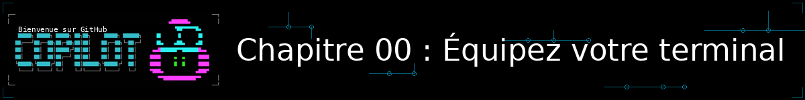

> **Et si votre terminal travaillait pour vous, avant même que Copilot CLI n'entre en jeu ?**

Avant même d'installer GitHub Copilot CLI (Chapitre 01) et de vous lancer dans les démonstrations en direct du Chapitre 02, faisons une pause d'installation — optionnelle, mais qui change concrètement votre quotidien.

GitHub Copilot CLI vit entièrement dans votre terminal. Or la plupart des développeurs et développeuses utilisent encore la configuration par défaut de leur shell, quasiment inchangée depuis vingt ans : pas d'autocomplétion intelligente, pas d'historique réellement exploitable, pas de navigation rapide entre les projets. C'est de la friction gratuite, répétée des centaines de fois par jour — et cette friction ne disparaît pas quand vous ajoutez Copilot CLI par-dessus, elle s'additionne.

Ce chapitre vous propose une stack de onze outils, cohérente et éprouvée, qui remplace les commandes Unix historiques par des équivalents modernes — plus rapides, plus lisibles, et pensés pour la façon dont on travaille réellement aujourd'hui. Chaque outil est accompagné de scripts d'installation automatisés pour macOS et pour WSL Debian, afin que toute une équipe reparte du même socle sans y passer une après-midi.

> 💡 **Chapitre complémentaire** : Vous pouvez tout à fait passer directement au [Chapitre 01](../01-quick-start/README.md) et revenir ici plus tard. Mais plus votre terminal sera confortable, plus les longues sessions Copilot CLI des chapitres suivants (contexte, workflows, agents, MCP...) seront agréables et rapides à mener.

## 🎯 Objectifs d'apprentissage

À la fin de ce chapitre, vous serez capable de :

- Installer et configurer zsh comme shell par défaut, avec Starship comme invite de commandes
- Retrouver n'importe quelle commande passée et naviguer entre vos projets sans retaper de chemins, grâce à Atuin et Zoxide
- Chercher, lister et lire des fichiers plus vite grâce à fzf, eza et bat
- Bénéficier d'une complétion et d'une coloration en temps réel pendant la frappe
- Créer des sessions Tmux persistantes qui survivent à un redémarrage ou à un crash
- Automatiser l'ensemble de cette installation avec un seul script, reproductible pour toute une équipe

> ⏱️ **Durée estimée : ~60 minutes** (20 min de lecture + 40 min d'installation et de configuration)

---

## ✅ Prérequis

- Une machine **macOS**, **Linux/WSL Debian**, ou **Windows avec PowerShell** (les commandes des trois plateformes sont données à chaque étape)
- Être à l'aise avec l'édition d'un fichier de configuration (`~/.zshrc`, `~/.tmux.conf`, ou votre profil PowerShell) dans un éditeur de texte
- Des droits d'administration sur votre machine (`sudo` sur Linux, `brew` sur macOS, `winget` sur Windows)

> 🏷️ **Tags de disponibilité** : chaque outil ci-dessous indique sur quelles plateformes il fonctionne — 🐧 **Linux** (WSL Debian ou distribution native), 🍎 **macOS**, 🪟 **PowerShell** (Windows natif). Quand un outil n'a pas d'équivalent natif sous PowerShell, la mention **🪟 non applicable** l'indique explicitement : passez alors par WSL (voir `scripts/install-linux.sh`).

> ⚠️ **Remarque WSL** : deux étapes restent manuelles côté Windows (pas automatisables depuis le shell Linux) : l'installation d'une police adaptée et le changement de shell par défaut. Elles sont détaillées à la fin de ce chapitre.

### 🧭 Matrice de compatibilité et solutions de repli

Les commandes Linux ci-dessous fonctionnent aussi dans WSL Debian. Sur Linux natif,
utilisez le gestionnaire de paquets de votre distribution lorsque la commande APT
n'est pas disponible.

| Famille d'outils | macOS | Linux natif | WSL Debian | Windows PowerShell |
|---|---|---|---|---|
| zsh et ses plugins | Préinstallé + clonage Git | `apt` + clonage Git | `apt` + clonage Git | WSL Debian |
| Starship, Atuin, Zoxide | Homebrew | Scripts officiels | Scripts officiels | `winget` ; WSL si l'installation échoue |
| fzf, eza, bat | Homebrew | APT ou dépôt indiqué | APT ou dépôt indiqué | `winget` pour fzf/bat ; WSL ou Cargo pour eza |
| Tmux et plugins | Homebrew + TPM | APT + TPM | APT + TPM | WSL Debian ou volets Windows Terminal |

Les identifiants `winget` peuvent évoluer. Si un paquet Windows n'est pas trouvé,
relancez la commande avec `winget search <nom>`, installez-le depuis sa source
officielle, ou utilisez WSL Debian avec `scripts/install-linux.sh`.

---

## 🧩 Analogie du monde réel : le cockpit équipé

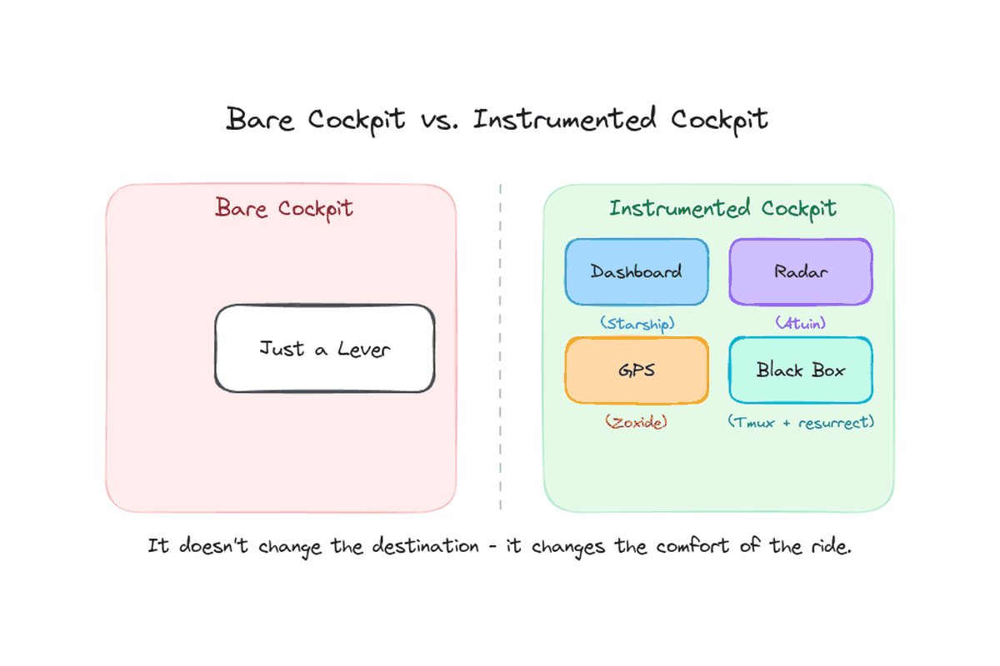

Piloter avec un terminal par défaut, c'est un peu comme piloter avec un manche et rien d'autre : ça vole, mais vous devez tout mémoriser et tout refaire à la main, à chaque vol.

| Élément du cockpit | Équivalent terminal | Ce qu'il vous apporte |
|---|---|---|
| Tableau de bord lisible | Starship | Contexte visuel immédiat (répertoire, branche git, langage détecté) |
| Radar qui garde tout en mémoire | Atuin | Historique de commandes consultable et filtrable |
| GPS qui connaît vos trajets habituels | Zoxide | Navigation directe vers vos projets fréquents |
| Boîte noire increvable | Tmux + resurrect/continuum | Vos sessions survivent à un crash ou un redémarrage |
| Copilote qui termine vos phrases | zsh-autosuggestions | Suggestions de commandes pendant la frappe |

**C'est ce que ce chapitre installe !** Un cockpit instrumenté ne change rien à la destination — mais il change radicalement le confort et la vitesse du trajet.

---

# 1. Le shell et l'invite de commandes

## zsh — le shell par défaut

**Disponibilité** : 🐧 Linux · 🍎 macOS · 🪟 non applicable (zsh n'existe pas sous PowerShell — utilisez WSL)

**Le problème :** bash reste la valeur par défaut sur beaucoup de systèmes, mais son autocomplétion est limitée et son écosystème de plugins bien plus pauvre que celui de zsh.

**Pourquoi l'adopter :** zsh est le socle sur lequel repose tout le reste de cette stack — suggestions, coloration syntaxique, thèmes. C'est un changement invisible au quotidien une fois en place, mais un prérequis non négociable pour tout ce qui suit.

**Installation**

🍎 macOS (préinstallé, rien à faire) :
```bash
# zsh est déjà présent sur macOS
```

🐧 Linux (WSL Debian) :
```bash
sudo apt update && sudo apt install -y zsh
chsh -s "$(which zsh)"
```

Après le `chsh`, il faut ouvrir une nouvelle session (ou lancer `exec zsh`) pour que le changement prenne effet.

<details>
<summary>🎬 Voyez-le en action !</summary>

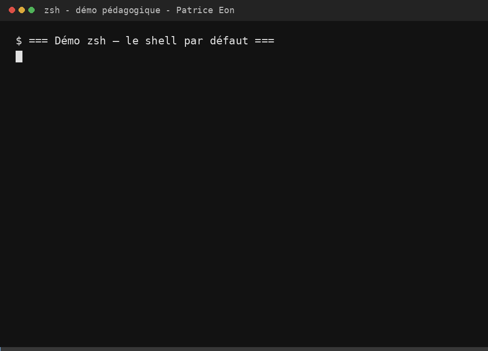

*Le résultat peut varier selon votre terminal, votre police et votre système : ne soyez pas surpris si votre rendu diffère légèrement de celui présenté ici.*

</details>

## Starship — un prompt minimaliste et rapide

**Disponibilité** : 🐧 Linux · 🍎 macOS · 🪟 PowerShell (winget)

**Le problème :** un prompt bash par défaut ne donne aucune information contextuelle (branche git, langage détecté, statut de la dernière commande), ou alors via des configurations maison lentes à charger.

**Pourquoi l'adopter :** Starship est écrit en Rust, se charge quasi instantanément, et affiche automatiquement le contexte utile (répertoire, git, version de Node/Python détectée) sans configuration complexe.

**Installation** :
```bash
# 🍎 macOS
brew install starship

# 🐧 Linux (WSL Debian)
curl -sS https://starship.rs/install.sh | sh -s -- --yes
```

```powershell
# 🪟 PowerShell (Windows)
winget install Starship.Starship
```

**Configuration** (`~/.zshrc`) :
```zsh
eval "$(starship init zsh)" # Prompt minimaliste et rapide
```

**Configuration PowerShell** (profil `$PROFILE`) :
```powershell
Invoke-Expression (&starship init powershell)
```

<details>
<summary>🎬 Voyez-le en action !</summary>

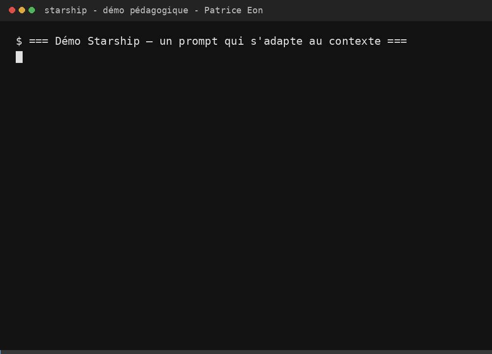

*Le résultat peut varier selon votre terminal, votre police et votre système : ne soyez pas surpris si votre rendu diffère légèrement de celui présenté ici.*

</details>

---

# 2. Un historique et une navigation qui se souviennent de vous

## Atuin — un historique de commandes qui se cherche vraiment

**Disponibilité** : 🐧 Linux · 🍎 macOS · 🪟 PowerShell (winget, installation Windows non vérifiée par ce chapitre — voir issue de suivi)

**Le problème :** l'historique bash/zsh par défaut est une liste plate, non synchronisée, et sa recherche (`Ctrl+R`) est rudimentaire dès qu'on a plusieurs milliers de lignes.

**Pourquoi l'adopter :** Atuin remplace l'historique par une base de données consultable en plein écran, avec recherche floue, filtrage par répertoire, et — si on le souhaite — synchronisation chiffrée entre machines.

**Installation :**
```bash
# 🍎 macOS
brew install atuin

# 🐧 Linux (WSL Debian)
curl --proto '=https' --tlsv1.2 -LsSf https://setup.atuin.sh | sh
```

```powershell
# 🪟 PowerShell (Windows) — identifiant winget non confirmé officiellement
winget install ellie.atuin
```

**Configuration** (`~/.zshrc`) :
```zsh
eval "$(atuin init zsh)"    # Historique de shell consultable

# Utiliser la flèche du haut pour la recherche plein écran d'Atuin
bindkey '^[[A' atuin-up-search
```

<details>
<summary>🎬 Voyez-le en action !</summary>

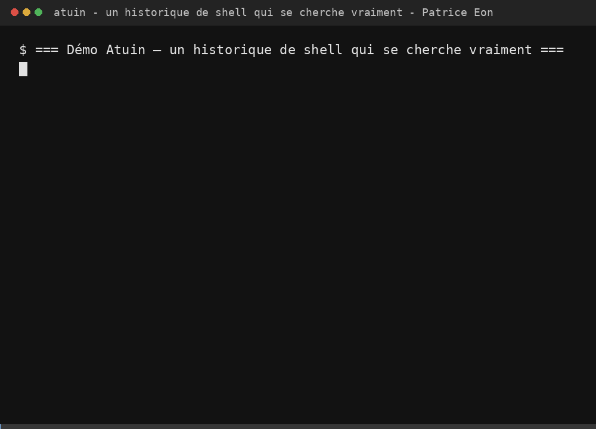

*Le résultat peut varier selon votre terminal, votre police et votre système : ne soyez pas surpris si votre rendu diffère légèrement de celui présenté ici.*

</details>

## Zoxide — un `cd` qui apprend vos habitudes

**Disponibilité** : 🐧 Linux · 🍎 macOS · 🪟 PowerShell (winget)

**Le problème :** naviguer entre projets avec `cd` demande de retaper (ou de compléter au Tab) des chemins entiers, encore et encore, y compris pour les répertoires qu'on visite dix fois par jour.

**Pourquoi l'adopter :** Zoxide retient la fréquence et la récence de vos déplacements et vous laisse sauter directement vers un projet avec quelques lettres (`z monrepo` plutôt que `cd ~/dev/clients/x/monrepo/backend`).

**Installation :**
```bash
# 🍎 macOS
brew install zoxide

# 🐧 Linux (WSL Debian)
curl -sSfL https://raw.githubusercontent.com/ajeetdsouza/zoxide/main/install.sh | sh
```

```powershell
# 🪟 PowerShell (Windows)
winget install ajeetdsouza.zoxide
```

**Configuration** (`~/.zshrc`) :
```zsh
eval "$(zoxide init zsh)"   # 'cd' intelligent
alias cd='z'                # Fait de 'cd' un saut intelligent via Zoxide
```

**Configuration PowerShell** (profil `$PROFILE`) :
```powershell
Invoke-Expression (& { (zoxide init powershell | Out-String) })
```

<details>
<summary>🎬 Voyez-le en action !</summary>

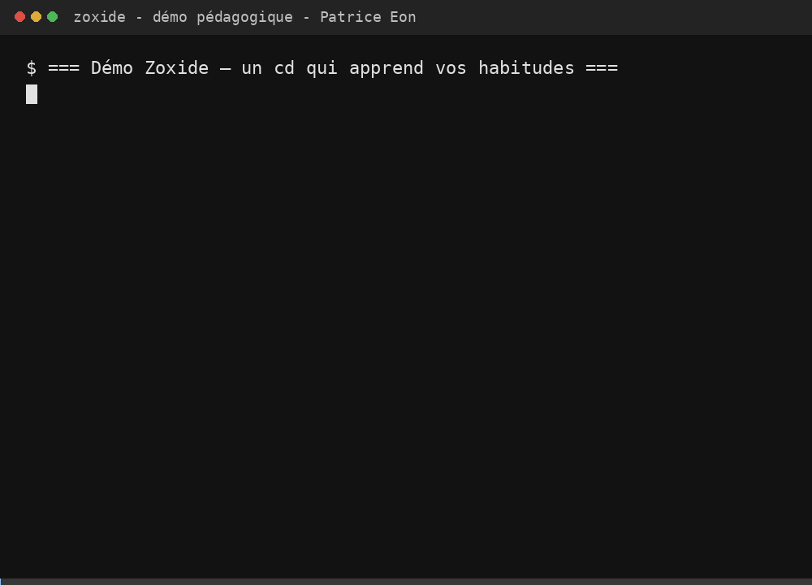

*Le résultat peut varier selon votre terminal, votre police et votre système : ne soyez pas surpris si votre rendu diffère légèrement de celui présenté ici.*

</details>

---

# 3. Chercher et lire plus vite

## fzf — la recherche floue partout dans le terminal

**Disponibilité** : 🐧 Linux · 🍎 macOS · 🪟 PowerShell (winget, via le module `PSFzf` pour l'intégration au shell)

**Le problème :** rechercher un fichier, une commande ou un processus dans un shell classique impose de connaître le nom exact ou de jongler avec `grep`/`find` à la main.

**Pourquoi l'adopter :** fzf s'intègre dans le shell (complétion, historique, navigation de fichiers) et permet de filtrer n'importe quelle liste en tapant quelques caractères approximatifs.

**Installation :**
```bash
# 🍎 macOS
brew install fzf

# 🐧 Linux (WSL Debian — installation via git, génère ~/.fzf.zsh pour les raccourcis)
git clone --depth 1 https://github.com/junegunn/fzf.git ~/.fzf
~/.fzf/install --all --no-bash --no-fish
```

```powershell
# 🪟 PowerShell (Windows)
winget install junegunn.fzf
```

**Configuration** (`~/.zshrc`) :
```zsh
[ -f ~/.fzf.zsh ] && source ~/.fzf.zsh
```

<details>
<summary>🎬 Voyez-le en action !</summary>

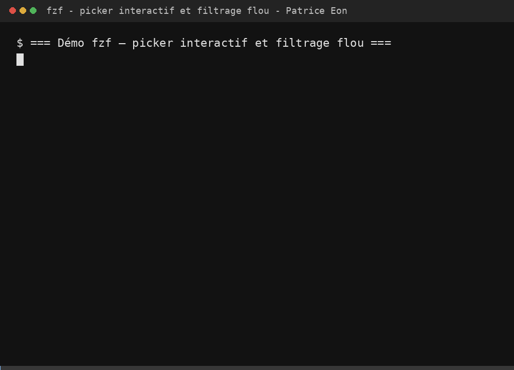

*Le résultat peut varier selon votre terminal, votre police et votre système : ne soyez pas surpris si votre rendu diffère légèrement de celui présenté ici.*

</details>

## eza — `ls` avec des icônes, des couleurs et du bon sens

**Disponibilité** : 🐧 Linux · 🍎 macOS · 🪟 non confirmé (pas de paquet winget officiel — utilisez WSL, ou `cargo install eza` si Rust est installé)

**Le problème :** la sortie de `ls` est brute — pas de couleurs cohérentes par type de fichier, pas de tri intelligent des répertoires, pas d'icônes.

**Pourquoi l'adopter :** eza est un remplacement direct et moderne de `ls`, avec icônes, couleurs par type, regroupement automatique des répertoires, et une vue grille lisible pour `ll`.

**Installation :**
```bash
# 🍎 macOS
brew install eza

# 🐧 Linux (WSL Debian — dépôt officiel eza)
sudo mkdir -p /etc/apt/keyrings
wget -qO- https://raw.githubusercontent.com/eza-community/eza/main/deb.asc \
    | sudo gpg --dearmor -o /etc/apt/keyrings/gierens.gpg
echo "deb [signed-by=/etc/apt/keyrings/gierens.gpg] http://deb.gierens.de stable main" \
    | sudo tee /etc/apt/sources.list.d/gierens.list > /dev/null
sudo apt update && sudo apt install -y eza
```

**Configuration** (`~/.zshrc`) :
```zsh
alias ls='eza --icons --group-directories-first' # 'ls' avec icônes et meilleur regroupement
alias ll='eza -lh --icons --grid'                # 'ls -l' avec icônes et vue grille
```

<details>
<summary>🎬 Voyez-le en action !</summary>

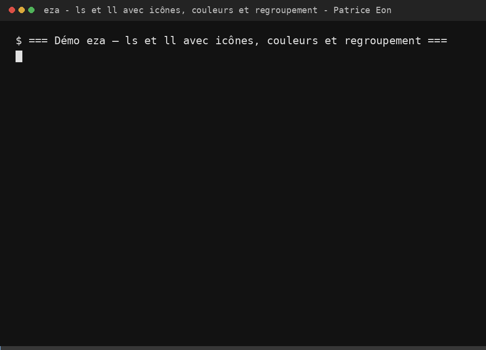

*Le résultat peut varier selon votre terminal, votre police et votre système : ne soyez pas surpris si votre rendu diffère légèrement de celui présenté ici.*

</details>

## bat — `cat` avec coloration syntaxique

**Disponibilité** : 🐧 Linux · 🍎 macOS · 🪟 PowerShell (winget)

**Le problème :** `cat` affiche un fichier en texte brut, sans coloration ni contexte, ce qui rend la lecture rapide d'un fichier de config ou de code peu agréable en ligne de commande.

**Pourquoi l'adopter :** bat ajoute la coloration syntaxique, les numéros de ligne, et une intégration git (indication des lignes modifiées). C'est un remplacement transparent : on tape toujours `cat`, mais on lit un fichier bien plus vite.

**Installation :**
```bash
# 🍎 macOS
brew install bat

# 🐧 Linux (WSL Debian) — le paquet s'installe sous le nom 'batcat'
sudo apt install -y bat
mkdir -p ~/.local/bin
if command -v batcat &> /dev/null && ! command -v bat &> /dev/null; then
    ln -sf "$(which batcat)" ~/.local/bin/bat
fi
```

```powershell
# 🪟 PowerShell (Windows)
winget install sharkdp.bat
```

> ⚠️ **Point d'attention Debian** : le paquet APT s'appelle `batcat`, pas `bat` — d'où le symlink ci-dessus pour garder un alias cohérent entre macOS et Linux.

**Configuration** (`~/.zshrc`) :
```zsh
# 🍎 macOS
alias cat='bat'

# 🐧 Linux (WSL Debian — bascule automatique selon ce qui est disponible)
command -v bat &>/dev/null && alias cat='bat' || alias cat='batcat'
```

<details>
<summary>🎬 Voyez-le en action !</summary>

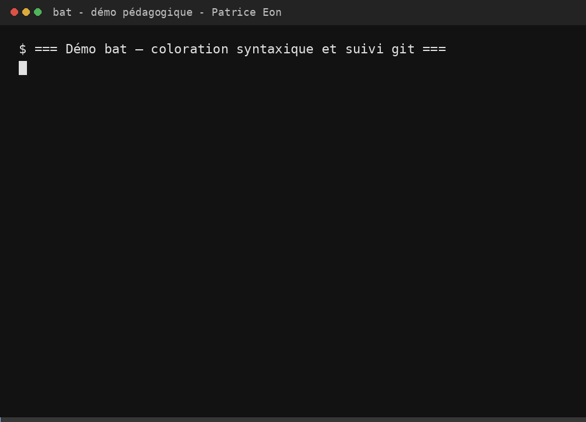

*Le résultat peut varier selon votre terminal, votre police et votre système : ne soyez pas surpris si votre rendu diffère légèrement de celui présenté ici.*

</details>

---

# 4. Une frappe assistée en temps réel

## zsh-autosuggestions — la complétion qui devine la suite

**Disponibilité** : 🐧 Linux · 🍎 macOS · 🪟 non applicable (plugin zsh — utilisez WSL)

**Le problème :** sans assistance, on retape entièrement des commandes déjà exécutées des dizaines de fois, même quand le shell « sait » ce qu'on va probablement écrire.

**Pourquoi l'adopter :** ce plugin affiche en grisé la commande la plus probable pendant que vous tapez, basée sur votre historique — il suffit d'appuyer sur `→` pour l'accepter.

**Installation** (identique sur macOS et WSL Debian) :
```bash
mkdir -p ~/.zsh
git clone https://github.com/zsh-users/zsh-autosuggestions ~/.zsh/zsh-autosuggestions
```

**Configuration** (`~/.zshrc`) :
```zsh
source ~/.zsh/zsh-autosuggestions/zsh-autosuggestions.zsh
```

<details>
<summary>🎬 Voyez-le en action !</summary>

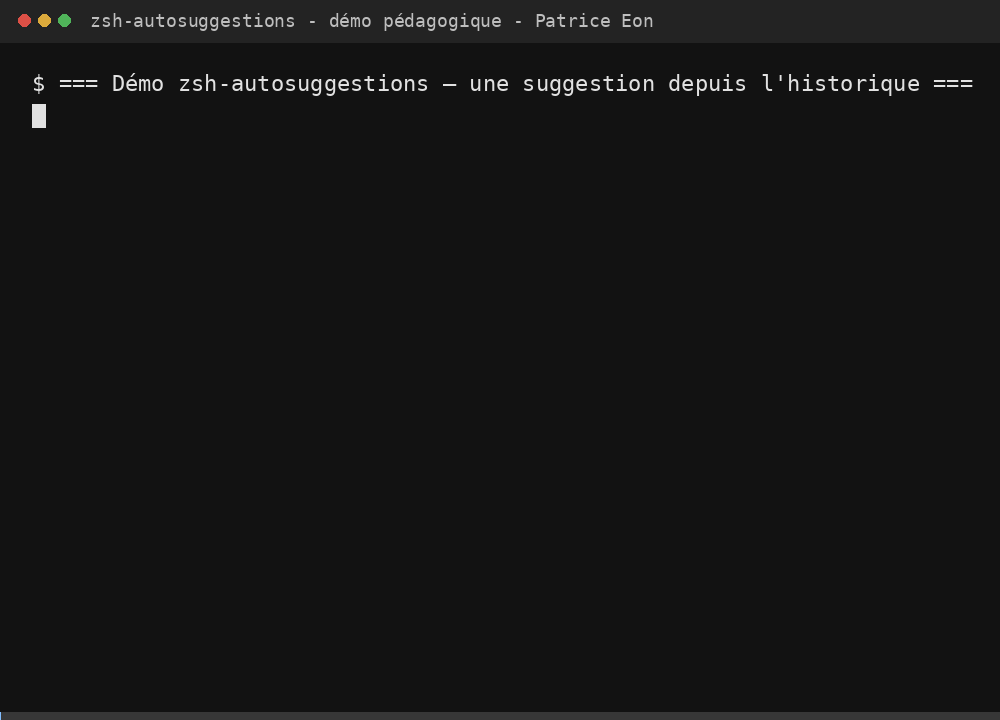

*Le résultat peut varier selon votre terminal, votre police et votre système : ne soyez pas surpris si votre rendu diffère légèrement de celui présenté ici.*

</details>

## zsh-syntax-highlighting — la coloration en temps réel

**Disponibilité** : 🐧 Linux · 🍎 macOS · 🪟 non applicable (plugin zsh — utilisez WSL)

**Le problème :** dans un shell nu, une commande mal orthographiée ou une syntaxe invalide ne se révèle qu'à l'exécution — trop tard, et souvent après avoir déjà appuyé sur Entrée.

**Pourquoi l'adopter :** ce plugin colore la commande pendant la frappe (vert si la commande existe, rouge sinon). On repère une faute de frappe avant même de valider.

**Installation** (identique sur macOS et WSL Debian) :
```bash
mkdir -p ~/.zsh
git clone https://github.com/zsh-users/zsh-syntax-highlighting.git ~/.zsh/zsh-syntax-highlighting
```

**Configuration** (`~/.zshrc`) — **attention à l'ordre : ce plugin doit être sourcé après `zsh-autosuggestions`** :
```zsh
source ~/.zsh/zsh-autosuggestions/zsh-autosuggestions.zsh
source ~/.zsh/zsh-syntax-highlighting/zsh-syntax-highlighting.zsh
```

<details>
<summary>🎬 Voyez-le en action !</summary>

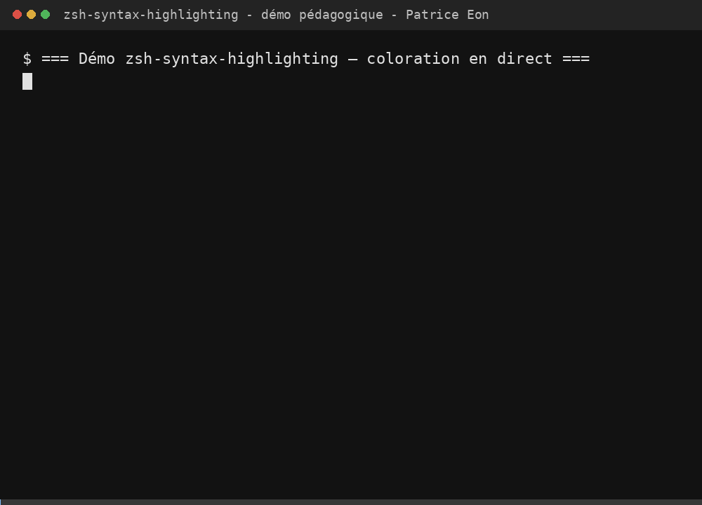

*Le résultat peut varier selon votre terminal, votre police et votre système : ne soyez pas surpris si votre rendu diffère légèrement de celui présenté ici.*

</details>

---

# 5. Tmux et des sessions qui survivent à tout

## Tmux — le multiplexeur de terminal

**Disponibilité** : 🐧 Linux · 🍎 macOS · 🪟 non applicable (pas de multiplexeur de terminal équivalent nativement sous PowerShell — utilisez WSL, ou les volets natifs de Windows Terminal en attendant)

**Le problème :** sans multiplexeur, chaque tâche parallèle (une session Copilot CLI en cours, des logs, un éditeur, un shell de debug) demande un nouvel onglet ou une nouvelle fenêtre — et tout disparaît si la connexion SSH tombe ou si le terminal se ferme.

**Pourquoi l'adopter :** Tmux donne des sessions persistantes et des volets (panes) dans une seule fenêtre. On détache une session, on ferme le laptop, on la retrouve intacte le lendemain — ou sur une autre machine via SSH.

**Installation :**
```bash
# 🍎 macOS
brew install tmux

# 🐧 Linux (WSL Debian)
sudo apt install -y tmux
```

**Configuration** (`~/.tmux.conf`, extrait) :
```tmux
set -g default-terminal "screen-256color" # Active les 256 couleurs
set -g mouse on                           # Active la souris pour redimensionner/défiler
set -s escape-time 0                      # Réduit le délai de la touche Échap (important pour Vim)
set -g history-limit 10000                # Augmente le tampon de défilement

bind | split-window -h -c "#{pane_current_path}" # Division verticale
bind - split-window -v -c "#{pane_current_path}" # Division horizontale
unbind '"'
unbind %

bind -n M-Left select-pane -L
bind -n M-Right select-pane -R
bind -n M-Up select-pane -U
bind -n M-Down select-pane -D
```

<details>
<summary>🎬 Voyez-le en action !</summary>

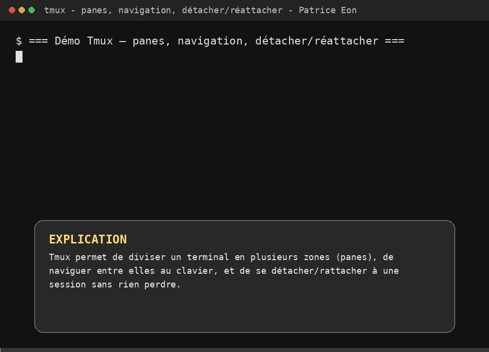

*Le résultat peut varier selon votre terminal, votre police et votre système : ne soyez pas surpris si votre rendu diffère légèrement de celui présenté ici.*

</details>

## TPM + tmux-resurrect + tmux-continuum — des sessions qui survivent aux redémarrages

**Disponibilité** : 🐧 Linux · 🍎 macOS · 🪟 non applicable (dépend de Tmux — utilisez WSL)

**Le problème :** une session Tmux, aussi pratique soit-elle, disparaît si la machine redémarre ou si le service Tmux est tué — perdant d'un coup tous les volets, layouts et répertoires de travail en cours (y compris une session Copilot CLI en plein milieu d'un long workflow).

**Pourquoi l'adopter :** TPM (Tmux Plugin Manager) gère l'installation des plugins Tmux ; `tmux-resurrect` sauvegarde l'état complet d'une session ; `tmux-continuum` automatise cette sauvegarde toutes les 15 minutes et restaure tout au démarrage suivant.

**Installation** (identique sur macOS et WSL Debian) :
```bash
mkdir -p ~/.tmux/plugins
git clone https://github.com/tmux-plugins/tpm ~/.tmux/plugins/tpm
```

**Configuration** (`~/.tmux.conf`) :
```tmux
set -g @plugin 'tmux-plugins/tpm'            # Le gestionnaire de plugins Tmux lui-même
set -g @plugin 'tmux-plugins/tmux-resurrect'  # Sauvegarde et restauration de l'environnement Tmux
set -g @plugin 'tmux-plugins/tmux-continuum'  # Sauvegarde continue de l'environnement Tmux

set -g @continuum-restore 'on'

# Initialise TPM. Cette ligne DOIT être à la toute fin de .tmux.conf
run '~/.tmux/plugins/tpm/tpm'
```

Puis, pour installer les plugins déclarés sans intervention manuelle :
```bash
~/.tmux/plugins/tpm/bin/install_plugins
```

<details>
<summary>🎬 Voyez-le en action !</summary>

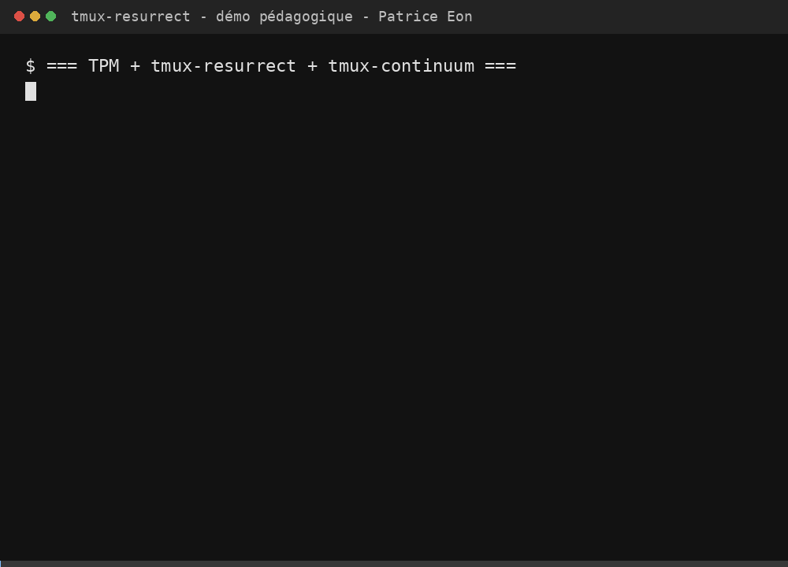

*Le résultat peut varier selon votre terminal, votre police et votre système : ne soyez pas surpris si votre rendu diffère légèrement de celui présenté ici.*

</details>

---

# 6. Automatiser plutôt que documenter

Le vrai levier ici n'est pas la liste d'outils elle-même. Le levier, c'est de la rendre **reproductible en une commande**, pour que toute l'équipe parte du même socle sans y passer une après-midi.

## Scripts d'installation

```bash
# 🍎 macOS
bash scripts/install-macos.sh

# 🐧 Linux (WSL Debian)
bash scripts/install-linux.sh
```

```powershell
# 🪟 PowerShell (Windows) — installe le sous-ensemble de la stack disponible nativement
# (zsh, tmux et leurs plugins nécessitent WSL, voir scripts/install-linux.sh)
.\scripts\install-windows.ps1
```

Sur WSL Debian, deux étapes post-installation restent manuelles côté Windows (pas automatisables depuis le shell Linux) :

1. **Installer la police Anka/Coder côté Windows** (pas dans WSL), puis la sélectionner dans Windows Terminal ou Ghostty pour le profil WSL — [Anka-Coder-Font](https://github.com/nicktindall/Anka-Coder-Font).
2. **Ouvrir une nouvelle session** (ou lancer `exec zsh`) pour que zsh devienne le shell actif, puis lancer `tmux` pour démarrer une session persistante.

Les scripts sont **idempotents** : vous pouvez les relancer après une interruption.
Ils conservent votre configuration existante et remplacent uniquement le bloc
entre `BEGIN chapitre-00-terminal-stack` et `END chapitre-00-terminal-stack`.
Les dépôts Git et les paquets déjà présents ne sont pas réinstallés.

> 🎬 **Choix de couverture visuelle** : les GIF unitaires de ce chapitre couvrent
> chaque outil et sont suffisants pour suivre les manipulations. Aucun GIF global
> supplémentaire n'est nécessaire ; la feuille de route finale ci-dessous sert de
> synthèse textuelle et vérifiable.

## ✅ Contrôles copiables

Exécutez les commandes correspondant à votre environnement après l'installation.
Chaque ligne vérifie directement un outil ou une brique de la stack.

### macOS, Linux natif et WSL Debian (zsh)

```bash
zsh --version
starship --version
atuin --version
zoxide --version
fzf --version
eza --version
bat --version 2>/dev/null || batcat --version
test -f ~/.zsh/zsh-autosuggestions/zsh-autosuggestions.zsh && echo "zsh-autosuggestions OK"
test -f ~/.zsh/zsh-syntax-highlighting/zsh-syntax-highlighting.zsh && echo "zsh-syntax-highlighting OK"
tmux -V
test -x ~/.tmux/plugins/tpm/bin/install_plugins && echo "TPM OK"
test -d ~/.tmux/plugins/tmux-resurrect && echo "tmux-resurrect OK"
test -d ~/.tmux/plugins/tmux-continuum && echo "tmux-continuum OK"
```

Si `bat` n'est pas disponible sous Debian, la commande utilise automatiquement
`batcat`. Si un outil installé par script n'est pas encore dans le `PATH`, ouvrez
une nouvelle session ou rechargez-le avec `source ~/.zshrc`.

### Windows PowerShell

```powershell
zsh --version                 # doit être exécuté dans WSL ; sinon utilisez WSL Debian
starship --version
atuin --version
zoxide --version
fzf --version
bat --version
```

Sous Windows natif, vérifiez Tmux, les plugins zsh et eza dans WSL Debian avec le
bloc précédent. Pour les outils absents de `winget`, utilisez la solution de repli
indiquée dans la matrice de compatibilité.

## La feuille de route finale : les alias

Une fois les onze outils en place, voici ce qui change concrètement au quotidien :

| Ancienne commande | Nouvelle commande | Effet |
|---|---|---|
| `ls` | `eza --icons --group-directories-first` | Icônes, couleurs, dossiers groupés |
| `ls -lh` | `eza -lh --icons --grid` | Vue détaillée en grille |
| `cat` | `bat` (ou `batcat` sur Debian) | Coloration syntaxique |
| `cd` | `z` (Zoxide) | Navigation par fréquence d'usage |
| `Ctrl+R` / `↑` | Recherche Atuin en plein écran | Historique consultable et filtrable |

## Et les raccourcis Tmux à retenir

| Raccourci | Action |
|---|---|
| `Ctrl+b` puis `\|` | Diviser le volet verticalement |
| `Ctrl+b` puis `-` | Diviser le volet horizontalement |
| `Alt+Flèche` | Naviguer entre les volets (sans préfixe) |
| `Ctrl+b` puis `d` | Détacher la session (elle reste active) |
| `tmux attach` | Reprendre la dernière session |

---

# Pratique


Mettez la stack en pratique sur votre propre machine.

---

## ▶️ À vous de jouer

1. **Installez un premier bloc** : zsh + Starship. Ouvrez une nouvelle session et vérifiez que votre invite affiche désormais le répertoire courant et l'état git.
2. **Ajoutez Atuin et Zoxide** : tapez quelques commandes, changez de répertoire plusieurs fois, puis testez `atuin-up-search` (flèche du haut) et `z <fragment-de-nom-de-dossier>`.
3. **Ajoutez fzf, eza et bat** : lancez `ll` dans un dossier de projet et ouvrez un fichier de configuration avec `cat` — comparez le rendu à l'ancien `cat` brut.
4. **Activez tmux** : créez une session, divisez-la en deux volets avec `Ctrl+b` puis `|`, détachez-la avec `Ctrl+b` puis `d`, et reprenez-la avec `tmux attach`.

**Auto-évaluation** : vous avez terminé ce chapitre quand vous pouvez fermer votre terminal, le rouvrir, et retrouver votre session Tmux, votre historique de commandes, et votre invite Starship exactement comme vous les avez laissés.

---

## 📝 Devoir

### Défi principal : automatiser votre propre poste

Exécutez le script d'installation correspondant à votre plateforme (`scripts/install-macos.sh`, `scripts/install-linux.sh`, ou `scripts/install-windows.ps1`) sur votre machine. Une fois terminé :

1. Ouvrez une nouvelle session et vérifiez que le prompt Starship s'affiche
2. Tapez `z` suivi d'un fragment du nom d'un de vos dossiers de projet et vérifiez que Zoxide vous y amène
3. Créez une session Tmux, divisez-la en deux volets, puis détachez-la et reprenez-la avec `tmux attach`

### Défi bonus : personnalisez votre stack

Ajoutez un alias supplémentaire dans votre `~/.zshrc` (par exemple un raccourci pour une commande `git` que vous tapez souvent), ou ajoutez un module Starship supplémentaire à votre invite.

<details>
<summary>💡 Indices (cliquer pour développer)</summary>

- Si le prompt Starship ne s'affiche pas après l'installation, vérifiez que la ligne `eval "$(starship init zsh)"` est bien présente dans `~/.zshrc` et que vous avez rechargé votre shell (`exec zsh`).
- Sur WSL Debian, si `chsh -s "$(which zsh)"` ne semble rien changer, c'est normal : il faut fermer et rouvrir la session (ou lancer `exec zsh`) pour que le nouveau shell devienne actif.
- Pour Tmux, rappelez-vous que le préfixe par défaut est `Ctrl+b` : toutes les combinaisons de raccourcis commencent par cette touche, relâchée avant la touche suivante.

</details>

---

<details>
<summary>🔧 <strong>Erreurs courantes</strong> (cliquer pour développer)</summary>

| Erreur | Ce qui se passe | Solution |
|---------|--------------|-----|
| `chsh -s "$(which zsh)"` ne change rien immédiatement | Le shell actif reste bash tant que la session n'est pas relancée | Ouvrez une nouvelle session, ou lancez `exec zsh` |
| `cat` ne fonctionne toujours pas comme `bat` sur Debian | Le paquet APT s'appelle `batcat`, pas `bat` | Créez le symlink `~/.local/bin/bat` vers `batcat`, ou utilisez l'alias conditionnel fourni |
| La coloration en temps réel ne s'affiche pas | Les plugins zsh sont sourcés dans le mauvais ordre | `zsh-syntax-highlighting` doit toujours être sourcé **après** `zsh-autosuggestions` |
| Tmux ne restaure rien après un redémarrage | `tmux-continuum` n'a pas encore effectué de sauvegarde automatique, ou les plugins TPM n'ont pas été installés | Attendez le premier cycle de sauvegarde (15 min), ou lancez manuellement `~/.tmux/plugins/tpm/bin/install_plugins` |
| Les icônes eza/Starship s'affichent comme des carrés vides | La police du terminal ne contient pas les glyphes Nerd Font nécessaires | Installez une police compatible (par exemple Anka-Coder-Font) et sélectionnez-la dans les paramètres de votre terminal |

</details>

---

# Résumé

## 🔑 Points clés à retenir

1. **zsh est le socle** : Starship, les suggestions et la coloration syntaxique en dépendent tous
2. **Atuin et Zoxide suppriment la friction de navigation** : votre historique et vos déplacements deviennent consultables et prévisibles
3. **fzf, eza et bat rendent la lecture du terminal plus rapide** sans changer vos habitudes de frappe (`ls`, `cat` restent les mêmes commandes)
4. **Tmux, TPM, resurrect et continuum protègent votre contexte de travail** : un crash ou un redémarrage ne vous coûte plus votre session
5. **Automatiser vaut mieux que documenter** : un script reproductible fait gagner du temps à toute une équipe, pas seulement à vous

> 📋 **Référence rapide** : les dépôts sources de chaque outil documentent leurs options avancées — [Starship](https://starship.rs), [Atuin](https://github.com/atuinsh/atuin), [Zoxide](https://github.com/ajeetdsouza/zoxide), [fzf](https://github.com/junegunn/fzf), [eza](https://github.com/eza-community/eza), [bat](https://github.com/sharkdp/bat), [tmux-resurrect / tmux-continuum](https://github.com/tmux-plugins/tpm).

## ➡️ Et ensuite ?

Votre terminal est maintenant équipé. Passez au **[Chapitre 01 : Démarrage rapide](../01-quick-start/README.md)** pour installer GitHub Copilot CLI, vous connecter, et vérifier que tout fonctionne. Vous serez alors prêt pour le **[Chapitre 02 : Premiers pas](../02-setup-and-first-steps/README.md)**, où vous allez :

- Regarder l'IA passer en revue la Book App et détecter instantanément des problèmes de qualité de code
- Apprendre trois façons différentes d'utiliser Copilot CLI
- Générer du code fonctionnel à partir de langage naturel

**[Continuer vers le Chapitre 01 : Démarrage rapide →](../01-quick-start/README.md)**
