<!--
---
id: CopilotCLI-00
title: !translate Équipe ton terminal avant de plonger dans Copilot CLI
description: !translate Découvre et configure une stack terminal moderne (zsh, Starship, tmux, Atuin, Zoxide, fzf, eza, bat) qui rend chaque session Copilot CLI plus rapide, plus lisible et plus résiliente.
audience: Developers / Students / Terminal users
slug: modern-terminal-stack
weight: 1
---
-->

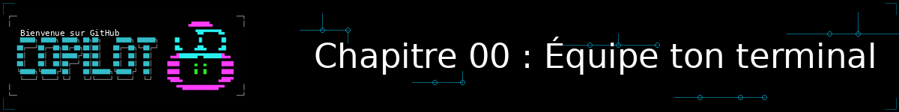

> **Et si ton terminal travaillait pour toi, avant même que Copilot CLI n'entre en jeu ?**

Avant même d'installer GitHub Copilot CLI (Chapitre 01) et de te lancer dans les démonstrations en direct du Chapitre 02, faisons une pause — optionnelle, mais qui change concrètement ton quotidien.

GitHub Copilot CLI vit entièrement dans ton terminal. Or la plupart des développeurs et développeuses utilisent encore la configuration par défaut de leur shell, quasiment inchangée depuis vingt ans : pas d'autocomplétion intelligente, pas d'historique réellement exploitable, pas de navigation rapide entre les projets. C'est de la friction gratuite, répétée des centaines de fois par jour — et cette friction ne disparaît pas quand tu ajoutes Copilot CLI par-dessus, elle s'additionne.

Ce chapitre te propose une stack de onze outils, cohérente et éprouvée, qui remplace les commandes Unix historiques par des équivalents modernes — plus rapides, plus lisibles, et pensés pour la façon dont on travaille réellement aujourd'hui. L'installation est entièrement portée par des scripts automatisés (macOS, WSL Debian, Windows PowerShell — voir [Installer la stack avec les scripts](#installer-la-stack-avec-les-scripts)) : ce chapitre explique donc ce que fait chaque outil et comment il est configuré, afin que toute une équipe reparte du même socle sans y passer une après-midi.

> 💡 **Chapitre complémentaire** : Tu peux tout à fait passer directement au [Chapitre 01](../01-quick-start/README.md) et revenir ici plus tard. Mais plus ton terminal sera confortable, plus les longues sessions Copilot CLI des chapitres suivants (contexte, workflows, agents, MCP...) seront agréables et rapides à mener.

## 🎯 Objectifs d'apprentissage

À la fin de ce chapitre, tu seras capable de :

- Comprendre le rôle de zsh et de Starship, et lancer le script qui les installe et les configure
- Retrouver n'importe quelle commande passée et naviguer entre tes projets sans retaper de chemins, grâce à Atuin et Zoxide
- Chercher, lister et lire des fichiers plus vite grâce à fzf, eza et bat
- Bénéficier d'une complétion et d'une coloration en temps réel pendant la frappe
- Créer des sessions Tmux persistantes qui survivent à un redémarrage ou à un crash
- Automatiser l'ensemble de cette installation avec un seul script, reproductible pour toute une équipe

> ⏱️ **Durée estimée : ~60 minutes** (20 min de lecture + 40 min d'exécution du script et de prise en main)

---

## ✅ Prérequis

- Une machine **macOS**, **Linux/WSL Debian**, ou **Windows avec PowerShell** (un script d'installation est fourni pour chacune)
- Être à l'aise avec l'édition d'un fichier de configuration (`~/.zshrc`, `~/.tmux.conf`, ou ton profil PowerShell) dans un éditeur de texte
- Des droits d'administration sur ta machine (nécessaires au script d'installation)

> 🏷️ **Tags de disponibilité** : chaque outil ci-dessous indique sur quelles plateformes il fonctionne — 🐧 **Linux** (WSL Debian ou distribution native), 🍎 **macOS**, 🪟 **PowerShell** (Windows natif). Quand un outil n'a pas d'équivalent natif sous PowerShell, la mention **🪟 non applicable** l'indique explicitement : passe alors par WSL (voir `scripts/install-linux.sh`).

> ⚠️ **Remarque WSL** : deux étapes restent manuelles côté Windows (pas automatisables depuis le shell Linux) : l'installation d'une police adaptée et le changement de shell par défaut. Elles sont détaillées à la fin de ce chapitre.

---

## 🧩 Analogie du monde réel : le cockpit équipé

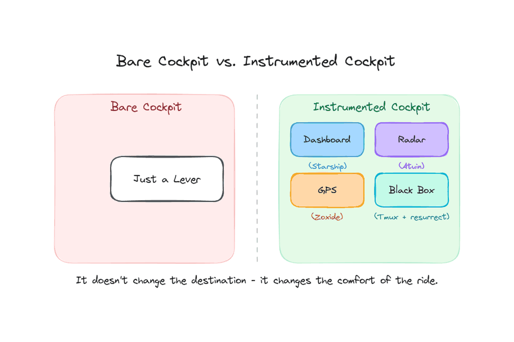

Piloter avec un terminal par défaut, c'est un peu comme piloter avec un manche et rien d'autre : ça vole, mais tu dois tout mémoriser et tout refaire à la main, à chaque vol.

| Élément du cockpit | Équivalent terminal | Ce qu'il t'apporte |
|---|---|---|
| Tableau de bord lisible | Starship | Contexte visuel immédiat (répertoire, branche git, langage détecté) |
| Radar qui garde tout en mémoire | Atuin | Historique de commandes consultable et filtrable |
| GPS qui connaît tes trajets habituels | Zoxide | Navigation directe vers tes projets fréquents |
| Boîte noire increvable | Tmux + resurrect/continuum | Tes sessions survivent à un crash ou un redémarrage |
| Copilote qui termine tes phrases | zsh-autosuggestions | Suggestions de commandes pendant la frappe |

**C'est ce que ce chapitre met en place !** Un cockpit instrumenté ne change rien à la destination — mais il change radicalement le confort et la vitesse du trajet.

---

# 1. Le shell et l'invite de commandes

> ℹ️ Les scripts d'installation (voir [section 6](#installer-la-stack-avec-les-scripts)) installent les outils **et** écrivent les blocs de configuration ci-dessous pour toi. Ils sont montrés ici pour que tu comprennes ce que chaque outil change.

## zsh — le shell par défaut

**Disponibilité** : 🐧 Linux · 🍎 macOS · 🪟 non applicable (zsh n'existe pas sous PowerShell — utilise WSL)

**Le problème :** bash reste la valeur par défaut sur beaucoup de systèmes, mais son autocomplétion est limitée et son écosystème de plugins bien plus pauvre que celui de zsh.

**Pourquoi l'adopter :** zsh est le socle sur lequel repose tout le reste de cette stack — suggestions, coloration syntaxique, thèmes. C'est un changement invisible au quotidien une fois en place, mais un prérequis non négociable pour tout ce qui suit.

<details>
<summary>🎬 Vois-le en action !</summary>

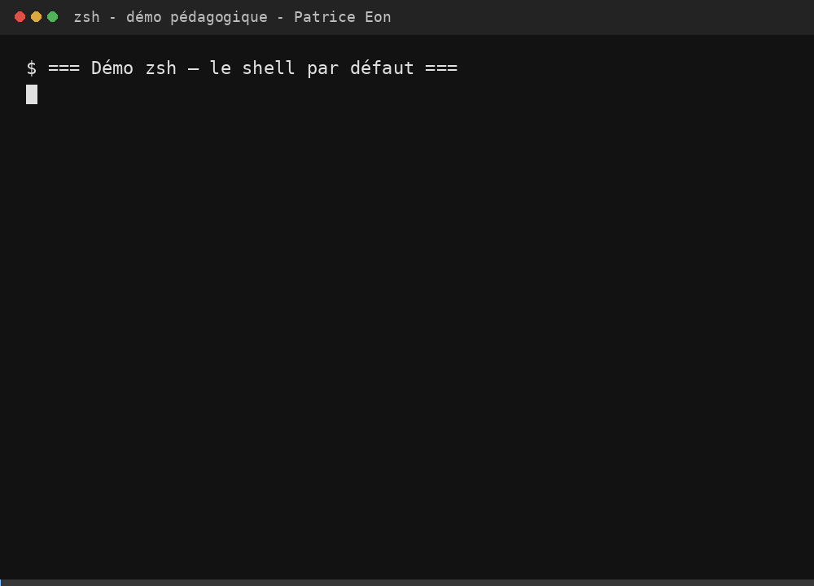

*Le résultat peut varier selon ton terminal, ta police et ton système : ne sois pas surpris si ton rendu diffère légèrement de celui présenté ici.*

</details>

## Starship — un prompt minimaliste et rapide

**Disponibilité** : 🐧 Linux · 🍎 macOS · 🪟 PowerShell

**Le problème :** un prompt bash par défaut ne donne aucune information contextuelle (branche git, langage détecté, statut de la dernière commande), ou alors via des configurations maison lentes à charger.

**Pourquoi l'adopter :** Starship est écrit en Rust, se charge quasi instantanément, et affiche automatiquement le contexte utile (répertoire, git, version de Node/Python détectée) sans configuration complexe.

**Configuration** (`~/.zshrc`) :
```zsh
eval "$(starship init zsh)" # Prompt minimaliste et rapide
```

**Configuration PowerShell** (profil `$PROFILE`) :
```powershell
Invoke-Expression (&starship init powershell)
```

<details>
<summary>🎬 Vois-le en action !</summary>

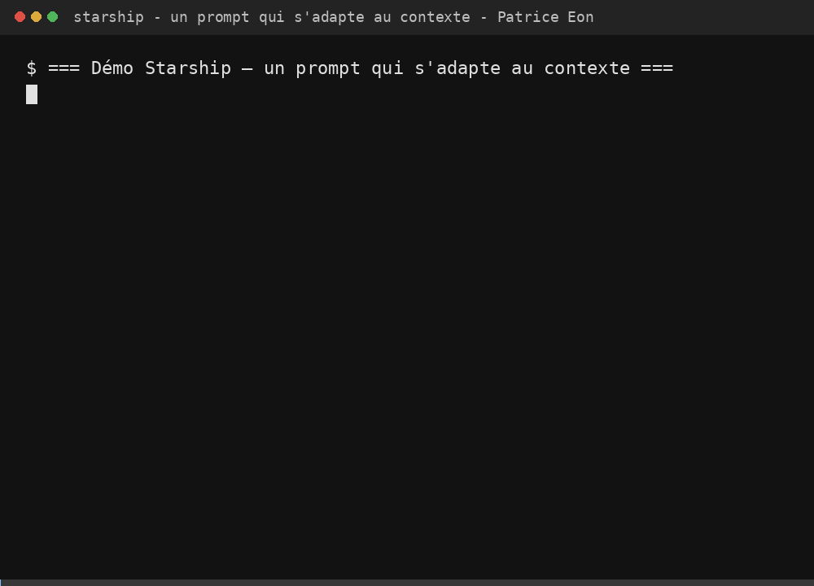

*Le résultat peut varier selon ton terminal, ta police et ton système : ne sois pas surpris si ton rendu diffère légèrement de celui présenté ici.*

</details>

---

# 2. Un historique et une navigation qui se souviennent de toi

## Atuin — un historique de commandes qui se cherche vraiment

**Disponibilité** : 🐧 Linux · 🍎 macOS · 🪟 PowerShell

**Le problème :** l'historique bash/zsh par défaut est une liste plate, non synchronisée, et sa recherche (`Ctrl+R`) est rudimentaire dès qu'on a plusieurs milliers de lignes.

**Pourquoi l'adopter :** Atuin remplace l'historique par une base de données consultable en plein écran, avec recherche floue, filtrage par répertoire, et — si on le souhaite — synchronisation chiffrée entre machines.

**Configuration** (`~/.zshrc`) :
```zsh
eval "$(atuin init zsh)"    # Historique de shell consultable

# Utiliser la flèche du haut pour la recherche plein écran d'Atuin
bindkey '^[[A' atuin-up-search
```

<details>
<summary>🎬 Vois-le en action !</summary>

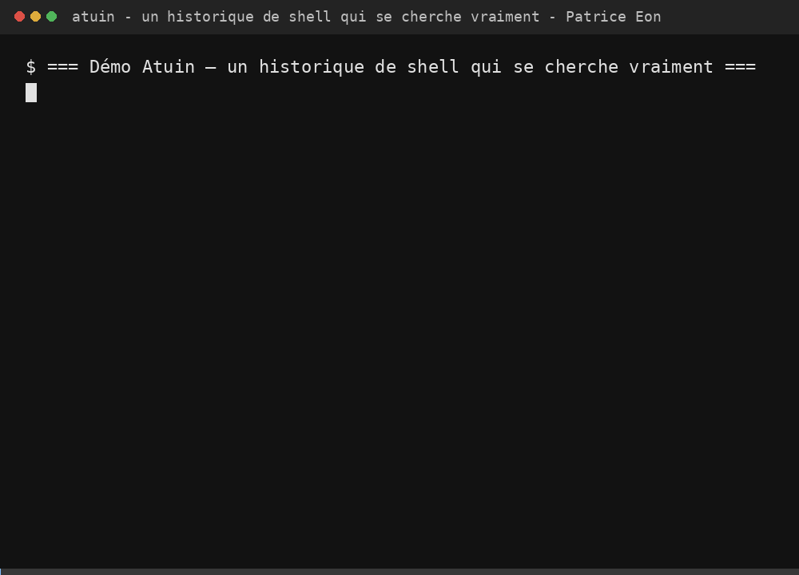

*Le résultat peut varier selon ton terminal, ta police et ton système : ne sois pas surpris si ton rendu diffère légèrement de celui présenté ici.*

</details>

## Zoxide — un `cd` qui apprend tes habitudes

**Disponibilité** : 🐧 Linux · 🍎 macOS · 🪟 PowerShell

**Le problème :** naviguer entre projets avec `cd` demande de retaper (ou de compléter au Tab) des chemins entiers, encore et encore, y compris pour les répertoires qu'on visite dix fois par jour.

**Pourquoi l'adopter :** Zoxide retient la fréquence et la récence de tes déplacements et te laisse sauter directement vers un projet avec quelques lettres (`z monrepo` plutôt que `cd ~/dev/clients/x/monrepo/backend`).

**Configuration** (`~/.zshrc`) :
```zsh
eval "$(zoxide init zsh)"   # 'cd' intelligent
alias cd='z'                # Fait de 'cd' un saut intelligent via Zoxide
```

**Configuration PowerShell** (profil `$PROFILE`) :
```powershell
Invoke-Expression (& { (zoxide init powershell | Out-String) })
```

<details>
<summary>🎬 Vois-le en action !</summary>

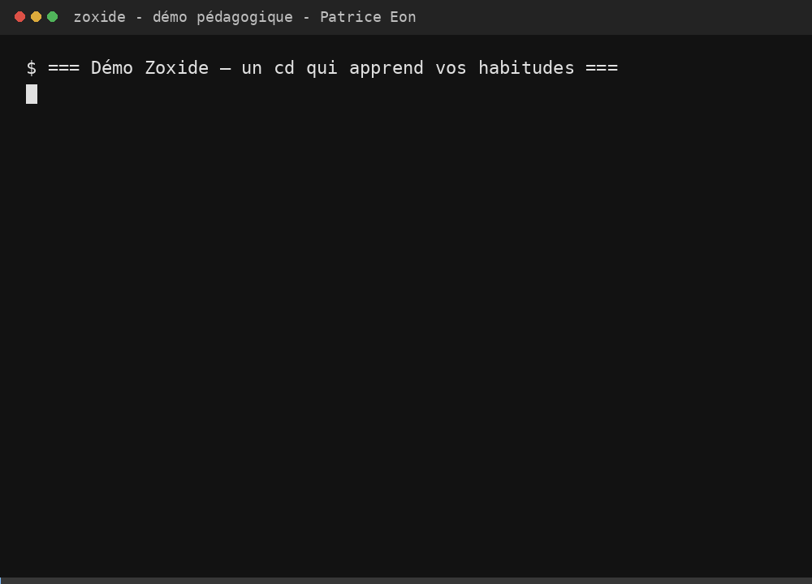

*Le résultat peut varier selon ton terminal, ta police et ton système : ne sois pas surpris si ton rendu diffère légèrement de celui présenté ici.*

</details>

---

# 3. Chercher et lire plus vite

## fzf — la recherche floue partout dans le terminal

**Disponibilité** : 🐧 Linux · 🍎 macOS · 🪟 PowerShell (avec le module `PSFzf` pour l'intégration au shell)

**Le problème :** rechercher un fichier, une commande ou un processus dans un shell classique impose de connaître le nom exact ou de jongler avec `grep`/`find` à la main.

**Pourquoi l'adopter :** fzf s'intègre dans le shell (complétion, historique, navigation de fichiers) et permet de filtrer n'importe quelle liste en tapant quelques caractères approximatifs.

**Configuration** (`~/.zshrc`) :
```zsh
[ -f ~/.fzf.zsh ] && source ~/.fzf.zsh
```

<details>
<summary>🎬 Vois-le en action !</summary>

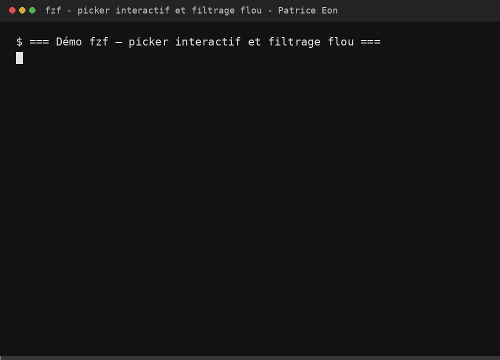

*Le résultat peut varier selon ton terminal, ta police et ton système : ne sois pas surpris si ton rendu diffère légèrement de celui présenté ici.*

</details>

## eza — `ls` avec des icônes, des couleurs et du bon sens

**Disponibilité** : 🐧 Linux · 🍎 macOS · 🪟 non confirmé (utilise WSL)

**Le problème :** la sortie de `ls` est brute — pas de couleurs cohérentes par type de fichier, pas de tri intelligent des répertoires, pas d'icônes.

**Pourquoi l'adopter :** eza est un remplacement direct et moderne de `ls`, avec icônes, couleurs par type, regroupement automatique des répertoires, et une vue grille lisible pour `ll`.

**Configuration** (`~/.zshrc`) :
```zsh
alias ls='eza --icons --group-directories-first' # 'ls' avec icônes et meilleur regroupement
alias ll='eza -lh --icons --grid'                # 'ls -l' avec icônes et vue grille
```

<details>
<summary>🎬 Vois-le en action !</summary>

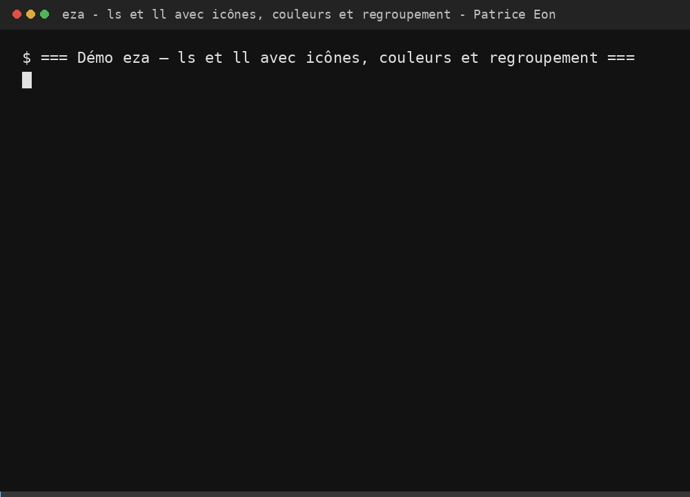

*Le résultat peut varier selon ton terminal, ta police et ton système : ne sois pas surpris si ton rendu diffère légèrement de celui présenté ici.*

</details>

## bat — `cat` avec coloration syntaxique

**Disponibilité** : 🐧 Linux · 🍎 macOS · 🪟 PowerShell

**Le problème :** `cat` affiche un fichier en texte brut, sans coloration ni contexte, ce qui rend la lecture rapide d'un fichier de config ou de code peu agréable en ligne de commande.

**Pourquoi l'adopter :** bat ajoute la coloration syntaxique, les numéros de ligne, et une intégration git (indication des lignes modifiées). C'est un remplacement transparent : on tape toujours `cat`, mais on lit un fichier bien plus vite.

**Configuration** (`~/.zshrc`) :
```zsh
# 🍎 macOS
alias cat='bat'

# 🐧 Linux (WSL Debian — bascule automatique selon ce qui est disponible)
command -v bat &>/dev/null && alias cat='bat' || alias cat='batcat'
```

<details>
<summary>🎬 Vois-le en action !</summary>

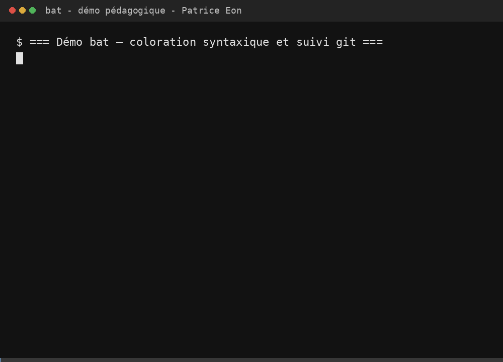

*Le résultat peut varier selon ton terminal, ta police et ton système : ne sois pas surpris si ton rendu diffère légèrement de celui présenté ici.*

</details>

---

# 4. Une frappe assistée en temps réel

## zsh-autosuggestions — la complétion qui devine la suite

**Disponibilité** : 🐧 Linux · 🍎 macOS · 🪟 non applicable (plugin zsh — utilise WSL)

**Le problème :** sans assistance, on retape entièrement des commandes déjà exécutées des dizaines de fois, même quand le shell « sait » ce qu'on va probablement écrire.

**Pourquoi l'adopter :** ce plugin affiche en grisé la commande la plus probable pendant que tu tapes, basée sur ton historique — il suffit d'appuyer sur `→` pour l'accepter.

**Configuration** (`~/.zshrc`) :
```zsh
source ~/.zsh/zsh-autosuggestions/zsh-autosuggestions.zsh
```

<details>
<summary>🎬 Vois-le en action !</summary>

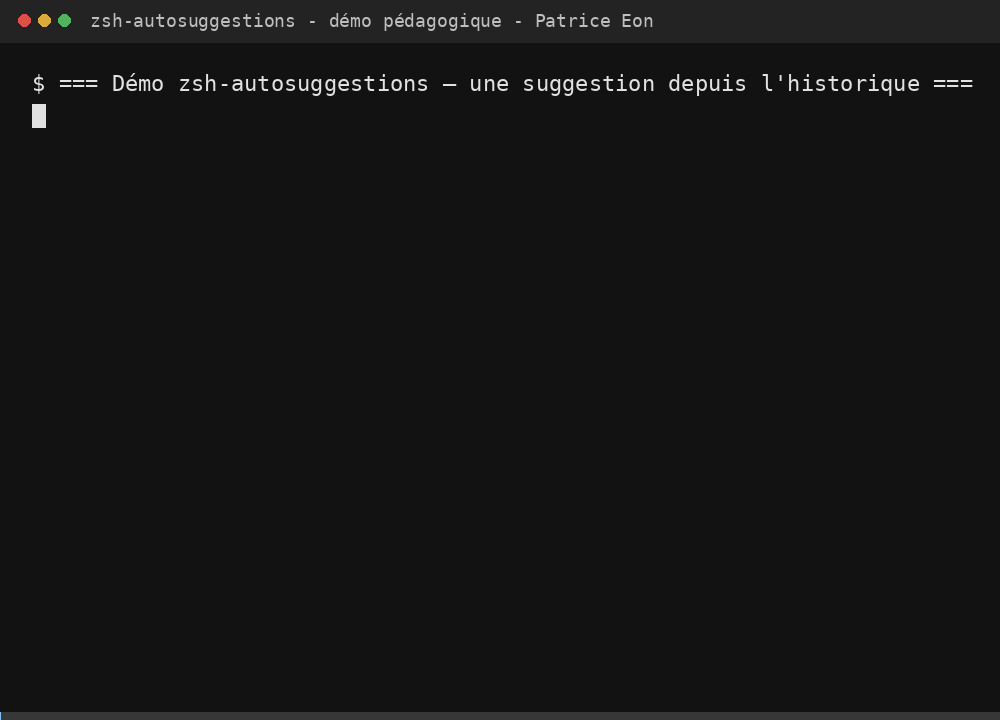

*Le résultat peut varier selon ton terminal, ta police et ton système : ne sois pas surpris si ton rendu diffère légèrement de celui présenté ici.*

</details>

## zsh-syntax-highlighting — la coloration en temps réel

**Disponibilité** : 🐧 Linux · 🍎 macOS · 🪟 non applicable (plugin zsh — utilise WSL)

**Le problème :** dans un shell nu, une commande mal orthographiée ou une syntaxe invalide ne se révèle qu'à l'exécution — trop tard, et souvent après avoir déjà appuyé sur Entrée.

**Pourquoi l'adopter :** ce plugin colore la commande pendant la frappe (vert si la commande existe, rouge sinon). On repère une faute de frappe avant même de valider.

**Configuration** (`~/.zshrc`) — **attention à l'ordre : ce plugin doit être sourcé après `zsh-autosuggestions`** :
```zsh
source ~/.zsh/zsh-autosuggestions/zsh-autosuggestions.zsh
source ~/.zsh/zsh-syntax-highlighting/zsh-syntax-highlighting.zsh
```

<details>
<summary>🎬 Vois-le en action !</summary>

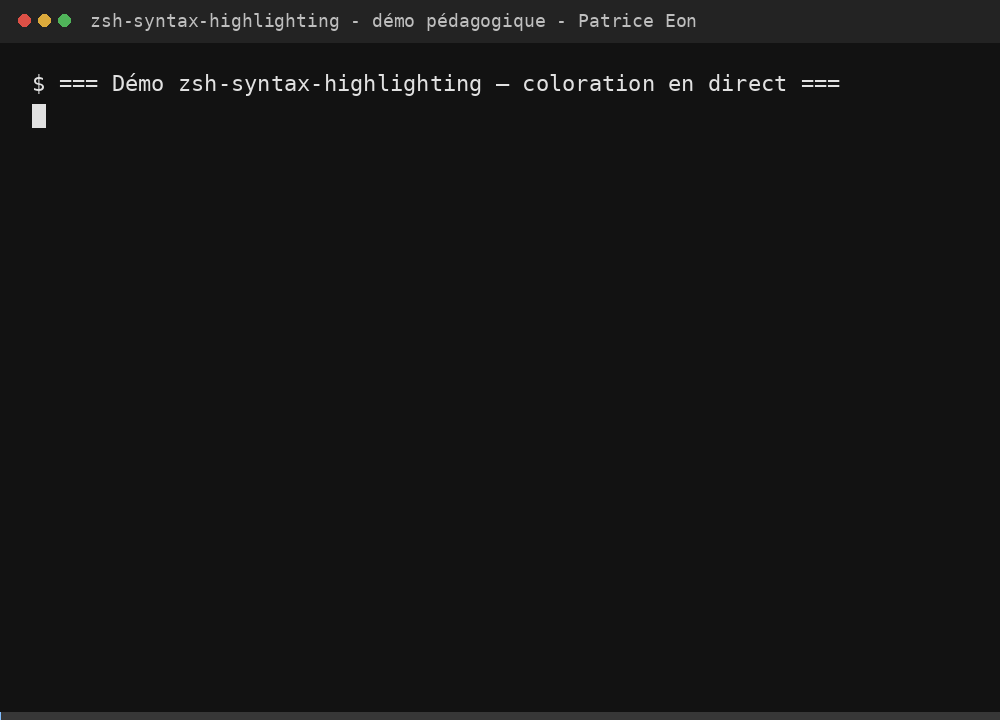

*Le résultat peut varier selon ton terminal, ta police et ton système : ne sois pas surpris si ton rendu diffère légèrement de celui présenté ici.*

</details>

---

# 5. Tmux et des sessions qui survivent à tout

## Tmux — le multiplexeur de terminal

**Disponibilité** : 🐧 Linux · 🍎 macOS · 🪟 non applicable (pas de multiplexeur de terminal équivalent nativement sous PowerShell — utilise WSL, ou les volets natifs de Windows Terminal en attendant)

**Le problème :** sans multiplexeur, chaque tâche parallèle (une session Copilot CLI en cours, des logs, un éditeur, un shell de debug) demande un nouvel onglet ou une nouvelle fenêtre — et tout disparaît si la connexion SSH tombe ou si le terminal se ferme.

**Pourquoi l'adopter :** Tmux donne des sessions persistantes et des volets (panes) dans une seule fenêtre. On détache une session, on ferme le laptop, on la retrouve intacte le lendemain — ou sur une autre machine via SSH.

**Configuration** (`~/.tmux.conf`, extrait) :
```tmux
set -g default-terminal "screen-256color" # Active les 256 couleurs
set -g mouse on                           # Active la souris pour redimensionner/défiler
set -s escape-time 0                      # Réduit le délai de la touche Échap (important pour Vim)
set -g history-limit 10000                # Augmente le tampon de défilement

bind | split-window -h -c "#{pane_current_path}" # Division verticale
bind - split-window -v -c "#{pane_current_path}" # Division horizontale
unbind '"'
unbind %

bind -n M-Left select-pane -L
bind -n M-Right select-pane -R
bind -n M-Up select-pane -U
bind -n M-Down select-pane -D
```

<details>
<summary>🎬 Vois-le en action !</summary>

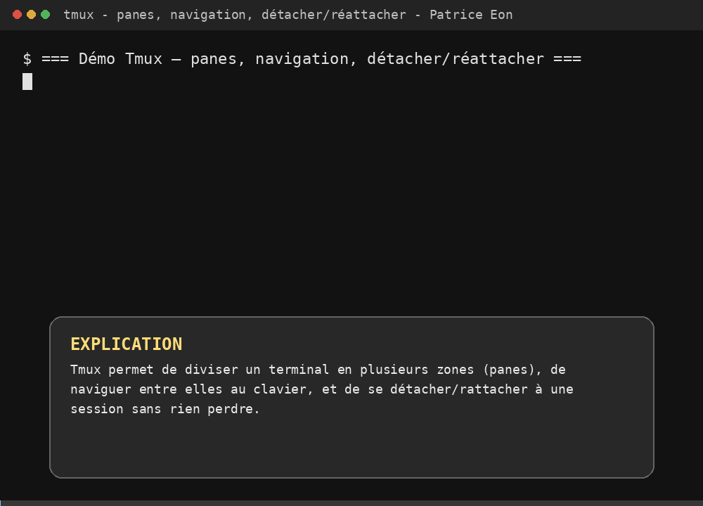

*Le résultat peut varier selon ton terminal, ta police et ton système : ne sois pas surpris si ton rendu diffère légèrement de celui présenté ici.*

</details>

## TPM + tmux-resurrect + tmux-continuum — des sessions qui survivent aux redémarrages

**Disponibilité** : 🐧 Linux · 🍎 macOS · 🪟 non applicable (dépend de Tmux — utilise WSL)

**Le problème :** une session Tmux, aussi pratique soit-elle, disparaît si la machine redémarre ou si le service Tmux est tué — perdant d'un coup tous les volets, layouts et répertoires de travail en cours (y compris une session Copilot CLI en plein milieu d'un long workflow).

**Pourquoi l'adopter :** TPM (Tmux Plugin Manager) gère l'installation des plugins Tmux ; `tmux-resurrect` sauvegarde l'état complet d'une session ; `tmux-continuum` automatise cette sauvegarde toutes les 15 minutes et restaure tout au démarrage suivant.

**Configuration** (`~/.tmux.conf`) :
```tmux
set -g @plugin 'tmux-plugins/tpm'            # Le gestionnaire de plugins Tmux lui-même
set -g @plugin 'tmux-plugins/tmux-resurrect'  # Sauvegarde et restauration de l'environnement Tmux
set -g @plugin 'tmux-plugins/tmux-continuum'  # Sauvegarde continue de l'environnement Tmux

set -g @continuum-restore 'on'

# Initialise TPM. Cette ligne DOIT être à la toute fin de .tmux.conf
run '~/.tmux/plugins/tpm/tpm'
```

<details>
<summary>🎬 Vois-le en action !</summary>

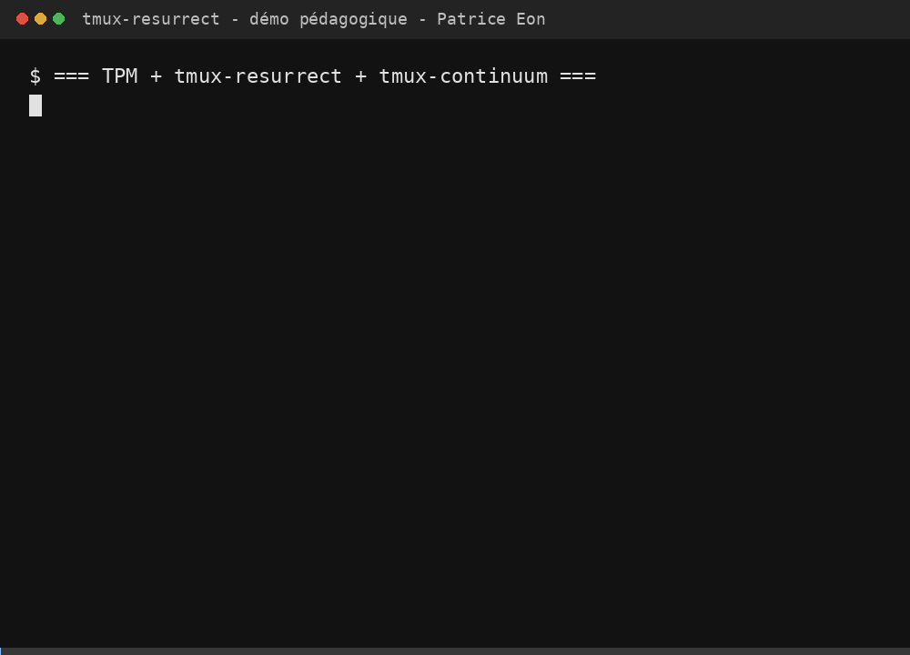

*Le résultat peut varier selon ton terminal, ta police et ton système : ne sois pas surpris si ton rendu diffère légèrement de celui présenté ici.*

</details>

---

# 6. Automatiser plutôt que documenter

Le vrai levier ici n'est pas la liste d'outils elle-même. Le levier, c'est de la rendre **reproductible en une commande**, pour que toute l'équipe parte du même socle sans y passer une après-midi.

## Installer la stack avec les scripts

Sans option, chaque script ouvre un **menu interactif** : installer tous les outils, en installer
ou désinstaller un seul, ou quitter.

```bash
# 🍎 macOS
bash scripts/install-macos.sh

# 🐧 Linux (WSL Debian)
bash scripts/install-linux.sh
```

```powershell
# 🪟 PowerShell (Windows) — gère le sous-ensemble de la stack disponible nativement
# (zsh, eza, tmux et leurs plugins nécessitent WSL, voir scripts/install-linux.sh)
.\scripts\install-windows.ps1
```

Pour scripter l'installation (CI, réinstallation rapide, formation à plusieurs) plutôt que de
répondre au menu, chaque script accepte aussi des options :

```bash
bash scripts/install-linux.sh --list                  # État (installé/absent) de chaque outil
bash scripts/install-linux.sh --install=eza            # Installe un seul outil
bash scripts/install-linux.sh --install=all --yes      # Installe tout, sans confirmation
bash scripts/install-linux.sh --uninstall=eza          # Désinstalle un seul outil
bash scripts/install-linux.sh --uninstall=all --yes    # Désinstalle tout, sans confirmation
```

```powershell
.\scripts\install-windows.ps1 -ListTools
.\scripts\install-windows.ps1 -Install starship
.\scripts\install-windows.ps1 -Uninstall starship
```

Noms d'outils reconnus par `--install=`/`--uninstall=` (Linux) : `zsh starship atuin zoxide fzf eza
bat zsh-autosuggestions zsh-syntax-highlighting tmux tmux-plugins`. Sur macOS, la liste est
identique sans `zsh` (déjà le shell par défaut). Sur Windows, seuls `starship fzf bat zoxide atuin`
sont gérables via `winget` (voir `-Help` pour le détail).

La désinstallation retire le paquet ou le binaire, les dépôts Git clonés (fzf, plugins zsh, TPM), et
régénère automatiquement les blocs de configuration (`~/.zshrc`, `~/.tmux.conf`, profil PowerShell)
pour ne garder que ce qui reste réellement installé. Elle conserve en revanche ton historique
Atuin local (base chiffrée), qu'elle ne touche jamais. `tmux-plugins` (TPM) nécessite `tmux` :
désinstalle-le d'abord si tu veux retirer les deux.

Sur WSL Debian, deux étapes post-installation restent manuelles côté Windows (pas automatisables depuis le shell Linux) :

1. **Installer la police Anka/Coder côté Windows** (pas dans WSL), puis la sélectionner dans Windows Terminal ou Ghostty pour le profil WSL — [Anka-Coder-Font](https://github.com/nicktindall/Anka-Coder-Font).
2. **Ouvrir une nouvelle session** (ou lancer `exec zsh`) pour que zsh devienne le shell actif, puis lancer `tmux` pour démarrer une session persistante.

Les scripts sont **idempotents** : tu peux les relancer après une interruption.
Ils conservent ta configuration existante et remplacent uniquement le bloc
entre `BEGIN chapitre-00-terminal-stack` et `END chapitre-00-terminal-stack`.
Les dépôts Git et les paquets déjà présents ne sont pas réinstallés.

> 🎬 **Choix de couverture visuelle** : les GIF unitaires de ce chapitre couvrent
> chaque outil et sont suffisants pour suivre les manipulations. Aucun GIF global
> supplémentaire n'est nécessaire ; la feuille de route finale ci-dessous sert de
> synthèse textuelle et vérifiable.

> 🧑‍💻 **Pour les mainteneurs** : avant de fusionner un changement sur ces scripts, valide-le dans
> des conteneurs Docker jetables plutôt que sur ta propre machine, avec
> `bash scripts/docker-test/run-tests.sh` (voir `scripts/docker-test/README.md` pour le détail et les
> limites de fidélité par plateforme).

## ✅ Contrôles copiables

Exécute les commandes correspondant à ton environnement après l'installation.
Chaque ligne vérifie directement un outil ou une brique de la stack.

### macOS, Linux natif et WSL Debian (zsh)

```bash
zsh --version
starship --version
atuin --version
zoxide --version
fzf --version
eza --version
bat --version 2>/dev/null || batcat --version
test -f ~/.zsh/zsh-autosuggestions/zsh-autosuggestions.zsh && echo "zsh-autosuggestions OK"
test -f ~/.zsh/zsh-syntax-highlighting/zsh-syntax-highlighting.zsh && echo "zsh-syntax-highlighting OK"
tmux -V
test -x ~/.tmux/plugins/tpm/bin/install_plugins && echo "TPM OK"
test -d ~/.tmux/plugins/tmux-resurrect && echo "tmux-resurrect OK"
test -d ~/.tmux/plugins/tmux-continuum && echo "tmux-continuum OK"
```

Si `bat` n'est pas disponible sous Debian, la commande utilise automatiquement
`batcat`. Si un outil installé par script n'est pas encore dans le `PATH`, ouvre
une nouvelle session ou recharge-le avec `source ~/.zshrc`.

### Windows PowerShell

```powershell
zsh --version                 # doit être exécuté dans WSL ; sinon utilise WSL Debian
starship --version
atuin --version
zoxide --version
fzf --version
bat --version
```

Sous Windows natif, vérifie Tmux, les plugins zsh et eza dans WSL Debian avec le
bloc précédent. Pour les outils absents de `winget`, utilise la solution de repli
indiquée dans la matrice de compatibilité.

## La feuille de route finale : les alias

Une fois les onze outils en place, voici ce qui change concrètement au quotidien :

| Ancienne commande | Nouvelle commande | Effet |
|---|---|---|
| `ls` | `eza --icons --group-directories-first` | Icônes, couleurs, dossiers groupés |
| `ls -lh` | `eza -lh --icons --grid` | Vue détaillée en grille |
| `cat` | `bat` (ou `batcat` sur Debian) | Coloration syntaxique |
| `cd` | `z` (Zoxide) | Navigation par fréquence d'usage |
| `Ctrl+R` / `↑` | Recherche Atuin en plein écran | Historique consultable et filtrable |

## Et les raccourcis Tmux à retenir

| Raccourci | Action |
|---|---|
| `Ctrl+b` puis `\|` | Diviser le volet verticalement |
| `Ctrl+b` puis `-` | Diviser le volet horizontalement |
| `Alt+Flèche` | Naviguer entre les volets (sans préfixe) |
| `Ctrl+b` puis `d` | Détacher la session (elle reste active) |
| `tmux attach` | Reprendre la dernière session |

---

# Pratique


Mets la stack en pratique sur ta propre machine.

---

## ▶️ À toi de jouer

1. **Lance le script d'installation** de ta plateforme (section « Installer la stack avec les scripts »), ou installe seulement zsh + Starship avec `--install=zsh` puis `--install=starship`. Ouvre une nouvelle session et vérifie que ton invite affiche désormais le répertoire courant et l'état git.
2. **Ajoute Atuin et Zoxide** : tape quelques commandes, change de répertoire plusieurs fois, puis teste `atuin-up-search` (flèche du haut) et `z <fragment-de-nom-de-dossier>`.
3. **Ajoute fzf, eza et bat** : lance `ll` dans un dossier de projet et ouvre un fichier de configuration avec `cat` — compare le rendu à l'ancien `cat` brut.
4. **Active tmux** : crée une session, divise-la en deux volets avec `Ctrl+b` puis `|`, détache-la avec `Ctrl+b` puis `d`, et reprends-la avec `tmux attach`.

**Auto-évaluation** : tu as terminé ce chapitre quand tu peux fermer ton terminal, le rouvrir, et retrouver ta session Tmux, ton historique de commandes, et ton invite Starship exactement comme tu les as laissés.

---

## 📝 Devoir

### Défi principal : automatiser ton propre poste

Exécute le script d'installation correspondant à ta plateforme (`scripts/install-macos.sh`, `scripts/install-linux.sh`, ou `scripts/install-windows.ps1`) sur ta machine. Une fois terminé :

1. Ouvre une nouvelle session et vérifie que le prompt Starship s'affiche
2. Tape `z` suivi d'un fragment du nom d'un de tes dossiers de projet et vérifie que Zoxide t'y amène
3. Crée une session Tmux, divise-la en deux volets, puis détache-la et reprends-la avec `tmux attach`

### Défi bonus : personnalise ta stack

Ajoute un alias supplémentaire dans ton `~/.zshrc` (par exemple un raccourci pour une commande `git` que tu tapes souvent), ou ajoute un module Starship supplémentaire à ton invite.

<details>
<summary>💡 Indices (cliquer pour développer)</summary>

- Si le prompt Starship ne s'affiche pas après l'exécution du script, vérifie que la ligne `eval "$(starship init zsh)"` est bien présente dans `~/.zshrc` et que tu as rechargé ton shell (`exec zsh`).
- Sur WSL Debian, si zsh n'est pas actif juste après le script, c'est normal : il faut fermer et rouvrir la session (ou lancer `exec zsh`) pour que le nouveau shell devienne actif.
- Pour Tmux, rappelle-toi que le préfixe par défaut est `Ctrl+b` : toutes les combinaisons de raccourcis commencent par cette touche, relâchée avant la touche suivante.

</details>

---

<details>
<summary>🔧 <strong>Erreurs courantes</strong> (cliquer pour développer)</summary>

| Erreur | Ce qui se passe | Solution |
|---------|--------------|-----|
| Le changement de shell par défaut (zsh) ne prend pas effet immédiatement | Le shell actif reste bash tant que la session n'est pas relancée | Ouvre une nouvelle session, ou lance `exec zsh` |
| `cat` ne fonctionne toujours pas comme `bat` sur Debian | Le paquet APT s'appelle `batcat`, pas `bat` | Relance le script (il crée le symlink `~/.local/bin/bat`), ou utilise l'alias conditionnel fourni |
| La coloration en temps réel ne s'affiche pas | Les plugins zsh sont sourcés dans le mauvais ordre | `zsh-syntax-highlighting` doit toujours être sourcé **après** `zsh-autosuggestions` |
| Tmux ne restaure rien après un redémarrage | `tmux-continuum` n'a pas encore effectué de sauvegarde automatique, ou les plugins TPM n'ont pas été installés | Attends le premier cycle de sauvegarde (15 min), ou lance manuellement `~/.tmux/plugins/tpm/bin/install_plugins` |
| Les icônes eza/Starship s'affichent comme des carrés vides | La police du terminal ne contient pas les glyphes Nerd Font nécessaires | Installe une police compatible (par exemple Anka-Coder-Font) et sélectionne-la dans les paramètres de ton terminal |

</details>

---

# Résumé

## 🔑 Points clés à retenir

1. **zsh est le socle** : Starship, les suggestions et la coloration syntaxique en dépendent tous
2. **Atuin et Zoxide suppriment la friction de navigation** : ton historique et tes déplacements deviennent consultables et prévisibles
3. **fzf, eza et bat rendent la lecture du terminal plus rapide** sans changer tes habitudes de frappe (`ls`, `cat` restent les mêmes commandes)
4. **Tmux, TPM, resurrect et continuum protègent ton contexte de travail** : un crash ou un redémarrage ne te coûte plus ta session
5. **Automatiser vaut mieux que documenter** : un script reproductible fait gagner du temps à toute une équipe, pas seulement à toi

> 📋 **Référence rapide** : les dépôts sources de chaque outil documentent leurs options avancées — [Starship](https://starship.rs), [Atuin](https://github.com/atuinsh/atuin), [Zoxide](https://github.com/ajeetdsouza/zoxide), [fzf](https://github.com/junegunn/fzf), [eza](https://github.com/eza-community/eza), [bat](https://github.com/sharkdp/bat), [tmux-resurrect / tmux-continuum](https://github.com/tmux-plugins/tpm).

## ➡️ Et ensuite ?

Ton terminal est maintenant équipé. Passe au **[Chapitre 01 : Démarrage rapide](../01-quick-start/README.md)** pour installer GitHub Copilot CLI, te connecter, et vérifier que tout fonctionne. Tu seras alors prêt pour le **[Chapitre 02 : Premiers pas](../02-setup-and-first-steps/README.md)**, où tu vas :

- Regarder l'IA passer en revue la Book App et détecter instantanément des problèmes de qualité de code
- Apprendre trois façons différentes d'utiliser Copilot CLI
- Générer du code fonctionnel à partir de langage naturel

**[Continuer vers le Chapitre 01 : Démarrage rapide →](../01-quick-start/README.md)**
