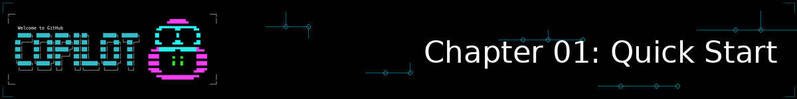
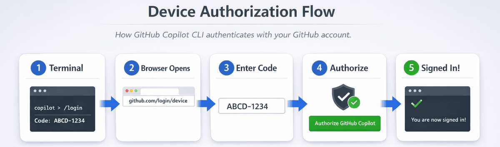

<!--
---
id: CopilotCLI-01
title: !translate Démarrage rapide
description: !translate Installez GitHub Copilot CLI, connectez-vous avec votre compte GitHub, et vérifiez que tout fonctionne.
audience: Developers / Students / Terminal users
slug: quick-start
weight: 2
---
-->



Bienvenue ! Dans ce chapitre, vous allez installer GitHub Copilot CLI (Command Line Interface), vous connecter avec votre compte GitHub, et vérifier que tout fonctionne. C'est un chapitre de configuration rapide. (Si vous avez sauté le Chapitre 00, optionnel, qui équipe votre terminal, pas de souci : vous pouvez toujours y revenir plus tard.) Une fois que vous serez opérationnel, les vraies démonstrations commencent au Chapitre 02 !

## 🎯 Objectifs d'apprentissage

À la fin de ce chapitre, vous aurez :

- Installé GitHub Copilot CLI
- Connecté votre compte GitHub
- Vérifié que tout fonctionne avec un test simple

> ⏱️ **Durée estimée** : ~10 minutes (5 min de lecture + 5 min de pratique)

---

## ✅ Prérequis

- **Un compte GitHub** avec accès à Copilot. [Voir les options d'abonnement](https://github.com/features/copilot/plans). Les étudiants/enseignants peuvent accéder à Copilot Pro gratuitement via [GitHub Education](https://education.github.com/pack).
- **Notions de base du terminal** : être à l'aise avec des commandes comme `cd` et `ls`

> ⚠️ **Version recommandée** : Copilot CLI v1.0.81 ou plus récent. L'outil est en disponibilité générale (GA) depuis février 2026 et évolue vite — pensez à le mettre à jour régulièrement (`npm update -g @github/copilot`, `brew upgrade copilot-cli`, etc.).

### Ce que signifie « avoir accès à Copilot »

GitHub Copilot CLI nécessite un abonnement Copilot actif. Vous pouvez vérifier votre statut sur [github.com/settings/copilot](https://github.com/settings/copilot). Vous devriez voir l'une des mentions suivantes :

- **Copilot Individual** - Abonnement personnel
- **Copilot Business** - Via votre organisation
- **Copilot Enterprise** - Via votre entreprise
- **GitHub Education** - Gratuit pour les étudiants/enseignants vérifiés

Si vous voyez « You don't have access to GitHub Copilot », vous devrez utiliser l'option gratuite, souscrire à un abonnement, ou rejoindre une organisation qui fournit l'accès.

---

## Installation

> ⏱️ **Durée estimée** : L'installation prend 2 à 5 minutes. L'authentification ajoute 1 à 2 minutes supplémentaires.

### GitHub Codespaces (aucune configuration nécessaire)

Si vous ne voulez installer aucun des prérequis, vous pouvez utiliser GitHub Codespaces, qui a GitHub Copilot CLI prêt à l'emploi (vous devrez vous connecter), et préinstalle Python et pytest.

1. [Forkez ce dépôt](https://github.com/github/copilot-cli-for-beginners/fork) sur votre compte GitHub
2. Sélectionnez **Code** > **Codespaces** > **Create codespace on main**
3. Attendez quelques minutes que le conteneur se construise
4. Vous êtes prêt ! Le terminal s'ouvrira automatiquement dans l'environnement Codespace.

> 💡 **Vérification dans Codespace** : Exécutez `cd samples/book-app-project && python book_app.py help` pour confirmer que Python et l'application d'exemple fonctionnent.

### Installation locale

Suivez ces étapes si vous souhaitez exécuter Copilot CLI sur votre machine locale avec les exemples du cours.

1. Clonez le dépôt pour récupérer les exemples du cours sur votre machine :

    ```bash
    git clone https://github.com/github/copilot-cli-for-beginners
    cd copilot-cli-for-beginners
    ```

2. Installez Copilot CLI en utilisant l'une des options suivantes.

    > 💡 **Vous ne savez pas laquelle choisir ?** Utilisez `npm` si vous avez Node.js installé. Sinon, choisissez l'option qui correspond à votre système.

    ### Toutes plateformes (npm)

    ```bash
    # Si vous avez Node.js installé, c'est un moyen rapide d'obtenir le CLI
    npm install -g @github/copilot
    ```

    ### macOS/Linux (Homebrew)

    ```bash
    brew install copilot-cli
    ```

    ### Windows (WinGet)

    ```bash
    winget install GitHub.Copilot
    ```

    ### macOS/Linux (script d'installation)

    ```bash
    curl -fsSL https://gh.io/copilot-install | bash
    ```

<details>
<summary>Optionnel : activer l'autocomplétion du shell</summary>

L'autocomplétion du shell vous permet d'appuyer sur **Tab** pour compléter les sous-commandes `copilot`, les options de commande, et certaines valeurs d'options. C'est optionnel, mais cela peut être pratique une fois que vous êtes à l'aise avec le CLI.

Copilot CLI prend actuellement en charge les scripts de complétion pour Bash, Zsh, et Fish :

```shell
# Bash, session en cours uniquement
source <(copilot completion bash)

# Bash, persistant sur Linux
copilot completion bash | sudo tee /etc/bash_completion.d/copilot

# Zsh
copilot completion zsh > "${fpath[1]}/_copilot"

# Fish
copilot completion fish > ~/.config/fish/completions/copilot.fish
```

Redémarrez votre shell après avoir ajouté la complétion persistante. PowerShell est pris en charge pour exécuter Copilot CLI sur Windows, mais `copilot completion` ne prend actuellement en charge que Bash, Zsh, et Fish.

</details>

---

## Authentification

Ouvrez une fenêtre de terminal à la racine du dépôt `copilot-cli-for-beginners`, démarrez le CLI et autorisez l'accès au dossier.

```bash
copilot
```

Il vous sera demandé de faire confiance au dossier contenant le dépôt (si ce n'est pas déjà fait). Vous pouvez lui faire confiance une seule fois ou pour toutes les sessions futures.


Après avoir approuvé le dossier, vous pouvez vous connecter avec votre compte GitHub.

```
> /login
```

**Ce qui se passe ensuite (terminal local interactif) :**

Depuis Copilot CLI v1.0.77, le **flux par navigateur est le flux par défaut** lorsque vous lancez `/login` depuis un terminal local interactif :

1. Choisissez de vous connecter à votre compte GitHub.com ou à un compte d'entreprise.
2. Le flux navigateur est proposé par défaut (`Sign in with your browser`).
3. Votre navigateur s'ouvre automatiquement sur la page d'autorisation de GitHub. Connectez-vous à GitHub si ce n'est pas déjà fait.
4. Sélectionnez « Authorize » pour accorder l'accès à GitHub Copilot CLI.
5. Retournez à votre terminal — vous êtes maintenant connecté !

> 💡 **Terminaux distants ou sans interface graphique (SSH, CI, conteneurs, IDE sans TTY)** : Dans ces environnements, Copilot CLI utilise par défaut le **flux de code d'appareil (device code flow)**, sans navigateur disponible. Vous verrez un code à usage unique du type `ABCD-1234`. Rendez-vous sur [github.com/login/device](https://github.com/login/device) dans un navigateur sur une autre machine et saisissez le code pour terminer la connexion.
>
> Pour forcer explicitement un flux plutôt que de laisser Copilot CLI choisir selon le contexte, utilisez `copilot login --web-flow` (navigateur) ou `copilot login --device-code` (code d'appareil). Vous pouvez aussi choisir de façon interactive avec `/login`.
>
> 
>
 
*Le flux par défaut selon le contexte (depuis Copilot CLI v1.0.77) : navigateur en local interactif — votre navigateur s'ouvre automatiquement et vous autorisez en un clic — et code d'appareil en distant/headless, où un code à saisir sur `github.com/login/device` est affiché à la place.*

**Astuce** : La connexion persiste entre les sessions. Vous n'avez besoin de le faire qu'une seule fois, sauf si votre jeton expire ou que vous vous déconnectez explicitement.

---

## Vérifier que tout fonctionne

### Étape 1 : Tester Copilot CLI

Maintenant que vous êtes connecté, vérifions que Copilot CLI fonctionne pour vous. Dans le terminal, démarrez le CLI si ce n'est pas déjà fait :

```bash
> Say hello and tell me what you can help with
```

Après avoir reçu une réponse, vous pouvez quitter le CLI :

```bash
> /exit
```

---

<details>
<summary>🎬 Voir en action !</summary>


*Le résultat de la démonstration peut varier. Votre modèle, vos outils et vos réponses différeront de ce qui est montré ici.*

</details>

---

**Résultat attendu** : Une réponse amicale listant les capacités de Copilot CLI.

### Étape 2 : Exécuter l'application d'exemple Book App

Le cours fournit une application d'exemple que vous allez explorer et améliorer tout au long du cours en utilisant le CLI *(vous pouvez voir le code dans /samples/book-app-project)*. Vérifiez que l'*application terminal Python de collection de livres* fonctionne avant de commencer. Exécutez `python` ou `python3` selon votre système.

> **Remarque :** Les exemples principaux présentés tout au long du cours utilisent Python (`samples/book-app-project`), vous devrez donc avoir [Python 3.10+](https://www.python.org/downloads/) disponible sur votre machine locale si vous avez choisi cette option (le Codespace l'a déjà installé). Des versions JavaScript (`samples/book-app-project-js`) et C# (`samples/book-app-project-cs`) sont également disponibles si vous préférez travailler avec ces langages. Chaque exemple dispose d'un README avec les instructions pour exécuter l'application dans ce langage.

```bash
cd samples/book-app-project
python book_app.py list
```

**Résultat attendu** : Une liste de 5 livres, dont « The Hobbit », « 1984 », et « Dune ».

### Étape 3 : Essayer Copilot CLI avec la Book App

Revenez d'abord à la racine du dépôt (si vous avez exécuté l'étape 2) :

```bash
cd ../..   # Retour à la racine du dépôt si nécessaire
copilot 
> What does @samples/book-app-project/book_app.py do?
```

**Résultat attendu** : Un résumé des principales fonctions et commandes de la Book App.

Si vous voyez une erreur, consultez la [section de dépannage](#dépannage) ci-dessous.

Une fois terminé, vous pouvez quitter Copilot CLI :

```bash
> /exit
```

---

## ✅ Vous êtes prêt !

C'est tout pour l'installation. Si vous n'avez pas encore équipé votre terminal, le **[Chapitre 00 : Équipez votre terminal](../00-modern-terminal-stack/README.md)** reste disponible (en option, mais recommandé) avant d'aller plus loin. Le vrai plaisir commence ensuite au Chapitre 02, où vous allez :

- Regarder l'IA passer en revue la Book App et détecter instantanément des problèmes de qualité de code
- Apprendre trois façons différentes d'utiliser Copilot CLI
- Générer du code fonctionnel à partir de langage naturel

**[Continuer vers le Chapitre 02 : Premiers pas →](../02-setup-and-first-steps/README.md)**

---

## Dépannage

### « copilot: command not found »

Le CLI n'est pas installé. Essayez une méthode d'installation différente :

```bash
# Si brew a échoué, essayez npm :
npm install -g @github/copilot

# Ou le script d'installation :
curl -fsSL https://gh.io/copilot-install | bash
```

### « You don't have access to GitHub Copilot »

1. Vérifiez que vous avez un abonnement Copilot sur [github.com/settings/copilot](https://github.com/settings/copilot)
2. Vérifiez que votre organisation autorise l'accès au CLI si vous utilisez un compte professionnel

### « Authentication failed »

Réauthentifiez-vous :

```bash
copilot
> /login
```

### Le navigateur ne s'ouvre pas automatiquement

Sur les terminaux distants ou sans interface graphique, le flux de code d'appareil est utilisé à la place. Votre terminal affichera un code à usage unique. Rendez-vous sur [github.com/login/device](https://github.com/login/device), saisissez le code, puis autorisez l'accès.

### Jeton expiré

Exécutez simplement à nouveau `/login` :

```bash
copilot
> /login
```

### Toujours bloqué ?

- Consultez la [documentation de GitHub Copilot CLI](https://docs.github.com/copilot/concepts/agents/about-copilot-cli)
- Recherchez dans les [GitHub Issues](https://github.com/github/copilot-cli/issues)

---

## 🔑 Points clés à retenir

1. **Un GitHub Codespace est un moyen rapide de démarrer** - Python, pytest, et GitHub Copilot CLI sont tous préinstallés pour que vous puissiez passer directement aux démonstrations
2. **Plusieurs méthodes d'installation** - Choisissez celle qui convient à votre système (Homebrew, WinGet, npm, ou script d'installation)
3. **Authentification unique** - La connexion persiste jusqu'à l'expiration du jeton
4. **La Book App fonctionne** - Vous utiliserez `samples/book-app-project` tout au long du cours

> 📚 **Documentation officielle** : [Installer Copilot CLI](https://docs.github.com/copilot/how-tos/copilot-cli/cli-getting-started) pour les options d'installation et les prérequis.

> 📋 **Référence rapide** : Consultez la [référence des commandes GitHub Copilot CLI](https://docs.github.com/en/copilot/reference/cli-command-reference) pour une liste complète des commandes et raccourcis.

---

**[← Retour au Chapitre 00 : Équipez votre terminal](../00-modern-terminal-stack/README.md)** | **[Continuer vers le Chapitre 02 : Premiers pas →](../02-setup-and-first-steps/README.md)**
