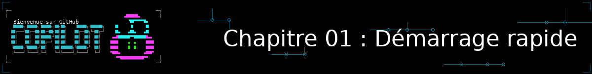
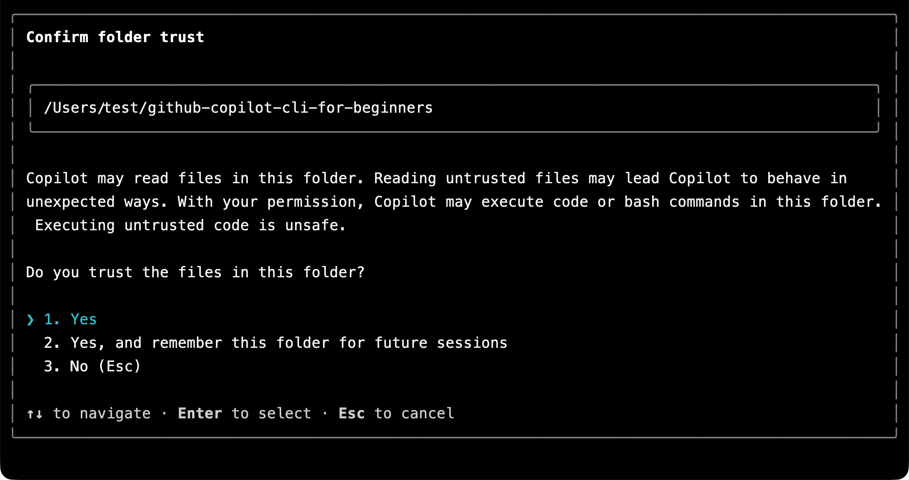
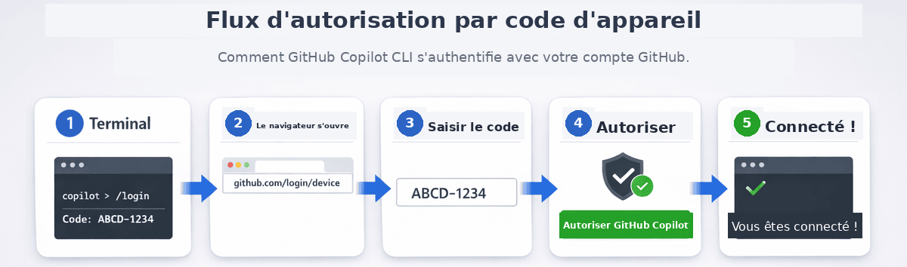
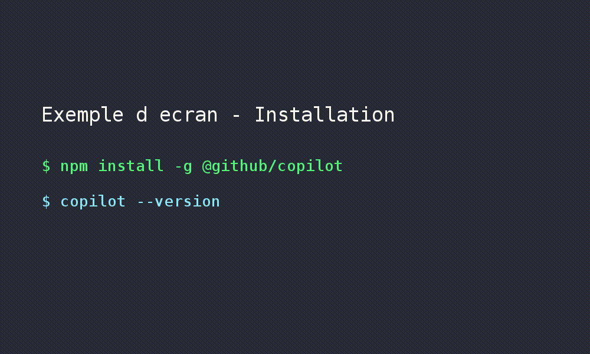
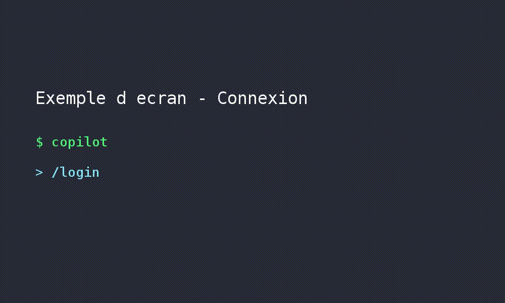
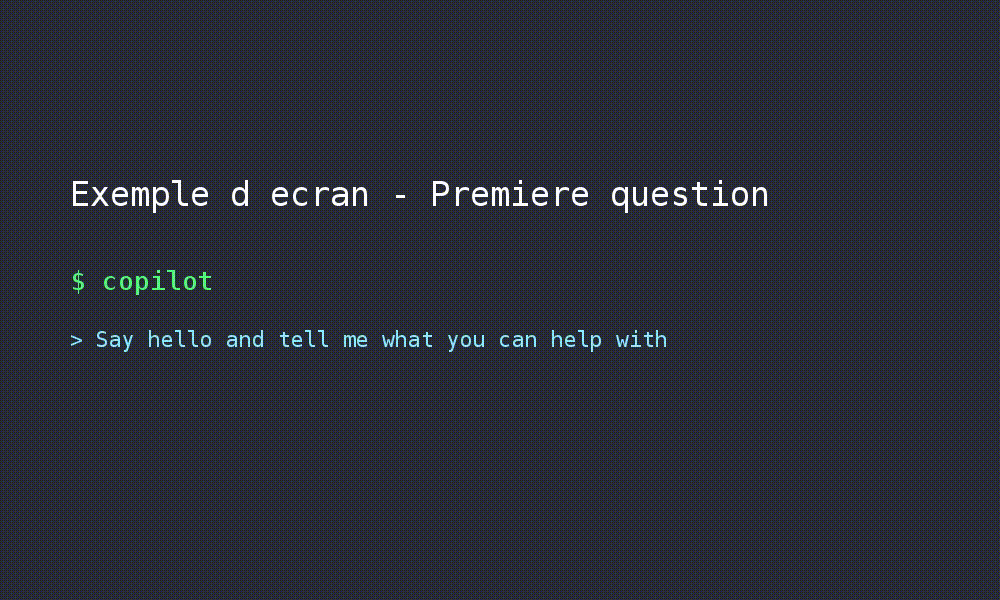
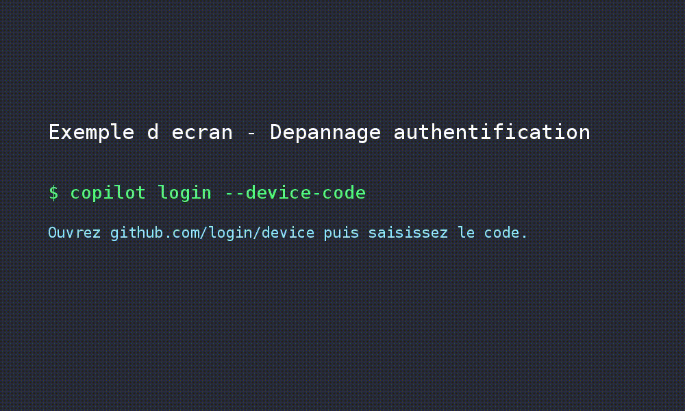

<!--
---
id: CopilotCLI-01
title: !translate Démarrage rapide
description: !translate Installe GitHub Copilot CLI, connecte-toi avec ton compte GitHub, vérifie que tout fonctionne, puis explore en option le modèle Auto, la Statusline, l'observabilité OpenTelemetry et les serveurs LSP.
audience: Developers / Students / Terminal users
slug: quick-start
weight: 2
---
-->



Bienvenue ! Dans ce chapitre, tu vas installer GitHub Copilot CLI (Command Line Interface), te connecter avec ton compte GitHub, et vérifier que tout fonctionne. C'est un chapitre de configuration rapide. (Si tu as sauté le Chapitre 00, optionnel, qui équipe ton terminal, pas de souci : tu peux toujours y revenir plus tard.) Une fois que tu seras opérationnel, les vraies démonstrations commencent au Chapitre 02 !

Une fois le cœur du chapitre terminé (« ✅ Tu es prêt ! »), une section entièrement **optionnelle** — « Pour aller plus loin » — t'attend si tu veux tout de suite creuser des sujets plus avancés : sélection automatique de modèle, personnalisation de l'interface, outils tiers, observabilité, et serveurs de langage (LSP). Tu peux aussi l'ignorer pour l'instant et y revenir après le Chapitre 02.

## 🎯 Objectifs d'apprentissage

À la fin de ce chapitre, tu auras :

- Installé GitHub Copilot CLI
- Connecté ton compte GitHub
- Vérifié que tout fonctionne avec un test simple

Et si tu complètes la section optionnelle « Pour aller plus loin », tu auras en plus :

- Activé et vérifié le modèle Auto
- Personnalisé la Statusline, y compris son mode expérimental à base de script
- Installé et testé deux outils tiers réels pour Copilot CLI (Caveman et peon-ping)
- Activé l'export de métriques OpenTelemetry et lu une trace produite par Copilot CLI
- Lu un rapport d'usage Copilot CLI avec Tokscale, et compris à quoi sert Graphiti
- Configuré au moins un serveur LSP (Python, Java, .NET ou Terraform)

> ⏱️ **Durée estimée** : ~10 minutes pour le cœur du chapitre (5 min de lecture + 5 min de pratique) + ~90 à 120 minutes si tu complètes la section optionnelle « Pour aller plus loin »

---

## ✅ Prérequis

- **Un compte GitHub** avec accès à Copilot. [Voir les options d'abonnement](https://github.com/features/copilot/plans). Les étudiants/enseignants peuvent accéder à Copilot Pro gratuitement via [GitHub Education](https://education.github.com/pack).
- **Notions de base du terminal** : être à l'aise avec des commandes comme `cd` et `ls`

> ⚠️ **Version recommandée** : Copilot CLI v1.0.81 ou plus récent. L'outil est en disponibilité générale (GA) depuis février 2026 et évolue vite — pense à le mettre à jour régulièrement (`npm update -g @github/copilot`, `brew upgrade copilot-cli`, etc.).

> 🏷️ **Tags de disponibilité** : comme au Chapitre 00, 🐧 **Linux**, 🍎 **macOS** et 🪟 **PowerShell** (Windows natif) marquent la disponibilité de chaque commande. Copilot CLI lui-même fonctionne sur les trois ; certaines commandes annexes (complétion shell, scripts d'exemple) ne sont pas disponibles partout.

### Ce que signifie « avoir accès à Copilot »

GitHub Copilot CLI nécessite un abonnement Copilot actif. Tu peux vérifier ton statut sur [github.com/settings/copilot](https://github.com/settings/copilot). Tu devrais voir l'une des mentions suivantes :

- **Copilot Individual** - Abonnement personnel
- **Copilot Business** - Via ton organisation
- **Copilot Enterprise** - Via ton entreprise
- **GitHub Education** - Gratuit pour les étudiants/enseignants vérifiés

Si tu vois « You don't have access to GitHub Copilot », tu devras utiliser l'option gratuite, souscrire à un abonnement, ou rejoindre une organisation qui fournit l'accès.

---

## Installation

> ⏱️ **Durée estimée** : L'installation prend 2 à 5 minutes. L'authentification ajoute 1 à 2 minutes supplémentaires.

### GitHub Codespaces (aucune configuration nécessaire)

Si tu ne veux installer aucun des prérequis, tu peux utiliser GitHub Codespaces, qui a GitHub Copilot CLI prêt à l'emploi (tu devras te connecter), et préinstalle Python et pytest.

1. [Forke ce dépôt](https://github.com/Lorddelphi01/onepoint_formation_gihub_copilot/fork) sur ton compte GitHub
2. Sélectionne **Code** > **Codespaces** > **Create codespace on main**
3. Attends quelques minutes que le conteneur se construise
4. Tu es prêt ! Le terminal s'ouvrira automatiquement dans l'environnement Codespace.

> 💡 **Vérification dans Codespace** : Exécute `cd samples/book-app-project && python book_app.py help` pour confirmer que Python et l'application d'exemple fonctionnent.

### Installation locale

Suis ces étapes si tu souhaites exécuter Copilot CLI sur ta machine locale avec les exemples du cours. L'installation est entièrement prise en charge par un script : tu n'as aucune commande d'installation à saisir à la main.

1. Clone le dépôt pour récupérer les exemples du cours sur ta machine :

    ```bash
    git clone https://github.com/Lorddelphi01/onepoint_formation_gihub_copilot
    cd onepoint_formation_gihub_copilot
    ```

2. Exécute le script correspondant à ton système, depuis la racine du dépôt. Il installe Copilot CLI, vérifie sa version, installe en option [RTK](#c3-rtk--réduire-la-sortie-des-commandes-à-la-source) (outil tiers, non bloquant), **et** contrôle que la Book App fonctionne (Étape 2 de la section « Vérifier que tout fonctionne ») :

    ```bash
    # 🐧 Linux (WSL Debian)
    bash 01-quick-start/scripts/install-linux.sh

    # 🍎 macOS
    bash 01-quick-start/scripts/install-macos.sh
    ```

    ```powershell
    # 🪟 PowerShell (Windows)
    .\01-quick-start\scripts\install-windows.ps1
    ```

    > 💡 Chaque script retrouve seul l'emplacement du dépôt (via son propre chemin), donc peu importe le dossier depuis lequel tu l'exécutes tant que tu restes dans le dépôt cloné.

    **Résultat attendu** : le script affiche un numéro de version de `copilot`. S'il signale une erreur ou que `copilot` reste introuvable, ferme et rouvre le terminal, puis relance le script.

Les scripts s'arrêtent avant l'authentification : `/login` reste une étape manuelle, car elle nécessite un navigateur ou la saisie d'un code d'appareil (voir la section [Authentification](#authentification) ci-dessous).

<details>
<summary>Optionnel : activer l'autocomplétion du shell</summary>

L'autocomplétion du shell te permet d'appuyer sur **Tab** pour compléter les sous-commandes `copilot`, les options de commande, et certaines valeurs d'options. C'est optionnel, mais cela peut être pratique une fois que tu es à l'aise avec le CLI.

Copilot CLI prend actuellement en charge les scripts de complétion pour Bash, Zsh, et Fish — **🐧 Linux · 🍎 macOS uniquement** :

```shell
# Bash, session en cours uniquement
source <(copilot completion bash)

# Bash, persistant sur Linux
copilot completion bash | sudo tee /etc/bash_completion.d/copilot

# Zsh
copilot completion zsh > "${fpath[1]}/_copilot"

# Fish
copilot completion fish > ~/.config/fish/completions/copilot.fish
```

Redémarre ton shell après avoir ajouté la complétion persistante. 🪟 **PowerShell** est pris en charge pour **exécuter** Copilot CLI sur Windows, mais `copilot completion` ne prend actuellement en charge que Bash, Zsh, et Fish — pas de complétion Tab native sous PowerShell à ce jour.

</details>

---

## Authentification

Ouvre une fenêtre de terminal à la racine du dépôt `onepoint_formation_gihub_copilot`, démarre le CLI et autorise l'accès au dossier.

```bash
copilot
```

Il te sera demandé de faire confiance au dossier contenant le dépôt (si ce n'est pas déjà fait). Tu peux lui faire confiance une seule fois ou pour toutes les sessions futures.



Après avoir approuvé le dossier, tu peux te connecter avec ton compte GitHub.

```
> /login
```

**Ce qui se passe ensuite (terminal local interactif) :**

Depuis Copilot CLI v1.0.77, le **flux par navigateur est le flux par défaut** lorsque tu lances `/login` depuis un terminal local interactif :

1. Choisis de te connecter à ton compte GitHub.com ou à un compte d'entreprise.
2. Le flux navigateur est proposé par défaut (`Sign in with your browser`).
3. Ton navigateur s'ouvre automatiquement sur la page d'autorisation de GitHub. Connecte-toi à GitHub si ce n'est pas déjà fait.
4. Sélectionne « Authorize » pour accorder l'accès à GitHub Copilot CLI.
5. Retourne à ton terminal — tu es maintenant connecté !

> 💡 **Terminaux distants ou sans interface graphique (SSH, CI, conteneurs, IDE sans TTY)** : Dans ces environnements, Copilot CLI utilise par défaut le **flux de code d'appareil (device code flow)**, sans navigateur disponible. Tu verras un code à usage unique du type `ABCD-1234`. Rends-toi sur [github.com/login/device](https://github.com/login/device) dans un navigateur sur une autre machine et saisis le code pour terminer la connexion.
>
> Pour forcer explicitement un flux plutôt que de laisser Copilot CLI choisir selon le contexte, utilise `copilot login --web-flow` (navigateur) ou `copilot login --device-code` (code d'appareil). Tu peux aussi choisir de façon interactive avec `/login`.
>
> 
>
 
*Le flux par défaut selon le contexte (depuis Copilot CLI v1.0.77) : navigateur en local interactif — ton navigateur s'ouvre automatiquement et tu autorises en un clic — et code d'appareil en distant/headless, où un code à saisir sur `github.com/login/device` est affiché à la place.*

**Astuce** : La connexion persiste entre les sessions. Tu n'as besoin de le faire qu'une seule fois, sauf si ton jeton expire ou que tu te déconnectes explicitement.

---

## Vérifier que tout fonctionne

### 🎬 Les quatre gestes du démarrage rapide

Les démonstrations ci-dessous illustrent les quatre parcours à retenir. Elles montrent le principe ; les écrans et le texte exact peuvent changer avec ton système ou la version du CLI.

| Geste | Démonstration | Si ton écran diffère |
|---|---|---|
| Installer puis vérifier | `quick-start-install-demo.gif` | Relance le script d'installation de ton système et vérifie avec `copilot --version`. |
| Se connecter | `quick-start-authentication-demo.gif` | Sur un terminal sans navigateur, utilise le code d'appareil montré dans la démonstration de dépannage. |
| Poser la première question | `quick-start-first-command-demo.gif` | La réponse peut être différente : cela confirme néanmoins que le CLI fonctionne. |
| Dépanner l'authentification | `quick-start-authentication-help-demo.gif` | Ouvre [le dépannage](#dépannage) si le code ou le navigateur ne résout pas le problème. |

<details>
<summary>Voir les quatre exemples d'écran</summary>









</details>

### Étape 1 : Tester Copilot CLI

Maintenant que tu es connecté, vérifions que Copilot CLI fonctionne pour toi. Dans le terminal, démarre le CLI puis pose ta première question :

```bash
copilot
> Say hello and tell me what you can help with
```

Après avoir reçu une réponse, tu peux quitter le CLI :

```bash
> /exit
```

---

<details>
<summary>🎬 Voir en action !</summary>


*Le résultat de la démonstration peut varier. Ton modèle, tes outils et tes réponses différeront de ce qui est montré ici.*

</details>

---

**Résultat attendu** : Une réponse amicale listant les capacités de Copilot CLI.

### Étape 2 : Exécuter l'application d'exemple Book App

Le cours fournit une application d'exemple que tu vas explorer et améliorer tout au long du cours en utilisant le CLI *(tu peux voir le code dans /samples/book-app-project)*. Vérifie que l'*application terminal Python de collection de livres* fonctionne avant de commencer. Exécute `python` ou `python3` selon ton système.

> **Remarque :** Les exemples principaux présentés tout au long du cours utilisent Python (`samples/book-app-project`), tu devras donc avoir [Python 3.10+](https://www.python.org/downloads/) disponible sur ta machine locale si tu as choisi cette option (le Codespace l'a déjà installé). Des versions JavaScript (`samples/book-app-project-js`) et C# (`samples/book-app-project-cs`) sont également disponibles si tu préfères travailler avec ces langages. Chaque exemple dispose d'un README avec les instructions pour exécuter l'application dans ce langage.

```bash
cd samples/book-app-project
python book_app.py list
```

**Résultat attendu** : Une liste de 5 livres, dont « The Hobbit », « 1984 », et « Dune ».

### Étape 3 : Essayer Copilot CLI avec la Book App

Reviens d'abord à la racine du dépôt (si tu as exécuté l'étape 2) :

```bash
cd ../..   # Retour à la racine du dépôt si nécessaire
copilot 
> What does @samples/book-app-project/book_app.py do?
```

**Résultat attendu** : Un résumé des principales fonctions et commandes de la Book App.

Si tu vois une erreur, consulte la [section de dépannage](#dépannage) ci-dessous.

Une fois terminé, tu peux quitter Copilot CLI :

```bash
> /exit
```

---

## ✅ Tu es prêt !

C'est tout pour l'installation. Si tu n'as pas encore équipé ton terminal, le **[Chapitre 00 : Équipe ton terminal](../00-modern-terminal-stack/README.md)** reste disponible (en option, mais recommandé) avant d'aller plus loin. Le vrai plaisir commence ensuite au Chapitre 02, où tu vas :

- Regarder l'IA passer en revue la Book App et détecter instantanément des problèmes de qualité de code
- Apprendre trois façons différentes d'utiliser Copilot CLI
- Générer du code fonctionnel à partir de langage naturel

**[Continuer vers le Chapitre 02 : Premiers pas →](../02-setup-and-first-steps/README.md)**

Tu peux continuer directement vers le Chapitre 02, ou rester ici pour la section optionnelle ci-dessous.

---

## Pour aller plus loin (optionnel)

> 💡 **Cette section est entièrement optionnelle.** Le cœur du chapitre s'arrête ci-dessus : tu as déjà installé, authentifié et vérifié Copilot CLI, ce qui suffit pour attaquer le Chapitre 02. Les six blocs qui suivent creusent des sujets plus avancés (sélection de modèle, personnalisation de l'interface, outils tiers, observabilité, intelligence de code) pour qui veut approfondir sa configuration avant de continuer. Traite-les dans l'ordre, pioche-en un seul, ou reviens-y plus tard.

> ⏱️ **Durée indicative de l'ensemble** : ~90 à 120 minutes pour les six blocs.

### A. Comprendre et activer le modèle Auto

**Objectif pédagogique** : comprendre le principe de sélection automatique de modèle, l'activer, vérifier quel modèle a réellement traité ta requête, et connaître ses limites.

> ⏱️ **Durée indicative** : ~10 minutes
> ✅ **Prérequis** : avoir terminé l'installation et l'authentification ci-dessus.

Copilot CLI peut choisir lui-même, à chaque requête, le modèle qu'il juge le plus adapté — en tenant compte de la disponibilité en temps réel des modèles et, depuis le 1er juillet 2026, de la complexité estimée de la tâche (raisonnement, génération de code, diagnostic de bug, orchestration d'outils). Le CLI évite volontairement de changer de modèle en cours de session : un changement mi-session coûterait plus cher pour un gain de qualité jugé insuffisant par GitHub.

> 💡 **Copilot CLI vs VS Code vs les autres IDE** : le modèle Auto avec routage par tâche est disponible en version stable (GA) à la fois dans **Copilot CLI** et dans **VS Code**, avec trois profils sélectionnables (`efficiency`, `balance`, `intelligence`). Dans **JetBrains, Eclipse, Xcode et Visual Studio**, Auto existe aussi mais se limite à un routage « fiabilité seule », sans ces profils. Ne pars donc pas du principe qu'Auto se comporte à l'identique partout.

**Étapes** :

1. Lance Copilot CLI et ouvre le sélecteur de modèle :

    ```bash
    copilot
    > /model
    ```

2. Sélectionne **Auto** dans la liste.
3. Pose une question qui demande un peu de raisonnement, par exemple :

    ```
    > Explique la différence entre une liste et un tuple en Python, puis donne un exemple où le choix a un impact sur les performances
    ```

4. Regarde le nom du modèle affiché avec la réponse : c'est le modèle qu'Auto a réellement choisi pour cette requête.
5. *(Optionnel)* Force un profil de routage pour la session :

    ```bash
    copilot --model auto --auto-tier intelligence
    ```

    Les profils possibles sont `efficiency` (rapide et économique), `balance` (par défaut) et `intelligence` (priorité à la qualité de réponse). Tu peux aussi fixer ce choix durablement avec la variable d'environnement `COPILOT_AUTO_TIER`.
6. *(Optionnel)* Pour qu'Auto soit le modèle par défaut de **toutes tes futures sessions** (pas seulement celle-ci), utilise `/config model` plutôt que `/model`, qui ne change le modèle que pour la session en cours — ou ajoute `"model": "auto"` dans `~/.copilot/settings.json`.

**Résultat attendu** : après chaque réponse, un nom de modèle concret s'affiche (jamais littéralement « Auto ») — c'est la preuve qu'un routage a bien eu lieu.

**Critères de validation** : tu as sélectionné Auto, posé au moins une question, et identifié dans la sortie le nom du modèle réellement utilisé.

<details>
<summary>🔧 Dépannage</summary>

| Erreur / Situation | Ce qui se passe | Solution |
|---|---|---|
| Auto ne route jamais vers le modèle attendu | Auto exclut les modèles hors de ton abonnement, exclus par une politique d'administrateur, à résidence de données/FedRAMP, ou marqués « évaluation » ; il est aussi actuellement limité aux modèles à multiplicateur 0x–1x | C'est un comportement documenté, pas un bug — vérifie `/model` pour voir la liste réellement disponible pour ton compte |
| `--auto-tier` semble ignoré | Le réglage n'a d'effet que si le modèle effectif est Auto | Confirme d'abord que `/model` affiche bien Auto comme sélection active |

</details>

> ⚠️ **Limite connue** : la documentation officielle ne précise pas de version minimale exacte de Copilot CLI pour voir apparaître Auto dans le sélecteur — le repère fiable est la fonctionnalité elle-même : si `/model` ne propose pas Auto, mets à jour le CLI (`copilot update`).

**Défi** : relance la même question avec `--auto-tier efficiency` puis `--auto-tier intelligence`, et compare le modèle choisi dans chaque cas.

> 📚 Source officielle : [About Copilot auto model selection](https://docs.github.com/en/copilot/concepts/models/auto-model-selection). Pour la table complète des commandes liées au modèle, voir la section *Changer de modèle* du [Chapitre 02](../02-setup-and-first-steps/README.md).

---

### B. Personnaliser la Statusline (expérimentale)

**Objectif pédagogique** : distinguer les deux niveaux de personnalisation de la barre d'état de Copilot CLI, activer le mode expérimental à base de script, et savoir le désactiver.

> ⏱️ **Durée indicative** : ~15 minutes
> ✅ **Prérequis** : un terminal Bash (le script de cet exercice utilise `jq` ; sous Windows, utilise WSL ou adapte-le en PowerShell).
> 🏷️ **Disponibilité** : 🐧 Linux · 🍎 macOS (script bash+jq tel quel) · 🪟 PowerShell non fourni, à adapter (voir prérequis ci-dessus).

> ⚠️ **Ne confonds pas** la Statusline de Copilot CLI avec celle d'autres outils en ligne de commande : ce sont des fonctionnalités distinctes, même si GitHub s'est ouvertement inspiré du concept (voir l'issue [`github/copilot-cli#2266`](https://github.com/github/copilot-cli/issues/2266)). Ce n'est pas non plus la barre d'état de VS Code.

Copilot CLI a en réalité **deux** mécanismes de personnalisation de la ligne affichée en bas de l'interface interactive :

| Mécanisme | Statut | Ce qu'il permet |
|---|---|---|
| `/statusline` (alias `/footer`) | Stable, documenté officiellement | Active/désactive des indicateurs prédéfinis : modèle et effort, répertoire, branche git, fenêtre de contexte, quota, agent actif, usage IA, lignes modifiées, nom d'utilisateur, sandbox, mode YOLO |
| `statusLine.command` (script personnalisé) | **Expérimental**, sujet à changement | Exécute ton propre script à chaque réponse et affiche ce qu'il retourne |

**Étapes — activer les indicateurs prédéfinis (stable)** :

1. Dans une session Copilot CLI, tape `/statusline` (ou `/footer`) et coche les indicateurs qui t'intéressent (par exemple la fenêtre de contexte et le quota).
2. **Résultat attendu** : la ligne en bas de l'écran affiche désormais ces informations après chaque réponse.

**Étapes — activer le mode script personnalisé (expérimental)** :

1. Ouvre (ou crée) `~/.copilot/settings.json` et ajoute :

    ```json
    {
      "experimental": true,
      "feature_flags": { "enabled": ["STATUS_LINE"] },
      "statusLine": {
        "type": "command",
        "command": "~/.copilot/statusline.sh",
        "padding": 1
      }
    }
    ```

2. Crée `~/.copilot/statusline.sh` (exécutable) : le CLI lui envoie sur son entrée standard un payload JSON (répertoire courant, modèle, tokens de contexte utilisés, coût de la session...) après chaque réponse, et affiche tel quel ce que le script écrit sur sa sortie standard. Exemple minimal :

    ```bash
    #!/usr/bin/env bash
    set -eu
    payload=$(cat)
    model=$(echo "$payload" | jq -r '.model.display_name // "?"')
    pct=$(echo "$payload" | jq -r '.context_window.current_context_used_percentage // "?"')
    echo "🤖 $model · contexte utilisé : ${pct}%"
    ```

    ```bash
    chmod +x ~/.copilot/statusline.sh
    ```

3. Redémarre Copilot CLI et pose une question.

**Résultat attendu** : après la réponse, la ligne personnalisée générée par ton script s'affiche en bas de l'écran.

**Critères de validation** : tu as activé au moins un indicateur via `/statusline`, **et** vu ton propre script s'afficher après avoir activé le mode expérimental.

**Désactivation** : repasse les indicateurs à faux via `/statusline`/`/footer` ; pour le mode script, supprime le bloc `statusLine` ou repasse `"experimental"` à `false`, puis redémarre.

<details>
<summary>🔧 Dépannage</summary>

| Erreur / Situation | Ce qui se passe | Solution |
|---|---|---|
| Le script ne s'affiche jamais | `experimental` est à `false`, ou le flag `STATUS_LINE` n'est pas activé | Vérifie les deux clés dans `settings.json`, puis redémarre le CLI |
| `jq: command not found` dans le script | `jq` n'est pas installé | Installe-le (`apt install jq`, `brew install jq`...) ou parse le JSON autrement |

</details>

**Défi** : modifie le script pour afficher aussi la branche git courante (`git symbolic-ref --short HEAD`).

> 📚 Sources : [référence des commandes CLI](https://docs.github.com/en/copilot/reference/copilot-cli-reference/cli-command-reference) et [référence du dossier de configuration](https://docs.github.com/en/copilot/reference/copilot-cli-reference/cli-config-dir-reference) pour les indicateurs `footer` (stable). Le mode script `statusLine.command` est corroboré par plusieurs sources communautaires cohérentes (dont la configuration active utilisée pour rédiger ce chapitre) mais n'a pas été retrouvé mot pour mot sur une page officielle : traite-le comme expérimental et sujet à changement.

---

### C. « Peon Caveman » : mise au point et deux vrais outils

**Objectif pédagogique** : ne pas confondre deux projets réels distincts, comprendre ce que chacun fait, et l'installer.

> ⏱️ **Durée indicative** : ~15 minutes (environ 7 minutes par outil)
> ✅ **Prérequis** : Node.js installé (les deux outils s'installent via `npx`).

> ⚠️ **Aucun projet ne s'appelle « Peon Caveman ».** Ce nom semble croiser deux outils réels et sans rapport entre eux. Les deux sont présentés ci-dessous, sous leur vrai nom, pour éviter toute confusion.

#### C.1. Caveman — compression de tokens pour agents IA

**Ce que c'est** : un skill + proxy open source qui réduit la consommation de tokens d'un agent IA : il rend la prose de l'agent plus concise, tout en préservant le code, les commandes et les messages d'erreur tels quels, et compresse les logs/diffs/JSON volumineux avant qu'ils n'atteignent le modèle.

**Intégration avec Copilot CLI** : documentée par le projet lui-même, puisque Copilot CLI s'appuie sur des fichiers de règles statiques plutôt que sur des hooks.

```bash
npx -y github:JuliusBrussee/caveman -- --only copilot
# --with-init génère en plus un .github/copilot-instructions.md pour tout le dépôt
```

**Vérification** : relance `copilot` et observe si les réponses en langage naturel sont plus courtes/denses qu'avant (le code et les commandes, eux, ne doivent pas changer).

**Limite** : projet tiers non officiel, à évaluer comme n'importe quelle dépendance externe avant de l'adopter en équipe.

Dépôt officiel : [`github.com/JuliusBrussee/caveman`](https://github.com/JuliusBrussee/caveman)

#### C.2. peon-ping — notifications sonores multi-agents

**Ce que c'est** : un outil qui joue des bruitages (voix Warcraft) lorsqu'un agent IA en ligne de commande a besoin d'attention ou termine une tâche. Il implémente un format ouvert, le *Coding Event Sound Pack Specification* (CESP), et fonctionne avec de nombreux agents — Claude Code, Copilot CLI, Cursor, Codex, et d'autres. Copilot CLI n'est qu'un des clients compatibles parmi d'autres : ce n'est pas un outil spécifique à GitHub.

```bash
npx -y peon-ping
```

**Vérification** : lance une commande longue via Copilot CLI et vérifie qu'un son se déclenche à la fin.

**Limite** : les bruitages proviennent d'œuvres tierces (Blizzard notamment), utilisées par le projet sous fair use, sans affiliation officielle revendiquée.

Dépôt officiel : [`github.com/PeonPing/peon-ping`](https://github.com/PeonPing/peon-ping) — site : [peonping.com](https://www.peonping.com/)

#### C.3. RTK — réduire la sortie des commandes à la source

**Ce que c'est** : [RTK](https://github.com/rtk-ai/rtk) (« Rust Token Killer ») est un proxy en ligne de commande écrit en Rust. Il s'intercale entre l'agent et plus d'une centaine de commandes courantes (`git`, `npm`, `pytest`, `docker`...), exécute la vraie commande, puis renvoie une version compressée de sa sortie. Le résultat reste le même, seul son volume (donc le nombre de tokens consommés) diminue. À ne pas confondre avec Caveman (C.1), qui agit sur la prose de l'agent : RTK agit sur ce que les commandes affichent.

**Installation** : déjà faite par les scripts d'installation de la section [Installation locale](#installation-locale) (étape optionnelle, non bloquante : si elle échoue, le reste de l'installation n'est pas affecté). Vérifie-la :

```bash
rtk --version
rtk gain
```

> ⚠️ **Collision de nom possible** : si `rtk gain` échoue, un autre paquet nommé `rtk` (« Rust Type Kit ») occupe peut-être le nom. Contrôle `which rtk` (🐧 Linux · 🍎 macOS) ou `Get-Command rtk` (🪟 PowerShell).

**Connexion à Copilot CLI** (seule étape manuelle) :

```bash
rtk init -g --copilot
```

**Vérification** : après avoir relancé `copilot`, exécute `rtk gain` : il affiche les tokens économisés au fil de ton usage.

**Limite** : projet tiers non maintenu par GitHub, à évaluer comme n'importe quelle dépendance externe. Les chiffres d'économie sont des estimations. Le [Chapitre 14](../14-token-consumption-analysis/README.md) détaille la comparaison avant/après et la lecture d'un rapport `rtk gain`.

Dépôt officiel : [`github.com/rtk-ai/rtk`](https://github.com/rtk-ai/rtk)

**Défi** : installe Caveman et peon-ping, vérifie que RTK répond, puis décide lesquels gardent leur place dans ta configuration quotidienne — et pourquoi.

---

### D. Activer les métriques OpenTelemetry

**Objectif pédagogique** : comprendre traces/métriques/logs dans un workflow agentique, activer l'export OpenTelemetry de Copilot CLI, observer une interaction réelle, puis désactiver l'instrumentation.

> ⏱️ **Durée indicative** : ~20 minutes
> ✅ **Prérequis** : `jq` installé pour lire confortablement le fichier produit.
> 🏷️ **Disponibilité** : 🐧 Linux · 🍎 macOS (`jq` s'installe via `apt`/`brew`) · 🪟 PowerShell — Copilot CLI et les variables `COPILOT_OTEL_*` fonctionnent, mais les commandes `jq` ci-dessous sont à adapter (`ConvertFrom-Json` par exemple) ou à exécuter depuis WSL.

**Traces, métriques, logs — la différence** : une **trace** est l'arbre des étapes d'une interaction (l'agent invoqué → un appel modèle → l'exécution d'un outil...) ; une **métrique** est une valeur numérique agrégée dans le temps (durée moyenne, nombre de tokens...) ; un **log** est un message d'événement ponctuel. Copilot CLI exporte des traces et des métriques suivant les *OTel GenAI Semantic Conventions* — pas de logs applicatifs au sens strict dans cet export.

OpenTelemetry est **désactivé par défaut** dans Copilot CLI. L'activation se déclenche dès que l'une de ces variables est définie : `COPILOT_OTEL_ENABLED=true`, `OTEL_EXPORTER_OTLP_ENDPOINT`, ou `COPILOT_OTEL_FILE_EXPORTER_PATH`.

**Étapes — exporteur fichier (le plus simple pour un TP, aucune infrastructure requise)** :

1. Lance Copilot CLI avec l'export fichier activé :

    ```bash
    COPILOT_OTEL_FILE_EXPORTER_PATH=/tmp/copilot-otel.jsonl copilot
    ```

2. Pose une question qui déclenche un outil, par exemple :

    ```
    > Liste les fichiers du dossier samples/book-app-project
    ```

3. Quitte (`/exit`) puis inspecte le fichier produit :

    ```bash
    wc -l /tmp/copilot-otel.jsonl
    jq -c 'select(.type == "span") | {name, attributes}' /tmp/copilot-otel.jsonl | head -5
    jq -c 'select(.type == "metric") | {name, unit}' /tmp/copilot-otel.jsonl | head -5
    ```

**Résultat attendu** : chaque ligne est un objet JSON `{"type": "span", ...}` ou `{"type": "metric", ...}`. Tu dois pouvoir repérer un span `execute_tool` avec le nom de l'outil appelé et sa durée (`startTime`/`endTime`), et des métriques comme `gen_ai.client.token.usage` ou `github.copilot.tool.call.count`.

**Critères de validation** : le fichier `.jsonl` existe et contient au moins un span de type `execute_tool` et une métrique liée aux tokens.

> ⚠️ **Confidentialité** : par défaut, **aucun contenu de prompt, de réponse ou d'argument d'outil n'est capturé** — seules des métadonnées (nom de modèle, durée, compteurs de tokens, nom d'outil) le sont. La capture complète du contenu (`OTEL_INSTRUMENTATION_GENAI_CAPTURE_MESSAGE_CONTENT=true`) peut exposer du code, des chemins de fichiers ou des données sensibles : ne l'active qu'en environnement de confiance, jamais sur un poste partagé ou en présence de données clients.

<details>
<summary>💡 Pour aller plus loin : exporter vers un collecteur local</summary>

Pour visualiser les traces dans une interface graphique (Jaeger, Grafana Tempo...), pointe vers un collecteur OTLP/HTTP local :

```bash
OTEL_EXPORTER_OTLP_ENDPOINT=http://localhost:4318 copilot
```

Seul le protocole `otlp-http` est supporté par le CLI (pas de gRPC), même si tu forces `OTEL_EXPORTER_OTLP_PROTOCOL`. Pour un backend distant avec authentification : `OTEL_EXPORTER_OTLP_HEADERS="Authorization=Bearer <ton-jeton>"`.

</details>

**Désactivation** : ne définis plus aucune des trois variables d'activation — c'est le comportement par défaut. Si ton entreprise impose l'export via un `managed-settings.json`, tu ne pourras pas forcément le désactiver localement.

<details>
<summary>🔧 Dépannage</summary>

| Erreur / Situation | Ce qui se passe | Solution |
|---|---|---|
| Le fichier `.jsonl` reste vide ou n'apparaît pas | La variable n'était pas exportée dans le shell qui lance `copilot`, ou aucune interaction n'a eu lieu | Vérifie `echo $COPILOT_OTEL_FILE_EXPORTER_PATH` puis relance une vraie question |
| Rien ne part vers mon collecteur `http://...` | Le CLI refuse silencieusement d'envoyer en clair vers un endpoint non sécurisé ; l'avertissement n'apparaît que dans les logs (`~/.copilot/logs/`), pas dans le terminal | Utilise `https://` pour un collecteur distant, ou relance avec `--log-level debug` |

</details>

**Défi** : compare le nombre de spans `execute_tool` produits par une question simple face à une question qui demande d'éditer plusieurs fichiers.

> 📚 Source officielle : `copilot help monitoring` (dans le CLI lui-même) et [docs.github.com/.../opentelemetry](https://docs.github.com/en/copilot/concepts/agents/opentelemetry).

---

### E. Tokscale et Graphiti

#### E.1. Tokscale — tableau de bord d'usage local

**Objectif pédagogique** : installer Tokscale, comprendre qu'il dépend de l'export OpenTelemetry (bloc D) pour lire l'usage de Copilot CLI, et lire un rapport de consommation.

> ⏱️ **Durée indicative** : ~15 minutes
> ✅ **Prérequis** : avoir complété le bloc **D** au moins une fois (Tokscale lit l'usage Copilot CLI depuis les fichiers produits par l'export OTel local, `~/.copilot/otel/`).

**Ce que c'est** : une CLI/TUI open source (pas un serveur MCP, pas un mécanisme de facturation officiel de GitHub — le projet ne revendique aucune affiliation officielle) qui agrège localement les journaux d'usage déjà produits par une cinquantaine d'agents IA, dont Copilot CLI, pour calculer coûts et statistiques de tokens.

**Étapes** :

1. Installe et lance Tokscale (aucune installation globale nécessaire) :

    ```bash
    npx tokscale@latest clients
    ```

2. Repère la ligne **Copilot CLI** dans la sortie — elle indique le chemin scanné (`~/.copilot/otel`) et le nombre de messages détectés. Si ce nombre est à 0, aucun export OTel fichier n'a encore été généré : refais le bloc D d'abord.
3. Ouvre le tableau de bord interactif :

    ```bash
    npx tokscale@latest tui
    ```

4. Navigue jusqu'à la vue par modèle ou par mois pour Copilot CLI.

**Résultat attendu** : Tokscale affiche au moins une session Copilot CLI, avec une estimation de tokens/coût.

**Critères de validation** : `tokscale clients` répertorie « Copilot CLI » avec un nombre de messages supérieur à 0.

<details>
<summary>🔧 Dépannage</summary>

| Erreur / Situation | Ce qui se passe | Solution |
|---|---|---|
| Copilot CLI affiche 0 messages dans Tokscale | Aucun fichier n'existe encore dans `~/.copilot/otel/` | Refais le bloc D avec `COPILOT_OTEL_FILE_EXPORTER_PATH`, ou vérifie le contenu du dossier avec `ls ~/.copilot/otel/` |

</details>

**Défi** : compare le coût estimé de deux sessions Copilot CLI différentes dans `tokscale tui`.

> 📚 Source : [`github.com/junhoyeo/tokscale`](https://github.com/junhoyeo/tokscale) — projet communautaire, non affilié à GitHub.

#### E.2. Graphiti — graphe de connaissances temporel pour la mémoire d'agent (aperçu)

**Objectif pédagogique** : comprendre à quoi sert Graphiti et pourquoi il ne s'installe pas en cinq minutes dans un Quick Start — cette sous-section reste volontairement conceptuelle.

**Ce que c'est** : un framework open source (par Zep) qui construit un graphe de connaissances *temporel* — mis à jour en continu plutôt que recalculé par lots — pour donner à un agent IA une mémoire persistante et interrogeable, au-delà du contexte d'une seule session.

**Ce que ça change par rapport à la mémoire native de Copilot** : Copilot CLI dispose d'une mémoire scopée à la session/au dépôt (`copilot memories`) ; aucune documentation ne mentionne de mémoire native de type graphe interrogeable comparable à Graphiti.

**Architecture et prérequis** : Python 3.10+, une clé API de fournisseur LLM (OpenAI, Anthropic, Gemini, Groq ou Azure OpenAI), un fournisseur d'embeddings, et une base de données graphe (FalkorDB par défaut, ou Neo4j 5.26+). Le paquet principal est `graphiti-core` (PyPI) ; le projet fournit aussi un **serveur MCP officiel** (`mcp_server/` du dépôt) exposant des outils comme `add_memory` ou `search_nodes`.

> ⚠️ **Compatibilité avec Copilot CLI : non confirmée officiellement.** Copilot CLI sait se connecter à n'importe quel serveur MCP standard via `~/.copilot/mcp-config.json` (`copilot mcp add`) ou `.github/mcp.json` — le mécanisme générique devrait donc, en principe, accepter le serveur MCP de Graphiti. Mais ni la documentation de GitHub ni celle de Zep ne confirment ce couplage précis (Zep documente Claude Desktop, Cursor et VS Code + Copilot Chat — pas explicitement Copilot CLI). Ne présente pas cette intégration comme testée et garantie.

**Défi bonus (hors guidage pas-à-pas, installation complète)** : si tu veux aller plus loin, suis le guide officiel de Zep pour lancer le serveur MCP de Graphiti (`uv sync` puis `uv run graphiti_mcp_server.py` dans `mcp_server/`), puis ajoute-le à `~/.copilot/mcp-config.json` avec `copilot mcp add` et vérifie si Copilot CLI parvient à s'y connecter (`/mcp` pour voir le statut).

> 📚 Source : [`github.com/getzep/graphiti`](https://github.com/getzep/graphiti), [documentation du serveur MCP](https://help.getzep.com/graphiti/getting-started/mcp-server).

---

### F. Ajouter des serveurs LSP (Python, Java, .NET, Terraform)

**Objectif pédagogique** : comprendre pourquoi Copilot CLI utilise des serveurs de langage (LSP), en configurer un pour chaque langage demandé, et savoir vérifier qu'il fonctionne.

> ⏱️ **Durée indicative** : ~30 minutes (dont ~10 min pour l'exemple Java, déjà prêt à tester)
> ✅ **Prérequis** : selon le langage — voir chaque sous-section.

**Pourquoi un LSP plutôt que la recherche texte de l'agent ?** Un serveur de langage (Language Server Protocol) est un processus qui comprend la structure réelle de ton code, comme le ferait le compilateur ou l'analyseur du langage — pas une simple recherche de motif. Quand un LSP est configuré pour un langage, Copilot CLI l'utilise automatiquement pour aller à la définition réelle d'un symbole (pas un texte qui y ressemble), renommer un symbole dans tout le projet, ou lister les symboles d'un fichier — avec des résultats structurés compacts, ce qui économise du contexte par rapport à la lecture de fichiers entiers.

> ⚠️ **LSP dans Copilot CLI ≠ LSP dans un IDE.** Dans VS Code, le LSP alimente *toutes* les fonctionnalités de l'éditeur (auto-complétion, soulignés d'erreur, info-bulles...). Dans Copilot CLI, le LSP n'alimente que quelques opérations ciblées que l'agent utilise pour ses propres appels d'outils — il n'y a pas d'éditeur ni d'UI associée. Ne présume pas qu'un serveur qui fonctionne dans VS Code se comporte identiquement dans Copilot CLI.

**Configuration** : deux emplacements possibles, avec le même schéma JSON — `~/.copilot/lsp-config.json` (utilisateur, toutes tes sessions) ou `.github/lsp.json` (projet, partagé avec l'équipe via git) :

```json
{
  "lspServers": {
    "NOM-DU-SERVEUR": {
      "command": "COMMANDE",
      "args": ["ARG1", "ARG2"],
      "fileExtensions": { ".ext": "identifiant-langage" }
    }
  }
}
```

Commandes utiles : `/lsp` (ou `/lsp show`) dans une session pour voir l'état des serveurs configurés, `/lsp test NOM` pour vérifier qu'un serveur démarre, `/lsp reload` pour recharger la config sans redémarrer ; hors session, `copilot lsp list`.

#### F.1. Python — Pyright

**Disponibilité** : 🐧 Linux · 🍎 macOS · 🪟 PowerShell (paquet npm, identique partout)

**Prérequis** : Node.js (déjà nécessaire pour installer Copilot CLI lui-même) ou Python/pip.

```bash
npm install -g pyright
```

```json
{
  "lspServers": {
    "python": {
      "command": "pyright-langserver",
      "args": ["--stdio"],
      "fileExtensions": { ".py": "python" }
    }
  }
}
```

**Vérification** : `copilot lsp list` doit afficher `python (.py)` ; en session, `/lsp test python`.

> 🤖 **Raccourci Python :** `bash 01-quick-start/scripts/setup-lsp.sh` ou `.\01-quick-start/scripts/setup-lsp.ps1` installe Pyright et fusionne le serveur `python` dans `~/.copilot/lsp-config.json` (sauvegarde `.bak`), puis lance `copilot lsp list`. Java et .NET restent manuels.

#### F.2. Java — Eclipse JDT Language Server (jdtls)

**Disponibilité** : 🍎 macOS (`brew install jdtls`, vérifié) · 🐧 Linux · 🪟 PowerShell — installation non documentée officiellement pour ces deux plateformes, téléchargement manuel requis (voir issue de suivi de ce chapitre).

**Prérequis** : **Java 21 ou plus récent**. Installation : `brew install jdtls` (macOS), ou téléchargement manuel depuis le [dépôt Eclipse JDT LS](https://github.com/eclipse-jdtls/eclipse.jdt.ls).

```json
{
  "lspServers": {
    "java": {
      "command": "jdtls",
      "args": [],
      "fileExtensions": { ".java": "java" }
    }
  }
}
```

*(Configuration vérifiée fonctionnelle lors de la rédaction de ce chapitre : avec jdtls installé, `copilot lsp list` affiche bien `java (.java)`.)*

**Vérification** : `copilot lsp list` → `java (.java)` ; `/lsp test java` en session.

#### F.3. .NET/C# — serveur Roslyn (via `dnx`)

**Disponibilité** : 🐧 Linux · 🍎 macOS · 🪟 PowerShell (le SDK .NET 10 et `dnx` sont multiplateformes)

**Prérequis** : **.NET SDK 10 ou plus récent** (la sous-commande `dnx`, qui lance le serveur Roslyn à la volée, est une nouveauté du SDK 10 — sans elle, cette section n'est pas applicable ; passe-la et reviens-y après mise à jour de ton SDK).

```json
{
  "lspServers": {
    "csharp": {
      "command": "dotnet",
      "args": ["dnx", "roslyn-language-server", "--yes", "--prerelease", "--", "--stdio", "--autoLoadProjects"],
      "fileExtensions": { ".cs": "csharp" }
    }
  }
}
```

> 💡 Cette configuration provient du skill officiel `lsp-setup` du dépôt `github/awesome-copilot`, pas de la page principale de documentation Copilot CLI — elle reste une source GitHub officielle, avec cette nuance. D'autres serveurs C# existent (OmniSharp, csharp-ls) mais ne sont documentés nulle part pour Copilot CLI : n'en installe qu'un seul pour éviter les conflits, et privilégie celui ci-dessus, activement recommandé par GitHub.

**Vérification** : `copilot lsp list` → `csharp (.cs)`.

#### F.4. Terraform — terraform-ls (non confirmé officiellement)

**Disponibilité** : terraform-ls est distribué pour 🐧 Linux, 🍎 macOS et 🪟 Windows par HashiCorp — mais son intégration avec Copilot CLI n'a été vérifiée sur aucune des trois plateformes (voir issue de suivi de ce chapitre).

> ⚠️ **À la différence des trois langages précédents, cette intégration n'est confirmée par aucune documentation officielle GitHub Copilot CLI.** terraform-ls est bien le serveur de langage officiel de HashiCorp pour Terraform, activement maintenu — mais il n'apparaît ni dans la documentation Copilot CLI, ni dans la liste des langages du skill `lsp-setup`. La configuration ci-dessous suit le même schéma générique que les autres langages, par analogie, mais **n'a pas été validée par GitHub** : traite-la comme une piste à tester toi-même, pas comme une fonctionnalité garantie.

**Prérequis** : `terraform-ls` installé ([`github.com/hashicorp/terraform-ls`](https://github.com/hashicorp/terraform-ls)).

```json
{
  "lspServers": {
    "terraform": {
      "command": "terraform-ls",
      "args": ["serve"],
      "fileExtensions": { ".tf": "terraform" }
    }
  }
}
```

**Vérification** : `copilot lsp list` → `terraform (.tf)` si le serveur démarre correctement ; sinon, consulte `/lsp logs` en session pour diagnostiquer.

<details>
<summary>🔧 Dépannage (section F)</summary>

| Erreur / Situation | Ce qui se passe | Solution |
|---|---|---|
| `/lsp test NOM` échoue avec « commande introuvable » | Le binaire du serveur n'est pas dans le `PATH` | Vérifie avec `which <commande>` (ex. `which jdtls`) et réinstalle si besoin |
| jdtls ne démarre pas | Version de Java insuffisante | `java -version` doit afficher 21 ou plus ; sinon installe un JDK 21+ |
| Le serveur C# ne démarre pas | .NET SDK antérieur à 10, ou sous-commande `dnx` absente | `dotnet --version` doit afficher 10.x ou plus ; sinon, passe cette sous-section |

</details>

**Défi** : configure le serveur correspondant à un langage que tu utilises au quotidien (même hors de cette liste) en suivant le même schéma JSON, et vérifie-le avec `/lsp test`.

> 📚 Sources officielles : [Using LSP servers with GitHub Copilot CLI](https://docs.github.com/en/copilot/concepts/agents/copilot-cli/lsp-servers), [Adding LSP servers](https://docs.github.com/en/copilot/how-tos/copilot-cli/set-up-copilot-cli/add-lsp-servers), [référence des serveurs du skill `lsp-setup`](https://github.com/github/awesome-copilot/blob/main/skills/lsp-setup/references/lsp-servers.md).

---

## 📝 Devoir

### Défi principal : relie observabilité et usage

Active l'export OpenTelemetry fichier (bloc D), effectue trois interactions différentes avec Copilot CLI (une question simple, une lecture de fichier, une édition de fichier), puis utilise Tokscale (bloc E.1) pour retrouver ces trois sessions et comparer leur coût estimé.

<details>
<summary>💡 Indices (clique pour développer)</summary>

- N'oublie pas d'exporter `COPILOT_OTEL_FILE_EXPORTER_PATH` **avant** de lancer `copilot`, dans le même terminal.
- `tokscale clients` doit afficher un nombre de messages Copilot CLI supérieur à 0 avant de passer à `tokscale tui`.

</details>

### Défi bonus : Graphiti

Installe le serveur MCP de Graphiti (bloc E.2) et tente de le connecter à Copilot CLI via `copilot mcp add`. Documente ce qui fonctionne, ce qui échoue, et pourquoi — ce cas est volontairement non garanti par la documentation officielle, l'exercice consiste à le vérifier toi-même.

---

## Dépannage

### « copilot: command not found »

Le CLI n'est pas installé, ou le terminal ne le trouve pas. Ferme et rouvre le terminal, puis relance le script d'installation de ton système (voir [Installation locale](#installation-locale)).

Vérifie ensuite que le terminal voit bien la nouvelle installation :

```bash
copilot --version
```

### « You don't have access to GitHub Copilot »

1. Vérifie que tu as un abonnement Copilot sur [github.com/settings/copilot](https://github.com/settings/copilot)
2. Vérifie que ton organisation autorise l'accès au CLI si tu utilises un compte professionnel

### « Authentication failed »

Réauthentifie-toi :

```bash
copilot
> /login
```

Si l'erreur persiste, quitte le CLI, ouvre un nouveau terminal et utilise le flux adapté à ton environnement :

```bash
# Terminal local avec navigateur
copilot login --web-flow

# SSH, conteneur ou terminal sans interface graphique
copilot login --device-code
```

Ne partage jamais le code d'appareil affiché ni un jeton d'accès. Si ton compte professionnel est concerné, vérifie aussi que ton organisation autorise Copilot CLI.

### Le navigateur ne s'ouvre pas automatiquement

Sur les terminaux distants ou sans interface graphique, le flux de code d'appareil est utilisé à la place. Ton terminal affichera un code à usage unique. Rends-toi sur [github.com/login/device](https://github.com/login/device), saisis le code, puis autorise l'accès.

### Jeton expiré

Exécute simplement à nouveau `/login` :

```bash
copilot
> /login
```

### Le modèle Auto ne route pas comme prévu

C'est un comportement documenté (exclusions d'abonnement, de politique d'administrateur, ou de résidence des données), pas un bug. Voir le bloc **A** de la section « Pour aller plus loin » ci-dessus.

### La Statusline personnalisée ne s'affiche pas

Vérifie que `"experimental": true` et `"feature_flags": {"enabled": ["STATUS_LINE"]}` sont bien présents dans `~/.copilot/settings.json`, puis redémarre Copilot CLI. Voir le bloc **B**.

### Une variable `COPILOT_OTEL_...` ne produit aucun fichier

La variable doit être exportée dans le même shell qui lance `copilot`, et une vraie interaction doit avoir eu lieu avant de quitter la session. Voir le bloc **D**.

### Un serveur LSP refuse de démarrer

Vérifie d'abord que la commande existe dans ton `PATH` (`which <commande>`) et que les prérequis de version sont respectés (Java 21+ pour jdtls, .NET SDK 10+ pour le serveur C#). Voir le bloc **F**.

### Toujours bloqué ?

- Consulte la [documentation de GitHub Copilot CLI](https://docs.github.com/copilot/concepts/agents/about-copilot-cli)
- Recherche dans les [GitHub Issues](https://github.com/github/copilot-cli/issues)

---

## 🔑 Points clés à retenir

1. **Un GitHub Codespace est un moyen rapide de démarrer** - Python, pytest, et GitHub Copilot CLI sont tous préinstallés pour que tu puisses passer directement aux démonstrations
2. **Un script d'installation par système** - Linux, macOS et Windows ont chacun leur script, qui installe et vérifie tout en une commande
3. **Authentification unique** - La connexion persiste jusqu'à l'expiration du jeton
4. **La Book App fonctionne** - Tu utiliseras `samples/book-app-project` tout au long du cours
5. **La section « Pour aller plus loin » est optionnelle** - Modèle Auto, Statusline, Caveman/peon-ping, OpenTelemetry, Tokscale/Graphiti et serveurs LSP approfondissent ta configuration, mais rien de tout cela n'est requis pour continuer le cours

> 📚 **Documentation officielle** : [Installer Copilot CLI](https://docs.github.com/copilot/how-tos/copilot-cli/cli-getting-started) pour les options d'installation et les prérequis. Pour la section optionnelle : [sélection automatique de modèle](https://docs.github.com/en/copilot/concepts/models/auto-model-selection), [serveurs LSP](https://docs.github.com/en/copilot/concepts/agents/copilot-cli/lsp-servers), [OpenTelemetry](https://docs.github.com/en/copilot/concepts/agents/opentelemetry), [référence du dossier de configuration](https://docs.github.com/en/copilot/reference/copilot-cli-reference/cli-config-dir-reference).

> 📋 **Référence rapide** : Consulte la [référence des commandes GitHub Copilot CLI](https://docs.github.com/en/copilot/reference/cli-command-reference) pour une liste complète des commandes et raccourcis.

---

**[← Retour au Chapitre 00 : Équipe ton terminal](../00-modern-terminal-stack/README.md)** | **[Continuer vers le Chapitre 02 : Premiers pas →](../02-setup-and-first-steps/README.md)**
