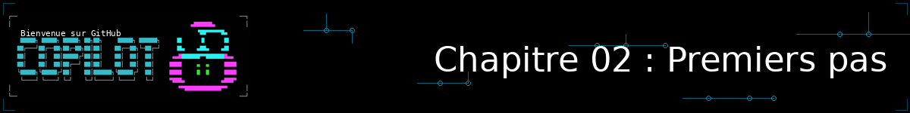
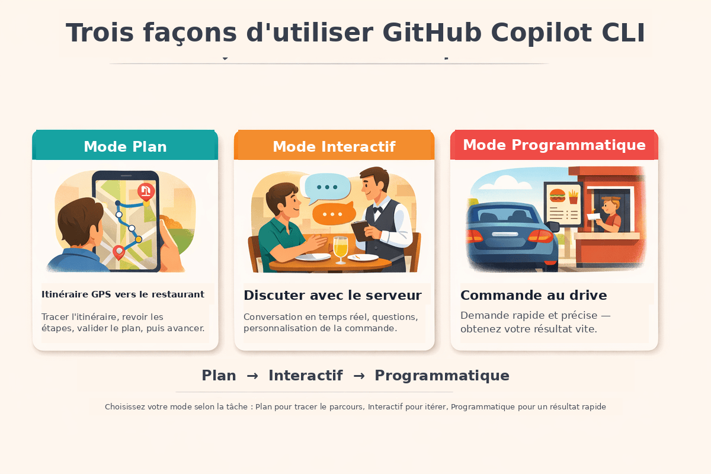

<!--
---
id: CopilotCLI-02
title: !translate Premiers pas
description: !translate Découvrez GitHub Copilot CLI à travers des démonstrations pratiques, puis apprenez quand utiliser les modes interactif, plan et programmatique.
audience: Developers / Students / Terminal users
slug: first-steps
weight: 3
---
-->



> **Regardez l'IA détecter des bugs instantanément, expliquer du code confus et générer des scripts fonctionnels. Puis découvrez trois façons différentes d'utiliser GitHub Copilot CLI.**

C'est dans ce chapitre que la magie commence ! Vous allez découvrir par vous-même pourquoi les développeurs décrivent GitHub Copilot CLI comme un ingénieur senior disponible en permanence. Vous allez voir l'IA détecter des failles de sécurité en quelques secondes, obtenir des explications en français clair sur du code complexe, et générer des scripts fonctionnels instantanément. Ensuite, vous maîtriserez les trois modes d'interaction (Interactif, Plan et Programmatique) pour savoir exactement lequel utiliser selon la tâche.

> ⚠️ **Prérequis** : Assurez-vous d'avoir terminé le **[Chapitre 01 : Démarrage rapide](../01-quick-start/README.md)** au préalable. Vous aurez besoin de GitHub Copilot CLI installé et authentifié avant de lancer les démos ci-dessous.

## 🎯 Objectifs d'apprentissage

À la fin de ce chapitre, vous serez capable de :

- Découvrir le gain de productivité offert par GitHub Copilot CLI à travers des démos pratiques
- Choisir le bon mode (Interactif, Plan ou Programmatique) selon la tâche
- Utiliser les commandes slash pour contrôler vos sessions

> ⏱️ **Durée estimée** : ~45 minutes (15 min de lecture + 30 min de pratique)

---

# Votre première expérience avec Copilot CLI


Lancez-vous directement et découvrez ce que Copilot CLI peut faire.

---

## Prendre ses marques : vos premiers prompts

Avant de plonger dans les démos impressionnantes, commençons par quelques prompts simples que vous pouvez essayer dès maintenant. **Aucun dépôt de code n'est nécessaire !** Ouvrez simplement un terminal et lancez Copilot CLI :

```bash
copilot
```

Essayez ces prompts adaptés aux débutants :

```
> Explain what a dataclass is in Python in simple terms

> Write a function that sorts a list of dictionaries by a specific key

> What's the difference between a list and a tuple in Python?

> Give me 5 best practices for writing clean Python code
```

Vous n'utilisez pas Python ? Pas de problème ! Posez simplement vos questions dans le langage de votre choix.

Remarquez à quel point cela semble naturel. Posez vos questions comme vous le feriez à un collègue. Une fois votre exploration terminée, tapez `/exit` pour quitter la session.

**L'idée clé** : GitHub Copilot CLI fonctionne de manière conversationnelle. Aucune syntaxe spéciale n'est nécessaire pour démarrer. Posez simplement vos questions en langage naturel.

## Passons à la pratique

Voyons maintenant pourquoi les développeurs parlent d'un « ingénieur senior disponible en permanence ».

> 📖 **Lecture des exemples** : Trois types de blocs de code apparaissent dans ce chapitre, ne les confondez pas :
>
> | Type de bloc | Format | Exemple |
> |---|---|---|
> | Commande shell (à exécuter dans votre terminal) | ```` ```bash ```` | `copilot` |
> | Prompt (à saisir à l'intérieur d'une session interactive) | ```` ``` ```` avec une ligne commençant par `>` | `> /help` |
> | Sortie attendue (affichée par Copilot CLI, **jamais à saisir**) | ```` ```text ````, précédé d'un libellé en gras comme **Sortie :** ou **Ce qui se passe :** | voir ci-dessous |

> 💡 **À propos des exemples de sorties** : Les exemples de sorties présentés tout au long de ce cours sont donnés à titre illustratif. Comme les réponses de Copilot CLI varient à chaque fois, vos résultats différeront en termes de formulation, de mise en forme et de détail. Concentrez-vous sur le *type* d'information renvoyée, pas sur le texte exact.

### Démo 1 : Revue de code en quelques secondes

Le cours inclut des fichiers d'exemple comportant des problèmes de qualité de code intentionnels. Si vous travaillez sur votre machine locale et n'avez pas encore cloné le dépôt, veuillez exécuter la commande `git clone` ci-dessous, naviguer vers le dossier `onepoint_formation_gihub_copilot`, puis exécuter la commande `copilot`.

```bash
# Clonez le dépôt du cours si vous travaillez en local et ne l'avez pas encore fait
git clone https://github.com/Lorddelphi01/onepoint_formation_gihub_copilot
cd onepoint_formation_gihub_copilot

# Démarrez Copilot
copilot
```

Une fois à l'intérieur de la session interactive Copilot CLI, exécutez ce qui suit :

```
> Review @samples/book-app-project/book_app.py for code quality issues and suggest improvements
```

> 💡 **À quoi sert le symbole `@` ?** Le symbole `@` indique à Copilot CLI de lire un fichier. Vous découvrirez tout cela en détail au Chapitre 03. Pour l'instant, copiez simplement la commande telle quelle.

---

<details>
<summary>🎬 Voyez-le en action !</summary>


*La sortie de la démo peut varier. Votre modèle, vos outils et vos réponses différeront de ce qui est présenté ici.*

</details>

---

**À retenir** : Une revue de code professionnelle en quelques secondes. Une revue manuelle prendrait... eh bien... beaucoup plus de temps que ça !

---

### Démo 2 : Expliquer du code confus

Vous êtes déjà resté bloqué devant du code en vous demandant ce qu'il fait ? Essayez ceci dans votre session Copilot CLI :

```
> Explain what @samples/book-app-project/books.py does in simple terms
```

---

<details>
<summary>🎬 Voyez-le en action !</summary>


*La sortie de la démo peut varier. Votre modèle, vos outils et vos réponses différeront de ce qui est présenté ici.*

</details>

---

**Ce qui se passe** : (votre résultat sera différent) Copilot CLI lit le fichier, comprend le code, et l'explique en français clair.

```text
This is a book collection management module using Python dataclasses.

Think of it like a digital bookshelf:
- Book is a dataclass - a simple way to store book information (title, author, year, read status)
- BookCollection manages the entire collection and handles saving/loading

Key components:

1. @dataclass decorator (line 8)
   - Automatically creates __init__, __repr__, etc.
   - Clean way to define data structures in Python

2. BookCollection class (line 16)
   - Maintains a list of Book objects
   - Handles persistence with JSON file I/O
   - load_books() reads from data.json
   - save_books() writes to data.json using asdict()

3. Book operations:
   - add_book() - creates and saves new books
   - find_book_by_title() - searches collection
   - mark_as_read() - updates read status
   - find_by_author() - filters by author name

Common pattern: Read from JSON → Work with Python objects → Write back to JSON
```

**À retenir** : Du code complexe expliqué comme le ferait un mentor patient.

---

### Démo 3 : Générer du code fonctionnel

Besoin d'une fonction que vous auriez sinon cherchée pendant 15 minutes sur Google ? Toujours dans votre session :

```
> Write a Python function that takes a list of books and returns statistics: 
  total count, number read, number unread, oldest and newest book
```

---

<details>
<summary>🎬 Voyez-le en action !</summary>


*La sortie de la démo peut varier. Votre modèle, vos outils et vos réponses différeront de ce qui est présenté ici.*

</details>

---

**Ce qui se passe** : Une fonction complète et fonctionnelle en quelques secondes, prête à copier-coller-exécuter.

Une fois votre exploration terminée, quittez la session :

```
> /exit
```

**À retenir** : Une gratification instantanée, et vous êtes resté dans une seule session continue tout du long.

---

# Modes et commandes


Vous venez de voir ce que Copilot CLI peut faire. Comprenons maintenant *comment* utiliser ces capacités efficacement. La clé est de savoir lequel des trois modes d'interaction utiliser selon les situations.

> 💡 **Remarque** : Copilot CLI dispose également d'un mode **Autopilot** dans lequel il traite les tâches sans attendre votre saisie. Il est puissant mais nécessite d'accorder toutes les permissions et utilise des requêtes premium de manière autonome. Ce cours se concentre sur les trois modes ci-dessous. Nous vous orienterons vers Autopilot une fois que vous serez à l'aise avec les bases.

---

## 🧩 Analogie du monde réel : Manger au restaurant

Pensez à l'utilisation de GitHub Copilot CLI comme à une sortie au restaurant. De la planification du trajet à la commande, différentes situations appellent différentes approches :

| Mode | Analogie restaurant | Quand l'utiliser |
|------|----------------|-------------|
| **Plan** | Itinéraire GPS vers le restaurant | Tâches complexes : tracer l'itinéraire, revoir les étapes, se mettre d'accord sur le plan, puis avancer |
| **Interactif** | Discuter avec le serveur | Exploration et itération : poser des questions, personnaliser, obtenir un retour en temps réel |
| **Programmatique** | Commander au drive | Tâches rapides et spécifiques : rester dans son environnement, obtenir un résultat vite |

Tout comme au restaurant, vous apprendrez naturellement quand chaque approche est la plus adaptée.



*Choisissez votre mode selon la tâche : Plan pour tracer le parcours au préalable, Interactif pour une collaboration en va-et-vient, Programmatique pour des résultats rapides en un coup*

### Par quel mode devrais-je commencer ?

**Commencez par le mode Interactif.**
- Vous pouvez expérimenter et poser des questions de suivi
- Le contexte se construit naturellement au fil de la conversation
- Les erreurs sont faciles à corriger avec `/clear`

Une fois à l'aise, essayez :
- Le **mode Programmatique** (`copilot -p "<votre prompt>"`) pour des questions rapides et ponctuelles
- Le **mode Plan** (`/plan`) quand vous devez planifier les choses plus en détail avant de coder

---

## Les trois modes

### Mode 1 : Mode Interactif (commencez ici)


**Idéal pour** : L'exploration, l'itération, les conversations à plusieurs échanges. Comme discuter avec un serveur capable de répondre aux questions, prendre en compte les retours, et ajuster la commande à la volée.

Démarrez une session interactive :

```bash
copilot
```

Comme vous l'avez vu jusqu'ici, vous verrez apparaître une invite où vous pouvez saisir du texte naturellement. Pour obtenir de l'aide sur les commandes disponibles, tapez simplement :

```
> /help
```

**Point clé** : Le mode Interactif conserve le contexte. Chaque message s'appuie sur les précédents, exactement comme une vraie conversation.

#### Exemple de mode Interactif

```bash
copilot

> Review @samples/book-app-project/utils.py and suggest improvements

> Add type hints to all functions

> Make the error handling more robust

> /exit
```

Remarquez comment chaque prompt s'appuie sur la réponse précédente. Vous tenez une conversation, vous ne recommencez pas à zéro à chaque fois.

---

### Mode 2 : Mode Plan


**Idéal pour** : Les tâches complexes où vous voulez revoir l'approche avant l'exécution. Comparable à planifier un itinéraire avant un trajet à l'aide du GPS.

Le mode Plan vous aide à créer un plan étape par étape avant d'écrire la moindre ligne de code. Utilisez la commande `/plan`, ou appuyez sur **Shift+Tab** pour basculer vers le mode Plan :

```bash
copilot

> /plan Add a "mark as read" command to the book app
```

> 💡 **Astuce** : **Shift+Tab** fait défiler les modes : Interactif → Plan → Autopilot. Appuyez dessus à tout moment pendant une session interactive pour changer de mode sans taper de commande.

Vous pouvez aussi lancer Copilot CLI directement en mode Plan grâce au flag `--plan` :

```bash
copilot --plan
```

**Sortie du mode Plan :** (votre résultat peut différer)

```text
📋 Implementation Plan

Step 1: Update the command handler in book_app.py
  - Add new elif branch for "mark" command
  - Create handle_mark_as_read() function

Step 2: Implement the handler function
  - Prompt user for book title
  - Call collection.mark_as_read(title)
  - Display success/failure message

Step 3: Update help text
  - Add "mark" to available commands list
  - Document the command usage

Step 4: Test the flow
  - Add a book
  - Mark it as read
  - Verify status changes in list output

Proceed with implementation? [Y/n]
```

**Point clé** : Le mode Plan vous permet de revoir et de modifier l'approche avant qu'aucun code ne soit écrit. En mode Plan, Copilot CLI est en **lecture seule** et ne modifiera aucun fichier ni n'exécutera de commande modifiant votre espace de travail tant que vous n'avez pas approuvé et basculé vers l'implémentation. Cela vous maintient en toute sécurité dans la phase de « réflexion » jusqu'à ce que vous soyez prêt. Une fois un plan terminé, vous pouvez même demander à Copilot CLI de l'enregistrer dans un fichier pour référence ultérieure. Par exemple, « Save this plan to `mark_as_read_plan.md` » créerait un fichier markdown avec les détails du plan.

> 💡 **Envie de quelque chose de plus complexe ?** Essayez : `/plan Add search and filter capabilities to the book app`. Le mode Plan s'adapte aussi bien à des fonctionnalités simples qu'à des applications complètes.

> 📚 **Mode Autopilot** : Vous avez peut-être remarqué que Shift+Tab fait aussi défiler jusqu'à un troisième mode appelé **Autopilot**. En mode Autopilot, Copilot traite un plan entier sans attendre votre saisie après chaque étape, un peu comme confier une tâche à un collègue en lui disant « préviens-moi quand c'est terminé ». Le flux de travail typique est plan → acceptation → autopilot, ce qui signifie qu'il faut d'abord bien savoir écrire des plans. Vous pouvez aussi lancer directement en mode Autopilot avec `copilot --autopilot`, ou définir un objectif directement avec `/autopilot <objectif>` (par exemple, `/autopilot Add a search command to the book app`). Vous pouvez également combiner planification et autopilot en exécutant `copilot --plan --mode autopilot`. Copilot créera d'abord un plan puis l'implémentera automatiquement sans marquer de pause pour approbation. Familiarisez-vous d'abord avec les modes Interactif et Plan, puis consultez la [documentation officielle](https://docs.github.com/copilot/concepts/agents/copilot-cli/autopilot) quand vous serez prêt.

---

### Mode 3 : Mode Programmatique


**Idéal pour** : L'automatisation, les scripts, le CI/CD, les commandes ponctuelles. Comme utiliser un drive pour une commande rapide sans avoir à parler à un serveur.

Utilisez le flag `-p` pour des commandes ponctuelles qui n'ont pas besoin d'interaction :

```bash
# Générer du code
copilot -p "Write a function that checks if a number is even or odd"

# Obtenir de l'aide rapide
copilot -p "How do I read a JSON file in Python?"
```

**Point clé** : Le mode Programmatique vous donne une réponse rapide puis se termine. Pas de conversation, juste une entrée → une sortie.

<details>
<summary>📚 <strong>Pour aller plus loin : utiliser le mode Programmatique dans des scripts</strong> (cliquez pour développer)</summary>

Une fois à l'aise, vous pouvez utiliser `-p` dans des scripts shell :

```bash
#!/bin/bash

# Générer automatiquement des messages de commit
COMMIT_MSG=$(copilot -p "Generate a commit message for: $(git diff --staged)")
git commit -m "$COMMIT_MSG"

# Faire la revue d'un fichier
copilot --allow-all -p "Review @myfile.py for issues"
```
> ⚠️ **À propos de `--allow-all`** : Ce flag désactive toutes les invites de permission, permettant à Copilot CLI de lire des fichiers, d'exécuter des commandes et d'accéder à des URL sans demander d'abord. Ceci est nécessaire pour le mode programmatique (`-p`) puisqu'il n'y a pas de session interactive pour approuver les actions. N'utilisez `--allow-all` qu'avec des prompts que vous avez écrits vous-même et dans des répertoires en lesquels vous avez confiance. Ne l'utilisez jamais avec des entrées non fiables ou dans des répertoires sensibles.

</details>

---

## Commandes slash essentielles

Ces commandes sont idéales à apprendre en premier lorsque vous débutez avec Copilot CLI :

| Commande | Ce qu'elle fait | Quand l'utiliser |
|---------|--------------|-------------|
| `/ask` | Poser une question rapide sans qu'elle n'affecte votre historique de conversation | Quand vous voulez une réponse rapide sans dévier de votre tâche en cours |
| `/clear` | Effacer la conversation et repartir de zéro | Quand vous changez de sujet |
| `/config` | Voir ou définir des réglages par défaut persistants (par ex. le modèle par défaut) | Quand vous voulez qu'un réglage s'applique à toutes les sessions futures |
| `/help` | Afficher toutes les commandes disponibles | Quand vous oubliez une commande |
| `/model` | Afficher ou changer le modèle d'IA pour la session en cours | Quand vous voulez changer de modèle d'IA |
| `/plan` | Planifier votre travail avant de coder | Pour des fonctionnalités plus complexes |
| `/refine` | Réécrire un prompt brut, écrit au fil de la pensée, en un prompt clair et précis | Quand votre prompt semble brouillon et que vous voulez de meilleurs résultats |
| `/research` | Recherche approfondie utilisant GitHub et des sources web | Quand vous devez investiguer un sujet avant de coder |
| `/exit` | Terminer la session | Quand vous avez terminé |

> 💡 **`/ask` vs discussion normale** : Normalement, chaque message que vous envoyez fait partie de la conversation en cours et affecte les réponses futures. `/ask` est un raccourci « hors dossier ». Il est parfait pour des questions ponctuelles rapides comme `/ask What does YAML mean?` sans polluer le contexte de votre session.

> 💡 **`/refine` pour de meilleurs prompts** : Pas sûr que votre prompt soit assez clair ? Tapez-le tel qu'il vous vient à l'esprit, puis exécutez `/refine` pour laisser Copilot le réécrire en un prompt précis et bien structuré avant de l'envoyer. C'est particulièrement utile quand vous débutez avec les outils d'IA et que vous apprenez encore à écrire des prompts efficaces.

> 💡 **Auto-complétion avec Tab** : En saisissant une commande slash, appuyez sur **Tab** pour auto-compléter le nom de la commande ou faire défiler les sous-commandes et arguments disponibles. C'est particulièrement pratique quand vous ne vous souvenez plus du nom exact d'une commande.

> 💡 **Mettre des prompts en file d'attente pendant que Copilot est occupé** : Si Copilot est en train de traiter une tâche et que vous pensez à la prochaine chose à lui demander, tapez-la simplement et appuyez sur **Entrée**. Copilot l'exécutera automatiquement une fois la tâche en cours terminée, sans que vous ayez à attendre.

C'est tout pour bien démarrer ! Au fur et à mesure que vous serez à l'aise, vous pourrez explorer des commandes supplémentaires.

> 📚 **Documentation officielle** : [Référence des commandes CLI](https://docs.github.com/copilot/reference/cli-command-reference) pour la liste complète des commandes et des flags.

<details>
<summary>📚 <strong>Commandes supplémentaires</strong> (cliquez pour développer)</summary>

> 💡 Les commandes essentielles ci-dessus couvrent une grande partie de ce que vous ferez au quotidien. Cette référence est là pour quand vous serez prêt à explorer davantage.

### Environnement des agents

| Commande | Ce qu'elle fait |
|---------|--------------|
| `/agent` | Parcourir et sélectionner parmi les agents disponibles |
| `/env` | Afficher les détails de l'environnement chargé — quelles instructions, serveurs MCP, skills, agents et plugins sont actifs |
| `/init` | Initialiser les instructions Copilot pour votre dépôt |
| `/instructions` | Voir et gérer tous les fichiers d'instructions chargés pour la session en cours |
| `/mcp` | Ouvrir le tableau de bord des plugins (axé sur les serveurs MCP) ; utilisez `/mcp config` pour l'assistant de configuration MCP dédié |
| `/plugin` | Ouvrir le tableau de bord des plugins pour parcourir, installer, activer et mettre à jour des plugins |
| `/settings` | Ouvrir une boîte de dialogue interactive pour parcourir et modifier tous les réglages utilisateur en un seul endroit |
| `/skills` | Ouvrir le tableau de bord des plugins (axé sur les skills) pour découvrir et gérer les skills |
| `/subagents` | Voir et gérer les subagents en cours d'exécution dans la session |

> 💡 Les agents sont couverts au [Chapitre 05](../05-agents-custom-instructions/README.md), les skills sont couverts au [Chapitre 06](../06-skills/README.md), et les serveurs MCP sont couverts au [Chapitre 07](../07-mcp-servers/README.md).

> 📚 **Un tableau de bord unifié** : Depuis Copilot CLI v1.0.81, `/plugin`, `/mcp` et `/skills` ouvrent tous le même tableau de bord unifié des plugins, simplement avec un onglet de départ différent selon la commande utilisée. Consultez le [Chapitre 06](../06-skills/README.md) pour les skills et le [Chapitre 07](../07-mcp-servers/README.md) pour les serveurs MCP.

### Modèles et subagents

| Commande | Ce qu'elle fait |
|---------|--------------|
| `/config` | Voir ou définir des réglages par défaut persistants (par ex. `/config model` pour définir votre modèle par défaut pour toutes les futures sessions) |
| `/delegate` | Confier une tâche à un agent cloud GitHub Copilot |
| `/fleet` | Diviser une tâche complexe en sous-tâches parallèles pour une réalisation plus rapide |
| `/model` | Afficher ou changer le modèle d'IA pour la session en cours uniquement |
| `/tasks` | Voir les subagents en arrière-plan et les sessions shell détachées |

### Code

| Commande | Ce qu'elle fait |
|---------|--------------|
| `/diff` | Passer en revue les modifications apportées dans le répertoire courant |
| `/pr` | Agir sur les pull requests de la branche courante |
| `/research` | Lancer une recherche approfondie utilisant GitHub et des sources web |
| `/review` | Exécuter l'agent de revue de code pour analyser les modifications |
| `/terminal-setup` | Activer la prise en charge de la saisie multiligne (shift+entrée et ctrl+entrée) |

### Permissions

| Commande | Ce qu'elle fait |
|---------|--------------|
| `/add-dir <directory>` | Ajouter un répertoire à la liste autorisée |
| `/allow-all [on\|off\|show]` | Approuver automatiquement toutes les invites de permission ; utilisez `on` pour activer, `off` pour désactiver, `show` pour vérifier l'état actuel |
| `/permissions` | Basculer entre les modes d'approbation (interactif, plan, autopilot) pour contrôler ce que Copilot peut faire sans demander |
| `/yolo` | Alias rapide pour `/allow-all on` — approuve automatiquement toutes les invites de permission. |
| `/cwd`, `/cd [directory]` | Voir ou changer le répertoire de travail |
| `/list-dirs` | Afficher tous les répertoires autorisés |

> ⚠️ **À utiliser avec prudence** : `/allow-all` et `/yolo` ignorent les invites de confirmation. Pratiques pour des projets de confiance, mais soyez prudent avec du code non fiable.

### Session

| Commande | Ce qu'elle fait |
|---------|--------------|
| `/clear` | Abandonne la session en cours (aucun historique enregistré) et démarre une nouvelle conversation |
| `/compact` | Résumer la conversation pour réduire l'utilisation du contexte (vous pouvez ajouter des instructions de focus, par ex. `/compact focus on the bug list`) |
| `/context` | Afficher l'utilisation des jetons de la fenêtre de contexte et sa visualisation |
| `/keep-alive` | Empêcher votre système de se mettre en veille pendant que Copilot CLI est actif — pratique pour les tâches longues sur un ordinateur portable |
| `/memory [on\|off\|show]` | Activer, désactiver ou afficher la mémoire persistante — faits et préférences mémorisés d'une session à l'autre |
| `/new` | Termine la session en cours (en l'enregistrant dans l'historique pour recherche/reprise) et démarre une nouvelle conversation. |
| `/worktree new` (ou `/new-worktree`) | Crée un nouveau worktree git et y démarre une nouvelle session, pour isoler votre travail (une nouvelle branche, un espace de travail à part) sans perturber votre session en cours *(fonctionnalité expérimentale ajoutée sous le nom `/new-worktree` depuis Copilot CLI v1.0.78, généralisée en `/worktree new` depuis v1.0.79)* |
| `/resume` | Basculer vers une autre session (en précisant éventuellement l'ID ou le nom de la session) |
| `/rename` | Renommer la session en cours (omettez le nom pour en générer un automatiquement) |
| `/rewind` | Ouvrir un sélecteur de chronologie pour revenir à un point antérieur de la conversation ; restaure éventuellement les fichiers modifiés par Copilot (fonctionne sans git) |
| `/usage` | Afficher les statistiques et indicateurs d'utilisation de la session, y compris les barres de progression de quota |
| `/session` | Afficher les informations de session et le résumé de l'espace de travail ; utilisez `/session delete`, `/session delete <id>`, ou `/session delete-all` pour supprimer des sessions |
| `/share` | Exporter la session sous forme de fichier markdown, de gist GitHub, ou de fichier HTML autonome |
| `/every <interval> <prompt>` | Planifier l'exécution récurrente d'un prompt à intervalle régulier (par ex. `/every 1h summarize new commits`). Utilisez le langage naturel pour l'intervalle. `/loop` est un alias de `/every`. |
| `/after <time> <prompt>` | Planifier l'exécution unique d'un prompt après un délai (par ex. `/after 30m run tests`). Utilisez le langage naturel pour le délai. |

> 💡 **Onglet Sessions** : L'interface interactive de Copilot CLI inclut un **onglet Sessions** en haut de la fenêtre. Vous pouvez l'utiliser pour voir et basculer entre plusieurs sessions en cours d'exécution simultanément. Appuyez sur `n` dans l'onglet Sessions pour démarrer une nouvelle session sans fermer celle en cours.

> 💡 **Point de départ du worktree** : Le réglage `worktreeBaseRef` détermine si `/worktree`, `/worktree new` et le flag `--worktree` démarrent depuis `HEAD` ou depuis la branche distante par défaut. Depuis Copilot CLI v1.0.81, le comportement par défaut est de démarrer depuis `HEAD`.

### Affichage

| Commande | Ce qu'elle fait |
|---------|--------------|
| `/statusline` (ou `/footer`) | Personnaliser les éléments qui apparaissent dans la barre d'état en bas de la session (répertoire, branche, effort, fenêtre de contexte, quota) |
| `/theme` | Voir ou définir le thème du terminal |
| `/voice` | Dicter votre prompt grâce à la reconnaissance vocale locale — parlez naturellement au lieu de taper |

> 💡 **Raccourci dictée vocale** : Depuis Copilot CLI v1.0.79, appuyez sur **Ctrl+Espace** à tout moment dans une session interactive pour basculer la dictée vocale, sans passer par la commande `/voice`.

### Aide et retours

| Commande | Ce qu'elle fait |
|---------|--------------|
| `/app` | Ouvrir l'application GitHub (ou le navigateur en repli) directement depuis le CLI |
| `/changelog` | Afficher le journal des modifications des versions du CLI |
| `/feedback` | Envoyer un retour à GitHub |
| `/help` | Afficher toutes les commandes disponibles |

### Commandes shell rapides

Exécutez des commandes shell directement sans l'IA en les préfixant par `!` :

```bash
copilot

> !git status
# Exécute git status directement, en contournant l'IA

> !python -m pytest tests/
# Exécute pytest directement
```

### Changer de modèle

Copilot CLI prend en charge plusieurs modèles d'IA d'OpenAI, Anthropic, Google et d'autres. Les modèles disponibles dépendent de votre niveau d'abonnement et de votre région. Utilisez `/model` pour voir vos options et basculer entre elles :

```bash
copilot
> /model

# Affiche les modèles disponibles et vous permet d'en choisir un. Sélectionnez Sonnet 4.5.
```

> 💡 **Modèle de session vs modèle persistant** : La commande `/model` change le modèle uniquement pour la **session en cours**. Quand vous démarrez une nouvelle session, Copilot utilisera à nouveau le modèle par défaut. Pour définir un modèle par défaut permanent pour toutes les futures sessions, utilisez plutôt `/config model`. *(Depuis Copilot CLI v1.0.81, `/model` est de nouveau scopé à la session par défaut ; c'est `/config model` qui change le modèle par défaut des futures sessions.)*

> 💡 **Astuce** : Certains modèles coûtent plus de « requêtes premium » que d'autres. Les modèles marqués **1x** (comme Claude Sonnet 4.5, cité ici à titre d'exemple) constituent un excellent choix par défaut. Ils sont performants et efficaces. Les modèles à multiplicateur plus élevé consomment votre quota de requêtes premium plus vite, réservez-les donc pour quand vous en avez vraiment besoin. La liste des modèles disponibles évolue fréquemment : consultez `/model` pour voir la liste à jour plutôt que de vous fier à un nom de modèle précis sur la durée.

> 💡 **Vous ne savez pas quel modèle choisir ?** Sélectionnez **`Auto`** dans le sélecteur de modèle pour laisser Copilot choisir automatiquement le meilleur modèle disponible pour chaque session. C'est un excellent choix par défaut si vous débutez et ne voulez pas vous soucier du choix du modèle.

> 💡 **Raccourcis de famille de modèles** : Vous pouvez aussi taper un alias court de famille — comme `opus`, `sonnet`, `haiku`, `gpt`, ou `gemini` — directement dans le sélecteur `/model` au lieu de faire défiler toute la liste. Copilot choisira le meilleur modèle disponible dans cette famille pour vous.

> 💡 **Navigation dans le sélecteur de modèle** : Depuis Copilot CLI v1.0.79, le sélecteur de modèle regroupe les modèles en sections — **Récents**, **Recommandés**, et **Nouveaux** (et autres) — pour que vous puissiez retrouver rapidement le modèle utilisé la dernière fois ou essayer les nouveautés. Utilisez **Shift+Tab** à l'intérieur du sélecteur pour basculer entre les vues de regroupement.

</details>

---

# Pratique


Il est temps de mettre en pratique ce que vous avez appris.

---

## ▶️ À vous de jouer

### Exploration interactive

Démarrez Copilot et utilisez des prompts de suivi pour améliorer itérativement l'application de livres :

```bash
copilot

> Review @samples/book-app-project/book_app.py - what could be improved?

> Refactor the if/elif chain into a more maintainable structure

> Add type hints to all the handler functions

> /exit
```

### Planifier une fonctionnalité

Utilisez `/plan` pour que Copilot CLI trace un plan d'implémentation avant d'écrire la moindre ligne de code :

```bash
copilot

> /plan Add a search feature to the book app that can find books by title or author

# Passez en revue le plan
# Approuvez ou modifiez-le
# Regardez-le s'exécuter étape par étape
```

### Automatiser avec le mode Programmatique

Le flag `-p` vous permet d'exécuter Copilot CLI directement depuis votre terminal sans entrer en mode interactif. Copiez-collez le script suivant dans votre terminal (pas à l'intérieur de Copilot) depuis la racine du dépôt pour passer en revue tous les fichiers Python de l'application de livres.

```bash
# Passer en revue tous les fichiers Python de l'application de livres
for file in samples/book-app-project/*.py; do
  echo "Reviewing $file..."
  copilot --allow-all -p "Quick code quality review of @$file - critical issues only"
done
```

**PowerShell (Windows) :**

```powershell
# Passer en revue tous les fichiers Python de l'application de livres
Get-ChildItem samples/book-app-project/*.py | ForEach-Object {
  $relativePath = "samples/book-app-project/$($_.Name)";
  Write-Host "Reviewing $relativePath...";
  copilot --allow-all -p "Quick code quality review of @$relativePath - critical issues only" 
}
```

---

Après avoir terminé les démos, essayez ces variantes :

1. **Défi Interactif** : Démarrez `copilot` et explorez l'application de livres. Posez des questions sur `@samples/book-app-project/books.py` et demandez des améliorations 3 fois de suite.

2. **Défi Mode Plan** : Exécutez `/plan Add rating and review features to the book app`. Lisez le plan attentivement. Est-il cohérent ?

3. **Défi Programmatique** : Exécutez `copilot --allow-all -p "List all functions in @samples/book-app-project/book_app.py and describe what each does"`. Cela a-t-il fonctionné du premier coup ?

---

## 💡 Astuce : Contrôlez votre session CLI depuis le web ou mobile

GitHub Copilot CLI prend en charge les **sessions distantes**, vous permettant de surveiller et d'interagir avec une session CLI en cours d'exécution depuis un navigateur web (sur ordinateur ou mobile) ou l'application GitHub Mobile, sans être physiquement devant votre terminal.

Démarrez une session distante avec le flag `--remote` :

```bash
copilot --remote
```

Copilot CLI affichera un lien et fournira l'accès à un QR code. Ouvrez le lien sur votre téléphone ou dans un onglet de navigateur sur ordinateur pour observer la session en temps réel, envoyer des prompts de suivi, revoir des plans, et piloter l'agent à distance. Les sessions sont propres à chaque utilisateur, vous ne pouvez donc accéder qu'à vos propres sessions Copilot CLI.

Vous pouvez aussi activer l'accès distant depuis une session active à tout moment :

```
> /remote
```

Des détails supplémentaires sur les sessions distantes sont disponibles dans la [documentation Copilot CLI](https://docs.github.com/copilot/how-tos/copilot-cli/steer-remotely).

---

## 📝 Devoir

### Défi principal : Améliorer les utilitaires de l'application de livres

Les exemples pratiques se sont concentrés sur la revue et le refactoring de `book_app.py`. Entraînez-vous maintenant sur les mêmes compétences avec un fichier différent, `utils.py` :

1. Démarrez une session interactive : `copilot`
2. Demandez à Copilot CLI de résumer le fichier : « Summarize @samples/book-app-project/utils.py and explain what each function in this file does »
3. Demandez-lui d'ajouter une validation des entrées : « Add validation to `get_user_choice()` so it handles empty input and non-numeric entries »
4. Demandez-lui d'améliorer la gestion des erreurs : « What happens if `get_book_details()` receives an empty string for the title? Add guards for that. »
5. Demandez une docstring : « Add a comprehensive docstring to `get_book_details()` with parameter descriptions and return values »
6. Observez comment le contexte se transmet entre les prompts. Chaque amélioration s'appuie sur la précédente
7. Quittez avec `/exit`
8. De retour dans votre terminal (pas dans Copilot), vérifiez que le fichier a bien été modifié :

   ```bash
   git status
   ```

   Vous devriez voir `samples/book-app-project/utils.py` listé comme modifié.

9. Exécutez la suite de tests du projet pour vérifier que vos changements n'ont rien cassé :

   ```bash
   cd samples/book-app-project && python -m pytest tests/ -v
   ```

**Critères de réussite** (les trois doivent être vrais) :

- ✅ `git status` (étape 8) liste bien `samples/book-app-project/utils.py` comme fichier modifié.
- ✅ Vous avez exécuté `python -m pytest tests/ -v` (étape 9) depuis `samples/book-app-project/`.
- ✅ La sortie du test se termine par une ligne du type `N passed in Xs`, **sans aucune mention de `failed` ou `error`**, confirmant que vos modifications de `utils.py` n'ont pas cassé les tests existants. Exemple de sortie attendue :

  ```text
  tests/test_books.py::test_add_book PASSED
  tests/test_books.py::test_mark_book_as_read PASSED
  tests/test_books.py::test_remove_book PASSED
  ...
  ============================== 5 passed in 0.39s ==============================
  ```

<details>
<summary>💡 Indices (cliquez pour développer)</summary>

**Exemples de prompts à essayer :**

```text
> @samples/book-app-project/utils.py What does each function in this file do?
> Add validation to get_user_choice() so it handles empty input and non-numeric entries
> What happens if get_book_details() receives an empty string for the title? Add guards for that.
> Add a comprehensive docstring to get_book_details() with parameter descriptions and return values
```

**Problèmes courants :**
- Si Copilot CLI pose des questions de clarification, répondez-y simplement naturellement
- Le contexte se transmet, donc chaque prompt s'appuie sur le précédent
- Utilisez `/clear` si vous voulez repartir de zéro

</details>

### Défi bonus : Comparer les modes

Les exemples utilisaient `/plan` pour une fonctionnalité de recherche et `-p` pour des revues par lot. Essayez maintenant les trois modes sur une seule et même nouvelle tâche : ajouter une méthode `list_by_year()` à la classe `BookCollection` :

1. **Interactif** : `copilot` → demandez-lui de concevoir et construire la méthode étape par étape
2. **Plan** : `/plan Add a list_by_year(start, end) method to BookCollection that filters books by publication year range`
3. **Programmatique** : `copilot --allow-all -p "@samples/book-app-project/books.py Add a list_by_year(start, end) method that returns books published between start and end year inclusive"`

**Réflexion** : Quel mode vous a semblé le plus naturel ? Quand utiliseriez-vous chacun d'eux ?

---

<details>
<summary>🔧 <strong>Erreurs courantes et dépannage</strong> (cliquez pour développer)</summary>

### Erreurs courantes

| Erreur | Ce qui se passe | Solution |
|---------|--------------|-----|
| Taper `exit` au lieu de `/exit` | Copilot CLI traite « exit » comme un prompt, pas comme une commande | Les commandes slash commencent toujours par `/` |
| Utiliser `-p` pour des conversations à plusieurs échanges | Chaque appel `-p` est isolé, sans mémoire des appels précédents | Utilisez le mode interactif (`copilot`) pour les conversations qui s'appuient sur le contexte |
| Oublier les guillemets autour des prompts contenant `$` ou `!` | Le shell interprète les caractères spéciaux avant que Copilot CLI ne les voie | Entourez les prompts de guillemets simples : `copilot -p 'What does $HOME mean?'` |
| Appuyer une seule fois sur Échap pour annuler une tâche en cours | Un seul appui sur Échap n'annule plus la tâche en cours (pour éviter les erreurs) | Appuyez **deux fois sur Échap** pour annuler pendant que Copilot CLI traite une tâche |

### Dépannage

**« Model not available »** - Votre abonnement ne comprend peut-être pas tous les modèles. Utilisez `/model` pour voir ce qui est disponible.

**« Context too long »** - Votre conversation a atteint la limite de la fenêtre de contexte. Utilisez `/new` pour démarrer une nouvelle session.

**« Rate limit exceeded »** - Attendez quelques minutes et réessayez. Envisagez d'utiliser le mode programmatique pour les opérations par lot avec des délais.

</details>

---

# Résumé

## 🔑 Points clés à retenir

1. Le **mode Interactif** est destiné à l'exploration et à l'itération : le contexte se transmet. C'est comme avoir une conversation avec quelqu'un qui se souvient de ce que vous avez dit jusque-là.
2. Le **mode Plan** est normalement destiné aux tâches plus complexes. Revoyez avant de passer à l'implémentation.
3. Le **mode Programmatique** est destiné à l'automatisation. Aucune interaction n'est nécessaire.
4. Les **commandes essentielles** (`/ask`, `/help`, `/clear`, `/new`, `/plan`, `/research`, `/model`, `/exit`) couvrent l'essentiel de l'usage quotidien.

> 📋 **Référence rapide** : Consultez la [référence des commandes GitHub Copilot CLI](https://docs.github.com/en/copilot/reference/cli-command-reference) pour la liste complète des commandes et raccourcis.

---

## ➡️ Et ensuite ?

Maintenant que vous comprenez les trois modes, apprenons comment donner du contexte à Copilot CLI sur votre code.

Dans le **[Chapitre 03 : Contexte et conversations](../03-context-conversations/README.md)**, vous apprendrez :

- La syntaxe `@` pour référencer des fichiers et des répertoires
- La gestion des sessions avec `--resume` et `--continue`
- Comment la gestion du contexte rend Copilot CLI véritablement puissant

---

**[← Retour au Chapitre 01](../01-quick-start/README.md)** | **[Continuer vers le Chapitre 03 →](../03-context-conversations/README.md)**
