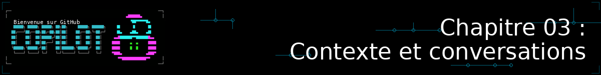
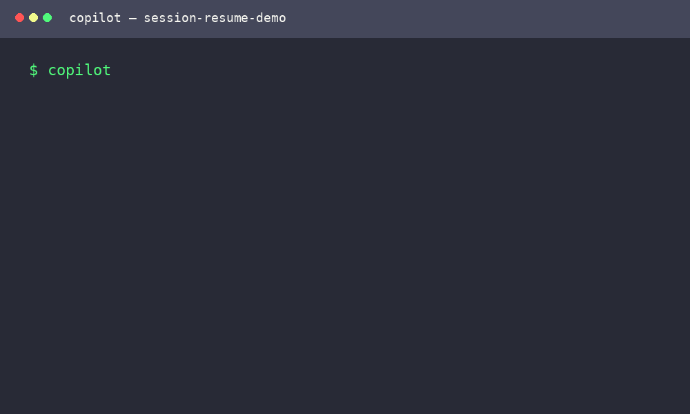
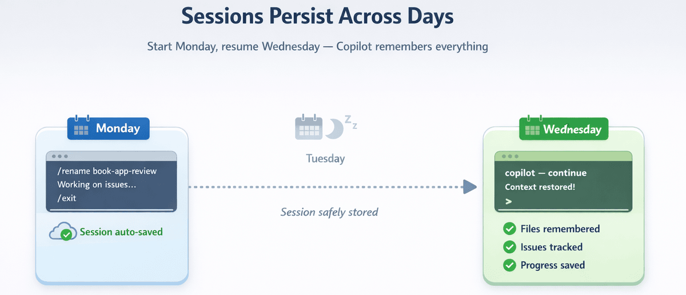

<!--
---
id: CopilotCLI-03
title: !translate Contexte et conversations
description: !translate Utilisez le contexte des fichiers et des répertoires, reprenez des sessions précédentes, et rédigez des conversations multi-tours efficaces avec GitHub Copilot CLI.
audience: Developers / Students / Terminal users
slug: context-and-conversations
weight: 4
---
-->



> **Et si l'IA pouvait voir l'ensemble de votre base de code, et pas seulement un fichier à la fois ?**

Dans ce chapitre, vous allez débloquer le véritable pouvoir de GitHub Copilot CLI : le contexte. Vous apprendrez à utiliser la syntaxe `@` pour référencer des fichiers et des répertoires, donnant à Copilot CLI une compréhension approfondie de votre base de code. Vous découvrirez comment maintenir des conversations d'une session à l'autre, reprendre un travail des jours plus tard exactement là où vous l'aviez laissé, et comment l'analyse inter-fichiers détecte des bugs que les revues fichier par fichier ratent complètement.

## 🎯 Objectifs d'apprentissage

À la fin de ce chapitre, vous serez capable de :

- Utiliser la syntaxe `@` pour référencer des fichiers, des répertoires et des images
- Reprendre des sessions précédentes avec `--resume` et `--continue`
- Comprendre le fonctionnement des [fenêtres de contexte](../GLOSSARY.md#context-window)
- Rédiger des conversations multi-tours efficaces
- Gérer les permissions de répertoires pour des flux de travail multi-projets

> ⏱️ **Durée estimée** : ~50 minutes (20 min de lecture + 30 min de pratique)

---

## 🧩 Analogie du monde réel : Travailler avec un collègue


*Tout comme vos collègues, Copilot CLI ne lit pas dans les pensées. Fournir plus d'informations aide autant les humains que Copilot à apporter un soutien ciblé !*

Imaginez que vous expliquiez un bug à un collègue :

> **Sans contexte** : « L'application de livres ne fonctionne pas. »

> **Avec contexte** : « Regarde `books.py`, en particulier la fonction `find_book_by_title`. Elle ne fait pas de comparaison insensible à la casse. »

Pour donner du contexte à Copilot CLI, utilisez *la syntaxe `@`* pour pointer Copilot CLI vers des fichiers spécifiques.

---

# Essentiel : Contexte de base


Cette section couvre tout ce dont vous avez besoin pour travailler efficacement avec le contexte. Maîtrisez d'abord ces bases.

---

## La syntaxe @

Le symbole `@` référence des fichiers et des répertoires dans vos invites. C'est ainsi que vous indiquez à Copilot CLI « regarde ce fichier ».

> 💡 **Remarque** : Tous les exemples de ce cours utilisent le dossier `samples/` inclus dans ce dépôt, afin que vous puissiez essayer chaque commande directement.

### Essayez-le maintenant (sans configuration requise)

Vous pouvez essayer ceci avec n'importe quel fichier de votre ordinateur :

```bash
copilot

# Pointez vers n'importe quel fichier que vous possédez
> Explain what @package.json does
> Summarize @README.md
> What's in @.gitignore and why?
```

> 💡 **Pas de projet sous la main ?** Créez rapidement un fichier de test :
> ```bash
> echo "def greet(name): return 'Hello ' + name" > test.py
> copilot
> > What does @test.py do?
> ```
>
> **Nettoyage** : ce fichier ne sert qu'à cette démonstration. Supprimez-le
> ensuite avec `rm test.py` sur macOS/Linux, ou `del test.py` dans l'invite de
> commandes Windows.

### Motifs @ de base

| Motif | Ce qu'il fait | Exemple d'utilisation |
|---------|--------------|-------------|
| `@file.py` | Référencer un seul fichier | `Review @samples/book-app-project/books.py` |
| `@folder/` | Référencer tous les fichiers d'un répertoire | `Review @samples/book-app-project/` |
| `@file1.py @file2.py` | Référencer plusieurs fichiers | `Compare @samples/book-app-project/book_app.py @samples/book-app-project/books.py` |

### Référencer un seul fichier

```bash
copilot

> Explain what @samples/book-app-project/utils.py does
```

---

### Quel niveau de contexte choisir ?

Ces mécanismes ne donnent pas tous le même type d'accès. Commencez par le
contexte le plus ciblé, puis élargissez seulement si la question le nécessite :

| Niveau | Quand l'utiliser | Exemple | Limite à connaître |
|---|---|---|---|
| Répertoire courant | Travailler dans le projet depuis lequel vous lancez `copilot` | `copilot` puis `Review @samples/book-app-project/books.py` | Changer de répertoire change les chemins relatifs disponibles |
| `@fichier` | Poser une question précise sur un fichier | `Explain @samples/book-app-project/books.py` | Les dépendances et appels situés ailleurs peuvent manquer |
| `@répertoire/` | Explorer une petite base de code ou repérer des motifs entre fichiers | `Review @samples/book-app-project/` | Charge davantage de contenu et remplit plus vite la fenêtre de contexte |
| `@fichier1 @fichier2` | Suivre un flux ou comparer des modules liés | `Compare @samples/book-app-project/book_app.py @samples/book-app-project/books.py` | Il faut ajouter les dépendances réellement utiles |
| `--add-dir` | Autoriser un répertoire situé en dehors du projet courant | `copilot --add-dir=../shared-notes` puis `@../shared-notes/` | Autorise l'accès, mais ne charge pas automatiquement les fichiers |
| Session (`--continue`/`--resume`) | Retrouver l'historique, les décisions et les fichiers évoqués | `copilot --resume=book-app-review` | L'historique ne remplace pas une référence `@` quand le contenu actuel est nécessaire |

> 🔎 **À retenir** : le répertoire courant définit le point de départ, `@`
> choisit précisément le contenu fourni à Copilot CLI, et `--add-dir` élargit
> les répertoires auxquels Copilot CLI est autorisé à accéder. Autoriser un
> dossier ne signifie donc pas que tous ses fichiers sont automatiquement
> chargés.

<details>
<summary>🎬 Voyez-le en action !</summary>


*Le résultat de la démo peut varier. Votre modèle, vos outils et les réponses obtenues seront différents de ce qui est montré ici.*

</details>

---

### Référencer plusieurs fichiers

```bash
copilot

> Compare @samples/book-app-project/book_app.py and @samples/book-app-project/books.py for consistency
```

### Référencer un répertoire entier

```bash
copilot

> Review all files in @samples/book-app-project/ for error handling
```

---

## Intelligence inter-fichiers

C'est là que le contexte devient un super-pouvoir. L'analyse d'un seul fichier est utile. L'analyse inter-fichiers est transformative.


### Démo : Trouver des bugs qui traversent plusieurs fichiers

```bash
copilot

> @samples/book-app-project/book_app.py @samples/book-app-project/books.py
>
> How do these files work together? What's the data flow?
```

> 💡 **Option avancée** : Pour une analyse inter-fichiers axée sur la sécurité, essayez les exemples Python de sécurité :
> ```bash
> > @samples/buggy-code/python/user_service.py @samples/buggy-code/python/payment_processor.py
> > Find security vulnerabilities that span BOTH files
> ```

---

<details>
<summary>🎬 Voyez-le en action !</summary>


*Le résultat de la démo peut varier. Votre modèle, vos outils et les réponses obtenues seront différents de ce qui est montré ici.*

</details>

---

**Ce que Copilot CLI découvre** :

```
Analyse inter-modules
=====================

1. MOTIF DE FLUX DE DONNÉES
   book_app.py crée une instance BookCollection et appelle des méthodes
   books.py définit la classe BookCollection et gère la persistance des données

   Flux : book_app.py (interface) → books.py (logique métier) → data.json (stockage)

2. FONCTIONS D'AFFICHAGE DUPLIQUÉES
   book_app.py:9-21    fonction show_books()
   utils.py:28-36      fonction print_books()

   Impact : Deux fonctions presque identiques faisant la même chose. Si vous mettez à jour
   l'une (par exemple en changeant le format), vous devez penser à mettre à jour l'autre.

3. GESTION D'ERREURS INCOHÉRENTE
   book_app.py gère ValueError lors de la conversion de l'année
   books.py retourne silencieusement None/False en cas d'erreur

   Motif : Aucune approche unifiée de la gestion des erreurs entre les modules
```

**Pourquoi c'est important** : Une revue d'un seul fichier passerait à côté de la vue d'ensemble. Seule l'analyse inter-fichiers révèle :
- Le **code dupliqué** qui devrait être consolidé
- Les **motifs de flux de données** montrant comment les composants interagissent
- Les **problèmes d'architecture** qui affectent la maintenabilité

---

### Démo : Comprendre une base de code en 60 secondes


Nouveau sur un projet ? Renseignez-vous rapidement en utilisant Copilot CLI.

```bash
copilot

> @samples/book-app-project/
>
> In one paragraph, what does this app do and what are its biggest quality issues?
```

**Ce que vous obtenez** :
```
This is a CLI book collection manager that lets users add, list, remove, and
search books stored in a JSON file. The biggest quality issues are:

1. Duplicate display logic - show_books() and print_books() do the same thing
2. Inconsistent error handling - some errors raise exceptions, others return False
3. No input validation - year can be 0, empty strings accepted for title/author
4. Missing tests - no test coverage for critical functions like find_book_by_title

Priority fix: Consolidate duplicate display functions and add input validation.
```

**Résultat** : Ce qui prend une heure de lecture de code compressé en 10 secondes. Vous savez exactement où concentrer votre attention.

---

## Exemples pratiques

### Exemple 1 : Revue de code avec contexte

```bash
copilot

> @samples/book-app-project/books.py Review this file for potential bugs

# Copilot CLI dispose maintenant du contenu complet du fichier et peut donner un retour précis :
# "Line 49: Case-sensitive comparison may miss books..."
# "Line 29: JSON decode errors are caught but data corruption isn't logged..."

> What about @samples/book-app-project/book_app.py?

# Il examine maintenant book_app.py, tout en restant conscient du contexte de books.py
```

### Exemple 2 : Comprendre une base de code

```bash
copilot

> @samples/book-app-project/books.py What does this module do?

# Copilot CLI lit books.py et comprend la classe BookCollection

> @samples/book-app-project/ Give me an overview of the code structure

# Copilot CLI parcourt le répertoire et en fait un résumé

> How does the app save and load books?

# Copilot CLI peut retracer le code qu'il a déjà vu
```

<details>
<summary>🎬 Voyez une conversation multi-tours en action !</summary>


*Le résultat de la démo peut varier. Votre modèle, vos outils et les réponses obtenues seront différents de ce qui est montré ici.*

</details>

### Exemple 3 : Refactorisation multi-fichiers

```bash
copilot

> @samples/book-app-project/book_app.py @samples/book-app-project/utils.py
> I see duplicate display functions: show_books() and print_books(). Help me consolidate these.

# Copilot CLI voit les deux fichiers et peut suggérer comment fusionner le code dupliqué
```

---

## Gestion des sessions

Les sessions sont automatiquement enregistrées au fur et à mesure que vous travaillez. Vous pouvez reprendre des sessions précédentes pour continuer là où vous vous étiez arrêté.

### Les sessions s'enregistrent automatiquement

Chaque conversation est automatiquement enregistrée. Il suffit de quitter normalement :

```bash
copilot

> @samples/book-app-project/ Let's improve error handling across all modules

[... du travail est effectué ...]

> /exit
```

### Reprendre la session la plus récente

```bash
# Continuer là où vous vous étiez arrêté
copilot --continue
```

### Reprendre une session spécifique

```bash
# Choisir dans une liste de sessions de manière interactive
copilot --resume

# -r est un raccourci pour --resume (ça économise de la frappe !)
copilot -r

# Ou reprendre une session spécifique par son ID
copilot --resume=abc123

# Ou reprendre par le nom donné à la session
copilot --resume="my book app review"
```

> 💡 **Comment trouver l'ID d'une session ?** Vous n'avez pas besoin de les mémoriser. Exécuter `copilot --resume` sans ID affiche une liste interactive de vos sessions précédentes, leurs noms, leurs ID, et leur dernière activité. Il suffit de choisir celle que vous voulez.
>
> **Et pour plusieurs terminaux ?** Chaque fenêtre de terminal est sa propre session avec son propre contexte. Si vous avez Copilot CLI ouvert dans trois terminaux, cela fait trois sessions distinctes. Exécuter `--resume` depuis n'importe quel terminal vous permet de les parcourir toutes. Le drapeau `--continue` récupère d'abord la session du répertoire de travail actuel ; si aucune n'existe là, il choisit la session la plus récemment active.
>
> **Puis-je changer de session sans redémarrer ?** Oui. Utilisez la commande slash `/resume` depuis l'intérieur d'une session active :
> ```
> > /resume
> # Affiche une liste de sessions vers lesquelles basculer
> ```

### Organiser vos sessions

Donnez aux sessions des noms significatifs afin de pouvoir les retrouver plus tard. Vous pouvez nommer une session à son démarrage, ou la renommer à tout moment depuis l'intérieur de la session :

```bash
# Nommer une session dès son démarrage
copilot --name book-app-review

# Ou renommer la session actuelle depuis l'intérieur
copilot

> /rename book-app-review
# Session renommée pour une identification plus facile
```

Une fois qu'une session est nommée, vous pouvez la reprendre directement par son nom sans parcourir une liste :

```bash
copilot --resume=book-app-review
```

<details>
<summary>🎬 Voyez le nommage et la reprise en action !</summary>



*Le résultat de la démo peut varier. Votre modèle, vos outils et les réponses obtenues seront différents de ce qui est montré ici.*

</details>

Pour nettoyer les sessions dont vous n'avez plus besoin, utilisez `/session delete` depuis l'intérieur d'une session :

```bash
copilot

> /session delete            # Supprime la session actuelle
> /session delete abc123     # Supprime une session spécifique par son ID
> /session delete-all        # Supprime toutes les sessions (à utiliser avec précaution !)
```

### Mémoire persistante entre les sessions

Les sessions enregistrent votre historique de conversation, mais la **mémoire** va plus loin et permet à Copilot CLI de se souvenir de préférences et de faits *d'une session à l'autre*, pas seulement au sein d'une seule.

```bash
copilot

> /memory show
# Affiche ce dont Copilot CLI se souvient actuellement à propos de vous et de votre projet

> /memory on
# Active la mémoire (activée par défaut si votre compte le prend en charge)

> /memory off
# Désactive la mémoire (utile si vous préférez repartir de zéro à chaque fois)
```

Par exemple, si vous dites à Copilot CLI « Je préfère toujours pytest pour les tests Python », il peut retenir cette préférence et l'appliquer automatiquement dans les sessions futures. Sans que vous ayez à la répéter.

> 💡 **Mémoire vs. sessions** : Les sessions enregistrent l'historique de conversation afin que vous puissiez reprendre une tâche spécifique. La mémoire enregistre des faits réutilisables sur le dépôt et des préférences utilisateur que Copilot peut appliquer dans les travaux futurs. Pensez aux sessions comme des carnets de tâches, et à la mémoire comme un contexte réutilisable que Copilot peut transporter avec lui.

### Vérifier et gérer le contexte

À mesure que vous ajoutez des fichiers et des échanges, la [fenêtre de contexte](../GLOSSARY.md#context-window) de Copilot CLI se remplit. Plusieurs commandes sont disponibles pour vous aider à garder le contrôle :

```bash
copilot

> /context
Context usage: 62k/200k tokens (31%)

> /clear
# Abandonne la session actuelle (aucun historique enregistré) et démarre une nouvelle conversation

> /new
# Termine la session actuelle (en l'enregistrant dans l'historique pour recherche/reprise) et démarre une nouvelle conversation

> /rewind
# Ouvre un sélecteur de chronologie permettant de revenir à un point antérieur de votre conversation
```

> 💡 **Quand utiliser `/clear` ou `/new`** : Si vous étiez en train de revoir books.py et souhaitez passer à une discussion sur utils.py, exécutez d'abord /new (ou /clear si vous n'avez pas besoin de l'historique de session). Sinon, du contexte périmé de l'ancien sujet pourrait perturber les réponses.

> 💡 **Vous avez fait une erreur ou voulez essayer une approche différente ?** Utilisez `/rewind` (ou appuyez deux fois sur Échap) pour ouvrir un **sélecteur de chronologie** qui vous permet de revenir à n'importe quel point antérieur de votre conversation, pas seulement le plus récent. Depuis Copilot CLI v1.0.78, `/rewind` ne nécessite plus de dépôt git : au moment de rembobiner, on vous demande explicitement si vous voulez restaurer **uniquement la conversation** ou **la conversation et les fichiers**. Dans ce second cas, seuls les fichiers que Copilot a lui-même modifiés sont restaurés — un fichier dont le contenu ne correspond plus à ce que Copilot avait écrit en dernier est laissé de côté par sécurité. Ceci est utile lorsque vous vous êtes engagé dans une mauvaise voie et voulez revenir en arrière sans tout recommencer entièrement.

---

### Reprenez là où vous vous étiez arrêté



*Les sessions s'enregistrent automatiquement à la sortie. Reprenez des jours plus tard avec le contexte complet : fichiers, problèmes et progression, tout est mémorisé.*

Imaginez ce flux de travail sur plusieurs jours :

```bash
# Lundi : Démarrer la revue de l'application de livres avec un nom dès le départ
copilot --name book-app-review

> @samples/book-app-project/books.py
> Review and number all code quality issues

Quality Issues Found:
1. Duplicate display functions (book_app.py & utils.py) - MEDIUM
2. No input validation for empty strings - MEDIUM
3. Year can be 0 or negative - LOW
4. No type hints on all functions - LOW
5. Missing error logging - LOW

> Fix issue #1 (duplicate functions)
# Travail sur la correction...

> /exit
```

```bash
# Mercredi : Reprendre exactement là où vous vous étiez arrêté, par le nom
copilot --resume=book-app-review

> What issues remain unfixed from our book app review?

Remaining issues from our book-app-review session:
2. No input validation for empty strings - MEDIUM
3. Year can be 0 or negative - LOW
4. No type hints on all functions - LOW
5. Missing error logging - LOW

Issue #1 (duplicate functions) was fixed on Monday.

> Let's tackle issue #2 next
```

**Ce qui rend cela puissant** : Des jours plus tard, Copilot CLI se souvient de :
- Le fichier exact sur lequel vous travailliez
- La liste numérotée des problèmes
- Ceux que vous avez déjà résolus
- Le contexte de votre conversation

Pas besoin de tout réexpliquer. Pas besoin de relire les fichiers. Il suffit de continuer à travailler.

---

**🎉 Vous connaissez maintenant l'essentiel !** La syntaxe `@`, la gestion des sessions (`--name`/`--continue`/`--resume`/`/rename`), et les commandes de contexte (`/context`/`/clear`) suffisent pour être très productif. Tout ce qui suit est optionnel. Revenez-y quand vous serez prêt.

---

# Optionnel : Aller plus loin


Ces sujets s'appuient sur les bases ci-dessus. **Choisissez ce qui vous intéresse, ou passez directement à [Pratique](#practice).**

| Je veux en savoir plus sur... | Aller à |
|---|---|
| Les motifs génériques et les commandes de session avancées | [Motifs @ supplémentaires et commandes de session](#additional-patterns) |
| Construire du contexte sur plusieurs invites | [Conversations conscientes du contexte](#context-aware-conversations) |
| Les limites de tokens et `/compact` | [Comprendre les fenêtres de contexte](#understanding-context-windows) |
| Comment choisir les bons fichiers à référencer | [Choisir quoi référencer](#choosing-what-to-reference) |
| Analyser des captures d'écran et des maquettes | [Travailler avec des images](#working-with-images) |

<details>
<summary><strong>Motifs @ supplémentaires et commandes de session</strong></summary>
<a id="additional-patterns"></a>

### Motifs @ supplémentaires

Pour les utilisateurs avancés, Copilot CLI prend en charge les motifs génériques et les références d'images :

| Motif | Ce qu'il fait |
|---------|--------------|
| `@folder/*.py` | Tous les fichiers .py du dossier |
| `@**/test_*.py` | Motif générique récursif : trouve tous les fichiers de test partout |
| `@image.png` | Fichier image pour la revue d'interface utilisateur |

```bash
copilot

> Find all TODO comments in @samples/book-app-project/**/*.py
```

### Voir les informations de session

```bash
copilot

> /session
# Affiche les détails de la session actuelle et un résumé de l'espace de travail

> /usage
# Affiche les métriques et statistiques de la session
```

### Partager votre session

```bash
copilot

> /share file ./my-session.md
# Exporte la session sous forme de fichier markdown

> /share gist
# Crée un gist GitHub avec la session

> /share html
# Exporte la session sous forme de fichier HTML interactif autonome
# Utile pour partager des rapports de session soignés avec des collègues ou pour les conserver comme référence
```

> 💡 **Partager une session reprise** : Depuis Copilot CLI v1.0.83, exporter avec `/share` une session que vous avez reprise (via `--continue` ou `--resume`) écrit l'intégralité du transcript, et non plus seulement le dernier run.

</details>

<details>
<summary><strong>Conversations conscientes du contexte</strong></summary>
<a id="context-aware-conversations"></a>

### Conversations conscientes du contexte

La magie opère lorsque vous avez des conversations multi-tours qui s'appuient les unes sur les autres.

#### Exemple : Amélioration progressive

```bash
copilot

> @samples/book-app-project/books.py Review the BookCollection class

Copilot CLI: "The class looks functional, but I notice:
1. Missing type hints on some methods
2. No validation for empty title/author
3. Could benefit from better error handling"

> Add type hints to all methods

Copilot CLI: "Here's the class with complete type hints..."
[Affiche la version typée]

> Now improve error handling

Copilot CLI: "Building on the typed version, here's improved error handling..."
[Ajoute la validation et les exceptions appropriées]

> Generate tests for this final version

Copilot CLI: "Based on the class with types and error handling..."
[Génère des tests complets]
```

Remarquez comment chaque invite s'appuie sur le travail précédent. C'est là toute la puissance du contexte.

</details>

<details>
<summary><strong>Comprendre les fenêtres de contexte</strong></summary>
<a id="understanding-context-windows"></a>

### Comprendre les fenêtres de contexte

Vous connaissez déjà `/context` et `/clear` grâce à l'essentiel. Voici une vue plus approfondie du fonctionnement des fenêtres de contexte.

Chaque IA dispose d'une « fenêtre de contexte », c'est-à-dire la quantité de texte qu'elle peut prendre en compte à la fois.


*La fenêtre de contexte est comme un bureau : elle ne peut contenir qu'une certaine quantité à la fois. Les fichiers, l'historique de conversation et les invites système occupent tous de la place.*

#### Ce qui se passe à la limite

```bash
copilot

> /context

Context usage: 45,000 / 128,000 tokens (35%)

# À mesure que vous ajoutez plus de fichiers et de conversation, ceci augmente

> @large-codebase/

Context usage: 120,000 / 128,000 tokens (94%)

# Avertissement : Approche de la limite de contexte

> @another-large-file.py

Context limit reached. Older context will be summarized.
```

#### La commande `/compact`

Lorsque votre contexte se remplit mais que vous ne voulez pas perdre la conversation, `/compact` résume votre historique pour libérer des tokens :

```bash
copilot

> /compact
# Résume l'historique de conversation, libérant de l'espace de contexte
# Vos conclusions et décisions clés sont préservées
```

Vous pouvez également donner à `/compact` des instructions de focalisation optionnelles pour orienter ce qui est priorisé dans le résumé :

```bash
copilot

> /compact focus on the list of bugs we found and decisions made
# Résume l'historique, en gardant la liste des bugs et les décisions bien en évidence
```

> 💡 **Quand utiliser des instructions de focalisation** : Si votre conversation a couvert de nombreux sujets, les instructions de focalisation aident `/compact` à conserver les parties les plus pertinentes pour vos prochaines étapes afin de ne pas perdre le fil.

#### Astuces d'efficacité du contexte

| Situation | Action | Pourquoi |
|-----------|--------|-----|
| Démarrer un nouveau sujet | `/clear` | Supprime le contexte non pertinent |
| Engagé dans une mauvaise voie | `/rewind` | Revenir en arrière dans la conversation (et éventuellement restaurer les fichiers) à un point antérieur |
| Conversation longue | `/compact` | Résume l'historique, libère des tokens |
| Besoin d'un fichier spécifique | `@file.py` plutôt que `@folder/` | Ne charge que ce dont vous avez besoin |
| Atteinte des limites | `/new` ou `/clear` | Contexte neuf |
| Sujets multiples | Utilisez `/rename` par sujet | Facile de reprendre la bonne session |

#### Bonnes pratiques pour les grandes bases de code

1. **Soyez précis** : `@samples/book-app-project/books.py` plutôt que `@samples/book-app-project/`
2. **Effacez le contexte entre les sujets** : Utilisez `/new` ou `/clear` en changeant de focus
3. **Utilisez `/compact`** : Résumez la conversation pour libérer du contexte
4. **Utilisez plusieurs sessions** : Une session par fonctionnalité ou par sujet

</details>

<details>
<summary><strong>Choisir quoi référencer</strong></summary>
<a id="choosing-what-to-reference"></a>

### Choisir quoi référencer

Tous les fichiers ne se valent pas en matière de contexte. Voici comment choisir judicieusement :

#### Considérations sur la taille des fichiers

| Taille du fichier | [Tokens](../GLOSSARY.md#token) approximatifs | Stratégie |
|-----------|-------------------|----------|
| Petit (<100 lignes) | ~500-1 500 tokens | Référencer librement |
| Moyen (100-500 lignes) | ~1 500-7 500 tokens | Référencer des fichiers spécifiques |
| Grand (500+ lignes) | 7 500+ tokens | Être sélectif, utiliser des fichiers spécifiques |
| Très grand (1000+ lignes) | 15 000+ tokens | Envisager de diviser ou de cibler des sections |

**Exemples concrets :**
- Les 4 fichiers Python de l'application de livres combinés ≈ 2 000-3 000 tokens
- Un module Python typique (200 lignes) ≈ 3 000 tokens
- Un fichier d'API Flask (400 lignes) ≈ 6 000 tokens
- Votre package.json ≈ 200-500 tokens
- Une courte invite + réponse ≈ 500-1 500 tokens

> 💡 **Estimation rapide pour le code :** Multipliez le nombre de lignes de code par ~15 pour obtenir un nombre approximatif de tokens. Gardez à l'esprit que ceci n'est qu'une estimation.

#### Quoi inclure vs. exclure

**Haute valeur** (à inclure) :
- Points d'entrée (`book_app.py`, `main.py`, `app.py`)
- Les fichiers spécifiques sur lesquels porte votre question
- Les fichiers directement importés par votre fichier cible
- Fichiers de configuration (`requirements.txt`, `pyproject.toml`)
- Modèles de données ou dataclasses

**Faible valeur** (à envisager d'exclure) :
- Fichiers générés (sortie compilée, ressources regroupées)
- Modules Node ou répertoires vendor
- Fichiers de données volumineux ou fixtures
- Fichiers sans rapport avec votre question

#### Le spectre de spécificité

```
Moins spécifique ────────────────────────► Plus spécifique
@samples/book-app-project/                      @samples/book-app-project/books.py:47-52
     │                                       │
     └─ Parcourt tout                        └─ Juste ce dont vous avez besoin
        (utilise plus de contexte)              (préserve le contexte)
```

**Quand aller large** (`@samples/book-app-project/`) :
- Exploration initiale de la base de code
- Recherche de motifs sur de nombreux fichiers
- Revues d'architecture

**Quand aller spécifique** (`@samples/book-app-project/books.py`) :
- Débogage d'un problème particulier
- Revue de code d'un fichier spécifique
- Question sur une fonction unique

#### Exemple pratique : Chargement de contexte par étapes

```bash
copilot

# Étape 1 : Commencer par la structure
> @package.json What frameworks does this project use?

# Étape 2 : Affiner en fonction de la réponse
> @samples/book-app-project/ Show me the project structure

# Étape 3 : Se concentrer sur ce qui compte
> @samples/book-app-project/books.py Review the BookCollection class

# Étape 4 : Ajouter des fichiers liés uniquement au besoin
> @samples/book-app-project/book_app.py @samples/book-app-project/books.py How does the CLI use the BookCollection?
```

Cette approche par étapes garde le contexte ciblé et efficace.

</details>

<details>
<summary><strong>Travailler avec des images</strong></summary>
<a id="working-with-images"></a>

### Travailler avec des images

Vous pouvez inclure des images dans vos conversations en utilisant la syntaxe `@`, ou simplement **coller depuis votre presse-papiers** (Cmd+V / Ctrl+V). Copilot CLI peut analyser des captures d'écran, des maquettes et des diagrammes pour aider au débogage d'interface utilisateur, à l'implémentation de design et à l'analyse d'erreurs.

```bash
copilot

> @assets/screenshot.png What is happening in this image?

> @assets/mockup.png Write the HTML and CSS to match this design. Place it in a new file called index.html and put the CSS in styles.css.
```

> 📖 **En savoir plus** : Consultez [Fonctionnalités de contexte supplémentaires](../appendices/additional-context.md#working-with-images) pour les formats pris en charge, des cas d'usage pratiques, et des astuces pour combiner images et code.

</details>

---

# Pratique


Il est temps d'appliquer vos compétences en gestion de contexte et de session.

---

## ▶️ Essayez par vous-même

### Revue de projet complète

Le cours inclut des fichiers d'exemple que vous pouvez examiner directement. Démarrez copilot et exécutez l'invite montrée ci-après :

```bash
copilot

> @samples/book-app-project/ Give me a code quality review of this project

# Copilot CLI identifiera des problèmes comme :
# - Fonctions d'affichage dupliquées
# - Validation d'entrée manquante
# - Gestion d'erreurs incohérente
```

> 💡 **Vous voulez essayer avec vos propres fichiers ?** Créez un petit projet Python (`mkdir -p my-project/src`), ajoutez quelques fichiers .py, puis utilisez `@my-project/src/` pour les examiner. Vous pouvez demander à copilot de créer du code d'exemple pour vous si vous le souhaitez !

### Flux de travail de session

```bash
copilot

> /rename book-app-review
> @samples/book-app-project/books.py Let's add input validation for empty titles

[Copilot CLI suggère une approche de validation]

> Implement that fix
> Now consolidate the duplicate display functions in @samples/book-app-project/
> /exit

# Plus tard - reprendre là où vous vous étiez arrêté
copilot --continue

> Generate tests for the changes we made
```

---

Après avoir terminé les démos, essayez ces variantes :

1. **Défi inter-fichiers** : Analysez comment book_app.py et books.py fonctionnent ensemble :
   ```bash
   copilot
   > @samples/book-app-project/book_app.py @samples/book-app-project/books.py
   > What's the relationship between these files? Are there any code smells?
   ```

2. **Défi session** : Démarrez une session, nommez-la avec `/rename my-first-session`, travaillez sur quelque chose, quittez avec `/exit`, puis exécutez `copilot --continue`. Se souvient-elle de ce que vous faisiez ?

3. **Défi contexte** : Exécutez `/context` en cours de session. Combien de tokens utilisez-vous ? Essayez `/compact` et vérifiez à nouveau. (Voir [Comprendre les fenêtres de contexte](#understanding-context-windows) dans Aller plus loin pour en savoir plus sur `/compact`.)

**Auto-vérification** : Vous comprenez le contexte lorsque vous pouvez expliquer pourquoi `@folder/` est plus puissant que d'ouvrir chaque fichier individuellement.

**Nettoyage** : si vous avez créé `test.py` dans la démonstration « sans
configuration requise », supprimez-le avant de quitter l'exercice : `rm test.py`
sur macOS/Linux ou `del test.py` sous Windows.

---

## 📝 Devoir

### Défi principal : Tracer le flux de données

Les exemples pratiques se sont concentrés sur les revues de qualité de code et la validation d'entrée. Pratiquez maintenant les mêmes compétences de contexte sur une tâche différente, en traçant comment les données circulent à travers l'application :

1. Démarrez une session interactive : `copilot`
2. Référencez `books.py` et `book_app.py` ensemble :
   `@samples/book-app-project/books.py @samples/book-app-project/book_app.py Trace how a book goes from user input to being saved in data.json. What functions are involved at each step?`
3. Apportez le fichier de données pour du contexte supplémentaire :
   `@samples/book-app-project/data.json What happens if this JSON file is missing or corrupted? Which functions would fail?`
4. Demandez une amélioration inter-fichiers :
   `@samples/book-app-project/books.py @samples/book-app-project/utils.py Suggest a consistent error-handling strategy that works across both files.`
5. Renommez la session : `/rename data-flow-analysis`
6. Quittez avec `/exit`, puis reprenez avec `copilot --continue` et posez une question de suivi sur le flux de données

**Critères de réussite** : Vous pouvez tracer les données à travers plusieurs fichiers, reprendre une session nommée, et obtenir des suggestions inter-fichiers.

<details>
<summary>💡 Indices (cliquez pour développer)</summary>

**Pour commencer :**
```bash
cd /path/to/copilot-cli-for-beginners
copilot
> @samples/book-app-project/books.py @samples/book-app-project/book_app.py Trace how a book goes from user input to being saved in data.json.
> @samples/book-app-project/data.json What happens if this file is missing or corrupted?
> /rename data-flow-analysis
> /exit
```

Puis reprenez avec : `copilot --continue`

**Commandes utiles :**
- `@file.py` - Référencer un seul fichier
- `@folder/` - Référencer tous les fichiers d'un dossier (notez le `/` final)
- `/context` - Vérifier combien de contexte vous utilisez
- `/rename <name>` - Nommer votre session pour la reprendre facilement

</details>

### Défi bonus : Limites de contexte

1. Référencez tous les fichiers de l'application de livres à la fois avec `@samples/book-app-project/`
2. Posez plusieurs questions détaillées sur différents fichiers (`books.py`, `utils.py`, `book_app.py`, `data.json`)
3. Exécutez `/context` pour voir l'utilisation. À quelle vitesse se remplit-elle ?
4. Pratiquez l'utilisation de `/compact` pour récupérer de l'espace, puis continuez la conversation
5. Essayez d'être plus précis avec les références de fichiers (par exemple, `@samples/book-app-project/books.py` plutôt que le dossier entier) et observez l'effet sur l'utilisation du contexte

---

<details>
<summary>🔧 <strong>Erreurs courantes et dépannage</strong> (cliquez pour développer)</summary>

### Erreurs courantes

| Erreur | Ce qui se passe | Correction |
|---------|--------------|-----|
| Oublier `@` avant les noms de fichiers | Copilot CLI traite « books.py » comme du texte brut | Utilisez `@samples/book-app-project/books.py` pour référencer les fichiers |
| S'attendre à ce que les sessions persistent automatiquement | Démarrer `copilot` à neuf perd tout le contexte précédent | Utilisez `--continue` (dernière session) ou `--resume` (choisir une session) |
| Référencer des fichiers hors du répertoire actuel | Erreurs « Permission denied » ou « File not found » | Utilisez `/add-dir /path/to/directory` pour accorder l'accès |
| Ne pas utiliser `/clear` en changeant de sujet | L'ancien contexte perturbe les réponses sur le nouveau sujet | Exécutez `/clear` avant de démarrer une tâche différente |

### Dépannage

**Erreurs « File not found »** - Assurez-vous d'être dans le bon répertoire :

```bash
pwd  # Vérifier le répertoire actuel
ls   # Lister les fichiers

# Puis démarrez copilot et utilisez des chemins relatifs
copilot

> Review @samples/book-app-project/books.py
```

**« Permission denied »** - Ajoutez le répertoire à votre liste autorisée :

```bash
copilot --add-dir /path/to/directory

# Ou dans une session :
> /add-dir /path/to/directory
```

<details>
<summary>🎬 Voyez l'accès à un autre répertoire en action !</summary>


*Le résultat de la démo peut varier. Votre modèle, vos outils et les réponses obtenues seront différents de ce qui est montré ici.*

</details>

**Le contexte se remplit trop vite** :
- Soyez plus précis avec les références de fichiers
- Utilisez `/clear` entre les différents sujets
- Répartissez le travail sur plusieurs sessions

</details>

---

# Résumé

## 🔑 Points clés à retenir

1. La **syntaxe `@`** donne à Copilot CLI du contexte sur les fichiers, répertoires et images
2. Les **conversations multi-tours** s'appuient les unes sur les autres à mesure que le contexte s'accumule
3. Les **sessions s'enregistrent automatiquement** : nommez-les au démarrage avec `--name`, reprenez-les par nom avec `--resume=<name>`, ou utilisez `--continue` pour reprendre la session la plus récente
4. Les **fenêtres de contexte** ont des limites : gérez-les avec `/clear`, `/compact`, `/context`, `/new`, et `/rewind`. Utilisez `/compact focus on <topic>` pour orienter ce qui est conservé dans le résumé
5. La **mémoire persistante** (`/memory`) permet à Copilot CLI de se souvenir de préférences et de faits d'une session à l'autre — pas seulement la session actuelle
6. Les **drapeaux de permission** (`--add-dir`, `--allow-all`) contrôlent l'accès multi-répertoires. Utilisez-les judicieusement !
7. Les **références d'images** (`@screenshot.png`) aident à déboguer visuellement les problèmes d'interface utilisateur

> 📚 **Documentation officielle** : [Utiliser Copilot CLI](https://docs.github.com/copilot/how-tos/copilot-cli/use-copilot-cli) pour la référence complète sur le contexte, les sessions et le travail avec les fichiers.

> 📋 **Référence rapide** : Consultez la [référence des commandes GitHub Copilot CLI](https://docs.github.com/en/copilot/reference/cli-command-reference) pour une liste complète des commandes et raccourcis.

---

## ➡️ Et ensuite

Maintenant que vous pouvez donner du contexte à Copilot CLI, mettons-le au travail sur de véritables tâches de développement. Les techniques de contexte que vous venez d'apprendre (références de fichiers, analyse inter-fichiers et gestion des sessions) sont le fondement des flux de travail puissants du prochain chapitre.

Dans le **[Chapitre 04 : Flux de travail de développement](../04-development-workflows/README.md)**, vous apprendrez :

- Les flux de travail de revue de code
- Les motifs de refactorisation
- L'assistance au débogage
- La génération de tests
- L'intégration Git

---

**[← Retour au Chapitre 02](../02-setup-and-first-steps/README.md)** | **[Continuer vers le Chapitre 04 →](../04-development-workflows/README.md)**
</content>
