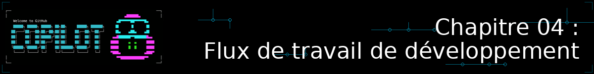
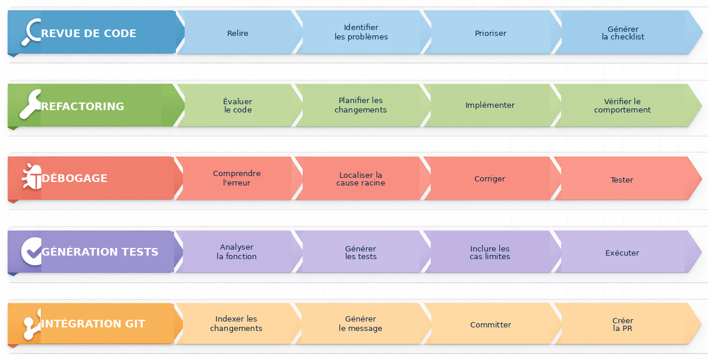
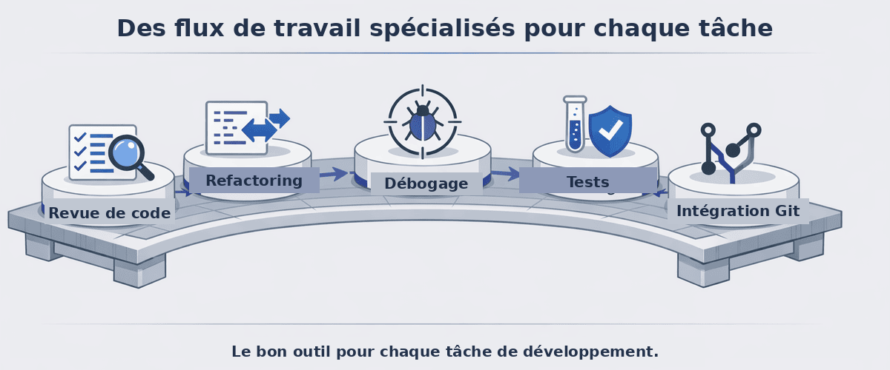

<!--
---
id: CopilotCLI-04
title: !translate Flux de travail de développement
description: !translate Appliquer GitHub Copilot CLI aux flux de travail de développement quotidiens, notamment la revue de code, le refactoring, le débogage, la génération de tests et Git.
audience: Developers / Students / Terminal users
slug: development-workflows
weight: 5
---
-->



> **Et si l'IA pouvait trouver des bugs que tu ne savais même pas devoir chercher ?**

Dans ce chapitre, GitHub Copilot CLI devient ton outil quotidien. Tu l'utiliseras au sein des flux de travail que tu utilises déjà tous les jours : tests, refactoring, débogage et Git.

## 🎯 Objectifs d'apprentissage

À la fin de ce chapitre, tu seras capable de :

- Effectuer des revues de code complètes avec Copilot CLI
- Refactoriser du code existant en toute sécurité
- Déboguer des problèmes avec l'assistance de l'IA
- Générer des tests automatiquement
- Intégrer Copilot CLI dans ton flux de travail git

> ⏱️ **Durée estimée** : ~60 minutes (15 min de lecture + 45 min de pratique)

---

## 🧩 Analogie du monde réel : le flux de travail d'un charpentier

Un charpentier ne se contente pas de savoir utiliser des outils, il a des *flux de travail* pour différents types de chantiers :


De la même manière, les développeurs ont des flux de travail pour différentes tâches. GitHub Copilot CLI améliore chacun de ces flux, te rendant plus efficace au quotidien.

---

# Les cinq flux de travail


Chaque flux de travail ci-dessous est autonome. Choisis ceux qui correspondent à tes besoins actuels, ou parcours-les tous.

### ✅ Pipeline vérifiable de chaque workflow

Pour que le flux soit réellement vérifiable, suis la même séquence à chaque fois :

1. **Préparer** : choisis le bon fichier et décris le symptôme ou l'objectif.
2. **Demander** : donne un prompt précis à Copilot CLI avec `@` ou `/review`.
3. **Vérifier** : relis la réponse et confirme qu'elle correspond à la cible.
4. **Tester** : exécute la commande de validation ciblée (par exemple `python -m pytest tests/`).
5. **Diff** : utilise `git add` sur les fichiers modifiés, puis `git diff --staged` pour relire les changements.
6. **Commit** : génère le message de commit et applique-le uniquement si le diff est propre.

> 💡 **Critère de réussite pour chaque workflow** : le résultat doit être observable et reproductible : une checklist de revue, un diff de refactoring à l'œil, un bug reproduit, des tests qui passent, ou un message de commit généré à partir d'un diff indexé.

---

## Choisis ton propre parcours

Ce chapitre couvre cinq flux de travail que les développeurs utilisent habituellement. **Cependant, tu n'as pas besoin de tout lire d'un coup !** Chaque flux de travail est autonome dans une section repliable ci-dessous. Choisis ceux qui correspondent le mieux à ton projet actuel. Tu pourras toujours revenir explorer les autres plus tard.



| Je veux... | Aller à |
|---|---|
| Relire du code avant de le fusionner | [Flux 1 : Revue de code](#workflow-1-code-review) |
| Nettoyer du code désordonné ou ancien | [Flux 2 : Refactoring](#workflow-2-refactoring) |
| Traquer et corriger un bug | [Flux 3 : Débogage](#workflow-3-debugging) |
| Générer des tests pour mon code | [Flux 4 : Génération de tests](#workflow-4-test-generation) |
| Écrire de meilleurs commits et PR | [Flux 5 : Intégration Git](#workflow-5-git-integration) |
| Faire des recherches avant de coder | [Astuce rapide : Rechercher avant de planifier ou coder](#quick-tip-research-before-you-plan-or-code) |
| Voir un flux complet de correction de bug de bout en bout | [Tout assembler](#putting-it-all-together-bug-fix-workflow) |

**Sélectionne un flux de travail ci-dessous pour le développer** et voir comment GitHub Copilot CLI peut améliorer ton processus de développement dans ce domaine.

---

<a id="workflow-1-code-review"></a>
<details>
<summary><strong>Flux 1 : Revue de code</strong> - Relire des fichiers, utiliser l'agent /review, créer des checklists de gravité</summary>

✅ Résultat observable : Copilot produit une checklist triée par gravité, avec au moins un problème identifié et un plan d'action clair.


### Revue de base

Cet exemple utilise le symbole `@` pour référencer un fichier, donnant à Copilot CLI un accès direct à son contenu pour la revue.

```bash
copilot

> Review @samples/book-app-project/book_app.py for code quality
```

---

<details>
<summary>🎬 Voir en action !</summary>


*Le résultat de la démo peut varier. Ton modèle, tes outils et tes réponses seront différents de ce qui est montré ici.*

</details>

---

### Revue de la validation des entrées

Demande à Copilot CLI de concentrer sa revue sur une préoccupation spécifique (ici, la validation des entrées) en listant les catégories qui t'intéressent dans le prompt.

```text
copilot

> Review @samples/book-app-project/utils.py for input validation issues. Check for: missing validation, error handling gaps, and edge cases
```


### Revue de projet inter-fichiers

Référence un répertoire entier avec `@` pour laisser Copilot CLI analyser tous les fichiers du projet en une seule fois.

```bash
copilot

> @samples/book-app-project/ Review this entire project. Create a markdown checklist of issues found, categorized by severity
```

### Revue de code interactive

Utilise une conversation à plusieurs tours pour approfondir. Commence par une revue large, puis pose des questions de suivi sans redémarrer.

```bash
copilot

> @samples/book-app-project/book_app.py Review this file for:
> - Input validation
> - Error handling
> - Code style and best practices

# Copilot CLI fournit une revue détaillée

> The user input handling - are there any edge cases I'm missing?

# Copilot CLI montre des problèmes potentiels avec les chaînes vides, les caractères spéciaux

> Create a checklist of all issues found, prioritized by severity

# Copilot CLI génère des actions prioritaires
```

### Modèle de checklist de revue

Demande à Copilot CLI de structurer sa sortie dans un format spécifique (ici, une checklist markdown classée par gravité que tu peux coller dans une issue).

```bash
copilot

> Review @samples/book-app-project/ and create a markdown checklist of issues found, categorized by:
> - Critical (data loss risks, crashes)
> - High (bugs, incorrect behavior)
> - Medium (performance, maintainability)
> - Low (style, minor improvements)
```

### Comprendre les changements Git (important pour /review)

Avant d'utiliser la commande `/review`, tu dois comprendre deux types de changements dans git :

| Type de changement | Ce que ça signifie | Comment le voir |
|-------------|---------------|------------|
| **Changements indexés (staged)** | Fichiers que tu as marqués pour le prochain commit avec `git add` | `git diff --staged` |
| **Changements non indexés (unstaged)** | Fichiers que tu as modifiés mais pas encore ajoutés | `git diff` |

```bash
# Référence rapide
git status           # Affiche à la fois les changements indexés et non indexés
git add file.py      # Indexer un fichier pour le commit
git diff             # Affiche les changements non indexés
git diff --staged    # Affiche les changements indexés
```

### Utiliser la commande /review

La commande `/review` invoque l'**agent de revue de code** intégré, optimisé pour analyser les changements indexés et non indexés avec une sortie à haut rapport signal/bruit. Utilise une commande slash pour déclencher un agent intégré spécialisé plutôt que d'écrire un prompt libre.

> ✅ **Résultat observable attendu** : `/review` retourne une revue structurée, priorisée par gravité, et tu peux facilement décider si le diff est prêt ou s'il faut corriger un problème avant le commit.

```bash
copilot

> /review
# Invoque l'agent code-review sur les changements indexés/non indexés
# Fournit un retour ciblé et exploitable

> /review Check for security issues in authentication
# Lance une revue avec un domaine de focus spécifique
```

> 💡 **Astuce** : L'agent code-review fonctionne mieux lorsque tu as des changements en attente. Indexe tes fichiers avec `git add` pour des revues plus ciblées.

### 🆕 Obtenir un second avis avec /rubber-duck

Après une revue avec `/review`, si tu hésites encore sur une correction ou un plan, la commande `/rubber-duck` consulte un agent dédié pour un second avis sur ton code, tes plans ou tes tests — comme le fait un vrai canard en plastique posé sur le bureau, mais avec des retours concrets.

```bash
copilot

> /rubber-duck Is this fix for find_by_author actually safe, or am I missing an edge case?
```

> 💡 **Quand l'utiliser** : entre `/review` (qui liste des problèmes) et un commit, `/rubber-duck` est utile pour challenger une hypothèse ou un plan avant de l'exécuter, plutôt que pour lister des bugs.

</details>

---

<a id="workflow-2-refactoring"></a>
<details>
<summary><strong>Flux 2 : Refactoring</strong> - Restructurer du code, séparer les responsabilités, améliorer la gestion des erreurs</summary>

✅ Résultat observable : le refactoring réduit la duplication ou la complexité du code et la validation ciblée (tests ou lint) continue à passer.


### Refactoring simple

> **Essaie ceci en premier :** `@samples/book-app-project/book_app.py The command handling uses if/elif chains. Refactor it to use a dictionary dispatch pattern.`

Commence par des améliorations simples. Essaie celles-ci sur l'application de livres. Chaque prompt utilise une référence de fichier `@` associée à une instruction de refactoring précise afin que Copilot CLI sache exactement quoi changer.

```bash
copilot

> @samples/book-app-project/book_app.py The command handling uses if/elif chains. Refactor it to use a dictionary dispatch pattern.

> @samples/book-app-project/utils.py Add type hints to all functions

> @samples/book-app-project/book_app.py Extract the book display logic into utils.py for better separation of concerns
```

> 💡 **Tu débutes en refactoring ?** Commence par des demandes simples comme l'ajout de type hints ou l'amélioration des noms de variables avant de t'attaquer à des transformations complexes.

---

<details>
<summary>🎬 Voir en action !</summary>


*Le résultat de la démo peut varier. Ton modèle, tes outils et tes réponses seront différents de ce qui est montré ici.*

</details>

---

### Séparer les responsabilités

Référence plusieurs fichiers avec `@` dans un seul prompt afin que Copilot CLI puisse déplacer du code entre eux dans le cadre du refactoring.

```bash
copilot

> @samples/book-app-project/utils.py @samples/book-app-project/book_app.py
> The utils.py file has print statements mixed with logic. Refactor to separate display functions from data processing.
```

### Améliorer la gestion des erreurs

Fournis deux fichiers liés et décris la préoccupation transversale afin que Copilot CLI puisse suggérer une correction cohérente sur les deux.

```bash
copilot

> @samples/book-app-project/utils.py @samples/book-app-project/books.py
> These files have inconsistent error handling. Suggest a unified approach using custom exceptions.
```

### Ajouter de la documentation

Utilise une liste à puces détaillée pour préciser exactement ce que chaque docstring doit contenir.

```bash
copilot

> @samples/book-app-project/books.py Add comprehensive docstrings to all methods:
> - Include parameter types and descriptions
> - Document return values
> - Note any exceptions raised
> - Add usage examples
```

### Refactoring sécurisé avec des tests

Enchaîne deux demandes liées dans une conversation à plusieurs tours. Génère d'abord des tests, puis refactorise avec ces tests comme filet de sécurité.

```bash
copilot

> @samples/book-app-project/books.py Before refactoring, generate tests for current behavior

# Obtenir d'abord les tests

> Now refactor the BookCollection class to use a context manager for file operations

# Refactoriser en toute confiance - les tests vérifient que le comportement est préservé
```

</details>

---

<a id="workflow-3-debugging"></a>
<details>
<summary><strong>Flux 3 : Débogage</strong> - Traquer des bugs, audits de sécurité, tracer des problèmes entre fichiers</summary>

✅ Résultat observable : le symptôme est reproduit, la cause racine est expliquée avec un fichier et une ligne ou une fonction, et la correction proposée est testable.


> ⚠️ **Attention :** les dossiers `samples/book-app-buggy/` et `samples/buggy-code/` sont volontairement bogués pour l'apprentissage. Ne corrige pas ces fichiers dans le dépôt du cours pendant les exercices ; utilise-les pour reproduire et diagnostiquer un bug, pas pour livrer une correction permanente.

### Débogage simple

> **Essaie ceci en premier :** `@samples/book-app-buggy/books_buggy.py Users report that searching for "The Hobbit" returns no results even though it's in the data. Debug why.`

Commence par décrire ce qui ne va pas. Voici des schémas de débogage courants que tu peux essayer avec l'application de livres bogguée. Chaque prompt associe une référence de fichier `@` à une description claire du symptôme afin que Copilot CLI puisse localiser et diagnostiquer le bug.

```bash
copilot

# Schéma : "Attendu X mais obtenu Y"
> @samples/book-app-buggy/books_buggy.py Users report that searching for "The Hobbit" returns no results even though it's in the data. Debug why.

# Schéma : "Comportement inattendu"
> @samples/book-app-buggy/book_app_buggy.py When I remove a book that doesn't exist, the app says it was removed. Help me find why.

# Schéma : "Résultats erronés"
> @samples/book-app-buggy/books_buggy.py When I mark one book as read, ALL books get marked. What's the bug?
```

> 💡 **Astuce de débogage** : Décris le *symptôme* (ce que tu observes) et l'*attente* (ce qui devrait se passer). Copilot CLI se charge du reste.

---

<details>
<summary>🎬 Voir en action !</summary>


*Le résultat de la démo peut varier. Ton modèle, tes outils et tes réponses seront différents de ce qui est montré ici.*

</details>

---

### Le « détective des bugs » - l'IA trouve des bugs LIÉS

C'est là que le débogage contextuel brille vraiment. Essaie ce scénario avec l'application de livres bogguée. Fournis le fichier entier via `@` et décris uniquement le symptôme rapporté par l'utilisateur. Copilot CLI remontera à la cause racine et pourra repérer des bugs supplémentaires à proximité.

```bash
copilot

> @samples/book-app-buggy/books_buggy.py
>
> Users report: "Finding books by author name doesn't work for partial names"
> Debug why this happens
```

**Ce que fait Copilot CLI** :
```
Root Cause: Line 80 uses exact match (==) instead of partial match (in).

Line 80: return [b for b in self.books if b.author == author]

The find_by_author function requires an exact match. Searching for "Tolkien"
won't find books by "J.R.R. Tolkien".

Fix: Change to case-insensitive partial match:
return [b for b in self.books if author.lower() in b.author.lower()]
```

**Pourquoi c'est important** : Copilot CLI lit le fichier entier, comprend le contexte de ton rapport de bug, et te donne une correction précise avec une explication claire.

> 💡 **Bonus** : Comme Copilot CLI analyse le fichier entier, il découvre souvent *d'autres* problèmes que tu n'avais pas demandés. Par exemple, en corrigeant la recherche par auteur, Copilot CLI pourrait aussi remarquer le bug de sensibilité à la casse dans `find_book_by_title` !

### Aparté sur la sécurité en conditions réelles

Bien que déboguer ton propre code soit important, comprendre les vulnérabilités de sécurité dans les applications de production est essentiel. Essaie cet exemple : pointe Copilot CLI vers un fichier inconnu et demande-lui d'auditer les problèmes de sécurité.

```bash
copilot

> @samples/buggy-code/python/user_service.py Find all security vulnerabilities in this Python user service
```

Ce fichier illustre des schémas de sécurité réels que tu rencontreras dans les applications de production.

> 💡 **Termes de sécurité courants que tu rencontreras :**
> - **Injection SQL** : Quand une entrée utilisateur est insérée directement dans une requête de base de données, permettant à des attaquants d'exécuter des commandes malveillantes
> - **Requêtes paramétrées** : L'alternative sûre - des espaces réservés (`?`) séparent les données utilisateur des commandes SQL
> - **Condition de concurrence (race condition)** : Quand deux opérations se produisent en même temps et interfèrent l'une avec l'autre
> - **XSS (Cross-Site Scripting)** : Quand des attaquants injectent des scripts malveillants dans des pages web

---

### Comprendre une erreur

Colle une trace de pile directement dans ton prompt avec une référence de fichier `@` afin que Copilot CLI puisse relier l'erreur au code source.

```bash
copilot

> I'm getting this error:
> AttributeError: 'NoneType' object has no attribute 'title'
>     at show_books (book_app.py:19)
>
> @samples/book-app-project/book_app.py Explain why and how to fix it
```

### Débogage avec un cas de test

Décris l'entrée exacte et la sortie observée pour donner à Copilot CLI un cas de test concret et reproductible à analyser.

```bash
copilot

> @samples/book-app-buggy/books_buggy.py The remove_book function has a bug. When I try to remove "Dune",
> it also removes "Dune Messiah". Debug this: explain the root cause and provide a fix.
```

### Tracer un problème à travers le code

Référence plusieurs fichiers et demande à Copilot CLI de suivre le flux de données entre eux pour localiser l'origine du problème.

```bash
copilot

> Users report that the book list numbering starts at 0 instead of 1.
> @samples/book-app-buggy/book_app_buggy.py @samples/book-app-buggy/books_buggy.py
> Trace through the list display flow and identify where the issue occurs
```

### 🆕 Reproduire le bug sans quitter la session

Préfixe une ligne avec `!` pour exécuter une commande shell directement depuis ta session Copilot CLI, sans perdre le contexte de la conversation. Utile pour relancer un test qui échoue juste après avoir décrit le symptôme.

```bash
copilot

> @samples/book-app-buggy/books_buggy.py Users report the search is case-sensitive. Debug why.

# Copilot CLI propose une hypothèse de cause racine

> !python -m pytest tests/ -k search -v

# La sortie du test reste visible dans la même conversation :
# Copilot CLI peut confirmer ou corriger son hypothèse à partir du résultat réel
```

> 💡 **Astuce** : `!` (seul, sans commande) bascule en mode shell pour enchaîner plusieurs commandes de suite. `$` (seul) rend la main à ton shell interactif habituel si tu as besoin d'une session complète.

Si l'hypothèse de Copilot CLI te semble incertaine, demande un second avis avec `/rubber-duck` avant d'appliquer le correctif :

```bash
> /rubber-duck Before I apply this fix, does the root cause explanation actually match the symptom?
```

### Comprendre les problèmes de données

Inclus un fichier de données à côté du code qui le lit afin que Copilot CLI comprenne l'ensemble du contexte lors de la suggestion d'améliorations de la gestion des erreurs.

```bash
copilot

> @samples/book-app-project/data.json @samples/book-app-project/books.py
> Sometimes the JSON file gets corrupted and the app crashes. How should we handle this gracefully?
```

</details>

---

<a id="workflow-4-test-generation"></a>
<details>
<summary><strong>Flux 4 : Génération de tests</strong> - Générer automatiquement des tests complets et des cas limites</summary>

✅ Résultat observable : les tests générés couvrent au moins le cas nominal et un ou deux cas limites, puis `python -m pytest tests/` se termine sans échec.


> **Essaie ceci en premier :** `@samples/book-app-project/books.py Generate pytest tests for all functions including edge cases`

### L'« explosion de tests » - 2 tests contre 15+ tests

En écrivant des tests manuellement, les développeurs créent généralement 2 à 3 tests basiques :
- Tester une entrée valide
- Tester une entrée invalide
- Tester un cas limite

Regarde ce qui se passe quand tu demandes à Copilot CLI de générer des tests complets ! Ce prompt utilise une liste à puces structurée avec une référence de fichier `@` pour guider Copilot CLI vers une couverture de test approfondie :

```bash
copilot

> @samples/book-app-project/books.py Generate comprehensive pytest tests. Include tests for:
> - Adding books
> - Removing books
> - Finding by title
> - Finding by author
> - Marking as read
> - Edge cases with empty data
```

---

<details>
<summary>🎬 Voir en action !</summary>


*Le résultat de la démo peut varier. Ton modèle, tes outils et tes réponses seront différents de ce qui est montré ici.*

</details>

---

**Ce que tu obtiens** : 15+ tests complets incluant :

```python
class TestBookCollection:
    # Cas nominal
    def test_add_book_creates_new_book(self):
        ...
    def test_list_books_returns_all_books(self):
        ...

    # Opérations de recherche
    def test_find_book_by_title_case_insensitive(self):
        ...
    def test_find_book_by_title_returns_none_when_not_found(self):
        ...
    def test_find_by_author_partial_match(self):
        ...
    def test_find_by_author_case_insensitive(self):
        ...

    # Cas limites
    def test_add_book_with_empty_title(self):
        ...
    def test_remove_nonexistent_book(self):
        ...
    def test_mark_as_read_nonexistent_book(self):
        ...

    # Persistance des données
    def test_save_books_persists_to_json(self):
        ...
    def test_load_books_handles_missing_file(self):
        ...
    def test_load_books_handles_corrupted_json(self):
        ...

    # Caractères spéciaux
    def test_add_book_with_unicode_characters(self):
        ...
    def test_find_by_author_with_special_characters(self):
        ...
```

**Résultat** : En 30 secondes, tu obtiens des tests de cas limites qui prendraient une heure à imaginer et à écrire.

---

### Tests unitaires

Cible une seule fonction et énumère les catégories d'entrées que tu veux tester afin que Copilot CLI génère des tests unitaires ciblés et approfondis.

```bash
copilot

> @samples/book-app-project/utils.py Generate comprehensive pytest tests for get_book_details covering:
> - Valid input
> - Empty strings
> - Invalid year formats
> - Very long titles
> - Special characters in author names
```

### Exécuter les tests

Pose à Copilot CLI une question en langage naturel sur ta chaîne d'outils. Il peut générer la bonne commande shell pour toi.

```bash
copilot

> How do I run the tests? Show me the pytest command.

# Copilot CLI répond :
# cd samples/book-app-project && python -m pytest tests/
# Ou pour une sortie détaillée : python -m pytest tests/ -v
# Pour voir les instructions print : python -m pytest tests/ -s
```

### Tester des scénarios spécifiques

Liste des scénarios avancés ou délicats que tu veux couvrir afin que Copilot CLI aille au-delà du cas nominal.

```bash
copilot

> @samples/book-app-project/books.py Generate tests for these scenarios:
> - Adding duplicate books (same title and author)
> - Removing a book by partial title match
> - Finding books when collection is empty
> - File permission errors during save
> - Concurrent access to the book collection
```

### Ajouter des tests à un fichier existant

Demande des tests *supplémentaires* pour une seule fonction afin que Copilot CLI génère de nouveaux cas qui complètent ceux que tu as déjà.

```bash
copilot

> @samples/book-app-project/books.py
> Generate additional tests for the find_by_author function with edge cases:
> - Author name with hyphens (e.g., "Jean-Paul Sartre")
> - Author with multiple first names
> - Empty string as author
> - Author name with accented characters
```

</details>

---

<a id="workflow-5-git-integration"></a>
<details>
<summary><strong>Flux 5 : Intégration Git</strong> - Messages de commit, descriptions de PR, /pr, /delegate, /diff et /branch</summary>

✅ Résultat observable : après `git add`, `git diff --staged` montre un diff propre et Copilot génère un message de commit cohérent avec les changements indexés.


> 💡 **Ce flux de travail suppose une familiarité de base avec git** (indexation, commits, branches). Si git est nouveau pour toi, essaie d'abord les quatre autres flux de travail.

### Générer des messages de commit

> **Essaie ceci en premier :** indexe quelques changements (`git add .`), puis exécute :
>
> ```bash
> git add .
> git diff --staged
> copilot -p "Generate a conventional commit message for: $(git diff --staged)"
> ```
>
> Cela permet de vérifier que le diff indexé est bien le bon changement avant de laisser Copilot CLI écrire le message de commit.

Cet exemple utilise l'option de prompt en ligne `-p` avec une substitution de commande shell pour transmettre directement la sortie de `git diff` à Copilot CLI pour un message de commit en une seule étape. La syntaxe `$(...)` exécute la commande entre parenthèses et insère sa sortie dans la commande englobante.

```bash

# 1. Indexer les changements avant de relire le diff
# (sans git add, git diff --staged reste vide)
git add .

# 2. Voir ce qui a changé
git diff --staged

# 3. Générer un message de commit au format [Conventional Commit](../GLOSSARY.md#conventional-commit)
# (messages structurés comme "feat(books): add search" ou "fix(data): handle empty input")
copilot -p "Generate a conventional commit message for: $(git diff --staged)"

# Résultat : "feat(books): add partial author name search
#
# - Update find_by_author to support partial matches
# - Add case-insensitive comparison
# - Improve user experience when searching authors"
```

---

<details>
<summary>🎬 Voir en action !</summary>


*Le résultat de la démo peut varier. Ton modèle, tes outils et tes réponses seront différents de ce qui est montré ici.*

</details>

---

### Expliquer des changements

Transmets la sortie de `git show` à un prompt `-p` pour obtenir un résumé en langage clair du dernier commit.

```bash
# Qu'est-ce que ce commit a changé ?
copilot -p "Explain what this commit does: $(git show HEAD --stat)"
```

### Description de PR

Combine la sortie de `git log` avec un modèle de prompt structuré pour générer automatiquement une description complète de pull request.

```bash
# Générer une description de PR à partir des changements de la branche
copilot -p "Generate a pull request description for these changes:
$(git log main..HEAD --oneline)

Include:
- Summary of changes
- Why these changes were made
- Testing done
- Breaking changes? (yes/no)"
```

### Utiliser /pr en mode interactif pour la branche actuelle

Si tu travailles avec une branche en mode interactif de Copilot CLI, tu peux utiliser la commande `/pr` pour travailler avec les pull requests. Utilise `/pr` pour visualiser une PR, en créer une nouvelle, corriger une PR existante, ou laisser Copilot CLI décider automatiquement selon l'état de la branche.

```bash
copilot

> /pr [view|create|fix|auto|automerge]
```

| Mode | Ce qu'il fait |
|------|---------------|
| `view` | Affiche la PR de la branche courante |
| `create` | Crée une nouvelle PR |
| `fix` | Corrige une PR existante (ex. après un retour de revue) |
| `auto` | Corrige les vérifications CI jusqu'à ce qu'elles passent au vert, puis s'arrête |
| `automerge` *(alias `agentmerge`)* 🆕 | Corrige les vérifications CI jusqu'au vert, **puis fusionne automatiquement** la PR |

> ⚠️ **Attention avec `automerge`** : cette option fusionne la PR sans confirmation manuelle une fois les checks au vert. Réserve-la à des changements que tu as déjà revus, sur des dépôts où la fusion automatique est acceptable.

### Revue avant push

Utilise `git diff main..HEAD` dans un prompt `-p` pour une vérification rapide de bon sens avant de pousser, sur l'ensemble des changements de la branche.

```bash
# Dernière vérification avant de pousser
copilot -p "Review these changes for issues before I push:
$(git diff main..HEAD)"
```

### Utiliser /delegate pour des tâches en arrière-plan

La commande `/delegate` confie le travail à l'agent cloud GitHub Copilot. Utilise la commande slash `/delegate` (ou le raccourci `&`) pour déléguer une tâche bien définie à un agent en arrière-plan.

```bash
copilot

> /delegate Add input validation to the login form

# Copilot CLI :
# 1. Commite tes changements sur une nouvelle branche
# 2. Ouvre une pull request en brouillon
# 3. Travaille en arrière-plan sur GitHub
# 4. Demande ta revue une fois terminé
```

C'est idéal pour des tâches bien définies que tu veux voir accomplies pendant que tu te concentres sur autre chose.

### Utiliser /diff pour relire et commenter les changements

La commande `/diff` ouvre un véritable **mode de revue interactif** sur les changements du répertoire courant (elle bascule automatiquement sur le diff de branche quand l'arbre de travail est propre). Elle fonctionne aussi dans des dossiers qui ne sont pas des dépôts git.

> 🧪 **Expérimental** : `/diff` est marquée expérimentale dans la documentation officielle. Si elle ne répond pas, active les fonctionnalités expérimentales avec `/experimental on`.

```bash
copilot

# Après avoir effectué quelques changements...
> /diff

# Ouvre le mode diff interactif
```

Une fois en mode diff, quelques raccourcis utiles :

| Touche | Action |
|--------|--------|
| `↑`/`↓` (ou `k`/`j`) | Naviguer ligne par ligne |
| `←`/`→` (ou `h`/`l`) | Passer au fichier précédent/suivant |
| `c` | Ajouter ou éditer un commentaire sur la ligne sélectionnée |
| `s` | Afficher le résumé des commentaires |
| `b` | Basculer entre diff non indexé et diff de branche |
| `w` | Masquer les changements d'espaces uniquement |
| `Enter` | Soumettre tous les commentaires (Copilot CLI les traite comme des retours de revue) |
| `Esc` / `Ctrl+C` | Quitter le mode diff |

> 💡 **Pourquoi c'est utile** : laisser des commentaires ligne par ligne avec `c` puis les soumettre avec `Enter` revient à faire une auto-revue de PR directement dans le terminal, avant même d'ouvrir GitHub.

### Créer une branche de ta session avec /branch ou /fork

Parfois, tu veux explorer deux approches différentes d'un problème sans perdre ta conversation d'origine. La commande `/branch` (aussi disponible sous `/fork`) crée une copie de ta session actuelle afin que tu puisses essayer une direction différente puis comparer les résultats.

```bash
copilot

> Fix the find_by_author function to support partial matches

# Tu veux essayer une approche différente — crée d'abord une branche !
> /branch

# Tu es maintenant dans une nouvelle copie de session. Essaie ton approche alternative :
> Fix find_by_author using a different regex-based strategy

# Si le résultat ne te plaît pas, reviens à ta session d'origine avec /session
```

> 💡 **`/branch` et `/fork` sont identiques** : Les deux commandes font exactement la même chose. `/branch` a été ajoutée comme nom plus intuitif. Utilise celle qui te convient le mieux. 🆕 Les deux acceptent désormais un nom optionnel (`/branch nom-de-session`, `/fork nom-de-session`) pour retrouver facilement la copie dans ta liste de sessions.

> 💡 **Quand créer une branche** : Créer une branche est utile quand tu n'es pas sûr de quelle approche est la meilleure et que tu veux garder les deux options ouvertes.

### Isoler un flux de travail avec /worktree, /move ou --worktree

`/branch` et `/fork` dupliquent ta *conversation*, mais les fichiers restent partagés sur le même disque. Pour de vraies copies de travail isolées — utile quand tu veux travailler sur plusieurs branches en parallèle sans faire de `git stash` — utilise plutôt un [worktree git](../GLOSSARY.md#worktree) dédié.

> 🆕 *(depuis Copilot CLI v1.0.79)* Ajout expérimental de `/worktree new`, qui démarre une nouvelle session Copilot CLI dans un nouveau worktree git.

```bash
copilot

> /worktree new

# Crée un nouveau worktree git et démarre une session dedans :
# tes fichiers sur disque sont réellement séparés de ton checkout actuel
```

Tu peux aussi démarrer directement une session dans un nouveau worktree depuis la ligne de commande, sans passer par le mode interactif :

```bash
copilot --worktree
```

🆕 `/worktree` accepte désormais directement un nom de branche ou une description de tâche, et **bascule ta session courante** dans le nouveau worktree (tes changements non commités restent derrière, dans le worktree d'origine) :

```bash
copilot

> /worktree fix-search-bug
# Crée le worktree "fix-search-bug" et y bascule la session courante

> /worktree Add pagination to the book list
# Sans nom de branche fourni, la description de tâche sert de premier prompt
# et un nom de branche est généré automatiquement à partir de la conversation
```

🆕 Si tu as déjà des changements non commités et que tu veux les **déplacer** (plutôt que les laisser) vers un nouveau worktree, utilise `/move` :

```bash
copilot

> /move fix-search-bug
# Déplace les changements non commités du checkout courant vers le nouveau worktree
```

> 💡 **`/worktree` vs `/move`** : `/worktree` laisse tes changements non commités dans le worktree d'origine et démarre propre dans le nouveau. `/move` emporte ces changements avec toi.

> 💡 **`/branch`/`/fork` vs `/worktree`** : `/branch` (ou `/fork`) est léger et rapide - il duplique la conversation, mais tu restes sur le même checkout de fichiers. `/worktree` (et `--worktree`) crée un dossier de checkout entièrement séparé : idéal pour garder une branche en cours de review pendant que tu travailles déjà sur la suivante, sans conflits de fichiers ni stash.

> 🆕 *(depuis Copilot CLI v1.0.81)* Le réglage `worktreeBaseRef` contrôle si `/worktree`, `/worktree new` et `--worktree` démarrent depuis `HEAD` ou depuis la branche distante par défaut. Par défaut, les trois démarrent depuis `HEAD` (le checkout courant) ; règle `worktreeBaseRef` sur `"defaultBranch"` pour démarrer plutôt depuis la branche distante par défaut.

</details>

---

## Astuce rapide : rechercher avant de planifier ou coder

Quand tu as besoin d'investiguer une bibliothèque, comprendre des bonnes pratiques, ou explorer un sujet inconnu, utilise `/research` pour lancer une investigation de recherche approfondie avant d'écrire du code :

```bash
copilot

> /research What are the best Python libraries for validating user input in CLI apps?
```

Copilot recherche dans les dépôts GitHub et des sources web, puis renvoie un résumé avec des références. Ceci est utile lorsque tu es sur le point de commencer une nouvelle fonctionnalité et que tu veux prendre des décisions éclairées d'abord. Tu peux partager les résultats avec `/share`.

> 💡 **Astuce** : `/research` fonctionne bien *avant* `/plan`. Recherche l'approche, puis planifie l'implémentation.

---

## Tout assembler : flux de correction de bug

Voici un flux de travail complet pour corriger un bug signalé :

```bash

# 1. Comprendre le rapport de bug
copilot

> Users report: 'Finding books by author name doesn't work for partial names'
> @samples/book-app-project/books.py Analyze and identify the likely cause

# 2. Déboguer le problème et corriger (en continuant dans la même session)
> Based on the analysis, show me the find_by_author function and explain the issue

> Fix the find_by_author function to handle partial name matches

# 3. Générer des tests pour la correction
> @samples/book-app-project/books.py Generate pytest tests specifically for:
> - Full author name match
> - Partial author name match
> - Case-insensitive matching
> - Author name not found

# Quitter la session interactive

> /exit

# 4. Exécuter git add

# Indexer les changements pour que git diff --staged ait quelque chose à traiter
git add .

# 5. Vérifier le diff indexé avant de générer le message de commit
git diff --staged

# 6. Générer le message de commit
copilot -p "Generate commit message for: $(git diff --staged)"

# Exemple de résultat : "fix(books): support partial author name search"

# 7. Committer les changements (optionnel)

git commit -m "<coller le message généré>"
```

> 🆕 **Rester dans la même session** : au lieu de `/exit` puis `git add .` dans un terminal séparé, tu peux préfixer une commande shell avec `!` pour l'exécuter directement depuis la session interactive, sans perdre le contexte de conversation :
> ```bash
> > !git add .
> > !git diff --staged
> > /review
> ```
> Utile si tu veux que Copilot CLI enchaîne l'indexation, une dernière revue avec `/review`, puis le message de commit, sans changer de fenêtre.
>
> 🆕 **Reprendre après un `-p`** : le résumé affiché à la fin d'une commande `copilot -p "..."` inclut désormais un indice `--resume=SESSION-ID`. S'il te reste des questions après le commit, tu peux reprendre cette même session en mode interactif au lieu d'en démarrer une nouvelle.

### Résumé du flux de correction de bug

| Étape | Action | Commande Copilot |
|------|--------|-----------------|
| 1 | Comprendre le bug | `> [décrire le bug] @relevant-file.py Analyze the likely cause` |
| 2 | Analyse et correction | `> Show me the function and fix the issue` |
| 3 | Générer des tests | `> Generate tests for [specific scenarios]` |
| 4 | Indexer les changements | `git add .` |
| 5 | Vérifier le diff indexé | `git diff --staged` |
| 6 | Générer le message de commit | `copilot -p "Generate commit message for: $(git diff --staged)"` |
| 7 | Committer les changements | `git commit -m "<coller le message généré>"` |

---

# Pratique


C'est maintenant à toi d'appliquer ces flux de travail.

---

## ▶️ À toi d'essayer

Après avoir terminé les démonstrations, essaie ces variations :

1. **Défi du détective de bug** : Demande à Copilot CLI de déboguer la fonction `mark_as_read` dans `samples/book-app-buggy/books_buggy.py`. A-t-il expliqué pourquoi la fonction marque TOUS les livres comme lus au lieu d'un seul ?

2. **Défi de test** : Génère des tests pour la fonction `add_book` dans l'application de livres. Compte combien de cas limites Copilot CLI inclut auxquels tu n'aurais pas pensé.

3. **Défi du message de commit** : Fais un petit changement dans un fichier de l'application de livres, indexe-le (`git add .`), puis exécute :
   ```bash
   git diff --staged
   copilot -p "Generate a conventional commit message for: $(git diff --staged)"
   ```
   Vérifie que le diff indexé est bien le bon changement et que le message généré décrit précisément ce qui a été modifié. Le message est-il meilleur que ce que tu aurais écrit rapidement ?

**Auto-vérification** : Tu comprends les flux de travail de développement quand tu peux expliquer pourquoi « déboguer ce bug » est plus puissant que « trouver des bugs » (le contexte compte !).

---

## 📝 Devoir

### Défi principal : refactoriser, tester et livrer

Les exemples pratiques se sont concentrés sur `find_book_by_title` et les revues de code. Maintenant, mets en pratique les mêmes compétences de flux de travail sur d'autres fonctions dans `book-app-project` :

1. **Revue** : Demande à Copilot CLI de relire `remove_book()` dans `books.py` pour les cas limites et problèmes potentiels :
   `@samples/book-app-project/books.py Review the remove_book() function. What happens if the title partially matches another book (e.g., "Dune" vs "Dune Messiah")? Are there any edge cases not handled?`
2. **Refactoring** : Demande à Copilot CLI d'améliorer `remove_book()` pour gérer des cas limites comme la correspondance insensible à la casse et retourner un retour utile lorsqu'un livre n'est pas trouvé
3. **Test** : Génère des tests pytest spécifiquement pour la fonction `remove_book()` améliorée, couvrant :
   - Supprimer un livre qui existe
   - Correspondance de titre insensible à la casse
   - Un livre qui n'existe pas retourne un retour approprié
   - Suppression depuis une collection vide
4. **Revue** : Indexe tes changements et exécute `/review` pour vérifier les problèmes restants
5. **Commit** : Génère un message de commit conventionnel après avoir indexé les changements :
   ```bash
   git add .
   git diff --staged
   copilot -p "Generate a conventional commit message for: $(git diff --staged)"
   ```

<details>
<summary>💡 Indices (cliquer pour développer)</summary>

**Exemples de prompts pour chaque étape :**

```bash
copilot

# Étape 1 : Revue
> @samples/book-app-project/books.py Review the remove_book() function. What edge cases are not handled?

# Étape 2 : Refactoring
> Improve remove_book() to use case-insensitive matching and return a clear message when the book isn't found. Show me the before and after code.

# Étape 3 : Test
> Generate pytest tests for the improved remove_book() function, including:
> - Removing a book that exists
> - Case-insensitive matching ("dune" should remove "Dune")
> - Book not found returns appropriate response
> - Removing from an empty collection

# Étape 4 : Revue
> /review

# Étape 5 : Commit
> Generate a conventional commit message for this refactor
```

**Astuce :** Après avoir amélioré `remove_book()`, essaie de demander à Copilot CLI : « Y a-t-il d'autres fonctions dans ce fichier qui pourraient bénéficier des mêmes améliorations ? ». Il pourrait suggérer des changements similaires à `find_book_by_title()` ou `find_by_author()`.

</details>

### Défi bonus : créer une application avec Copilot CLI

> 💡 **Remarque** : Cet exercice GitHub Skills utilise **Node.js** plutôt que Python. Les techniques de GitHub Copilot CLI que tu pratiqueras - créer des issues, générer du code et collaborer depuis le terminal - s'appliquent à n'importe quel langage.

Cet exercice montre aux développeurs comment utiliser GitHub Copilot CLI pour créer des issues, générer du code et collaborer depuis le terminal en construisant une application calculatrice Node.js. Tu installeras le CLI, utiliseras des modèles et des agents, et pratiqueras un développement itératif piloté par la ligne de commande.

#####  [Démarrer l'exercice Skills « Create applications with the Copilot CLI »](https://github.com/skills/create-applications-with-the-copilot-cli)

---

<details>
<summary>🔧 <strong>Erreurs courantes et dépannage</strong> (cliquer pour développer)</summary>

### Erreurs courantes

| Erreur | Ce qui se passe | Correction |
|---------|--------------|-----|
| Utiliser des prompts vagues comme « Review this code » | Un retour générique qui passe à côté des problèmes spécifiques | Sois précis : « Review for SQL injection, XSS, and auth issues » |
| Ne pas utiliser `/review` pour les revues de code | Se priver de l'agent code-review optimisé | Utilise `/review`, réglé pour une sortie à haut rapport signal/bruit |
| Demander de « trouver des bugs » sans contexte | Copilot CLI ne sait pas quel bug tu rencontres | Décris le symptôme : « Users report X happens when Y » |
| Générer des tests sans préciser le framework | Les tests peuvent utiliser une syntaxe ou une bibliothèque d'assertions incorrecte | Précise : « Generate tests using Jest » ou « using pytest » |
| `/diff` ne répond pas | La commande est marquée expérimentale et peut être désactivée par défaut | Active-la avec `/experimental on`, ou liste les commandes disponibles avec `copilot help commands` |

### Dépannage

**La revue semble incomplète** - Sois plus précis sur ce qu'il faut chercher :

```bash
copilot

# Au lieu de :
> Review @samples/book-app-project/book_app.py

# Essaie :
> Review @samples/book-app-project/book_app.py for input validation, error handling, and edge cases
```

**Les tests ne correspondent pas à mon framework** - Précise le framework :

```bash
copilot

> @samples/book-app-project/books.py Generate tests using pytest (not unittest)
```

**Le refactoring change le comportement** - Demande à Copilot CLI de préserver le comportement :

```bash
copilot

> @samples/book-app-project/book_app.py Refactor command handling to use dictionary dispatch. IMPORTANT: Maintain identical external behavior - no breaking changes
```

</details>

---

# Résumé

## 🔑 Points clés à retenir



1. La **revue de code** devient complète avec des prompts précis
2. Le **refactoring** est plus sûr quand tu génères d'abord des tests
3. Le **débogage** bénéficie de montrer à Copilot CLI l'erreur ET le code
4. La **génération de tests** doit inclure les cas limites et les scénarios d'erreur
5. L'**intégration git** automatise les messages de commit et les descriptions de PR

> 📋 **Référence rapide** : Consulte la [référence des commandes GitHub Copilot CLI](https://docs.github.com/en/copilot/reference/copilot-cli-reference/cli-command-reference) pour une liste complète des commandes et raccourcis.

---

## ✅ Point de contrôle : tu maîtrises l'essentiel

**Félicitations !** Tu as maintenant toutes les compétences de base pour être productif avec GitHub Copilot CLI :

| Compétence | Chapitre | Tu peux maintenant... |
|-------|---------|----------------|
| Commandes de base | Ch 02 | Utiliser le mode interactif, le mode plan, le mode programmatique (-p) et les commandes slash |
| Contexte | Ch 03 | Référencer des fichiers avec `@`, gérer des sessions, comprendre les fenêtres de contexte |
| Flux de travail | Ch 04 | Relire du code, refactoriser, déboguer, générer des tests, intégrer avec git |

Les chapitres 05 à 07 couvrent des fonctionnalités supplémentaires qui apportent encore plus de puissance et méritent d'être apprises.

---

## 🛠️ Construire ton flux de travail personnel

Il n'existe pas de « bonne » façon unique d'utiliser GitHub Copilot CLI. Voici quelques conseils pendant que tu développes tes propres habitudes :

> 📚 **Documentation officielle** : [Bonnes pratiques Copilot CLI](https://docs.github.com/en/copilot/how-tos/copilot-cli/cli-best-practices) pour des flux de travail recommandés et des astuces de GitHub.

- **Commence par `/plan`** pour tout ce qui n'est pas trivial. Affine le plan avant l'exécution - un bon plan mène à de meilleurs résultats.
- **Automatise les tâches routinières avec `--plan --mode autopilot`.** *(depuis Copilot CLI v1.0.79)* 🆕 En combinant les deux, Copilot CLI planifie d'abord la tâche, puis l'implémente directement sans attendre ton approbation à chaque étape. Réserve cette combinaison aux tâches routinières ou déjà bien maîtrisées.
- **Plafonne la dépense avec `/goal --max-ai-credits N`.** 🆕 En mode interactif, `/autopilot [OBJECTIF]` (ou son alias `/goal [OBJECTIF]`) démarre ou réoriente le mode autopilot ; ajoute `--max-ai-credits N` pour plafonner les crédits IA consommés sur cet objectif (ex. `/goal Refactor remove_book --max-ai-credits 5`). Une fois le plafond atteint, autopilot se met en pause et affiche un panneau pour reprendre avec une nouvelle fenêtre de crédits. `/goal on`/`/goal off` bascule le mode sans fixer de nouvel objectif.
- **Enchaîne plusieurs étapes sans attendre.** *(depuis Copilot CLI v1.0.79)* 🆕 Tu peux mettre en file d'attente des prompts, des commandes shell et certaines commandes slash : ils s'exécutent dans l'ordre dès que la tâche en cours se termine, sans que tu aies à surveiller la session pour enchaîner manuellement les étapes d'un flux de travail.
- **Sauvegarde les prompts qui fonctionnent bien.** Quand Copilot CLI fait une erreur, note ce qui n'a pas marché. Avec le temps, cela devient ton carnet de bord personnel.
- **Expérimente librement.** Certains développeurs préfèrent des prompts longs et détaillés. D'autres préfèrent des prompts courts avec des relances. Essaie différentes approches et vois ce qui te semble naturel.

> 💡 **À venir** : Dans les chapitres 05 et 06, tu apprendras à codifier tes meilleures pratiques en instructions personnalisées et en skills que Copilot CLI charge automatiquement.

---

## ➡️ Et ensuite

Les chapitres restants couvrent des fonctionnalités supplémentaires qui étendent les capacités de Copilot CLI :

| Chapitre | Ce qu'il couvre | Quand tu en auras besoin |
|---------|----------------|---------------------|
| Ch 05 : Agents | Créer des personas IA spécialisés | Quand tu veux des experts de domaine (frontend, sécurité) |
| Ch 06 : Skills | Charger automatiquement des instructions pour des tâches | Quand tu répètes souvent les mêmes prompts |
| Ch 07 : MCP | Connecter des services externes | Quand tu as besoin de données en direct depuis GitHub, des bases de données |

**Recommandation** : Essaie les flux de travail principaux pendant une semaine, puis reviens aux chapitres 05-07 quand tu auras des besoins spécifiques.

---

## Continuer vers des sujets supplémentaires

Dans le **[Chapitre 05 : Agents et instructions personnalisées](../05-agents-custom-instructions/README.md)**, tu apprendras :

- Utiliser les agents intégrés (`/plan`, `/review`)
- Créer des agents spécialisés (expert frontend, auditeur de sécurité) avec des fichiers `.agent.md`
- Les schémas de collaboration multi-agents
- Les fichiers d'instructions personnalisées pour les standards de projet

---

**[← Retour au Chapitre 03](../03-context-conversations/README.md)** | **[Continuer vers le Chapitre 05 →](../05-agents-custom-instructions/README.md)**
