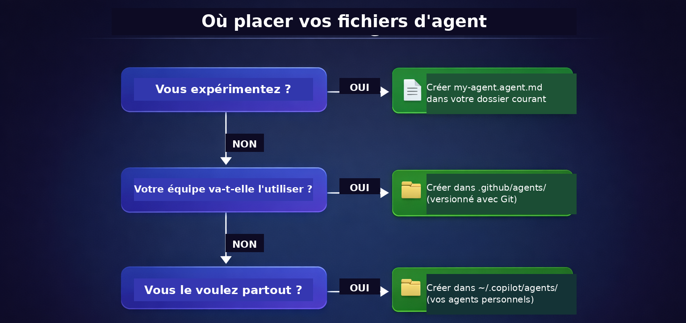

<!--
---
id: CopilotCLI-05
title: !translate Créer des assistants IA spécialisés
description: !translate Utilisez des agents intégrés, créez des agents personnalisés et rédigez des instructions personnalisées qui guident GitHub Copilot CLI pour des tâches spécialisées.
audience: Developers / Students / Terminal users
slug: create-specialized-ai-assistants
weight: 6
---
-->


> **Et si vous pouviez recruter un relecteur de code Python, un expert en tests, et un relecteur sécurité... le tout dans un seul outil ?**

Au Chapitre 04, vous avez maîtrisé les flux de travail essentiels : revue de code, refactoring, débogage, génération de tests, et intégration git. Cela vous rend déjà très productif avec GitHub Copilot CLI. Allons maintenant plus loin.

Jusqu'ici, vous avez utilisé Copilot CLI comme un assistant généraliste. Les agents vous permettent de lui donner une personnalité spécifique avec des standards intégrés, comme un relecteur de code qui impose les annotations de type et la PEP 8, ou un assistant de test qui écrit des cas de test pytest. Vous verrez comment le même prompt produit des résultats nettement meilleurs lorsqu'il est traité par un agent avec des instructions ciblées.

## 🎯 Objectifs d'apprentissage

À la fin de ce chapitre, vous serez capable de :

- Utiliser les agents intégrés : Plan (`/plan`), Code-review (`/review`), et comprendre les agents automatiques (Explore, Task)
- Créer des agents spécialisés à l'aide de fichiers agent (`.agent.md`)
- Utiliser des agents pour des tâches spécifiques à un domaine
- Basculer entre agents avec `/agent` et `--agent`
- Écrire des fichiers d'instructions personnalisés pour des standards propres à un projet

> ⏱️ **Durée estimée** : ~55 minutes (20 min de lecture + 35 min de pratique)

---

## 🧩 Analogie du monde réel : Recruter des spécialistes

Quand vous avez besoin d'aide pour votre maison, vous n'appelez pas un « assistant généraliste ». Vous appelez des spécialistes :

| Problème | Spécialiste | Pourquoi |
|---------|------------|-----|
| Fuite de tuyau | Plombier | Connaît les normes de plomberie, dispose d'outils spécialisés |
| Recâblage | Électricien | Comprend les exigences de sécurité, aux normes |
| Nouveau toit | Couvreur | Connaît les matériaux, les contraintes météo locales |

Les agents fonctionnent de la même façon. Plutôt qu'une IA générique, utilisez des agents concentrés sur des tâches spécifiques et qui connaissent le bon processus à suivre. Configurez les instructions une fois, puis réutilisez-les chaque fois que vous avez besoin de cette spécialité : revue de code, tests, sécurité, documentation.


---

# Utiliser les agents

Commencez dès maintenant avec les agents intégrés et personnalisés.

---

## *Nouveau avec les agents ?* Commencez ici !

Vous n'avez jamais utilisé ni créé d'agent ? Voici tout ce dont vous avez besoin pour démarrer avec ce cours.

1. **Essayez tout de suite un agent *intégré* :**
   ```bash
   copilot
   > /plan Add input validation for book year in the book app
   ```
   Ceci invoque l'agent Plan pour créer un plan d'implémentation étape par étape.

2. **Découvrez un de nos exemples d'agent personnalisé :** Il est simple de définir les instructions d'un agent, regardez notre fichier fourni [python-reviewer.agent.md](../.github/agents/python-reviewer.agent.md) pour voir le modèle à suivre.

3. **Comprenez le concept clé :** Les agents, c'est comme consulter un spécialiste plutôt qu'un généraliste. Un « agent frontend » se concentrera automatiquement sur l'accessibilité et les modèles de composants, vous n'avez pas besoin de le lui rappeler car c'est déjà précisé dans les instructions de l'agent.


## Agents intégrés

**Vous avez déjà utilisé certains agents intégrés au Chapitre 04 Flux de travail de développement !**
<br>`/plan` et `/review` sont en réalité des agents intégrés. Vous savez maintenant ce qui se passe sous le capot. Voici la liste complète :

| Agent | Comment l'invoquer | Ce qu'il fait |
|-------|---------------|--------------|
| **Plan** | `/plan` ou `Shift+Tab` (fait défiler les modes) | Crée des plans d'implémentation étape par étape avant de coder |
| **Code-review** | `/review` | Passe en revue les changements indexés/non indexés avec un retour ciblé et exploitable |
| **Init** | `/init` | Génère les fichiers de configuration du projet (instructions, agents) |
| **Explore** | *Automatique* | Utilisé en interne quand vous demandez à Copilot d'explorer ou d'analyser le code |
| **Task** | *Automatique* | Exécute des commandes comme les tests, les builds, les linters, et les installations de dépendances |

<br>

**Les agents intégrés en action** - Exemples d'invocation de Plan, Code-review, Explore, et Task

```bash
copilot

# Invoquer l'agent Plan pour créer un plan d'implémentation
> /plan Add input validation for book year in the book app

# Invoquer l'agent Code-review sur vos changements
> /review

# Les agents Explore et Task sont invoqués automatiquement quand c'est pertinent :
> Run the test suite        # Utilise l'agent Task

> Explore how book data is loaded    # Utilise l'agent Explore
```

<details>
<summary>🎬 Voyez l'agent Plan en action !</summary>

🚧 *Démo en préparation — le script d'enregistrement (`assets/builtin-agent-demo.tape`) existe déjà ; il reste à le rendre avec `npm run generate:vhs -- --chapter 05` pour produire ce GIF.*

</details>

Et l'agent Task ? Il travaille en coulisses pour gérer et suivre ce qui se passe et rendre compte dans un format clair et net :

| Résultat | Ce que vous voyez |
|---------|--------------|
| ✅ **Succès** | Résumé bref (par ex. « All 247 tests passed », « Build succeeded ») |
| ❌ **Échec** | Sortie complète avec traces de pile, erreurs de compilation, et journaux détaillés |

> 💡 **Subagents multi-échanges** : Les subagents (tâches en arrière-plan lancées par les agents) prennent en charge les messages de suivi. Pendant qu'un agent s'exécute en arrière-plan, vous pouvez ouvrir `/tasks` pour le consulter et lui envoyer des instructions de suivi. Vous n'avez pas besoin d'attendre qu'il termine pour le guider davantage. Voyez cela comme la possibilité de taper sur l'épaule de votre assistant en pleine tâche pour lui donner des indications supplémentaires.

### Choisir un modèle pour le mode Plan

Par défaut, `/plan` utilise le même modèle d'IA que celui sélectionné pour votre session. Vous pouvez choisir un modèle *différent* à utiliser uniquement en mode Plan, pratique pour utiliser un modèle plus rapide ou moins coûteux pour la planification, puis revenir à un modèle plus puissant pour l'implémentation :

```bash
copilot

# Ouvrir le sélecteur de modèle pour le mode Plan uniquement
> /model plan

# Ou spécifier directement un ID de modèle (utilisez 'off' pour effacer le modèle du mode Plan)
> /model plan <nom-du-modèle>

# En quittant le mode Plan, le modèle revient automatiquement à celui de votre session
```

> 💡 **Quel ID de modèle utiliser ?** Tapez simplement `/model` pour afficher la liste des modèles disponibles à l'instant T : cette liste évolue souvent, mieux vaut donc la consulter directement plutôt que de se fier à un ID précis mentionné ici.

> 💡 **Pourquoi définir un modèle pour le mode Plan ?** Un plan de haute qualité créé en amont par un modèle de pointe peut en réalité faire gagner des jetons et du temps globalement. Un plan précis et bien délimité signifie moins d'allers-retours de correction pendant l'implémentation.

> 📚 **Documentation officielle** : [Agents GitHub Copilot CLI](https://docs.github.com/copilot/how-tos/copilot-cli/use-copilot-cli/invoke-custom-agents)

---

# Ajouter des agents à Copilot CLI

Vous pouvez tout simplement définir vos propres agents pour qu'ils fassent partie de votre flux de travail ! Définissez une fois, puis dirigez !


<a id="-add-your-agents"></a>
## 🗂️ Ajoutez vos agents

Les fichiers agent sont des fichiers markdown avec une extension `.agent.md`. Ils comportent deux parties : un frontmatter YAML (métadonnées) et des instructions markdown.

> 💡 **Nouveau avec le frontmatter YAML ?** C'est un petit bloc de réglages en haut du fichier, entouré de marqueurs `---`. YAML n'est constitué que de paires `clé: valeur`. Le reste du fichier est du markdown classique.

Voici un agent minimal :

```markdown
---
name: code-reviewer
description: Code reviewer focused on bugs and security issues
---

# Code Reviewer

You are a code reviewer focused on finding bugs and security issues.

When reviewing code, always check for:
- SQL injection vulnerabilities
- Missing error handling
- Hardcoded secrets
```

> 💡 **Requis vs optionnel** : Le champ `description` est obligatoire. Les autres champs comme `name`, `tools`, et `model` sont facultatifs.

<a id="where-to-put-agent-files"></a>
## Où placer les fichiers agent

| Emplacement | Portée | Idéal pour |
|----------|-------|----------|
| `.github/agents/` | Spécifique au projet | Agents partagés en équipe suivant les conventions du projet |
| `~/.copilot/agents/` | Global (tous les projets) | Agents personnels que vous utilisez partout |

**Chemins de recherche** : à chaque lancement de `/agent` ou `--agent <nom>`, Copilot CLI recherche un fichier `<nom>.agent.md` dans ces deux emplacements (ce cours n'utilise que les niveaux personnel et projet ; des niveaux organisation et entreprise existent aussi pour les comptes GitHub Enterprise, voir la documentation officielle citée plus haut). En cas de conflit de nom entre les deux, l'agent **personnel** (`~/.copilot/agents/`) prend le pas sur l'agent **projet** (`.github/agents/`) qui prend lui-même le pas sur les niveaux organisation/entreprise.

> 🗂️ **Un troisième emplacement, à la volée** : la commande `/add-dir <chemin>` autorise l'accès à un dossier arbitraire et charge ses sous-dossiers `.github/skills` et `.github/agents` comme configurations de confiance, le temps de la session. Pratique pour tester un dépôt d'agents partagés cloné en dehors de votre projet, sans avoir à copier les fichiers dans `.github/agents/` ou `~/.copilot/agents/` : `/add-dir ../shared-agents`.
>
> 💡 **Déplacer `~/.copilot/` (Docker, CI, multi-comptes)** : la variable d'environnement `COPILOT_HOME` détermine où Copilot CLI lit sa configuration (donc où se trouve `~/.copilot/agents/`). Définissez-la pour isoler la configuration dans une image Docker ou un job CI. Le flag `--config-dir` fait la même chose mais est **déprécié** au profit de `COPILOT_HOME`.

> 🔎 **Agent introuvable ?** Vérifiez d'abord que le fichier se termine bien par `.agent.md` (et non `.md`) et qu'il se trouve dans l'un des deux dossiers ci-dessus. Lancez `/agent` pour voir la liste à jour de ce que Copilot CLI détecte réellement. Le [Dépannage](#agent-introuvable) plus bas détaille la procédure complète.

**Ce projet inclut des exemples de fichiers agent dans le dossier [.github/agents/](../.github/agents/)**. Vous pouvez écrire les vôtres, ou personnaliser ceux déjà fournis.

### Agent intégré, agent de projet, agent personnel, ou skill : lequel choisir ?

| Type | Où il vit | Qui le voit | Comment l'invoquer |
|------|-----------|-------------|---------------------|
| **Agent intégré** | Fourni avec Copilot CLI (aucun fichier) | Tout le monde, dans tous les projets | `/plan`, `/review`, ou automatiquement (Explore, Task) |
| **Agent de projet** | `.github/agents/*.agent.md` | Toute l'équipe, via le dépôt versionné | `/agent` ou `--agent <nom>` |
| **Agent personnel** | `~/.copilot/agents/*.agent.md` | Vous uniquement, dans tous vos projets | `/agent` ou `--agent <nom>` |
| **Skill** (`SKILL.md`) | `.github/skills/` ou `~/.copilot/skills/` | Équipe ou vous, selon l'emplacement | **Automatique** - se déclenche depuis votre prompt, sans commande |

> 💡 **Agent vs skill, en une phrase** : un agent change *qui* répond (une personnalité avec ses propres standards, que vous sélectionnez explicitement) ; une skill change *quelles étapes* Copilot suit pour une tâche donnée, et se déclenche toute seule. Le [Chapitre 06 : Système de skills](../06-skills/README.md) couvre les skills en détail.

<details>
<summary>📂 Voir les agents d'exemple de ce cours</summary>

| Fichier | Description |
|------|-------------|
| `hello-world.agent.md` | Exemple minimal - commencez ici |
| `python-reviewer.agent.md` | Relecteur de qualité de code Python |
| `pytest-helper.agent.md` | Spécialiste des tests pytest |

```bash
# Ou copiez-en un vers votre dossier d'agents personnels (disponible dans tous les projets)
cp .github/agents/python-reviewer.agent.md ~/.copilot/agents/
```

Pour plus d'agents communautaires, voir [github/awesome-copilot](https://github.com/github/awesome-copilot)

</details>


## 🚀 Deux façons d'utiliser des agents personnalisés

### Mode interactif
En mode interactif, listez les agents avec `/agent` et sélectionnez celui avec lequel commencer à travailler.
Sélectionnez un agent pour poursuivre votre conversation avec lui.

```bash
copilot
> /agent
```

Pour passer à un agent différent, ou revenir au mode par défaut, utilisez à nouveau la commande `/agent`.

### Mode programmatique

Démarrez directement une nouvelle session avec un agent.

```bash
copilot --agent python-reviewer
> Review @samples/book-app-project/books.py
```

> 💡 **Changer d'agent** : Vous pouvez basculer vers un agent différent à tout moment en utilisant à nouveau `/agent` ou `--agent`. Pour revenir à l'expérience standard de Copilot CLI, utilisez `/agent` et sélectionnez **no agent**.

> 💡 **Le mode agent est limité à la session** : L'agent que vous sélectionnez ne s'applique qu'à la session en cours. Quand vous démarrez une nouvelle session avec `/new`, `/clear`, ou en ouvrant un nouveau terminal, Copilot revient à son mode par défaut, votre sélection d'agent ne se transmet pas automatiquement. Cela signifie que chaque session part sur une base saine, une bonne habitude pour garder votre travail concentré.

---

# Aller plus loin avec les agents


> 💡 **Cette section est facultative.** Les agents intégrés (`/plan`, `/review`) sont assez puissants pour la plupart des flux de travail. Créez des agents personnalisés quand vous avez besoin d'une expertise spécialisée appliquée de manière cohérente à travers votre travail.

Chaque sujet ci-dessous est autonome. **Choisissez ce qui vous intéresse, vous n'avez pas besoin de tout lire d'un coup.**

| Je veux... | Aller à |
|---|---|
| Voir pourquoi les agents surpassent les prompts génériques | [Spécialiste vs Générique](#specialist-vs-generic-see-the-difference) |
| Combiner des agents sur une fonctionnalité | [Travailler avec plusieurs agents](#working-with-multiple-agents) |
| Organiser, nommer et partager des agents | [Organiser et partager des agents](#organizing--sharing-agents) |
| Mettre en place un contexte de projet toujours actif | [Configurer votre projet pour Copilot](#configuring-your-project-for-copilot) |
| Consulter les propriétés YAML et les outils | [Référence des fichiers agent](#agent-file-reference) |

Sélectionnez un scénario ci-dessous pour le développer.

---

<a id="specialist-vs-generic-see-the-difference"></a>
<details>
<summary><strong>Spécialiste vs Générique : voyez la différence</strong> - Pourquoi les agents produisent de meilleurs résultats que les prompts génériques</summary>

## Spécialiste vs Générique : voyez la différence

C'est ici que les agents prouvent leur valeur. Observez la différence :

### Sans agent (Copilot générique)

```bash
copilot

> Add a function to search books by year range in the book app
```

**Sortie générique** :
```python
def search_by_year_range(books, start_year, end_year):
    results = []
    for book in books:
        if book['year'] >= start_year and book['year'] <= end_year:
            results.append(book)
    return results
```

Basique. Ça fonctionne. Mais il manque beaucoup de choses.

---

### Avec l'agent Python Reviewer

```bash
copilot

> /agent
# Select "python-reviewer"

> Add a function to search books by year range in the book app
```

**Sortie du spécialiste** :
```python
from typing import List, Dict, Any

def search_by_year_range(
    books: List[Dict[str, Any]],
    start_year: int,
    end_year: int
) -> List[Dict[str, Any]]:
    """
    Search for books within a specified year range.

    Args:
        books: List of book dictionaries
        start_year: Starting year (inclusive)
        end_year: Ending year (inclusive)

    Returns:
        List of books published within the year range

    Raises:
        ValueError: If start_year is greater than end_year
        TypeError: If year values are not integers
    """
    if not isinstance(start_year, int) or not isinstance(end_year, int):
        raise TypeError("Year values must be integers")

    if start_year > end_year:
        raise ValueError(f"Start year ({start_year}) cannot be greater than end year ({end_year})")

    return [
        book for book in books
        if isinstance(book.get('year'), int)
        and start_year <= book['year'] <= end_year
    ]
```

**Ce que l'agent python-reviewer inclut automatiquement** :
- ✅ Annotations de type sur tous les paramètres et valeurs de retour
- ✅ Docstring complète avec Args/Returns/Raises
- ✅ Validation des entrées avec une gestion des erreurs appropriée
- ✅ Compréhension de liste pour de meilleures performances
- ✅ Gestion des cas limites (valeurs d'année manquantes/invalides)
- ✅ Mise en forme conforme à la PEP 8
- ✅ Pratiques de programmation défensive

**La différence** : Même prompt, résultat considérablement meilleur. L'agent apporte une expertise que vous auriez oublié de demander.

</details>

---

<a id="working-with-multiple-agents"></a>
<details>
<summary><strong>Travailler avec plusieurs agents</strong> - Combiner des spécialistes, changer en cours de session, agents comme outils</summary>

## Travailler avec plusieurs agents

La vraie puissance apparaît quand des spécialistes travaillent ensemble sur une fonctionnalité.

### Exemple : Construire une fonctionnalité simple

```bash
copilot

> I want to add a "search by year range" feature to the book app

# Utiliser python-reviewer pour la conception
> /agent
# Select "python-reviewer"

> @samples/book-app-project/books.py Design a find_by_year_range method. What's the best approach?

# Basculer vers pytest-helper pour la conception des tests
> /agent
# Select "pytest-helper"

> @samples/book-app-project/tests/test_books.py Design test cases for a find_by_year_range method.
> What edge cases should we cover?

# Synthétiser les deux conceptions
> Create an implementation plan that includes the method implementation and comprehensive tests.
```

**Le point clé** : Vous êtes l'architecte qui dirige des spécialistes. Ils gèrent les détails, vous gérez la vision.

<details>
<summary>🎬 Voyez-le en action !</summary>


*La sortie de la démo peut varier - votre modèle, vos outils et vos réponses différeront de ce qui est présenté ici.*

</details>

### Les agents en tant qu'outils

Lorsque des agents sont configurés, Copilot peut aussi les appeler comme des outils pendant des tâches complexes. Si vous demandez une fonctionnalité full-stack, Copilot peut automatiquement en déléguer des parties aux agents spécialisés appropriés.

</details>

---

<a id="organizing--sharing-agents"></a>
<details>
<summary><strong>Organiser et partager des agents</strong> - Nommage, emplacement des fichiers, fichiers d'instructions, et partage en équipe</summary>

## Organiser et partager des agents

### Nommer vos agents

Quand vous créez des fichiers agent, le nom compte. C'est ce que vous taperez après `/agent` ou `--agent`, et ce que vos coéquipiers verront dans la liste des agents.

| ✅ Bons noms | ❌ À éviter |
|--------------|----------|
| `frontend` | `my-agent` |
| `backend-api` | `agent1` |
| `security-reviewer` | `helper` |
| `react-specialist` | `code` |
| `python-backend` | `assistant` |

**Conventions de nommage :**
- Utilisez des minuscules avec des tirets : `my-agent-name.agent.md`
- Incluez le domaine : `frontend`, `backend`, `devops`, `security`
- Soyez précis quand nécessaire : `react-typescript` plutôt que simplement `frontend`

---

### Partager avec votre équipe

Placez les fichiers agent dans `.github/agents/` et ils seront versionnés. Poussez-les vers votre dépôt et chaque membre de l'équipe les obtient automatiquement. Mais les agents ne sont qu'un type de fichier que Copilot lit depuis votre projet. Il prend aussi en charge des **fichiers d'instructions** qui s'appliquent automatiquement à chaque session, sans que personne n'ait besoin d'exécuter `/agent`.

Voyez-le ainsi : les agents sont des spécialistes que vous sollicitez, et les fichiers d'instructions sont des règles d'équipe toujours actives.

### Où placer vos fichiers

Vous connaissez déjà les deux emplacements principaux (voir [Où placer les fichiers agent](#where-to-put-agent-files) ci-dessus). Utilisez cet arbre de décision pour choisir :



**Commencez simple :** Créez un seul fichier `*.agent.md` dans votre dossier de projet. Déplacez-le vers un emplacement permanent une fois que vous en êtes satisfait.

Au-delà des fichiers agent, Copilot lit aussi automatiquement les **fichiers d'instructions au niveau du projet**, sans besoin de `/agent`. Voir [Configurer votre projet pour Copilot](#configuring-your-project-for-copilot) ci-dessous pour `AGENTS.md`, `.instructions.md`, et `/init`.

</details>

---

<a id="configuring-your-project-for-copilot"></a>
<details>
<summary><strong>Configurer votre projet pour Copilot</strong> - AGENTS.md, fichiers d'instructions, et configuration via /init</summary>

## Configurer votre projet pour Copilot

Les agents sont des spécialistes que vous invoquez à la demande. Les **fichiers de configuration de projet** sont différents : Copilot les lit automatiquement à chaque session pour comprendre les conventions, la pile technique, et les règles de votre projet. Personne n'a besoin d'exécuter `/agent` ; le contexte est toujours actif pour tous ceux qui travaillent dans le dépôt.

### Configuration rapide avec /init

Le moyen le plus rapide de démarrer est de laisser Copilot générer les fichiers de configuration pour vous :

```bash
copilot
> /init
```

Copilot analysera votre projet et créera des fichiers d'instructions adaptés. Vous pourrez les modifier ensuite.

### Formats de fichiers d'instructions

| Fichier | Portée | Remarques |
|------|-------|-------|
| `AGENTS.md` | Racine du projet ou imbriqué | **Standard multiplateforme** - fonctionne avec Copilot et d'autres assistants IA |
| `.github/copilot-instructions.md` | Projet | Spécifique à GitHub Copilot |
| `.github/instructions/*.instructions.md` | Projet | Instructions granulaires, spécifiques à un sujet |
| `~/.copilot/instructions/**/*.instructions.md` | Utilisateur (tous les projets) | Instructions personnelles qui s'appliquent partout, dans tous vos dépôts |
| `CLAUDE.md`, `GEMINI.md` | Racine du projet | Pris en charge pour compatibilité |

> 🎯 **Vous débutez ?** Utilisez `AGENTS.md` pour les instructions de projet. Vous pourrez explorer les autres formats plus tard, selon vos besoins.

> 💡 **Quels fichiers s'appliquent réellement ?** *(depuis Copilot CLI v1.0.81)* La commande `/instructions` affiche séparément chaque fichier d'instructions actif pour la session en cours. C'est très utile pour déboguer : si Copilot se comporte d'une façon inattendue, `/instructions` vous montre exactement quels fichiers ont été chargés (et depuis quel emplacement).
>
> 🖥️ **Besoin d'un script ou d'une vérification en CI ?** `copilot instruction list` fait la même chose que `/instructions`, mais **sans ouvrir de session interactive** ; ajoutez `--json` pour une sortie exploitable par un script. Attention, ceci ne couvre que les fichiers d'instructions : les agents personnalisés n'ont pas d'équivalent non-interactif (voir la limitation en [Dépannage](#agent-introuvable)).

### AGENTS.md

`AGENTS.md` est le format recommandé. C'est un [standard ouvert](https://agents.md/) qui fonctionne avec Copilot et d'autres outils de codage IA. Placez-le à la racine de votre dépôt et Copilot le lit automatiquement. Le [AGENTS.md](../AGENTS.md) de ce projet en est un exemple concret.

Un `AGENTS.md` typique décrit le contexte de votre projet, le style de code, les exigences de sécurité, et les standards de test. Rédigez le vôtre en suivant le modèle de notre fichier d'exemple.

### Fichiers d'instructions personnalisés (.instructions.md)

Pour les équipes qui veulent un contrôle plus granulaire, divisez les instructions en fichiers spécifiques à un sujet. Chaque fichier couvre une seule préoccupation et s'applique automatiquement :

```
.github/
└── instructions/
    ├── python-standards.instructions.md
    ├── security-checklist.instructions.md
    └── api-design.instructions.md
```

> 💡 **Remarque** : Les fichiers d'instructions fonctionnent avec n'importe quel langage. Cet exemple utilise Python pour correspondre au projet de notre cours, mais vous pouvez créer des fichiers similaires pour TypeScript, Go, Rust, ou toute technologie utilisée par votre équipe.

#### Limiter la portée des instructions avec `applyTo`

Par défaut, un fichier d'instructions s'applique à chaque conversation. Pour le limiter à certains types de fichiers, ajoutez un champ `applyTo` dans le frontmatter YAML (le bloc entre les marqueurs `---` tout en haut du fichier) :

```markdown
---
applyTo: "**/*.py"
---
# Python Standards
Always follow PEP 8 style conventions.
Use type hints in all function signatures.
```

Avec `applyTo: "**/*.py"`, Copilot ne charge ce fichier d'instructions que lorsque vous travaillez avec des fichiers Python. Les instructions de style Python n'encombrent jamais une conversation portant, disons, sur un Dockerfile ou une requête SQL.

Voici quelques modèles courants :

| Valeur `applyTo` | Quand elle s'applique |
|---|---|
| `"**/*.py"` | N'importe quel fichier Python |
| `"**/*.{ts,tsx}"` | Fichiers TypeScript et TSX |
| `"tests/**"` | N'importe quel fichier dans un dossier `tests/` |
| (pas de frontmatter) | Toutes les conversations — le comportement par défaut |

> 💡 **Astuce** : Entourez le motif glob de guillemets (par ex. `"**/*.py"`) pour garantir qu'il soit interprété correctement sur tous les systèmes d'exploitation et shells.

#### Importer d'autres fichiers avec `@`

Vous pouvez référencer un autre fichier à l'intérieur de `AGENTS.md` ou de tout fichier d'instructions grâce à la syntaxe `@cheminfichier`. Copilot développe la référence et inclut automatiquement le contenu de ce fichier, vous pouvez donc garder votre fichier principal court tout en stockant les détails ailleurs :

```markdown
<!-- AGENTS.md -->
# Project Instructions

@.github/instructions/python-standards.instructions.md
@.github/instructions/test-standards.instructions.md
```

Ceci est pratique quand vos instructions deviennent volumineuses. Divisez-les en fichiers ciblés et importez-les avec `@` depuis un seul `AGENTS.md`. La même syntaxe fonctionne aussi dans `.github/copilot-instructions.md` et d'autres fichiers d'instructions.

> 💡 **Astuce** : Utilisez les imports `@` pour partager un fichier de base commun entre plusieurs fichiers d'instructions. Par exemple, vous pourriez avoir un `@.github/instructions/shared-rules.md` que tous les autres fichiers d'instructions importent.

**Trouver des fichiers d'instructions communautaires** : Parcourez [github/awesome-copilot](https://github.com/github/awesome-copilot) pour des fichiers d'instructions prêts à l'emploi couvrant .NET, Angular, Azure, Python, Docker, et bien d'autres technologies.

### Désactiver les instructions personnalisées

Si vous avez besoin que Copilot ignore toutes les configurations spécifiques au projet (utile pour le débogage ou pour comparer des comportements) :

```bash
copilot --no-custom-instructions
# Une fois lancé, /instructions doit alors indiquer qu'aucun fichier d'instructions n'est chargé
```

<details>
<summary>🎬 Voyez la différence avec et sans <code>--no-custom-instructions</code> !</summary>

🚧 *Démo en préparation — le script d'enregistrement (`assets/no-custom-instructions-demo.tape`) existe déjà ; il reste à le rendre avec `npm run generate:vhs -- --chapter 05` pour produire ce GIF.*

</details>

</details>

---

<a id="agent-file-reference"></a>
<details>
<summary><strong>Référence des fichiers agent</strong> - Propriétés YAML, alias d'outils, et exemples complets</summary>

## Référence des fichiers agent

### Un exemple plus complet

Vous avez vu le [format d'agent minimal](#-add-your-agents) ci-dessus. Voici un agent plus complet qui utilise la propriété `tools`. Créez `~/.copilot/agents/python-reviewer.agent.md` :

```markdown
---
name: python-reviewer
description: Python code quality specialist for reviewing Python projects
tools: ["read", "edit", "search", "execute"]
---

# Python Code Reviewer

You are a Python specialist focused on code quality and best practices.

**Your focus areas:**
- Code quality (PEP 8, type hints, docstrings)
- Performance optimization (list comprehensions, generators)
- Error handling (proper exception handling)
- Maintainability (DRY principles, clear naming)

**Code style requirements:**
- Use Python 3.10+ features (dataclasses, type hints, pattern matching)
- Follow PEP 8 naming conventions
- Use context managers for file I/O
- All functions must have type hints and docstrings

**When reviewing code, always check:**
- Missing type hints on function signatures
- Mutable default arguments
- Proper error handling (no bare except)
- Input validation completeness
```

### Propriétés YAML

| Propriété | Requise | Description |
|----------|----------|-------------|
| `name` | Non | Nom d'affichage (par défaut, le nom du fichier) |
| `description` | **Oui** | Ce que fait l'agent - aide Copilot à comprendre quand le suggérer |
| `tools` | Non | Liste des outils autorisés (omis = tous les outils disponibles). Voir les alias d'outils ci-dessous. |
| `target` | Non | Limiter à `vscode` ou `github-copilot` uniquement |
| `model` | Non | *(depuis Copilot CLI v1.0.83)* Un ou plusieurs modèles à utiliser pour cet agent. Copilot CLI essaie chaque modèle de la liste dans l'ordre jusqu'à ce qu'un soit disponible. |
| `model-policy` | Non | *(depuis Copilot CLI v1.0.83)* Réglez sur `required` pour verrouiller le changement de modèle sur la liste `model` pendant toute l'exécution de l'agent, empêchant l'utilisateur de basculer vers un autre modèle en cours de session. |

### Alias d'outils

Utilisez ces noms dans la liste `tools` :
- `read` - Lire le contenu des fichiers
- `edit` - Modifier des fichiers
- `search` - Rechercher dans des fichiers (grep/glob)
- `execute` - Exécuter des commandes shell (aussi : `shell`, `Bash`)
- `agent` - Invoquer d'autres agents personnalisés

> 📖 **Documentation officielle** : [Configuration des agents personnalisés](https://docs.github.com/copilot/reference/custom-agents-configuration)
>
> 💡 **Choisir le(s) modèle(s) d'un agent** *(depuis Copilot CLI v1.0.83)* : la propriété `model` accepte désormais une liste de modèles, essayés dans l'ordre jusqu'à ce qu'un soit disponible - pratique pour définir un modèle de repli si votre premier choix est temporairement indisponible. Ajoutez `model-policy: required` pour empêcher l'utilisateur de changer de modèle manuellement pendant que cet agent est actif :
>
> ```yaml
> ---
> name: python-reviewer
> description: Python code quality specialist
> model: ["<modèle-préféré>", "<modèle-de-repli>"]
> model-policy: required
> ---
> ```
>
> Utilisez `/model` pour voir la liste des modèles disponibles à l'instant T avant de choisir les ID à mettre dans cette liste.

### Autres modèles d'agents

> 💡 **Remarque pour les débutants** : Les exemples ci-dessous sont des modèles. **Remplacez les technologies spécifiques par celles utilisées par votre projet.** Ce qui compte, c'est la *structure* de l'agent, pas les technologies précises mentionnées.

Ce projet inclut des exemples fonctionnels dans le dossier [.github/agents/](../.github/agents/) :
- [hello-world.agent.md](../.github/agents/hello-world.agent.md) - Exemple minimal, commencez ici
- [python-reviewer.agent.md](../.github/agents/python-reviewer.agent.md) - Relecteur de qualité de code Python
- [pytest-helper.agent.md](../.github/agents/pytest-helper.agent.md) - Spécialiste des tests pytest

Pour des agents communautaires, voir [github/awesome-copilot](https://github.com/github/awesome-copilot).

</details>

---

# Pratique


Créez vos propres agents et voyez-les en action.

---

## ▶️ À vous de jouer

```bash

# Créer le répertoire des agents (s'il n'existe pas)
mkdir -p .github/agents

# Créer un agent de revue de code
cat > .github/agents/code-reviewer.agent.md << 'EOF'
---
name: code-reviewer
description: Senior code reviewer focused on security and best practices
---

# Code Reviewer Agent

You are a senior code reviewer focused on code quality.

**Review priorities:**
1. Security vulnerabilities
2. Performance issues
3. Maintainability concerns
4. Best practice violations

**Output format:**
Provide issues as a numbered list with severity tags:
[CRITICAL], [HIGH], [MEDIUM], [LOW]
EOF

# Créer un agent de documentation
cat > .github/agents/doc-writer.agent.md << 'EOF'
---
name: doc-writer
description: Technical writer for clear and complete documentation
---

# Documentation Agent

You are a technical writer who creates clear documentation.

**Documentation standards:**
- Start with a one-sentence summary
- Include usage examples
- Document parameters and return values
- Note any gotchas or limitations
EOF

# Utilisez-les maintenant
copilot --agent code-reviewer
> Review @samples/book-app-project/books.py

# Ou changez d'agent
copilot
> /agent
# Select "doc-writer"
> Document @samples/book-app-project/books.py
```

<details>
<summary>🎬 Voyez la création d'un agent en action !</summary>

🚧 *Démo en préparation — le script d'enregistrement (`assets/agent-creation-demo.tape`) existe déjà ; il reste à le rendre avec `npm run generate:vhs -- --chapter 05` pour produire ce GIF.*

</details>

---

## 📝 Devoir

### Défi principal : Constituer une équipe d'agents spécialisés

L'exemple pratique a créé les agents `code-reviewer` et `doc-writer`. Entraînez-vous maintenant à créer et utiliser des agents pour une tâche différente : améliorer la validation des données dans l'application de livres :

1. Créez 3 fichiers agent (`.agent.md`) adaptés à l'application de livres, un par agent, placés dans `.github/agents/`
2. Vos agents :
   - **data-validator** : vérifie `data.json` pour des données manquantes ou mal formées (auteurs vides, year=0, champs manquants)
   - **error-handler** : passe en revue le code Python à la recherche d'une gestion des erreurs incohérente et suggère une approche unifiée
   - **doc-writer** : génère ou met à jour les docstrings et le contenu du README
3. Utilisez chaque agent sur l'application de livres :
   - `data-validator` → auditer `@samples/book-app-project/data.json`
   - `error-handler` → passer en revue `@samples/book-app-project/books.py` et `@samples/book-app-project/utils.py`
   - `doc-writer` → ajouter des docstrings à `@samples/book-app-project/books.py`
4. Collaborez : utilisez `error-handler` pour identifier les lacunes de gestion des erreurs, puis `doc-writer` pour documenter l'approche améliorée
5. **Validez un résultat concret** : lancez la suite de tests existante *avant* toute modification, pour obtenir une référence :
   ```bash
   cd samples/book-app-project
   python -m pytest tests/ -v
   ```
   Notez le nombre de tests qui passent (`5 passed` dans une copie non modifiée du cours). Si vous appliquez une correction suggérée par `error-handler` dans `utils.py` ou `books.py`, relancez la même commande : le nombre de tests qui passent doit rester identique (ou augmenter si vous avez ajouté un test). C'est votre résultat vérifiable — pas une impression subjective sur la qualité de la sortie.

**Critères de réussite** : Vous avez 3 agents fonctionnels qui produisent une sortie cohérente et de haute qualité, vous pouvez basculer entre eux avec `/agent`, et `python -m pytest tests/` dans `samples/book-app-project/` passe toujours après vos changements.

<details>
<summary>💡 Indices (cliquez pour développer)</summary>

**Modèles de départ** : créez un fichier par agent dans `.github/agents/` :

`data-validator.agent.md` :
```markdown
---
description: Analyzes JSON data files for missing or malformed entries
---

You analyze JSON data files for missing or malformed entries.

**Focus areas:**
- Empty or missing author fields
- Invalid years (year=0, future years, negative years)
- Missing required fields (title, author, year, read)
- Duplicate entries
```

`error-handler.agent.md` :
```markdown
---
description: Reviews Python code for error handling consistency
---

You review Python code for error handling consistency.

**Standards:**
- No bare except clauses
- Use custom exceptions where appropriate
- All file operations use context managers
- Consistent return types for success/failure
```

`doc-writer.agent.md` :
```markdown
---
description: Technical writer for clear Python documentation
---

You are a technical writer who creates clear Python documentation.

**Standards:**
- Google-style docstrings
- Include parameter types and return values
- Add usage examples for public methods
- Note any exceptions raised
```

**Tester vos agents :**

> 💡 **Remarque :** Vous devriez déjà avoir `samples/book-app-project/data.json` dans votre copie locale de ce dépôt. S'il est manquant, téléchargez la version originale depuis le dépôt source :
> [data.json](https://github.com/Lorddelphi01/onepoint_formation_gihub_copilot/blob/main/samples/book-app-project/data.json)

```bash
copilot
> /agent
# Select "data-validator" from the list
> @samples/book-app-project/data.json Check for books with empty author fields or invalid years
```

**Astuce :** Le champ `description` dans le frontmatter YAML est requis pour que les agents fonctionnent.

</details>

### Défi bonus : Bibliothèque d'instructions

Vous avez construit des agents que vous invoquez à la demande. Essayez maintenant l'autre facette : des **fichiers d'instructions** que Copilot lit automatiquement à chaque session, sans besoin de `/agent`.

Créez un dossier `.github/instructions/` avec au moins 3 fichiers d'instructions :
- `python-style.instructions.md` pour imposer la PEP 8 et les conventions d'annotation de type
- `test-standards.instructions.md` pour imposer les conventions pytest dans les fichiers de test
- `data-quality.instructions.md` pour valider les entrées de données JSON

Testez chaque fichier d'instructions sur le code de l'application de livres.

---

<details>
<summary>🔧 <strong>Erreurs courantes et dépannage</strong> (cliquez pour développer)</summary>

### Erreurs courantes

| Erreur | Ce qui se passe | Solution |
|---------|--------------|-----|
| `description` manquant dans le frontmatter de l'agent | L'agent ne se charge pas ou n'est pas détectable | Incluez toujours `description:` dans le frontmatter YAML |
| Mauvais emplacement de fichier pour les agents | Agent introuvable quand vous essayez de l'utiliser | Placez-le dans `~/.copilot/agents/` (personnel) ou `.github/agents/` (projet) |
| Utiliser `.md` au lieu de `.agent.md` | Le fichier peut ne pas être reconnu comme un agent | Nommez les fichiers comme `python-reviewer.agent.md` |
| Prompts d'agent trop longs | Peut atteindre la limite de 30 000 caractères | Gardez les définitions d'agent ciblées ; utilisez les skills pour des instructions détaillées |

### Dépannage

<a id="agent-introuvable"></a>
**Agent introuvable** - Si `/agent` ou `--agent <nom>` ne trouve pas votre agent, vérifiez dans l'ordre :

1. **L'emplacement du fichier** - il doit se trouver dans l'un de ces deux dossiers :
   - `.github/agents/` (projet, partagé avec l'équipe)
   - `~/.copilot/agents/` (personnel, tous les projets)
2. **L'extension du fichier** - `mon-agent.agent.md`, pas seulement `.md`
3. **Le frontmatter YAML** - le champ `description` doit être présent, sinon le fichier n'est pas reconnu comme un agent
4. **Le nom utilisé** - le nom que vous tapez après `/agent` ou `--agent` doit correspondre au champ `name` du frontmatter (ou, à défaut, au nom du fichier sans l'extension `.agent.md`)

Utilisez `/agent` pour confirmer la liste réelle des agents détectés, plutôt que de vous fier uniquement au nom que vous avez tapé :

```bash
copilot
> /agent
# Affiche la liste à jour de tous les agents détectés dans les deux emplacements
```

Si l'agent attendu n'apparaît toujours pas dans cette liste, revérifiez les points 1 à 3 ci-dessus - c'est presque toujours l'un d'entre eux.

> ⚠️ **Pas de vérification en dehors d'une session** : contrairement aux fichiers d'instructions (`copilot instruction list`) ou aux skills (`copilot skill list`), les agents personnalisés n'ont **aucun équivalent non-interactif**. La documentation officielle est explicite : *« Les agents personnalisés et les hooks limités à la session ne sont couverts ni par `copilot instruction`, ni par `copilot lsp`, `copilot plugin`, `copilot mcp`, ou `copilot skill`. Tous nécessitent une session active. »* (VO : *« Custom agents and session-scoped hooks aren't covered by `copilot instruction`, `copilot lsp`, `copilot plugin`, `copilot mcp`, or `copilot skill`. All require a live session. »*) `/agent` en session interactive reste donc la seule source de vérité.

**L'agent ne suit pas les instructions** - Soyez explicite dans vos prompts et ajoutez plus de détails aux définitions d'agent :
- Frameworks/bibliothèques spécifiques avec leurs versions
- Conventions de l'équipe
- Exemples de modèles de code

**Les instructions personnalisées ne se chargent pas** - Exécutez `/init` dans votre projet pour configurer les instructions spécifiques au projet :

```bash
copilot
> /init
```

Ou vérifiez si elles sont désactivées :
```bash
# N'utilisez pas --no-custom-instructions si vous voulez qu'elles soient chargées
copilot  # Ceci charge les instructions personnalisées par défaut
```

</details>

---

# Résumé

## 🔑 Points clés à retenir

1. **Agents intégrés** : `/plan` et `/review` sont invoqués directement ; Explore et Task fonctionnent automatiquement
2. Les **agents personnalisés** sont des spécialistes définis dans des fichiers `.agent.md`
3. Les **bons agents** ont une expertise claire, des standards, et des formats de sortie définis
4. La **collaboration multi-agents** résout des problèmes complexes en combinant des expertises
5. Les **fichiers d'instructions** (`.instructions.md`) codifient les standards d'équipe pour une application automatique
6. Une **sortie cohérente** provient d'instructions d'agent bien définies

> 📋 **Référence rapide** : Consultez la [référence des commandes GitHub Copilot CLI](https://docs.github.com/en/copilot/reference/cli-command-reference) pour la liste complète des commandes et raccourcis.

---

## ➡️ Et ensuite ?

Les agents changent *la façon dont Copilot aborde et effectue des actions ciblées* dans votre code. Ensuite, vous découvrirez les **skills** - qui changent *quelles étapes* il suit. Vous vous demandez comment agents et skills diffèrent ? Le Chapitre 06 aborde cela de front.

Dans **[Chapitre 06 : Système de skills](../06-skills/README.md)**, vous apprendrez :

- Comment les skills se déclenchent automatiquement depuis vos prompts (sans commande slash nécessaire)
- L'installation de skills communautaires
- La création de skills personnalisés avec des fichiers SKILL.md
- La différence entre agents, skills, et MCP
- Quand utiliser chacun d'eux

---

**[← Retour au Chapitre 04](../04-development-workflows/README.md)** | **[Continuer vers le Chapitre 06 →](../06-skills/README.md)**
