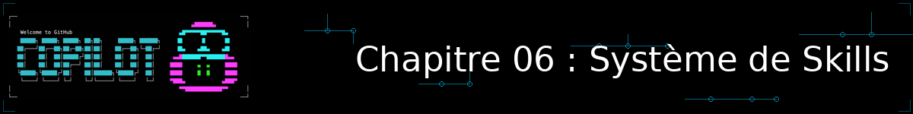
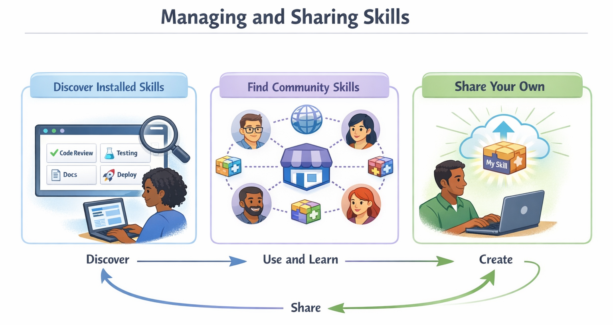
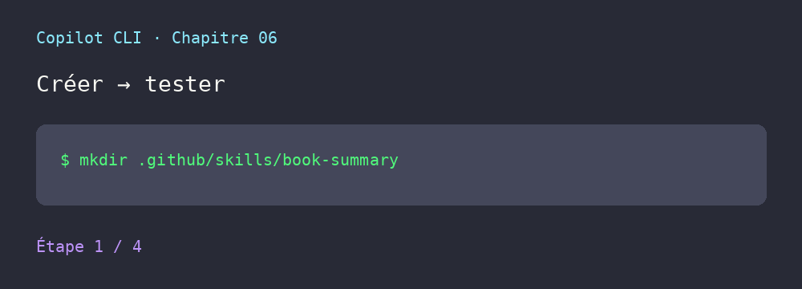
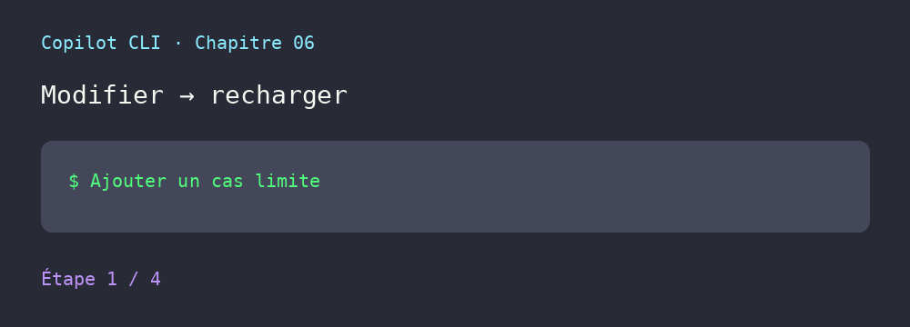
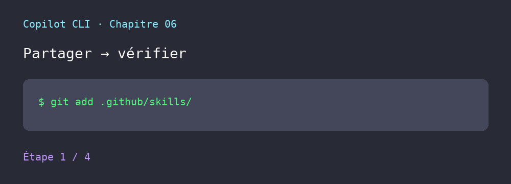

<!--
---
id: CopilotCLI-06
title: !translate Automatiser les tâches répétitives
description: !translate Créez et utilisez des Agent Skills pour que GitHub Copilot CLI applique automatiquement des instructions spécifiques aux tâches et les bonnes pratiques de votre équipe.
audience: Developers / Students / Terminal users
slug: automate-repetitive-tasks
weight: 7
---
-->



> **Et si Copilot pouvait appliquer automatiquement les bonnes pratiques de votre équipe sans que vous ayez à les expliquer à chaque fois ?**

Dans ce chapitre, vous allez découvrir les Agent Skills : des dossiers d'instructions que Copilot charge automatiquement lorsqu'ils sont pertinents pour votre tâche. Alors que les agents changent *la façon dont* Copilot réfléchit, les skills apprennent à Copilot *des manières spécifiques d'accomplir des tâches*. Vous allez créer un skill d'audit de sécurité que Copilot applique dès que vous parlez de sécurité, construire des critères de revue standardisés pour l'équipe garantissant une qualité de code homogène, et apprendre comment les skills fonctionnent à la fois dans Copilot CLI, VS Code et l'agent cloud GitHub Copilot.


## 🎯 Objectifs d'apprentissage

À la fin de ce chapitre, vous serez capable de :

- Comprendre le fonctionnement des Agent Skills et savoir quand les utiliser
- Créer des skills personnalisés avec des fichiers SKILL.md
- Utiliser des skills communautaires provenant de dépôts partagés
- Savoir quand utiliser les skills plutôt que les agents ou MCP

> ⏱️ **Durée estimée** : ~55 minutes (20 min de lecture + 35 min de pratique)

---

## 🧩 Analogie du monde réel : les outils électroportatifs

Une perceuse polyvalente est utile, mais des accessoires spécialisés la rendent encore plus puissante.


Les skills fonctionnent de la même manière. Tout comme on change de mèche selon le travail à faire, vous pouvez ajouter des skills à Copilot pour différentes tâches :

| Accessoire (Skill) | Objectif |
|------------|---------|
| `commit` | Générer des messages de commit cohérents |
| `security-audit` | Vérifier les vulnérabilités OWASP |
| `generate-tests` | Créer des tests pytest complets |
| `code-checklist` | Appliquer les standards de qualité de code de l'équipe |


*Les skills sont des accessoires spécialisés qui étendent ce que Copilot peut faire*

---

# Comment fonctionnent les skills


Découvrez ce que sont les skills, pourquoi ils sont importants, et en quoi ils diffèrent des agents et de MCP.

---

## *Nouveau avec les skills ?* Commencez ici !

1. **Voyez quels skills sont déjà disponibles :**
   ```bash
   copilot
   > /skills list
   ```
   Cela affiche tous les skills que Copilot peut trouver, y compris les **skills intégrés** livrés avec le CLI lui-même, ainsi que les skills issus de vos dossiers projet et personnel.

   > 💡 **Skills intégrés** : Copilot CLI est livré avec des skills préinstallés d'origine. Par exemple, le skill `customizing-copilot-cloud-agents-environment` fournit un guide pour personnaliser l'environnement de l'agent cloud Copilot. Vous n'avez rien besoin de créer ou d'installer pour les utiliser. Lancez `/skills list` pour voir ce qui est disponible.

2. **Regardez un vrai fichier de skill :** Consultez notre exemple [code-checklist SKILL.md](../.github/skills/code-checklist/SKILL.md) pour voir le modèle. Ce n'est qu'un frontmatter YAML suivi d'instructions en markdown.

3. **Comprenez le concept central :** les skills sont des instructions spécifiques à une tâche que Copilot charge *automatiquement* lorsque votre prompt correspond à la description du skill. Vous n'avez pas besoin de les activer, il suffit de poser votre question naturellement.


## Comprendre les skills

Les Agent Skills sont des dossiers contenant des instructions, des scripts et des ressources que Copilot **charge automatiquement lorsque cela est pertinent** pour votre tâche. Copilot lit votre prompt, vérifie si un skill correspond, et applique automatiquement les instructions pertinentes.

```bash
copilot

> Check books.py against our quality checklist
# Copilot détecte que cela correspond à votre skill "code-checklist"
# et applique automatiquement sa checklist qualité Python

> Generate tests for the BookCollection class
# Copilot charge votre skill "pytest-gen"
# et applique la structure de test que vous préférez

> What are the code quality issues in this file?
# Copilot charge votre skill "code-checklist"
# et vérifie par rapport aux standards de votre équipe
```

> 💡 **Point clé** : les skills sont **déclenchés automatiquement** lorsque votre prompt correspond à la description du skill. Il suffit de poser votre question naturellement, Copilot applique les skills pertinents en coulisses. Vous pouvez aussi invoquer les skills directement, comme vous l'apprendrez ensuite.

> 🧰 **Modèles prêts à l'emploi** : consultez le dossier [.github/skills](../.github/skills/) pour des skills simples à copier-coller et à essayer.

### Invocation directe via une commande slash

Bien que le déclenchement automatique soit le mode de fonctionnement principal des skills, vous pouvez aussi **invoquer un skill directement** en utilisant son nom comme commande slash :

```bash
> /generate-tests Create tests for the user authentication module

> /code-checklist Check books.py for code quality issues

> /security-audit Check the API endpoints for vulnerabilities
```

Cela vous donne un contrôle explicite lorsque vous voulez garantir qu'un skill précis est utilisé.

#### Combiner plusieurs skills dans un même message

Vous pouvez invoquer **plus d'un skill dans un seul message**, et la commande slash du skill peut apparaître n'importe où dans votre prompt — pas seulement au début. C'est pratique lorsque vous voulez effectuer deux vérifications différentes en une seule fois :

```bash
> Check @samples/book-app-project/book_app.py with /code-checklist and also run /generate-tests for it

> Review the auth module /security-audit then /code-checklist the result
```

Copilot appliquera chaque skill nommé dans la même réponse, ce qui vous évite d'envoyer plusieurs messages séparés.

> 💡 **Astuce** : placez les commandes slash des skills là où elles vous semblent le plus naturelles dans votre phrase. Vous pouvez les mettre au début, au milieu ou à la fin de votre message.

> 📝 **Skills vs invocation d'agents** : ne confondez pas l'invocation d'un skill avec l'invocation d'un agent :
> - **Skills** : `/nom-du-skill <prompt>`, par ex. `/code-checklist Check this file`
> - **Agents** : `/agent` (sélection dans une liste) ou `copilot --agent <nom>` (ligne de commande)
>
> Si vous avez à la fois un skill et un agent portant le même nom (par ex. « code-reviewer »), taper `/code-reviewer` invoque le **skill**, pas l'agent.

### Comment savoir qu'un skill a été utilisé ?

Vous pouvez le demander directement à Copilot :

```bash
> What skills did you use for that response?

> What skills do you have available for security reviews?
```

### Skills vs Agents vs MCP

Les skills ne sont qu'un élément du modèle d'extensibilité de GitHub Copilot. Voici comment ils se comparent aux agents et aux serveurs MCP.

> *Ne vous inquiétez pas encore de MCP. Nous le couvrirons au [Chapitre 07](../07-mcp-servers/). Il est mentionné ici pour que vous puissiez voir comment les skills s'intègrent dans l'ensemble.*


| Fonctionnalité | Ce qu'elle fait | Quand l'utiliser |
|---------|--------------|-------------|
| **Agents** | Change la façon dont l'IA réfléchit | Besoin d'une expertise spécialisée sur de nombreuses tâches |
| **Skills** | Fournit des instructions spécifiques à une tâche | Tâches spécifiques et répétitives avec des étapes détaillées |
| **MCP** | Connecte des services externes | Besoin de données en direct provenant d'API |

Utilisez les agents pour une expertise large, les skills pour des instructions de tâches spécifiques, et MCP pour les données externes. Un agent peut utiliser un ou plusieurs skills au cours d'une conversation. Par exemple, lorsque vous demandez à un agent de vérifier votre code, il peut appliquer automatiquement à la fois un skill `security-audit` et un skill `code-checklist`.

> 📚 **Pour aller plus loin** : consultez la documentation officielle [About Agent Skills](https://docs.github.com/copilot/concepts/agents/about-agent-skills) pour la référence complète des formats de skills et des bonnes pratiques.

---

## Des prompts manuels à l'expertise automatique

Avant de voir comment créer des skills, voyons *pourquoi* ils valent la peine d'être appris. Une fois que vous aurez constaté les gains en cohérence, le « comment » prendra tout son sens.

### Avant les skills : des revues incohérentes

À chaque revue de code, vous risquez d'oublier quelque chose :

```bash
copilot

> Review this code for issues
# Revue générique - pourrait manquer les préoccupations spécifiques de votre équipe
```

Ou vous écrivez un long prompt à chaque fois :

```bash
> Review this code checking for bare except clauses, missing type hints,
> mutable default arguments, missing context managers for file I/O,
> functions over 50 lines, print statements in production code...
```

Temps : **plus de 30 secondes** pour le taper. Cohérence : **variable selon la mémoire**.

### Après les skills : bonnes pratiques automatiques

Avec un skill `code-checklist` installé, il suffit de demander naturellement :

```bash
copilot

> Check the book collection code for quality issues
```

**Ce qui se passe en coulisses** :
1. Copilot détecte « qualité de code » et « problèmes » dans votre prompt
2. Il vérifie les descriptions des skills, trouve que votre skill `code-checklist` correspond
3. Il charge automatiquement la checklist qualité de votre équipe
4. Il applique toutes les vérifications sans que vous ayez à les énumérer


*Il suffit de demander naturellement. Copilot fait correspondre votre prompt au bon skill et l'applique automatiquement.*

**Résultat** :
```
## Code Checklist: books.py

### Code Quality
- [PASS] All functions have type hints
- [PASS] No bare except clauses
- [PASS] No mutable default arguments
- [PASS] Context managers used for file I/O
- [PASS] Functions are under 50 lines
- [PASS] Variable and function names follow PEP 8

### Input Validation
- [FAIL] User input is not validated - add_book() accepts any year value
- [FAIL] Edge cases not fully handled - empty strings accepted for title/author
- [PASS] Error messages are clear and helpful

### Testing
- [FAIL] No corresponding pytest tests found

### Summary
3 items need attention before merge
```

**La différence** : les standards de votre équipe sont appliqués automatiquement, à chaque fois, sans avoir à les taper.

---

<details>
<summary>🎬 Voyez-le en action !</summary>


*Le résultat de la démo peut varier. Votre modèle, vos outils et vos réponses différeront de ce qui est montré ici.*

</details>

---

## Cohérence à grande échelle : le skill de revue de PR d'équipe

Imaginez que votre équipe ait une checklist de PR en 10 points. Sans skill, chaque développeur doit se souvenir des 10 points, et il y en a toujours un qui en oublie un. Avec un skill `pr-review`, toute l'équipe obtient des revues cohérentes :

```bash
copilot

> Can you review this PR?
```

Copilot charge automatiquement le skill `pr-review` de votre équipe et vérifie les 10 points :

```
PR Review: feature/user-auth

## Security ✅
- No hardcoded secrets
- Input validation present
- No bare except clauses

## Code Quality ⚠️
- [WARN] print statement on line 45 - remove before merge
- [WARN] TODO on line 78 missing issue reference
- [WARN] Missing type hints on public functions

## Testing ✅
- New tests added
- Edge cases covered

## Documentation ❌
- [FAIL] Breaking change not documented in CHANGELOG
- [FAIL] API changes need OpenAPI spec update
```

**La puissance de l'approche** : chaque membre de l'équipe applique automatiquement les mêmes standards. Les nouvelles recrues n'ont pas besoin de mémoriser la checklist, car le skill s'en charge.

---

# Créer des skills personnalisés


Construisez vos propres skills à partir de fichiers SKILL.md.

---

## Emplacements des skills

Les skills sont stockés dans `.github/skills/` (spécifique au projet) ou `~/.copilot/skills/` (niveau utilisateur).

### Comment Copilot trouve les skills

Copilot scanne automatiquement ces emplacements à la recherche de skills :

| Emplacement | Portée |
|----------|-------|
| `.github/skills/` | Spécifique au projet (partagé avec l'équipe via git) |
| `~/.copilot/skills/` | Spécifique à l'utilisateur (vos skills personnels) |

### Structure d'un skill

Chaque skill vit dans son propre dossier avec un fichier `SKILL.md`. Vous pouvez éventuellement y inclure des scripts, des exemples ou d'autres ressources :

```
.github/skills/
└── my-skill/
    ├── SKILL.md           # Obligatoire : définition et instructions du skill
    ├── examples/          # Optionnel : fichiers d'exemple que Copilot peut référencer
    │   └── sample.py
    └── scripts/           # Optionnel : scripts que le skill peut utiliser
        └── validate.sh
```

> 💡 **Astuce** : le nom du dossier doit correspondre au `name` défini dans le frontmatter de votre SKILL.md (en minuscules, avec des traits d'union).

### Format du fichier SKILL.md

Les skills utilisent un format markdown simple avec un frontmatter YAML :

```markdown
---
name: code-checklist
description: Comprehensive code quality checklist with security, performance, and maintainability checks
license: MIT
---

# Code Checklist

When checking code, look for:

## Security
- SQL injection vulnerabilities
- XSS vulnerabilities
- Authentication/authorization issues
- Sensitive data exposure

## Performance
- N+1 query problems (running one query per item instead of one query for all items)
- Unnecessary loops or computations
- Memory leaks
- Blocking operations

## Maintainability
- Function length (flag functions > 50 lines)
- Code duplication
- Missing error handling
- Unclear naming

## Output Format
Provide issues as a numbered list with severity:
- [CRITICAL] - Must fix before merge
- [HIGH] - Should fix before merge
- [MEDIUM] - Should address soon
- [LOW] - Nice to have
```

**Propriétés YAML :**

| Propriété | Obligatoire | Description |
|----------|----------|-------------|
| `name` | **Oui** | Identifiant unique (minuscules, traits d'union pour les espaces) |
| `description` | **Oui** | Ce que fait le skill et quand Copilot doit l'utiliser |
| `license` | Non | Licence applicable à ce skill |
| `argument-hint` | Non | Court indice affiché aux utilisateurs décrivant l'argument attendu par le skill (par ex. `"file path or code snippet"`) |

> 💡 **Qu'est-ce que `argument-hint` ?** Lorsque les utilisateurs invoquent un skill directement (par ex. `/security-audit`), le texte `argument-hint` apparaît comme un texte indicatif suggérant quoi taper ensuite — un peu comme une mini-aide. Par exemple, définir `argument-hint: "file path to review"` indique à l'utilisateur de fournir un chemin de fichier après le nom du skill.

> 📖 **Documentation officielle** : [About Agent Skills](https://docs.github.com/copilot/concepts/agents/about-agent-skills)

### Créer votre premier skill

Construisons un skill d'audit de sécurité qui vérifie les vulnérabilités du Top 10 OWASP :

```bash
# Créer le dossier du skill
mkdir -p .github/skills/security-audit

# Créer le fichier SKILL.md
cat > .github/skills/security-audit/SKILL.md << 'EOF'
---
name: security-audit
description: Security-focused code review checking OWASP (Open Web Application Security Project) Top 10 vulnerabilities
---

# Security Audit

Perform a security audit checking for:

## Injection Vulnerabilities
- SQL injection (string concatenation in queries)
- Command injection (unsanitized shell commands)
- LDAP injection
- XPath injection

## Authentication Issues
- Hardcoded credentials
- Weak password requirements
- Missing rate limiting
- Session management flaws

## Sensitive Data
- Plaintext passwords
- API keys in code
- Logging sensitive information
- Missing encryption

## Access Control
- Missing authorization checks
- Insecure direct object references
- Path traversal vulnerabilities

## Output
For each issue found, provide:
1. File and line number
2. Vulnerability type
3. Severity (CRITICAL/HIGH/MEDIUM/LOW)
4. Recommended fix
EOF

# Testez votre skill (les skills se chargent automatiquement selon votre prompt)
copilot

> @samples/book-app-project/ Check this code for security vulnerabilities
# Copilot détecte que "security vulnerabilities" correspond à votre skill
# et applique automatiquement sa checklist OWASP
```

**Résultat attendu** (vos résultats varieront) :

```
Security Audit: book-app-project

[HIGH] Hardcoded file path (book_app.py, line 12)
  File path is hardcoded rather than configurable
  Fix: Use environment variable or config file

[MEDIUM] No input validation (book_app.py, line 34)
  User input passed directly to function without sanitization
  Fix: Add input validation before processing

✅ No SQL injection found
✅ No hardcoded credentials found
```

---

## Écrire de bonnes descriptions de skill

Le champ `description` de votre SKILL.md est crucial ! C'est ce sur quoi Copilot se base pour décider de charger votre skill :

```markdown
---
name: security-audit
description: Use for security reviews, vulnerability scanning,
  checking for SQL injection, XSS, authentication issues,
  OWASP Top 10 vulnerabilities, and security best practices
---
```

> 💡 **Astuce** : incluez des mots-clés qui correspondent à la façon dont vous posez naturellement vos questions. Si vous dites « revue de sécurité », incluez « revue de sécurité » dans la description.

### Description vague ou description exploitable ?

La description sert de **signal de découverte**. Elle doit indiquer le domaine, l'action et les formulations auxquelles le skill répond :

```yaml
# Trop vague : Copilot ne sait pas quand le proposer
description: Reviews code

# Exploitable : le domaine et les mots-clés sont explicites
description: Use for Python code reviews, code quality checks,
  bug finding, security issues, and best-practice violations
```

Testez les deux formulations avec des prompts proches, puis demandez :

```text
What skills did you use for that response?
```

La correspondance n'est pas une garantie : un prompt ambigu, un skill désactivé ou des instructions concurrentes peuvent empêcher le chargement. Dans ce cas, utilisez l'invocation directe et vérifiez `/skills info <name>`.

### Combiner les skills avec les agents

Les skills et les agents fonctionnent ensemble. L'agent apporte l'expertise, le skill apporte des instructions spécifiques :

```bash
# Démarrez avec un agent code-reviewer
copilot --agent code-reviewer

> Check the book app for quality issues
# L'expertise de l'agent code-reviewer se combine
# avec la checklist de votre skill code-checklist
```

---

# Gérer et partager les skills

Découvrez les skills installés, trouvez des skills communautaires, et partagez les vôtres.



## Le cycle de vie d'un skill

Un skill fiable n'est pas seulement un fichier créé une fois. Traitez-le comme une petite fonctionnalité d'équipe :

1. **Créer** : choisissez un nom en kebab-case, écrivez un frontmatter valide et des instructions ciblées.
2. **Tester** : testez le déclenchement automatique, puis le format de sortie et les cas limites.
3. **Modifier** : améliorez la description ou les instructions à partir d'un résultat réel, puis rechargez le skill.
4. **Partager** : copiez le skill dans `.github/skills/` pour l'équipe, documentez son objectif et relisez-le avant de le publier.
5. **Maintenir** : vérifiez régulièrement les commandes, les permissions et les dépendances externes.

### 1. Créer et tester localement

```bash
mkdir -p .github/skills/book-summary
cat > .github/skills/book-summary/SKILL.md << 'EOF'
---
name: book-summary
description: Generate a markdown summary of a book collection with title, author, year, and reading status
---

# Book Summary

When the user asks for a book collection summary:

- Read the supplied collection before writing the result.
- Sort books by year, oldest first.
- Use a Markdown table with title, author, year, and status columns.
- Use ✅ for read books and ❌ for unread books.
- Flag missing authors or invalid years instead of inventing values.
EOF

copilot
> @samples/book-app-project/data.json Summarize this book collection
> /skills reload
> /skills info book-summary
```

Testez toujours les deux chemins : un prompt naturel pour le déclenchement automatique, puis `/book-summary ...` pour vérifier l'invocation explicite. Un résultat plausible ne suffit pas : vérifiez aussi que le format demandé et les cas limites apparaissent réellement.

<details>
<summary>🎬 Voir le cycle créer → tester</summary>



</details>

### 2. Modifier sans perdre le contexte

Après une première utilisation, modifiez `SKILL.md` pour corriger une ambiguïté ou ajouter un cas limite, puis rechargez-le :

```bash
vi .github/skills/book-summary/SKILL.md

copilot
> /skills reload
> /skills info book-summary
> @samples/book-app-project/data.json Summarize this collection and flag invalid years
```

Le rechargement relit les fichiers de skills ; il ne remplace pas un test fonctionnel. Conservez un exemple de prompt et un résultat attendu dans la documentation de votre équipe.

<details>
<summary>🎬 Voir une modification rechargée</summary>



</details>

### 3. Partager avec une équipe

Pour un skill interne, commitez le dossier dans `.github/skills/` et partagez-le avec le dépôt. Pour un skill réutilisable dans plusieurs projets, publiez son dossier dans un dépôt dédié et indiquez sa portée :

```bash
git add .github/skills/book-summary/SKILL.md
git diff --staged --check
git diff --staged -- .github/skills/book-summary/SKILL.md
```

Avant de partager, vérifiez que les deux copies pédagogiques restent identiques lorsqu'un exemple existe dans `samples/skills/` :

```bash
diff -u .github/skills/code-checklist/SKILL.md samples/skills/code-checklist/SKILL.md
```

Une différence non voulue entre ces fichiers enseigne deux comportements différents. Le dépôt source doit rester la référence ; copiez ensuite le fichier vers `samples/skills/` et contrôlez la différence.

<details>
<summary>🎬 Voir le partage et la vérification</summary>



</details>

## Sécurité avant d'installer ou de partager

Un skill contient des instructions que Copilot peut suivre. Il peut donc influencer les fichiers modifiés, les commandes proposées et les outils utilisés. Considérez tout skill externe comme du code à auditer :

```text
Checklist de sécurité d'un skill

[ ] Source identifiée : dépôt, auteur, licence et date de mise à jour vérifiés
[ ] SKILL.md lu intégralement avant l'installation
[ ] Aucune commande destructive ou obfusquée (rm, curl | sh, téléchargement inattendu)
[ ] Aucune demande de secret, token, mot de passe ou variable d'environnement sensible
[ ] Aucune instruction demandant de contourner les confirmations ou les protections
[ ] Permissions et chemins limités au besoin réel du skill
[ ] Scripts et dépendances externes inspectés, pas seulement le frontmatter
[ ] Test effectué dans une branche ou un répertoire isolé
[ ] Résultat vérifié avec git diff et git status après le test
[ ] Suppression possible avec copilot skill remove <name> si le skill n'est plus nécessaire
```

Préférez une source versionnée et relisez les changements avant toute mise à jour. Ne transmettez jamais de secret dans un prompt pour « tester » un skill. Si le contenu est ambigu, ne l'installez pas : demandez une version documentée à l'auteur ou écrivez votre propre skill minimal.

Pour un skill local, commencez par l'inspecter sans l'exécuter :

```bash
sed -n '1,240p' .github/skills/book-summary/SKILL.md
git diff --check
```

Pour un skill communautaire, vérifiez d'abord sa source puis installez-le dans la portée minimale avec `copilot skill add --project`. Si cette sous-commande n'est pas disponible, mettez Copilot CLI à jour avec `copilot update` ou téléchargez le dossier dans un répertoire temporaire, lisez `SKILL.md`, puis copiez uniquement le contenu audité vers `.github/skills/`.

> ⚠️ **Règle pratique** : un skill ne doit pas demander à Copilot d'exécuter une commande que vous ne comprendriez pas ou que vous n'accepteriez pas d'exécuter vous-même. Les GIFs de ce chapitre illustrent le flux ; ils ne remplacent pas cette revue humaine.

---

## Gérer les skills : le tableau de bord unifié

> 🆕 **Depuis Copilot CLI v1.0.81** : le **tableau de bord des plugins** (« plugins dashboard ») est disponible pour tout le monde. Taper `/plugin`, `/mcp` ou `/skills` **sans argument** ouvre désormais la **même interface unifiée** : un gestionnaire commun listant vos skills, vos agents personnalisés, vos serveurs MCP et vos plugins installés, avec des indicateurs lorsqu'une mise à jour est disponible. L'ancienne commande `/plugins` (au pluriel), qui servait de point d'entrée séparé, a été **supprimée** ; ses fonctions sont désormais réparties entre `/plugin` (plugins), `/mcp` (serveurs MCP), `/skills` (skills), `/subagents` (agents personnalisés) et `/instructions` (fichiers d'instructions).

Ce tableau de bord est le point d'entrée principal pour gérer vos skills. Vous pouvez y accéder de deux façons, qui agissent toutes deux sur les mêmes données :

### Option 1 : ouvrir le tableau de bord (interface principale)

Depuis une session Copilot, tapez l'une de ces commandes sans argument — les trois ouvrent la même interface :

```bash
copilot

> /skills
> /plugin
> /mcp
```

Vous y parcourez skills (intégrés, projet, utilisateur), agents personnalisés, serveurs MCP et plugins installés, vous voyez lesquels sont activés/désactivés, et vous repérez d'un coup d'œil les mises à jour disponibles.

> 🆕 **Mises à jour** *(depuis v1.0.81)* : `/plugin` signale désormais quand une mise à jour est disponible pour un plugin ou une marketplace installée, avec une action **« Update »** pour la récupérer directement. Les plugins de première partie fournis par GitHub se mettent à jour **automatiquement au démarrage de session**, sans action de votre part — seuls les plugins communautaires nécessitent encore une mise à jour manuelle (voir plus bas).

### Option 2 : les commandes texte (raccourcis toujours valables)

Si vous préférez rester au clavier sans naviguer dans une interface, les commandes texte historiques fonctionnent toujours. Ce ne sont pas une gestion séparée : ce sont des raccourcis directs vers les actions du même tableau de bord — pratiques pour le scripting, les vérifications rapides, ou pour ajouter des skills avant de commencer à travailler.

#### `copilot skill` (commande terminal)

La sous-commande `copilot skill` vous permet de gérer les skills directement depuis votre terminal, sans ouvrir de session Copilot interactive.

```bash
# Voir tous les skills installés
copilot skill list

# Ajouter un skill depuis un fichier local, une URL ou un dossier
copilot skill add .github/skills/my-skill/SKILL.md
copilot skill add https://example.com/skills/security-audit/SKILL.md

# Supprimer un skill par son nom
copilot skill remove security-audit
```

#### `/skills` en texte (dans une session Copilot, raccourci `/skill`)

En session, passez un argument à `/skills` pour agir directement sur une entrée du tableau de bord sans y naviguer :

| Commande | Ce qu'elle fait |
|---------|--------------|
| `/skills list` | Affiche tous les skills installés |
| `/skills info <name>` | Obtient des détails sur un skill spécifique |
| `/skills add <name>` | Active un skill (depuis un dépôt ou une marketplace) |
| `/skills remove <name>` | Désactive ou désinstalle un skill |
| `/skills reload` | Recharge les skills après modification des fichiers SKILL.md |

> 💡 **Raccourci `/skill`** : vous pouvez taper `/skill` au lieu de `/skills` — ils sont interchangeables. Par exemple, `/skill list` fonctionne comme `/skills list`.

> 💡 **Rappel** : vous n'avez pas besoin d'« activer » les skills pour chaque prompt. Une fois installés, les skills sont **déclenchés automatiquement** lorsque votre prompt correspond à leur description. Le tableau de bord et ces commandes servent à gérer les skills disponibles, pas à les utiliser.

### Exemple : afficher vos skills

```bash
# Depuis le terminal (aucune session interactive requise) :
copilot skill list

Project skills:
- security-audit: Security-focused code review checking OWASP Top 10
- generate-tests: Generate comprehensive unit tests with edge cases
- code-checklist: Team code quality checklist (disabled)
...

# Ou depuis une session Copilot :
copilot

> /skills list

Project skills:
- security-audit: Security-focused code review checking OWASP Top 10
- generate-tests: Generate comprehensive unit tests with edge cases
- code-checklist: Team code quality checklist (disabled)
...

> /skills info security-audit

Skill: security-audit
Source: Project
Location: .github/skills/security-audit/SKILL.md
Description: Security-focused code review checking OWASP Top 10 vulnerabilities
```

> 💡 **Skills désactivés** : les skills marqués `(disabled)` sont installés mais pas actuellement actifs. Ils ne seront pas déclenchés par les prompts tant qu'ils ne sont pas réactivés. Cela peut arriver si le fichier `SKILL.md` d'un skill a un problème de configuration, ou si le skill a été explicitement désactivé. Vous pouvez activer/désactiver des skills en lançant `/skills`.

---

<details>
<summary>Voyez-le en action !</summary>


*Le résultat de la démo peut varier. Votre modèle, vos outils et vos réponses différeront de ce qui est montré ici.*

</details>

---

### Quand utiliser `/skills reload`

Après avoir créé ou modifié le fichier SKILL.md d'un skill, lancez `/skills reload` pour prendre en compte les changements sans redémarrer Copilot :

```bash
# Modifiez votre fichier de skill
# Puis dans Copilot :
> /skills reload
Skills reloaded successfully.
```

> 💡 **Bon à savoir** : les skills restent effectifs même après avoir utilisé `/compact` pour résumer l'historique de votre conversation. Aucun rechargement n'est nécessaire après un compactage.

---

## Trouver et utiliser des skills communautaires

### Utiliser les plugins pour installer des skills

> 💡 **Que sont les plugins ?** Les plugins sont des paquets installables qui peuvent regrouper des skills, des agents et des configurations de serveurs MCP ensemble. Voyez-les comme des extensions « app store » pour Copilot CLI.

Comme vu plus haut, `/plugin` sans argument ouvre le tableau de bord unifié. Il accepte aussi des sous-commandes texte pour parcourir et installer ces paquets directement :

```bash
copilot

> /plugin list
# Affiche les plugins installés (mêmes informations que dans le tableau de bord)

> /plugin marketplace
# Parcourt les plugins disponibles

> /plugin install <plugin-name>
# Installe un plugin depuis la marketplace
```

Pour garder votre catalogue local de plugins communautaires à jour, actualisez-le avec :

```bash
copilot plugin marketplace update
```

> 🆕 **Mises à jour automatiques et manuelles** *(depuis v1.0.81)* : les plugins **de première partie** (fournis par GitHub) se mettent à jour automatiquement à chaque démarrage de session — rien à faire de votre côté. Pour les autres plugins, `/plugin` affiche désormais un indicateur de mise à jour disponible et propose une action **« Update »** directement dans le tableau de bord.

Les plugins peuvent regrouper plusieurs fonctionnalités ensemble. Un seul plugin peut inclure des skills, des agents et des configurations de serveurs MCP liés qui fonctionnent ensemble.

### Dépôts de skills communautaires

Des skills prêts à l'emploi sont également disponibles auprès de dépôts communautaires :

- **[Awesome Copilot](https://github.com/github/awesome-copilot)** - Ressources officielles GitHub Copilot incluant la documentation et des exemples de skills

### Installer un skill communautaire avec Copilot CLI

La commande `copilot skill add` accepte un fichier local, un dossier de skills ou une URL HTTPS :

```bash
# Installer dans votre espace personnel après avoir audité le fichier
copilot skill add https://example.com/skills/security-audit/SKILL.md

# Enregistrer un skill dans le projet pour le partager avec l'équipe
copilot skill add --project ./security-audit/SKILL.md
```

Pour un skill hébergé dans un dépôt GitHub, clonez ou téléchargez d'abord le dépôt dans un répertoire temporaire, lisez `SKILL.md` et inspectez les scripts associés, puis utilisez `copilot skill add --project` sur le fichier validé. Si `copilot skill add` n'est pas disponible dans votre version, mettez Copilot CLI à jour avec `copilot update` ou copiez manuellement le dossier audité dans `.github/skills/`.

Un skill ajouté de cette façon apparaît ensuite avec les autres skills dans `/skills` (ou `/skills list`).

> ⚠️ **À vérifier avant l'installation** : lisez toujours le `SKILL.md` d'un skill avant de l'installer. Les skills contrôlent ce que fait Copilot, et un skill malveillant pourrait lui demander d'exécuter des commandes dangereuses ou de modifier du code de façon inattendue.

---

# Pratique


Mettez en pratique ce que vous avez appris en construisant et en testant vos propres skills.

---

## ▶️ Essayez par vous-même

### Construire davantage de skills

Voici deux skills supplémentaires illustrant des modèles différents. Suivez le même flux `mkdir` + `cat` que dans « Créer votre premier skill » ci-dessus, ou copiez-collez les skills à l'emplacement approprié. D'autres exemples sont disponibles dans [.github/skills](../.github/skills).

### Skill de génération de tests pytest

Un skill qui garantit une structure pytest cohérente dans votre base de code :

```bash
mkdir -p .github/skills/pytest-gen

cat > .github/skills/pytest-gen/SKILL.md << 'EOF'
---
name: pytest-gen
description: Generate comprehensive pytest tests with fixtures and edge cases
---

# pytest Test Generation

Generate pytest tests that include:

## Test Structure
- Use pytest conventions (test_ prefix)
- One assertion per test when possible
- Clear test names describing expected behavior
- Use fixtures for setup/teardown

## Coverage
- Happy path scenarios
- Edge cases: None, empty strings, empty lists
- Boundary values
- Error scenarios with pytest.raises()

## Fixtures
- Use @pytest.fixture for reusable test data
- Use tmpdir/tmp_path for file operations
- Mock external dependencies with pytest-mock

## Output
Provide complete, runnable test file with proper imports.
EOF
```

### Skill de revue de PR d'équipe

Un skill qui impose des standards de revue de PR cohérents dans votre équipe :

```bash
mkdir -p .github/skills/pr-review

cat > .github/skills/pr-review/SKILL.md << 'EOF'
---
name: pr-review
description: Team-standard PR review checklist
---

# PR Review

Review code changes against team standards:

## Security Checklist
- [ ] No hardcoded secrets or API keys
- [ ] Input validation on all user data
- [ ] No bare except clauses
- [ ] No sensitive data in logs

## Code Quality
- [ ] Functions under 50 lines
- [ ] No print statements in production code
- [ ] Type hints on public functions
- [ ] Context managers for file I/O
- [ ] No TODOs without issue references

## Testing
- [ ] New code has tests
- [ ] Edge cases covered
- [ ] No skipped tests without explanation

## Documentation
- [ ] API changes documented
- [ ] Breaking changes noted
- [ ] README updated if needed

## Output Format
Provide results as:
- ✅ PASS: Items that look good
- ⚠️ WARN: Items that could be improved
- ❌ FAIL: Items that must be fixed before merge
EOF
```

### Aller plus loin

1. **Défi de création de skill** : créez un skill `quick-review` qui effectue une checklist en 3 points :
   - Clauses `except` génériques (bare except)
   - Annotations de type manquantes
   - Noms de variables peu clairs

   Testez-le en demandant : « Do a quick review of books.py »

2. **Comparaison de skills** : chronométrez-vous en écrivant manuellement un prompt de revue de sécurité détaillé. Puis demandez simplement « Check for security issues in this file » et laissez votre skill security-audit se charger automatiquement. Combien de temps le skill vous a-t-il fait gagner ?

3. **Défi d'équipe** : pensez à la checklist de revue de code de votre équipe. Pourriez-vous l'encoder sous forme de skill ? Notez 3 choses que le skill devrait toujours vérifier.

**Auto-évaluation** : vous comprenez les skills lorsque vous pouvez expliquer pourquoi le champ `description` est important (c'est ce sur quoi Copilot se base pour décider de charger votre skill).

---

## 📝 Devoir

### Défi principal : construire un skill de résumé de livres

Les exemples ci-dessus ont créé les skills `pytest-gen` et `pr-review`. Entraînez-vous maintenant à créer un type de skill complètement différent : un skill pour générer une sortie formatée à partir de données.

1. Listez vos skills actuels : lancez Copilot et passez-lui `/skills list`. Vous pouvez aussi utiliser `ls .github/skills/` pour voir les skills du projet ou `ls ~/.copilot/skills/` pour les skills personnels.
2. Créez un skill `book-summary` dans `.github/skills/book-summary/SKILL.md` qui génère un résumé markdown formaté de la collection de livres
3. Votre skill doit avoir :
   - Un nom et une description clairs (la description est cruciale pour la correspondance !)
   - Des règles de mise en forme spécifiques (par ex. un tableau markdown avec titre, auteur, année, statut de lecture)
   - Des conventions de sortie (par ex. utiliser ✅/❌ pour le statut de lecture, trier par année)
4. Testez le skill : `@samples/book-app-project/data.json Summarize the books in this collection`
5. Vérifiez que le skill se déclenche automatiquement en consultant `/skills list`
6. Essayez de l'invoquer directement avec `/book-summary Summarize the books in this collection`

**Critères de réussite** : vous disposez d'un skill `book-summary` fonctionnel que Copilot applique automatiquement lorsque vous posez une question sur la collection de livres.

<details>
<summary>💡 Indices (cliquez pour développer)</summary>

**Modèle de départ** : créez `.github/skills/book-summary/SKILL.md` :

```markdown
---
name: book-summary
description: Generate a formatted markdown summary of a book collection
---

# Book Summary Generator

Generate a summary of the book collection following these rules:

1. Output a markdown table with columns: Title, Author, Year, Status
2. Use ✅ for read books and ❌ for unread books
3. Sort by year (oldest first)
4. Include a total count at the bottom
5. Flag any data issues (missing authors, invalid years)

Example:
| Title | Author | Year | Status |
|-------|--------|------|--------|
| 1984 | George Orwell | 1949 | ✅ |
| Dune | Frank Herbert | 1965 | ❌ |

**Total: 2 books (1 read, 1 unread)**
```

**Testez-le :**
```bash
copilot
> @samples/book-app-project/data.json Summarize the books in this collection
# Le skill devrait se déclencher automatiquement en fonction de la correspondance de description
```

**S'il ne se déclenche pas :** essayez `/skills reload` puis redemandez.

</details>

### Défi bonus : skill de message de commit

1. Créez un skill `commit-message` qui génère des messages de commit conventionnels avec un format cohérent
2. Testez-le en indexant une modification et en demandant : « Generate a commit message for my staged changes »
3. Documentez votre skill et partagez-le sur GitHub avec le tag `copilot-skill`

---

<details>
<summary>🔧 <strong>Erreurs courantes et dépannage</strong> (cliquez pour développer)</summary>

### Erreurs courantes

| Erreur | Ce qui se passe | Correction |
|---------|--------------|-----|
| Nommer le fichier autrement que `SKILL.md` | Le skill ne sera pas reconnu | Le fichier doit s'appeler exactement `SKILL.md` |
| Champ `description` vague | Le skill n'est jamais chargé automatiquement | La description est le MÉCANISME DE DÉCOUVERTE PRINCIPAL. Utilisez des mots-clés déclencheurs spécifiques |
| `name` ou `description` manquant dans le frontmatter | Le skill ne se charge pas | Ajoutez les deux champs dans le frontmatter YAML |
| Mauvais emplacement de dossier | Skill introuvable | Utilisez `.github/skills/nom-du-skill/` (projet) ou `~/.copilot/skills/nom-du-skill/` (personnel) |

### Dépannage

**Le skill n'est pas utilisé** - Si Copilot n'utilise pas votre skill comme attendu :

1. **Vérifiez la description** : correspond-elle à la façon dont vous formulez votre demande ?
   ```markdown
   # Mauvais : trop vague
   description: Reviews code

   # Bon : inclut des mots-clés déclencheurs
   description: Use for code reviews, checking code quality,
     finding bugs, security issues, and best practice violations
   ```

2. **Vérifiez l'emplacement du fichier** :
   ```bash
   # Skills du projet
   ls .github/skills/

   # Skills utilisateur
   ls ~/.copilot/skills/
   ```

3. **Vérifiez le format du SKILL.md** : le frontmatter est obligatoire :
   ```markdown
   ---
   name: skill-name
   description: What the skill does and when to use it
   ---

   # Instructions here
   ```

**Le skill n'apparaît pas** - Vérifiez la structure du dossier :
```
.github/skills/
└── my-skill/           # Nom du dossier
    └── SKILL.md        # Doit être exactement SKILL.md (sensible à la casse)
```

Lancez `/skills reload` après avoir créé ou modifié des skills pour vous assurer que les changements sont pris en compte.

**Tester si un skill se charge** - Demandez directement à Copilot :
```bash
> What skills do you have available for checking code quality?
# Copilot décrira les skills pertinents qu'il a trouvés
```

**Comment savoir si mon skill fonctionne réellement ?**

1. **Vérifiez le format de sortie** : si votre skill spécifie un format de sortie (comme les balises `[CRITICAL]`), recherchez-le dans la réponse
2. **Demandez directement** : après avoir obtenu une réponse, demandez « Did you use any skills for that? »
3. **Comparez avec/sans** : essayez le même prompt avec `--no-custom-instructions` pour voir la différence :
   ```bash
   # Avec les skills
   copilot --allow-all -p "Review @file.py for security issues"

   # Sans les skills (comparaison de référence)
   copilot --allow-all -p "Review @file.py for security issues" --no-custom-instructions
   ```
4. **Vérifiez les contrôles spécifiques** : si votre skill inclut des vérifications spécifiques (comme « fonctions de plus de 50 lignes »), voyez si elles apparaissent dans la sortie

</details>

---

# Résumé

## 🔑 Points clés à retenir

1. **Les skills sont automatiques** : Copilot les charge lorsque votre prompt correspond à la description du skill
2. **Invocation directe** : vous pouvez aussi invoquer les skills directement avec `/nom-du-skill` comme commande slash
3. **Format SKILL.md** : frontmatter YAML (name, description, license optionnelle, argument-hint) suivi d'instructions markdown
4. **L'emplacement compte** : `.github/skills/` pour le partage projet/équipe, `~/.copilot/skills/` pour un usage personnel
5. **La description est essentielle** : rédigez des descriptions qui correspondent à la façon dont vous posez naturellement vos questions
6. **Un tableau de bord unifié** *(depuis v1.0.81)* : `/plugin`, `/mcp` et `/skills` (sans argument) ouvrent la même interface de gestion des skills, agents, serveurs MCP et plugins, avec indicateurs de mise à jour. Les commandes texte comme `copilot skill` ou `/skills list|info|add|remove|reload` restent des raccourcis valables vers ce tableau de bord. `/plugins` (au pluriel) a été supprimée

> 📋 **Référence rapide** : consultez la [référence des commandes GitHub Copilot CLI](https://docs.github.com/en/copilot/reference/cli-command-reference) pour la liste complète des commandes et raccourcis.

---

## ➡️ La suite

Les skills étendent ce que Copilot peut faire grâce à des instructions chargées automatiquement. Mais qu'en est-il de la connexion à des services externes ? C'est là qu'intervient MCP.

Dans le **[Chapitre 07 : Serveurs MCP](../07-mcp-servers/README.md)**, vous apprendrez :

- Ce qu'est MCP (Model Context Protocol)
- Comment vous connecter aux services GitHub, système de fichiers et documentation
- Comment configurer des serveurs MCP
- Les workflows multi-serveurs

---

**[← Retour au Chapitre 05](../05-agents-custom-instructions/README.md)** | **[Continuer vers le Chapitre 07 →](../07-mcp-servers/README.md)**
