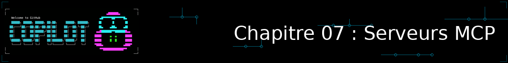
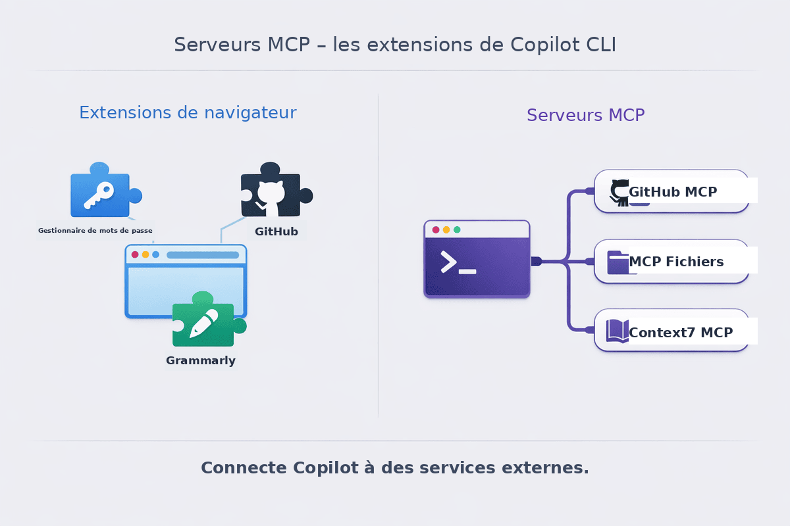
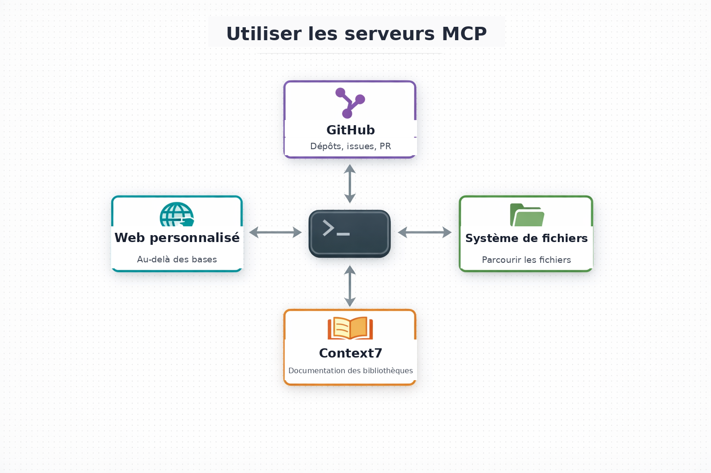
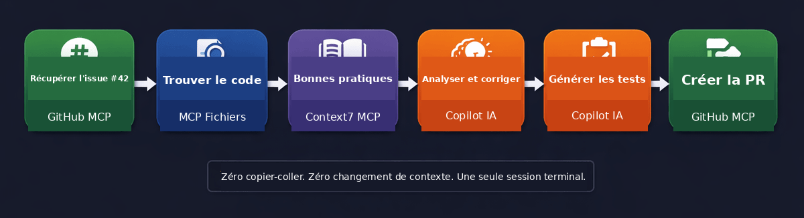

<!--
---
id: CopilotCLI-07
title: !translate Se connecter à GitHub, aux bases de données et aux API
description: !translate Configurez des serveurs MCP pour que GitHub Copilot CLI puisse se connecter à GitHub, aux fichiers locaux, à la documentation, aux bases de données et à d'autres sources de données en direct.
audience: Developers / Students / Terminal users
slug: connect-to-github-databases-and-apis
weight: 8
---
-->



> **Et si Copilot pouvait lire vos issues GitHub, vérifier votre base de données et créer des PR... le tout depuis le terminal ?**

Jusqu'à présent, Copilot ne pouvait travailler qu'avec ce que vous lui fournissiez directement : les fichiers référencés avec `@`, l'historique de conversation, et ses propres données d'entraînement. Mais que se passerait-il s'il pouvait aller chercher lui-même des informations dans votre dépôt GitHub, parcourir les fichiers de votre projet, ou consulter la documentation la plus récente d'une bibliothèque ?

C'est exactement ce que fait MCP (Model Context Protocol). C'est un moyen de connecter Copilot à des services externes afin qu'il ait accès à des données réelles et actualisées. Chaque service auquel Copilot se connecte est appelé un « serveur MCP ». Dans ce chapitre, vous allez configurer quelques-unes de ces connexions et voir à quel point elles rendent Copilot considérablement plus utile.

> 💡 **Déjà familier avec MCP ?** [Passez directement au démarrage rapide](#-use-the-built-in-github-mcp) pour vérifier que tout fonctionne et commencer à configurer des serveurs.

## 🎯 Objectifs d'apprentissage

À la fin de ce chapitre, vous serez capable de :

- Comprendre ce qu'est MCP et pourquoi c'est important
- Gérer les serveurs MCP avec les commandes `/mcp`
- Configurer des serveurs MCP pour GitHub, le système de fichiers et la documentation
- Utiliser des workflows alimentés par MCP avec le projet d'application de gestion de livres
- Savoir quand et comment construire un serveur MCP personnalisé (facultatif)

> ⏱️ **Durée estimée** : ~50 minutes (15 min de lecture + 35 min de pratique)

---

## 🧩 Analogie du monde réel : les extensions de navigateur



Pensez aux serveurs MCP comme à des extensions de navigateur. Votre navigateur, seul, peut afficher des pages web, mais les extensions le connectent à des services supplémentaires :

| Extension de navigateur | À quoi elle se connecte | Équivalent MCP |
|-------------------|---------------------|----------------|
| Gestionnaire de mots de passe | Votre coffre-fort de mots de passe | **GitHub MCP** → vos dépôts, issues, PR |
| Grammarly | Service d'analyse d'écriture | **Context7 MCP** → documentation de bibliothèques |
| Gestionnaire de fichiers | Stockage cloud | **Filesystem MCP** → fichiers locaux du projet |

Sans extensions, votre navigateur reste utile, mais avec elles, il devient redoutablement puissant. Les serveurs MCP font la même chose pour Copilot. Ils le connectent à des sources de données réelles et actualisées afin qu'il puisse lire vos issues GitHub, explorer votre système de fichiers, récupérer une documentation à jour, et bien plus encore.

***Les serveurs MCP connectent Copilot au monde extérieur : GitHub, les dépôts, la documentation, et plus encore***

> 💡 **Point clé** : Sans MCP, Copilot ne peut voir que les fichiers que vous partagez explicitement avec `@`. Avec MCP, il peut explorer votre projet de façon proactive, vérifier votre dépôt GitHub et consulter la documentation, le tout automatiquement.

---


# Démarrage rapide : MCP en 30 secondes

## Commencer avec le serveur GitHub MCP intégré
Voyons MCP en action tout de suite, avant même de configurer quoi que ce soit.
Le serveur GitHub MCP est inclus par défaut. Essayez ceci :

```bash
copilot
> List the recent commits in this repository
```

Si Copilot renvoie de vraies données de commits, vous venez de voir MCP en action. C'est le serveur GitHub MCP qui contacte GitHub en votre nom. Mais GitHub n'est qu'*un seul* serveur parmi d'autres. Ce chapitre vous montre comment en ajouter d'autres (accès au système de fichiers, documentation à jour, et bien plus) pour que Copilot en fasse encore davantage.

---

## Le tableau de bord unifié `/mcp`

*(depuis Copilot CLI v1.0.81)* Taper `/mcp` sans argument n'ouvre plus un gestionnaire MCP isolé : il ouvre désormais le **même tableau de bord unifié** que `/plugin` et `/skills`. Ce tableau de bord liste vos serveurs MCP, vos compétences (skills) et vos agents côte à côte, chacun avec son statut (activé/désactivé) — une seule vue pour tout ce qui étend Copilot.

```bash
copilot

> /mcp
```

Pour un statut rapide en texte directement dans le chat, `/mcp show` reste disponible et fonctionne comme avant :

```bash
copilot

> /mcp show

MCP Servers:
✓ github (enabled) - GitHub integration
✓ filesystem (enabled) - File system access
```

> 💡 **Vous ne voyez que le serveur GitHub ?** C'est normal ! Si vous n'avez pas encore ajouté de serveurs MCP supplémentaires, GitHub est le seul listé. Vous en ajouterez d'autres dans la section suivante.

Pour ajouter, modifier ou authentifier un serveur, utilisez `/mcp config` *(depuis Copilot CLI v1.0.81)*. Cette commande ouvre toujours l'assistant de configuration MCP dédié (formulaires d'ajout, d'édition et d'authentification) — mais ce formulaire s'ouvre maintenant **depuis** le tableau de bord des plugins, et le fermer vous y ramène, au lieu de vous laisser dans un gestionnaire MCP totalement séparé.

> 📚 **Vous voulez voir toutes les commandes de gestion MCP ?** Vous pouvez gérer les serveurs avec les commandes slash `/mcp` à l'intérieur du chat, ou avec `copilot mcp` directement depuis votre terminal. Consultez la [référence complète des commandes](#-additional-mcp-commands) à la fin de ce chapitre.

<details>
<summary>🎬 Voir ça en action !</summary>


*Le résultat de la démo peut varier. Votre modèle, vos outils et vos réponses différeront de ce qui est montré ici.*

</details>

---

## Qu'est-ce que MCP change concrètement ?

Voici la différence que fait MCP en pratique :

**Sans MCP :**
```bash
> What's in GitHub issue #42?

"I don't have access to GitHub. You'll need to copy and paste the issue content."
```

**Avec MCP :**
```bash
> What's in GitHub issue #42 of this repository?

Issue #42: Login fails with special characters
Status: Open
Labels: bug, priority-high
Description: Users report that passwords containing...
```

MCP rend Copilot conscient de votre environnement de développement réel.

> 📚 **Documentation officielle** : [About MCP](https://docs.github.com/copilot/concepts/context/mcp) pour un aperçu plus approfondi du fonctionnement de MCP avec GitHub Copilot.

---

# Configurer les serveurs MCP


Maintenant que vous avez vu MCP en action, configurons des serveurs supplémentaires. Vous pouvez ajouter des serveurs de deux façons : **depuis le registre intégré** (le plus simple — configuration guidée directement dans la CLI) ou en **modifiant le fichier de configuration** manuellement (plus flexible). Commencez par l'option du registre si vous ne savez pas laquelle choisir.

---

## Installer des serveurs MCP depuis le registre

La CLI dispose d'un registre de serveurs MCP intégré qui permet de découvrir et d'installer des serveurs populaires avec une configuration guidée, sans avoir besoin de modifier du JSON.

```bash
copilot

> /mcp search
```

Copilot ouvre un sélecteur interactif affichant les serveurs disponibles. Choisissez-en un, et la CLI vous guide à travers toute configuration requise (clés API, chemins, etc.) et l'ajoute automatiquement à votre configuration.

> 💡 **Pourquoi utiliser le registre ?** C'est le moyen le plus simple de démarrer — vous n'avez pas besoin de connaître le nom du paquet npm, les arguments de commande ou la structure JSON. La CLI s'occupe de tout cela pour vous.

---

## Fichier de configuration MCP

Les serveurs MCP peuvent être configurés au niveau utilisateur dans `~/.copilot/mcp-config.json`, ce qui s'applique à tous les projets, au niveau projet dans `.mcp.json`, ou dans le fichier de configuration d'espace de travail `.github/mcp.json`. `.github/mcp.json` est chargé automatiquement en même temps que `.mcp.json`. Si vous avez utilisé `/mcp search`, la CLI a créé ou mis à jour votre fichier `~/.copilot/mcp-config.json` au niveau utilisateur, mais comprendre le format JSON est utile lorsque vous voulez personnaliser ou partager une configuration MCP au niveau projet.

> 📚 **Spécification MCP à jour** *(depuis Copilot CLI v1.0.81)* : la CLI prend en charge la spécification MCP 2026-07-28, aussi bien côté CLI que SDK, IDE et clients en mémoire.

> ⚠️ **Remarque** : `.vscode/mcp.json` n'est plus pris en charge comme source de configuration MCP. Si vous avez un fichier `.vscode/mcp.json` existant, migrez-le vers `.mcp.json` à la racine de votre projet. La CLI affichera une indication de migration si elle détecte un ancien fichier de configuration.

```json
{
  "mcpServers": {
    "server-name": {
      "type": "local",
      "command": "npx",
      "args": ["@package/server-name"],
      "tools": ["*"]
    }
  }
}
```

*La plupart des serveurs MCP sont distribués sous forme de paquets npm et s'exécutent via la commande `npx`.*

<details>
<summary>💡 <strong>Nouveau avec JSON ?</strong> Cliquez ici pour comprendre chaque champ</summary>

| Champ | Ce qu'il signifie |
|-------|---------------|
| `"mcpServers"` | Conteneur pour toutes vos configurations de serveurs MCP |
| `"server-name"` | Un nom que vous choisissez (par ex., « github », « filesystem ») |
| `"type": "local"` | Le serveur s'exécute sur votre machine |
| `"command": "npx"` | Le programme à exécuter (npx exécute des paquets npm) |
| `"args": [...]` | Arguments passés à la commande |
| `"tools": ["*"]` | Autoriser tous les outils de ce serveur |

**Règles JSON importantes :**
- Utilisez des guillemets doubles `"` pour les chaînes de caractères (pas de guillemets simples)
- Pas de virgule finale après le dernier élément
- Le fichier doit être un JSON valide (utilisez un [validateur JSON](https://jsonlint.com/) en cas de doute)

</details>

---

## Ajouter des serveurs MCP

Le serveur GitHub MCP est intégré et ne nécessite aucune configuration. Voici d'autres serveurs que vous pouvez ajouter. **Choisissez ce qui vous intéresse, ou parcourez-les dans l'ordre.**

| Je veux... | Aller à |
|---|---|
| Laisser Copilot parcourir les fichiers de mon projet | [Serveur Filesystem](#filesystem-server) |
| Obtenir une documentation de bibliothèque à jour | [Serveur Context7](#context7-server-documentation) |
| Explorer les extras facultatifs (serveurs personnalisés, web_fetch) | [Au-delà des bases](#beyond-the-basics) |

<details>
<summary><strong>Serveur Filesystem</strong> - Laisser Copilot explorer les fichiers de votre projet</summary>
<a id="filesystem-server"></a>

### Serveur Filesystem

```json
{
  "mcpServers": {
    "filesystem": {
      "type": "local",
      "command": "npx",
      "args": ["-y", "@modelcontextprotocol/server-filesystem", "."],
      "tools": ["*"]
    }
  }
}
```

> 💡 **Le chemin `.`** : Le `.` signifie « répertoire courant ». Copilot peut accéder aux fichiers par rapport à l'endroit où vous l'avez lancé. Dans un Codespace, il s'agit de la racine de votre espace de travail. Vous pouvez aussi utiliser un chemin absolu comme `/workspaces/copilot-cli-for-beginners` si vous préférez.

Ajoutez ceci à votre `~/.copilot/mcp-config.json` et redémarrez Copilot.

</details>

<details>
<summary><strong>Serveur Context7</strong> - Obtenir une documentation de bibliothèque à jour</summary>
<a id="context7-server-documentation"></a>

### Serveur Context7 (Documentation)

Context7 donne à Copilot accès à une documentation à jour pour les frameworks et bibliothèques populaires. Au lieu de se fier à des données d'entraînement potentiellement obsolètes, Copilot récupère la documentation actuelle réelle.

```json
{
  "mcpServers": {
    "context7": {
      "type": "local",
      "command": "npx",
      "args": ["-y", "@upstash/context7-mcp"],
      "tools": ["*"]
    }
  }
}
```

- ✅ **Aucune clé API requise** 
- ✅ **Aucun compte nécessaire** 
- ✅ **Votre code reste local**

Ajoutez ceci à votre `~/.copilot/mcp-config.json` et redémarrez Copilot.

</details>

<details>
<summary><strong>Au-delà des bases</strong> - Serveurs personnalisés et accès web (facultatif)</summary>
<a id="beyond-the-basics"></a>

Ce sont des extras facultatifs pour lorsque vous êtes à l'aise avec les serveurs de base ci-dessus.

### Serveur Microsoft Learn MCP

Chaque serveur MCP que vous avez vu jusqu'ici (filesystem, Context7) s'exécute localement sur votre machine. Mais les serveurs MCP peuvent aussi s'exécuter à distance, ce qui signifie qu'il suffit de pointer Copilot CLI vers une URL et il se charge du reste. Pas de `npx` ni de `python`, pas de processus local, aucune dépendance à installer.

Le [serveur Microsoft Learn MCP](https://github.com/microsoftdocs/mcp) en est un bon exemple. Il donne à Copilot CLI un accès direct à la documentation officielle Microsoft (Azure, Microsoft Foundry et d'autres sujets IA, .NET, Microsoft 365, et bien plus) afin qu'il puisse rechercher dans la documentation, récupérer des pages complètes et trouver des exemples de code officiels au lieu de se fier aux données d'entraînement d'un modèle.

- ✅ **Aucune clé API requise** 
- ✅ **Aucun compte nécessaire** 
- ✅ **Aucune installation locale requise**

**Installation rapide avec `/plugin install` :**

Plutôt que de modifier votre fichier de configuration JSON manuellement, vous pouvez l'installer en une seule commande :

```bash
copilot

> /plugin install microsoftdocs/mcp
```

Cela ajoute le serveur et les compétences d'agent associées automatiquement. Les compétences installées comprennent :

- **microsoft-docs** : Concepts, tutoriels et recherches factuelles
- **microsoft-code-reference** : Recherches d'API, exemples de code et dépannage
- **microsoft-skill-creator** : Une méta-compétence pour générer des compétences personnalisées sur les technologies Microsoft

**Utilisation :**
```bash
copilot

> What's the recommended way to deploy a Python app to Azure App Service? Search Microsoft Learn.
```

📚 En savoir plus : [Aperçu du serveur Microsoft Learn MCP](https://learn.microsoft.com/training/support/mcp-get-started)

### Accès web avec `web_fetch`

Copilot CLI inclut un outil intégré `web_fetch` qui peut récupérer du contenu depuis n'importe quelle URL. C'est utile pour récupérer des README, de la documentation d'API ou des notes de version sans quitter votre terminal. Aucun serveur MCP nécessaire.

Vous pouvez contrôler quelles URL sont accessibles via `~/.copilot/config.json` (paramètres généraux de Copilot), qui est distinct de `~/.copilot/mcp-config.json` (définitions des serveurs MCP).

```json
{
  "permissions": {
    "allowedUrls": [
      "https://api.github.com/**",
      "https://docs.github.com/**",
      "https://*.npmjs.org/**"
    ],
    "blockedUrls": [
      "http://**"
    ]
  }
}
```

**Utilisation :**
```bash
copilot

> Fetch and summarize the README from https://github.com/facebook/react
```

### Construire un serveur MCP personnalisé

Vous voulez connecter Copilot à vos propres API, bases de données ou outils internes ? Vous pouvez construire un serveur MCP personnalisé en Python. C'est entièrement facultatif puisque les serveurs préconstruits (GitHub, filesystem, Context7) couvrent la plupart des cas d'usage.

📖 Consultez le [guide du serveur MCP personnalisé](mcp-custom-server.md) pour un tutoriel complet utilisant l'application de gestion de livres comme exemple.

📚 Pour plus de contexte, consultez le [cours MCP for Beginners](https://github.com/microsoft/mcp-for-beginners).

</details>

<a id="complete-configuration-file"></a>

### Fichier de configuration complet

Voici un `mcp-config.json` complet avec les serveurs filesystem et Context7 :

> 💡 **Remarque :** GitHub MCP est intégré. Vous n'avez pas besoin de l'ajouter à votre fichier de configuration.

```json
{
  "mcpServers": {
    "filesystem": {
      "type": "local",
      "command": "npx",
      "args": ["-y", "@modelcontextprotocol/server-filesystem", "."],
      "tools": ["*"]
    },
    "context7": {
      "type": "local",
      "command": "npx",
      "args": ["-y", "@upstash/context7-mcp"],
      "tools": ["*"]
    }
  }
}
```

Enregistrez ceci sous `~/.copilot/mcp-config.json` pour un accès global ou `.mcp.json` à la racine du projet pour une configuration spécifique au projet.

---

# Utiliser les serveurs MCP

Maintenant que vos serveurs MCP sont configurés, voyons ce qu'ils peuvent faire.



---

## Exemples d'utilisation des serveurs

**Choisissez un serveur à explorer, ou parcourez-les dans l'ordre.**

| Je veux essayer... | Aller à |
|---|---|
| Les dépôts, issues et PR GitHub | [Serveur GitHub](#github-server-built-in) |
| Parcourir les fichiers du projet | [Utilisation du serveur Filesystem](#filesystem-server-usage) |
| Recherche de documentation de bibliothèque | [Utilisation du serveur Context7](#context7-server-usage) |
| Serveur personnalisé, Microsoft Learn MCP et utilisation de web_fetch | [Utilisation « Au-delà des bases »](#beyond-the-basics-usage) |

<details>
<summary><strong>Serveur GitHub (intégré)</strong> - Accéder aux dépôts, issues, PR et plus</summary>
<a id="github-server-built-in"></a>

### Serveur GitHub (intégré)

Le serveur GitHub MCP est **intégré**. Si vous vous êtes connecté à Copilot (ce que vous avez fait lors de la configuration initiale), il fonctionne déjà. Aucune configuration nécessaire !

> 💡 **Ça ne fonctionne pas ?** Exécutez `/login` pour vous réauthentifier auprès de GitHub.

<details>
<summary><strong>Authentification dans les conteneurs de développement</strong></summary>

- **GitHub Codespaces** (recommandé) : L'authentification est automatique. La CLI `gh` hérite de votre jeton Codespace. Aucune action requise.
- **Conteneur de développement local (Docker)** : Exécutez `gh auth login` après le démarrage du conteneur, puis redémarrez Copilot.

**Dépannage de l'authentification :**
```bash
# Vérifier si vous êtes authentifié
gh auth status

# Si non, connectez-vous
gh auth login

# Vérifier que GitHub MCP est connecté
copilot
> /mcp show
```

</details>

| Fonctionnalité | Exemple |
|---------|----------|
| **Infos sur le dépôt** | Voir les commits, branches, contributeurs |
| **Issues** | Lister, créer, rechercher et commenter des issues |
| **Pull requests** | Voir les PR, diffs, créer des PR, vérifier le statut |
| **Recherche de code** | Rechercher du code à travers les dépôts |
| **Actions** | Interroger les exécutions et statuts de workflows |

```bash
copilot

# Voir l'activité récente de ce dépôt
> List the last 5 commits in this repository

Recent commits:
1. abc1234 - Update chapter 05 skills examples (2 days ago)
2. def5678 - Add book app test fixtures (3 days ago)
3. ghi9012 - Fix typo in chapter 03 README (4 days ago)
...

# Explorer la structure du dépôt
> What branches exist in this repository?

Branches:
- main (default)
- chapter6 (current)

# Rechercher des motifs de code à travers le dépôt
> Search this repository for files that import pytest

Found 1 file:
- samples/book-app-project/tests/test_books.py
```

> 💡 **Vous travaillez sur votre propre fork ?** Si vous avez forké ce dépôt de cours, vous pouvez aussi essayer des opérations d'écriture comme créer des issues et des pull requests. Nous pratiquerons cela dans les exercices ci-dessous.

> ⚠️ **Vous ne voyez pas de résultats ?** Le GitHub MCP opère sur le distant du dépôt (sur github.com), pas seulement sur les fichiers locaux. Assurez-vous que votre dépôt a un distant : exécutez `git remote -v` pour vérifier.

</details>

<details>
<summary><strong>Serveur Filesystem</strong> - Parcourir et analyser les fichiers du projet</summary>
<a id="filesystem-server-usage"></a>

### Serveur Filesystem

Une fois configuré, le MCP filesystem fournit des outils que Copilot peut utiliser automatiquement :

```bash
copilot

> How many Python files are in the book-app-project directory?

Found 3 Python files in samples/book-app-project/:
- book_app.py
- books.py
- utils.py

> What's the total size of the data.json file?

samples/book-app-project/data.json: 2.4 KB

> Find all functions that don't have type hints in the book app

Found 2 functions without type hints:
- samples/book-app-project/utils.py:10 - get_user_choice()
- samples/book-app-project/utils.py:14 - get_book_details()
```

</details>

<details>
<summary><strong>Serveur Context7</strong> - Consulter la documentation de bibliothèques</summary>
<a id="context7-server-usage"></a>

### Serveur Context7

```bash
copilot

> What are the best practices for using pytest fixtures?

From pytest Documentation:

Fixtures - Use fixtures to provide a fixed baseline for tests:

    import pytest

    @pytest.fixture
    def sample_books():
        return [
            {"title": "1984", "author": "George Orwell", "year": 1949},
            {"title": "Dune", "author": "Frank Herbert", "year": 1965},
        ]

    def test_find_by_author(sample_books):
        # fixture is automatically passed as argument
        results = [b for b in sample_books if "Orwell" in b["author"]]
        assert len(results) == 1

Best practices:
- Use fixtures instead of setup/teardown methods
- Use tmp_path fixture for temporary files
- Use monkeypatch for modifying environment
- Scope fixtures appropriately (function, class, module, session)

> How can I apply this to the book app's test file?

# Copilot connaît maintenant les patterns officiels de pytest
# et peut les appliquer à samples/book-app-project/tests/test_books.py
```

</details>

<details>
<summary><strong>Au-delà des bases</strong> - Serveur personnalisé et utilisation de web_fetch</summary>
<a id="beyond-the-basics-usage"></a>

### Au-delà des bases

**Serveur MCP personnalisé** : Si vous avez construit le serveur book-lookup à partir du [guide du serveur MCP personnalisé](mcp-custom-server.md), vous pouvez interroger votre collection de livres directement :

```bash
copilot

> Look up information about "1984" using the book lookup server. Search for books by George Orwell
```

**Microsoft Learn MCP** : Si vous avez installé le [serveur Microsoft Learn MCP](#microsoft-learn-mcp-server), vous pouvez consulter directement la documentation officielle Microsoft :

```bash
copilot

> How do I configure managed identity for an Azure Function? Search Microsoft Learn.
```

**Web Fetch** : Utilisez l'outil intégré `web_fetch` pour récupérer du contenu depuis n'importe quelle URL :

```bash
copilot

> Fetch and summarize the README from https://github.com/facebook/react
```

</details>

---

## Workflows multi-serveurs

Ces workflows montrent pourquoi les développeurs disent « je ne veux plus jamais travailler sans ça ». Chaque exemple combine plusieurs serveurs MCP au sein d'une même session.



*Workflow MCP complet : GitHub MCP récupère les données du dépôt, Filesystem MCP trouve le code, Context7 MCP fournit les bonnes pratiques, et Copilot gère l'analyse*

Chaque exemple ci-dessous est autonome. **Choisissez celui qui vous intéresse, ou lisez-les tous.**

| Je veux voir... | Aller à |
|---|---|
| Plusieurs serveurs travaillant ensemble | [Exploration multi-serveurs](#multi-server-exploration) |
| Passer d'une issue à une PR en une session | [Workflow issue-vers-PR](#issue-to-pr-workflow) |
| Un aperçu rapide de la santé du projet | [Tableau de bord de santé](#health-dashboard) |

<details>
<summary><strong>Exploration multi-serveurs</strong> - Combiner filesystem, GitHub et Context7 en une session</summary>
<a id="multi-server-exploration"></a>

#### Explorer l'application de gestion de livres avec plusieurs serveurs MCP

```bash
copilot

# Étape 1 : Utiliser filesystem MCP pour explorer l'application de gestion de livres
> List all Python files in samples/book-app-project/ and summarize
> what each file does

Found 3 Python files:
- book_app.py: CLI entry point with command routing (list, add, remove, find)
- books.py: BookCollection class with data persistence via JSON
- utils.py: Helper functions for user input and display

# Étape 2 : Utiliser GitHub MCP pour vérifier les changements récents
> What were the last 3 commits that touched files in samples/book-app-project/?

Recent commits affecting book app:
1. abc1234 - Add test fixtures for BookCollection (2 days ago)
2. def5678 - Add find_by_author method (5 days ago)
3. ghi9012 - Initial book app setup (1 week ago)

# Étape 3 : Utiliser Context7 MCP pour les bonnes pratiques
> What are Python best practices for JSON data persistence?

From Python Documentation:
- Use context managers (with statements) for file I/O
- Handle JSONDecodeError for corrupted files
- Use dataclasses for structured data
- Consider atomic writes to prevent data corruption

# Étape 4 : Synthétiser une recommandation
> Based on the book app code and these best practices,
> what improvements would you suggest?

Suggestions:
1. Add input validation in add_book() for empty strings and invalid years
2. Consider atomic writes in save_books() to prevent data corruption
3. Add type hints to utils.py functions (get_user_choice, get_book_details)
```

<details>
<summary>🎬 Voir le workflow MCP en action !</summary>


*Le résultat de la démo peut varier. Votre modèle, vos outils et vos réponses différeront de ce qui est montré ici.*

</details>

**Le résultat** : Exploration du code → revue de l'historique → recherche de bonnes pratiques → plan d'amélioration. **Le tout depuis une seule session de terminal, en utilisant trois serveurs MCP ensemble.**

</details>

<details>
<summary><strong>Workflow issue-vers-PR</strong> - Passer d'une issue GitHub à une pull request sans quitter le terminal</summary>
<a id="issue-to-pr-workflow"></a>

#### Le workflow issue-vers-PR (sur votre propre dépôt)

Cela fonctionne mieux sur votre propre fork ou dépôt où vous avez un accès en écriture :

> 💡 **Ne vous inquiétez pas si vous ne pouvez pas essayer ceci maintenant.** Si vous êtes sur un clone en lecture seule, vous pratiquerez cela dans l'exercice. Pour l'instant, contentez-vous de lire pour comprendre le déroulement.

```bash
copilot

> Get the details of GitHub issue #1

Issue #1: Add input validation for book year
Status: Open
Description: The add_book function accepts any year value...

> @samples/book-app-project/books.py Fix the issue described in issue #1

[Copilot implements year validation in add_book()]

> Run the tests to make sure the fix works

All 8 tests passed ✓

> Create a pull request titled "Add year validation to book app"

✓ Created PR #2: Add year validation to book app
```

**Zéro copier-coller. Zéro changement de contexte. Une seule session de terminal.**

</details>

<details>
<summary><strong>Tableau de bord de santé</strong> - Obtenir un aperçu rapide de la santé du projet grâce à plusieurs serveurs</summary>
<a id="health-dashboard"></a>

#### Tableau de bord de santé de l'application de gestion de livres

```bash
copilot

> Give me a health report for the book app project:
> 1. List all functions across the Python files in samples/book-app-project/
> 2. Check which functions have type hints and which don't
> 3. Show what tests exist in samples/book-app-project/tests/
> 4. Check the recent commit history for this directory

Book App Health Report
======================

📊 Functions Found:
- books.py: 8 methods in BookCollection (all have type hints ✓)
- book_app.py: 6 functions (4 have type hints, 2 missing)
- utils.py: 3 functions (1 has type hints, 2 missing)

🧪 Test Coverage:
- test_books.py: 8 test functions covering BookCollection
- Missing: no tests for book_app.py CLI functions
- Missing: no tests for utils.py helper functions

📝 Recent Activity:
- 3 commits in the last week
- Most recent: added test fixtures

Recommendations:
- Add type hints to utils.py functions
- Add tests for book_app.py CLI handlers
- All files well-sized (<100 lines) - good structure!
```

**Le résultat** : Plusieurs sources de données agrégées en quelques secondes. Manuellement, cela signifierait exécuter grep, compter des lignes, vérifier le git log et parcourir des fichiers de test. Facilement 15+ minutes de travail.

</details>

---

# Pratique


**🎉 Vous connaissez maintenant l'essentiel !** Vous comprenez MCP, vous avez vu comment configurer des serveurs, et vous avez vu de vrais workflows en action. Il est temps d'essayer vous-même.

---

## ▶️ À vous de jouer

C'est à vous maintenant ! Complétez ces exercices pour pratiquer l'utilisation des serveurs MCP avec le projet d'application de gestion de livres.

### Exercice 1 : Vérifier votre statut MCP

Commencez par voir quels serveurs MCP sont disponibles :

```bash
copilot

> /mcp show
```

Vous devriez voir le serveur GitHub listé comme activé. Si non, exécutez `/login` pour vous authentifier.

---

### Exercice 2 : Explorer l'application de gestion de livres avec filesystem MCP

Si vous avez configuré le serveur filesystem, utilisez-le pour explorer l'application de gestion de livres :

```bash
copilot

> How many Python files are in samples/book-app-project/?
> What functions are defined in each file?
```

**Résultat attendu** : Copilot liste `book_app.py`, `books.py` et `utils.py` avec leurs fonctions.

> 💡 **Vous n'avez pas encore configuré filesystem MCP ?** Créez le fichier de configuration à partir de la section [Configuration complète](#complete-configuration-file) ci-dessus. Puis redémarrez Copilot.

---

### Exercice 3 : Interroger l'historique du dépôt avec GitHub MCP

Utilisez le GitHub MCP intégré pour explorer ce dépôt de cours :

```bash
copilot

> List the last 5 commits in this repository

> What branches exist in this repository?
```

**Résultat attendu** : Copilot affiche les messages de commits récents et les noms de branches depuis le distant GitHub.

> ⚠️ **Dans un Codespace ?** Cela fonctionne automatiquement. L'authentification est héritée. Si vous êtes sur un clone local, assurez-vous que `gh auth status` indique que vous êtes connecté.

---

### Exercice 4 : Combiner plusieurs serveurs MCP

Combinez maintenant filesystem et GitHub MCP en une seule session :

```bash
copilot

> Read samples/book-app-project/data.json and tell me what books are
> in the collection. Then check the recent commits to see when this
> file was last modified.
```

**Résultat attendu** : Copilot lit le fichier JSON (filesystem MCP), liste les 5 livres dont « The Hobbit », « 1984 », « Dune », « To Kill a Mockingbird » et « Mysterious Book », puis interroge GitHub pour l'historique des commits.

**Auto-vérification** : Vous comprenez MCP quand vous pouvez expliquer pourquoi « Vérifie l'historique des commits de mon dépôt » est préférable à l'exécution manuelle de `git log` et au collage du résultat dans votre invite.

---

## 📝 Devoir

### Défi principal : Exploration MCP de l'application de gestion de livres

Pratiquez l'utilisation des serveurs MCP ensemble sur le projet d'application de gestion de livres. Complétez ces étapes en une seule session Copilot :

1. **Vérifiez que MCP fonctionne** : Exécutez `/mcp show` et confirmez qu'au moins le serveur GitHub est activé
2. **Configurez filesystem MCP** (si ce n'est pas déjà fait) : Créez `~/.copilot/mcp-config.json` avec la configuration du serveur filesystem
3. **Explorez le code** : Demandez à Copilot d'utiliser le serveur filesystem pour :
   - Lister toutes les fonctions dans `samples/book-app-project/books.py`
   - Vérifier quelles fonctions dans `samples/book-app-project/utils.py` n'ont pas d'annotations de type
   - Lire `samples/book-app-project/data.json` et identifier tout problème de qualité de données (indice : regardez la dernière entrée)
4. **Vérifiez l'activité du dépôt** : Demandez à Copilot d'utiliser GitHub MCP pour :
   - Lister les commits récents ayant touché des fichiers dans `samples/book-app-project/`
   - Vérifier s'il existe des issues ou pull requests ouvertes
5. **Combinez les serveurs** : Dans une seule invite, demandez à Copilot de :
   - Lire le fichier de test à `samples/book-app-project/tests/test_books.py`
   - Comparer les fonctions testées avec toutes les fonctions de `books.py`
   - Résumer quelle couverture de tests manque

**Critères de réussite** : Vous pouvez combiner sans effort les données de filesystem et GitHub MCP en une seule session Copilot, et vous pouvez expliquer ce que chaque serveur MCP a apporté à la réponse.

<details>
<summary>💡 Indices (cliquez pour développer)</summary>

**Étape 1 : Vérifier MCP**
```bash
copilot
> /mcp show
# Devrait montrer "github" comme activé
# Sinon, exécutez : /login
```

**Étape 2 : Créer le fichier de configuration**

Utilisez le JSON de la section [Configuration complète](#complete-configuration-file) ci-dessus et enregistrez-le sous `~/.copilot/mcp-config.json`.

**Étape 3 : Problème de qualité de données à rechercher**

Le dernier livre dans `data.json` est :
```json
{
  "title": "Mysterious Book",
  "author": "",
  "year": 0,
  "read": false
}
```
Un auteur vide et une année de 0. C'est le problème de qualité de données !

**Étape 5 : Comparaison de la couverture de tests**

Les tests dans `test_books.py` couvrent : `add_book`, `mark_as_read`, `remove_book`, `get_unread_books`, et `find_book_by_title`. Des fonctions comme `load_books`, `save_books`, et `list_books` n'ont pas de tests directs. Les fonctions CLI dans `book_app.py` et les helpers dans `utils.py` n'ont aucun test du tout.

**Si MCP ne fonctionne pas :** Redémarrez Copilot après avoir modifié le fichier de configuration.

</details>

### Défi bonus : Construire un serveur MCP personnalisé

Prêt à aller plus loin ? Suivez le [guide du serveur MCP personnalisé](mcp-custom-server.md) pour construire votre propre serveur MCP en Python qui se connecte à n'importe quelle API.

---

<details>
<summary>🔧 <strong>Erreurs courantes et dépannage</strong> (cliquez pour développer)</summary>

### Erreurs courantes

| Erreur | Ce qui se passe | Correction |
|---------|--------------|-----|
| Ne pas savoir que GitHub MCP est intégré | Essayer de l'installer/configurer manuellement | GitHub MCP est inclus par défaut. Essayez simplement : « Liste les commits récents de ce dépôt » |
| Chercher la configuration au mauvais endroit | Impossible de trouver ou modifier les paramètres MCP | La configuration au niveau utilisateur est dans `~/.copilot/mcp-config.json`, celle au niveau projet est `.mcp.json` à la racine du projet |
| JSON invalide dans le fichier de configuration | Les serveurs MCP ne se chargent pas | Utilisez `/mcp show` pour vérifier la configuration ; validez la syntaxe JSON |
| Oublier d'authentifier les serveurs MCP | Erreurs « Authentication failed » | Certains MCP nécessitent une authentification séparée. Vérifiez les exigences de chaque serveur |

### Dépannage

**« MCP server not found »** - Vérifiez que :
1. Le paquet npm existe : `npm view @modelcontextprotocol/server-github`
2. Votre configuration est un JSON valide
3. Le nom du serveur correspond à votre configuration

Utilisez `/mcp show` pour voir la configuration actuelle.

**« GitHub authentication failed »** - Le GitHub MCP intégré utilise vos identifiants `/login`. Essayez :

```bash
copilot
> /login
```

Cela vous réauthentifiera auprès de GitHub. Si les problèmes persistent, vérifiez que votre compte GitHub dispose des permissions nécessaires pour le dépôt auquel vous accédez.

**« MCP server failed to start »** - Vérifiez les logs du serveur :
```bash
# Exécutez la commande du serveur manuellement pour voir les erreurs
npx -y @modelcontextprotocol/server-github
```

**Outils MCP non disponibles** - Assurez-vous que le serveur est activé :
```bash
copilot

> /mcp show
# Vérifiez si le serveur est listé et activé
```

Si un serveur est désactivé, consultez les [commandes `/mcp` supplémentaires](#-additional-mcp-commands) ci-dessous pour savoir comment le réactiver.

> 💡 **Fiabilité après un redémarrage** *(depuis Copilot CLI v1.0.83)* : si un serveur MCP redémarre en cours de session, ses outils restent appelables — vous n'avez plus besoin de relancer Copilot pour qu'ils redeviennent disponibles.

</details>

---

<details>
<summary>📚 <strong>Commandes MCP supplémentaires</strong> (cliquez pour développer)</summary>
<a id="-additional-mcp-commands"></a>

Vous pouvez gérer les serveurs MCP de deux façons : en utilisant les **commandes slash à l'intérieur d'une session de chat**, ou en utilisant la **commande `copilot mcp` directement dans votre terminal** (aucune session de chat nécessaire).

### Option 1 : Commandes slash (à l'intérieur d'une session de chat)

Celles-ci fonctionnent lorsque vous êtes déjà dans `copilot` :

| Commande | Ce qu'elle fait |
|---------|--------------|
| `/mcp` (sans argument) | *(depuis v1.0.81)* Ouvre le tableau de bord unifié : serveurs MCP, compétences et agents, avec leur statut |
| `/mcp config` | *(depuis v1.0.81)* Ouvre l'assistant de configuration MCP dédié (ajout/édition/authentification), accessible depuis le tableau de bord |
| `/mcp show` | Affiche tous les serveurs MCP configurés et leur statut |
| `/mcp list` | Affiche les serveurs MCP actuellement rattachés et leur statut ; peut être exécutée pendant que Copilot travaille |
| `/mcp add` | Configuration interactive pour ajouter un nouveau serveur |
| `/mcp edit <server-name>` | Modifier la configuration d'un serveur existant |
| `/mcp enable <server-name>` | Activer un serveur désactivé (persiste entre les sessions) |
| `/mcp disable <server-name>` | Désactiver un serveur (persiste entre les sessions) |
| `/mcp delete <server-name>` | Supprimer un serveur définitivement |
| `/mcp auth <server-name>` | Se réauthentifier auprès d'un serveur MCP utilisant OAuth (par ex., après un changement de compte) |

### Option 2 : Commande `copilot mcp` (depuis votre terminal)

Vous pouvez aussi gérer les serveurs MCP directement depuis votre terminal sans démarrer d'abord une session de chat :

```bash
# Lister tous les serveurs MCP configurés
copilot mcp list

# Activer un serveur
copilot mcp enable filesystem

# Désactiver un serveur
copilot mcp disable context7
```

> 💡 **Quand utiliser quoi ?** Utilisez les commandes slash `/mcp` lorsque vous êtes déjà dans une session de chat. Utilisez `copilot mcp` depuis le terminal lorsque vous voulez vérifier ou modifier rapidement vos paramètres de serveur avant de démarrer une session.

Pour la plupart de ce cours, `/mcp show` est tout ce dont vous avez besoin. Les autres commandes deviennent utiles à mesure que vous gérez davantage de serveurs au fil du temps.

### Authentification OAuth des serveurs MCP distants

Certains serveurs MCP distants (protégés par OAuth) nécessitent une authentification via `/mcp auth <server-name>` ou `/mcp config`. Deux évolutions récentes facilitent ce flux :

- **Support CIMD** *(depuis Copilot CLI v1.0.83)* : Copilot CLI prend en charge CIMD (Client ID Metadata Document) pour la connexion OAuth des serveurs MCP.
- **Windows : authentification via le broker système (WAM)** *(depuis Copilot CLI v1.0.81)* : sous Windows, les serveurs MCP distants protégés par Microsoft Entra ID peuvent s'authentifier via le broker d'authentification du système (WAM), généralement sans invite. Sur les autres plateformes, avec `--device-code`, ou sur les machines sans la bibliothèque broker, le flux navigateur existant reste utilisé.

</details>

---

# Résumé

## 🔑 Points clés à retenir

1. **MCP** connecte Copilot à des services externes (GitHub, système de fichiers, documentation)
2. **GitHub MCP est intégré** - aucune configuration nécessaire, juste `/login`
3. **Filesystem et Context7** se configurent via `~/.copilot/mcp-config.json`
4. **Les workflows multi-serveurs** combinent des données de plusieurs sources en une seule session
5. **Gérez les serveurs de deux façons** : utilisez les commandes slash `/mcp` dans le chat, ou `copilot mcp` depuis le terminal
6. **`/mcp` sans argument ouvre le tableau de bord unifié** (serveurs MCP, compétences, agents) ; `/mcp config` reste l'assistant dédié pour ajouter/éditer/authentifier un serveur *(depuis v1.0.81)*
7. **Les serveurs personnalisés** vous permettent de connecter n'importe quelle API (facultatif, couvert dans le guide en annexe)

> 📋 **Référence rapide** : Consultez la [référence des commandes GitHub Copilot CLI](https://docs.github.com/en/copilot/reference/cli-command-reference) pour une liste complète des commandes et raccourcis.

---

## ➡️ Et ensuite

Vous disposez maintenant de tous les éléments de base : les modes, le contexte, les workflows, les agents, les compétences et MCP. Il est temps de tout assembler.

> 🎁 **Envie d'aller plus loin ?** Le [Chapitre 11 (bonus) : mcp2cli et le coût en tokens](../11-mcp2cli/README.md) revient sur ce que MCP coûte en tokens à chaque session, et vous montre comment interroger le serveur Context7 directement depuis le terminal, sans passer par Copilot.

Dans le **[Chapitre 08 : Tout assembler](../08-putting-it-together/README.md)**, vous apprendrez :

- Combiner agents, compétences et MCP dans des workflows unifiés
- Développement complet de fonctionnalités, de l'idée à la PR fusionnée
- Automatisation avec les hooks
- Bonnes pratiques pour les environnements d'équipe

---

**[← Retour au Chapitre 06](../06-skills/README.md)** | **[Continuer vers le Chapitre 08 →](../08-putting-it-together/README.md)**
