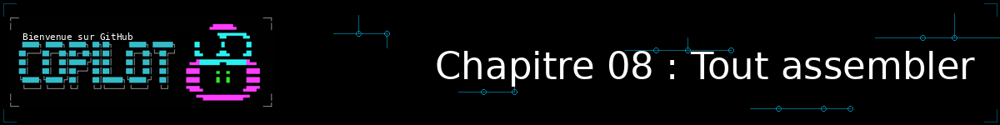
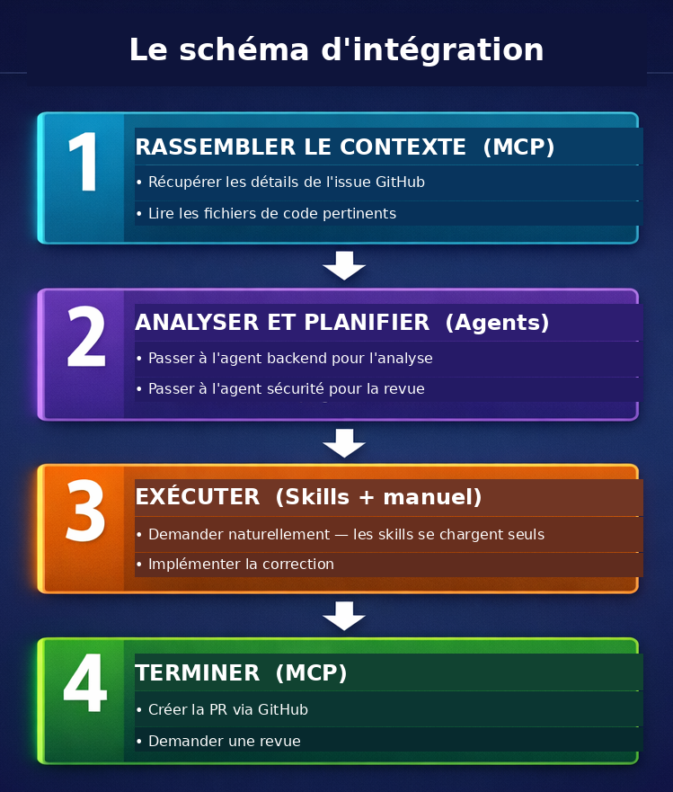

<!--
---
id: CopilotCLI-08
title: !translate Tout assembler
description: !translate Combinez contexte, workflows, agents, skills et MCP dans des workflows complets de développement de fonctionnalités, de l'idée à la pull request.
audience: Developers / Students / Terminal users
slug: putting-it-all-together
weight: 9
---
-->



> **Tout ce que vous avez appris se combine ici. Passez de l'idée à la PR fusionnée en une seule session.**

Dans ce chapitre, vous allez rassembler tout ce que vous avez appris en workflows complets. Vous allez construire des fonctionnalités en utilisant la collaboration multi-agents, mettre en place des hooks de pre-commit qui détectent les problèmes de sécurité avant qu'ils ne soient committés, intégrer Copilot dans des pipelines CI/CD, et passer de l'idée de fonctionnalité à la PR fusionnée en une seule session de terminal. C'est là que GitHub Copilot CLI devient un véritable multiplicateur de force.

> 💡 **Remarque** : Ce chapitre montre comment combiner tout ce que vous avez appris. **Vous n'avez pas besoin des agents, des skills, ou de MCP pour être productif (même s'ils peuvent être très utiles).** Le workflow de base — décrire, planifier, implémenter, tester, réviser, livrer — fonctionne avec uniquement les fonctionnalités intégrées des Chapitres 00 à 03.

## 🎯 Objectifs d'apprentissage

À la fin de ce chapitre, vous serez capable de :

- Combiner agents, skills et MCP (Model Context Protocol) dans des workflows unifiés
- Construire des fonctionnalités complètes en utilisant des approches multi-outils
- Mettre en place une automatisation de base avec des hooks
- Appliquer les bonnes pratiques pour un développement professionnel

> ⏱️ **Durée estimée** : ~75 minutes (15 min de lecture + 60 min de pratique)

---

## 🧩 Analogie du monde réel : l'orchestre


Un orchestre symphonique comporte plusieurs sections :
- Les **cordes** fournissent la base (comme vos workflows de base)
- Les **cuivres** ajoutent de la puissance (comme les agents avec une expertise spécialisée)
- Les **bois** ajoutent de la couleur (comme les skills qui étendent les capacités)
- Les **percussions** gardent le rythme (comme MCP qui se connecte à des systèmes externes)

Individuellement, chaque section semble limitée. Ensemble, bien dirigées, elles créent quelque chose de magnifique.

**C'est ce que ce chapitre enseigne !**<br>
*Comme un chef d'orchestre, vous orchestrez agents, skills et MCP en workflows unifiés*

Commençons par parcourir un scénario qui modifie du code, génère des tests, le révise, et crée une PR - le tout en une seule session.

---

## 🧭 Parcours guidé : de l'idée à la PR

Ce parcours reprend les fondamentaux des Chapitres 00 à 04. Il produit un résultat
observable à chaque étape et ne dépend ni d'un agent personnalisé, ni d'un skill,
ni d'un serveur MCP. Utilisez une branche dédiée afin de pouvoir abandonner
l'exercice sans toucher à votre branche principale.

> **Scénario** : ajouter une commande `search by year` à
> `samples/book-app-project/`, qui recherche les livres publiés entre deux années incluses.

| Jalon | Action | Résultat attendu |
|---|---|---|
| 1. Idée | Décrire le besoin et créer la branche | Une branche `feature/search-by-year` |
| 2. Plan | Utiliser `/plan` avec le contexte du projet | Un plan listant fichiers, règles métier et tests |
| 3. Implémentation | Modifier `books.py` et `book_app.py` | La recherche est accessible depuis la CLI |
| 4. Tests | Générer puis exécuter les tests pytest | Les cas nominal, vide, invalide et inversé sont couverts |
| 5. Diff | Relire avec `/review` et Git | Une revue et un diff staged compréhensibles |
| 6. PR | Préparer le commit puis créer la PR | Une PR avec résumé et tests exécutés |

### 1. Partir de l'idée

```bash
git switch -c feature/search-by-year
copilot

> Je veux ajouter une commande "search by year" à samples/book-app-project/.
> Elle doit trouver les livres publiés entre deux années incluses. Commence par
> reformuler le besoin et indique les questions qui restent ouvertes ; ne modifie
> encore aucun fichier.
```

**Jalon vérifiable** : Copilot reformule le besoin sans changement dans Git.
Vérifiez-le avec `git status`.

### 2. Planifier avec le contexte du projet

Dans la même session, donnez à Copilot le répertoire de l'exemple et demandez
un plan explicite :

```text
> @samples/book-app-project/ Utilise /plan pour proposer une implémentation de
> "search by year". Indique les fichiers à modifier, le format de la commande,
> la validation des années et les tests à ajouter. Ne modifie aucun fichier.
```

**Jalon vérifiable** : le plan mentionne au minimum `books.py`,
`book_app.py` et `tests/test_books.py`, ainsi que les plages vides ou inversées.

### 3. Implémenter la fonctionnalité

Après avoir relu le plan, demandez une implémentation limitée au scénario :

```text
> Implémente le plan validé. Ajoute find_by_year_range(start_year, end_year)
> dans BookCollection, branche la commande dans book_app.py et conserve le
> comportement des autres commandes. N'ajoute aucune dépendance.
```

**Jalon vérifiable** : `git diff --stat` ne liste que les fichiers prévus et
la commande suivante affiche la nouvelle commande :

```bash
cd samples/book-app-project
python book_app.py help
cd ../..
```

### 4. Générer et exécuter les tests

```text
> @samples/book-app-project/tests/test_books.py Ajoute des tests pytest pour
> find_by_year_range : bornes inclusives, aucun résultat, collection vide,
> année non numérique et plage inversée. Ne modifie pas les tests existants.
```

Puis exécutez les tests depuis le répertoire de l'exemple :

```bash
cd samples/book-app-project
python -m pytest tests/
cd ../..
```

**Jalon vérifiable** : pytest affiche une suite terminée sans échec. Si un test
échoue, corrigez le code ou le test avec Copilot avant de poursuivre ; ne masquez
pas l'échec.

### 5. Relire le diff avant de livrer

```text
> /review
```

```bash
git status
git diff
git add samples/book-app-project/books.py \
  samples/book-app-project/book_app.py \
  samples/book-app-project/tests/test_books.py
git diff --staged
```

**Jalon vérifiable** : la revue ne signale pas de problème bloquant, le diff
staged correspond au plan et aucun fichier de `samples/book-app-buggy/` ou
`samples/buggy-code/` n'est concerné.

> 💡 **Astuce** : `/diff` ouvre un mode de revue interactif directement dans
> le terminal, en alternative à `git diff` brut. Appuyez sur `c` pour
> commenter une ligne précise, `s` pour afficher un résumé de vos
> commentaires, puis `Entrée` pour les soumettre à Copilot — pratique pour
> demander des ajustements ciblés avant de committer, sans quitter la revue.

### 6. Préparer la PR

```text
> Rédige un message de commit conventionnel et une description de PR pour
> l'ajout de "search by year". Inclus le résumé, les fichiers modifiés, les
> tests exécutés et les limites connues. Ne crée pas encore la PR.
```

Après vérification humaine du message et des tests :

```bash
git commit -m "feat: add book search by year"
```

Puis, dans Copilot CLI :

```text
> /pr create
```

**Jalon vérifiable** : la PR contient le résumé de la fonctionnalité et la
commande exacte `python -m pytest tests/` dans la section des tests.

### Variante avec un agent spécialisé (facultative)

Les étapes précédentes restent suffisantes après les Chapitres 00 à 04. Si vous
avez suivi le Chapitre 05, vous pouvez renforcer les étapes 3 à 5 sans changer
le scénario :

```text
> /agent
# Sélectionner "python-reviewer"
> @samples/book-app-project/books.py Vérifie la conception de
> find_by_year_range et signale les validations ou cas limites manquants.

> /agent
# Sélectionner "pytest-helper"
> @samples/book-app-project/tests/test_books.py Complète les tests de la
> recherche par année et explique chaque cas limite ajouté.
```

Les agents donnent une seconde lecture spécialisée ; ils ne remplacent ni la
lecture du diff, ni l'exécution locale des tests.

> 🎬 **Démo** : le script reproductible qui suit les étapes idée → plan →
> agent spécialisé → tests → diff → PR est disponible dans
> [`assets/putting-it-together-demo.tape`](assets/putting-it-together-demo.tape).
> Le rendu GIF peut être régénéré avec l'outillage du dépôt lorsque VHS est
> installé (`npm run generate:vhs -- --file
> 08-putting-it-together/assets/putting-it-together-demo.tape`).

## De l'idée à la PR fusionnée en une seule session

Au lieu de basculer entre votre éditeur, votre terminal, votre lanceur de tests, et l'interface GitHub en perdant le contexte à chaque fois, vous pouvez combiner tous vos outils dans une seule session de terminal. Nous détaillerons ce modèle dans la section [Modèle d'intégration](#le-modèle-dintégration-pour-utilisateurs-avancés) ci-dessous.

```bash
# Démarrer Copilot en mode interactif
copilot

> I need to add a "list unread" command to the book app that shows only
> books where read is False. What files need to change?

# Copilot crée un plan de haut niveau...

# BASCULER VERS L'AGENT PYTHON-REVIEWER
> /agent
# Sélectionner "python-reviewer"

> @samples/book-app-project/books.py Design a get_unread_books method.
> What is the best approach?

# L'agent python-reviewer produit :
# - Signature de méthode et type de retour
# - Implémentation du filtre avec une compréhension de liste
# - Gestion des cas limites pour les collections vides

# BASCULER VERS L'AGENT PYTEST-HELPER
> /agent
# Sélectionner "pytest-helper"

> @samples/book-app-project/tests/test_books.py Design test cases for
> filtering unread books.

# L'agent pytest-helper produit :
# - Cas de test pour les collections vides
# - Cas de test avec des livres lus et non lus mélangés
# - Cas de test avec tous les livres lus

# IMPLÉMENTER
> Add a get_unread_books method to BookCollection in books.py
> Add a "list unread" command option in book_app.py
> Update the help text in the show_help function

# TESTER
> Generate comprehensive tests for the new feature

# Plusieurs tests sont générés, semblables à ce qui suit :
# - Cas nominal (3 tests) — filtre correctement, exclut les lus, inclut les non lus
# - Cas limites (4 tests) — collection vide, tous lus, aucun lu, un seul livre
# - Paramétré (5 cas) — ratios lus/non lus variés via @pytest.mark.parametrize
# - Intégration (4 tests) — interaction avec mark_as_read, remove_book, add_book, et intégrité des données

# Réviser les changements
> /review

# Si la révision passe, utilisez /pr pour opérer sur la pull request de la branche courante
> /pr [view|create|fix|auto]

# Ou demandez naturellement si vous voulez que Copilot la rédige depuis le terminal
> Create a pull request titled "Feature: Add list unread books command"
```

**Approche traditionnelle** : Basculer entre l'éditeur, le terminal, le lanceur de tests, la documentation, et l'interface GitHub. Chaque bascule cause une perte de contexte et des frictions.

**L'idée clé** : Vous avez dirigé des spécialistes comme un architecte. Ils ont géré les détails. Vous avez géré la vision.

> 💡 **Pour aller plus loin** : Pour de grands plans en plusieurs étapes comme celui-ci, essayez `/fleet` pour laisser Copilot exécuter des sous-tâches indépendantes en parallèle. Une autre option, complémentaire, est `/delegate` (vu au Chapitre 04) : confiez une sous-tâche bien délimitée à un agent cloud en arrière-plan tout en continuant à travailler dans votre session principale. Consultez la [documentation officielle](https://docs.github.com/copilot/concepts/agents/copilot-cli/fleet) pour plus de détails sur `/fleet`.

> 🛡️ **Sécurité et organisation** : Trois commandes complètent utilement ce flux de bout en bout :
> - `/worktree new` isole votre session de travail dans un nouveau worktree git *(depuis Copilot CLI v1.0.79)* — pratique pour paralléliser plusieurs tâches Copilot CLI (par exemple ce workflow et une correction de bug urgente) sans qu'elles ne se marchent dessus.
> - `/rewind` sert de filet de sécurité pour annuler une étape qui part dans la mauvaise direction *(depuis Copilot CLI v1.0.78)*. Il ne dépend plus de git, ne restaure que les fichiers modifiés par Copilot, et vous laisse choisir entre annuler « la conversation seule » ou « la conversation et les fichiers ».
> - `/tasks` affiche un tableau de bord des subagents en arrière-plan et des sessions shell détachées (vu au Chapitre 05) — utile pour surveiller ce que `/fleet` ou `/delegate` ont lancé sans perdre le fil de votre session principale.

---

# Workflows supplémentaires


Pour les utilisateurs avancés ayant terminé les Chapitres 04 à 06, ces workflows montrent comment agents, skills et MCP multiplient votre efficacité.

## Le modèle d'intégration

Voici le modèle mental pour tout combiner :



*Légende : le contexte rassemble les informations, le plan choisit l'approche,
l'exécution applique les changements, puis la phase de clôture vérifie et livre
le résultat. Les étapes 1 à 6 du parcours guidé détaillent ce même modèle sans
exiger les outils avancés.*

---

## Workflow 1 : Investigation et correction de bug

Correction de bug en conditions réelles avec une intégration complète des outils :

```bash
copilot

# PHASE 1 : Comprendre le bug depuis GitHub (MCP fournit ceci)
> Get the details of issue #1

# On apprend : "find_by_author doesn't work with partial names"

# PHASE 2 : Rechercher les bonnes pratiques (recherche approfondie avec sources web + GitHub)
> /research Best practices for Python case-insensitive string matching

# PHASE 3 : Trouver le code concerné
> @samples/book-app-project/books.py Show me the find_by_author method

# PHASE 4 : Obtenir une analyse experte
> /agent
# Sélectionner "python-reviewer"

> Analyze this method for issues with partial name matching

# L'agent identifie : la méthode utilise l'égalité exacte au lieu d'une correspondance de sous-chaîne

# PHASE 5 : Corriger avec l'aide de l'agent
> Implement the fix using lowercase comparison and 'in' operator

# PHASE 6 : Générer les tests
> /agent
# Sélectionner "pytest-helper"

> Generate pytest tests for find_by_author with partial matches
> Include test cases: partial name, case variations, no matches

# PHASE 7 : Commit et PR
> Generate a commit message for this fix

> Create a pull request linking to issue #1
```

---

## Workflow 2 : Automatisation de la revue de code (optionnel)

> 💡 **Cette section est optionnelle.** Les hooks de pre-commit sont utiles pour les équipes mais ne sont pas nécessaires pour être productif. Passez cette section si vous débutez.
>
> ⚠️ **Remarque sur les performances** : Ce hook appelle `copilot -p` pour chaque fichier indexé (staged), ce qui prend plusieurs secondes par fichier. Pour les gros commits, envisagez de limiter aux fichiers critiques ou d'exécuter les revues manuellement avec `/review` à la place.

Un **hook git** est un script que Git exécute automatiquement à certains moments, par exemple juste avant un commit. Vous pouvez l'utiliser pour exécuter des vérifications automatisées sur votre code. Voici comment configurer une revue automatisée de Copilot sur vos commits :

```bash
# Créer un hook de pre-commit
cat > .git/hooks/pre-commit << 'EOF'
#!/bin/bash

# Récupérer les fichiers indexés (fichiers Python uniquement)
STAGED=$(git diff --cached --name-only --diff-filter=ACM | grep -E '\.py$')

if [ -n "$STAGED" ]; then
  echo "Running Copilot review on staged files..."

  for file in $STAGED; do
    echo "Reviewing $file..."

    # Utiliser timeout pour éviter un blocage (60 secondes par fichier)
    # --allow-all approuve automatiquement les lectures/écritures de fichiers pour que le hook puisse s'exécuter sans surveillance.
    # À utiliser uniquement dans des scripts automatisés. En session interactive, laissez Copilot demander la permission.
    REVIEW=$(timeout 60 copilot --allow-all -p "Quick security review of @$file - critical issues only" 2>/dev/null)

    # Vérifier si un timeout s'est produit
    if [ $? -eq 124 ]; then
      echo "Warning: Review timed out for $file (skipping)"
      continue
    fi

    if echo "$REVIEW" | grep -qi "CRITICAL"; then
      echo "Critical issues found in $file:"
      echo "$REVIEW"
      exit 1
    fi
  done

  echo "Review passed"
fi
EOF

chmod +x .git/hooks/pre-commit
```

> ⚠️ **Utilisateurs macOS** : La commande `timeout` n'est pas incluse par défaut sur macOS. Installez-la avec `brew install coreutils` ou remplacez `timeout 60` par un simple appel sans garde-fou de timeout.

> 📚 **Documentation officielle** : [Utiliser les hooks](https://docs.github.com/copilot/how-tos/copilot-cli/use-hooks) et la [référence de configuration des hooks](https://docs.github.com/copilot/reference/hooks-configuration) pour l'API complète des hooks.
>
> 💡 **Alternative intégrée** : Copilot CLI dispose également d'un système de hooks intégré (`copilot hooks`) qui peut s'exécuter automatiquement sur des événements comme le pre-commit. Le hook git manuel ci-dessus vous donne un contrôle total, tandis que le système intégré est plus simple à configurer. Consultez la documentation ci-dessus pour décider quelle approche convient à votre workflow.
>
> ⚠️ **Ne pas confondre avec `/security-review`** : ce hook appelle `copilot -p` en mode scripté, pensé pour tourner sans surveillance à chaque commit. La commande `/security-review`, présentée au [Chapitre 11 (bonus)](../11-security-with-copilot/README.md), est un outil différent : une revue de sécurité interactive que vous lancez à la demande, en session, sur votre diff local. Les deux se complètent, ce ne sont pas deux façons interchangeables de faire la même chose.

Désormais, chaque commit reçoit une revue de sécurité rapide :

```bash
git add samples/book-app-project/books.py
git commit -m "Update book collection methods"

# Sortie :
# Running Copilot review on staged files...
# Reviewing samples/book-app-project/books.py...
# Critical issues found in samples/book-app-project/books.py:
# - Line 15: File path injection vulnerability in load_from_file
#
# Fix the issue and try again.
```

---

## Workflow 3 : Prise en main d'une nouvelle base de code

En rejoignant un nouveau projet, combinez contexte, agents et MCP pour monter en compétence rapidement :

```bash
# Démarrer Copilot en mode interactif
copilot

# PHASE 1 : Obtenir une vue d'ensemble avec le contexte
> @samples/book-app-project/ Explain the high-level architecture of this codebase

# PHASE 2 : Comprendre un flux spécifique
> @samples/book-app-project/book_app.py Walk me through what happens
> when a user runs "python book_app.py add"

# PHASE 3 : Obtenir une analyse experte avec un agent
> /agent
# Sélectionner "python-reviewer"

> @samples/book-app-project/books.py Are there any design issues,
> missing error handling, or improvements you would recommend?

# PHASE 4 : Trouver quelque chose sur quoi travailler (MCP fournit l'accès à GitHub)
> List open issues labeled "good first issue"

# PHASE 5 : Commencer à contribuer
> Pick the simplest open issue and outline a plan to fix it
```

Ce workflow combine le contexte `@`, les agents, et MCP en une seule session d'intégration, exactement le modèle d'intégration présenté plus tôt dans ce chapitre.

---

# Bonnes pratiques et automatisation

Modèles et habitudes qui rendent vos workflows plus efficaces.

---

## Bonnes pratiques

### 1. Commencer par le contexte avant l'analyse

Rassemblez toujours le contexte avant de demander une analyse :

```bash
# Bien
> Get the details of issue #42
> /agent
# Sélectionner python-reviewer
> Analyze this issue

# Moins efficace
> /agent
# Sélectionner python-reviewer
> Fix login bug
# L'agent n'a pas le contexte de l'issue
```

### 2. Connaître la différence : agents, skills, et instructions personnalisées

Chaque outil a son point fort :

```bash
# Agents : personas spécialisés que vous activez explicitement
> /agent
# Sélectionner python-reviewer
> Review this authentication code for security issues

# Skills : capacités modulaires qui s'activent automatiquement quand votre prompt
# correspond à la description du skill (vous devez d'abord les créer — voir Ch 05)
> Generate comprehensive tests for this code
# Si vous avez un skill de test configuré, il s'active automatiquement

# Instructions personnalisées (.github/copilot-instructions.md) : directives
# toujours actives qui s'appliquent à chaque session sans bascule ni déclenchement
```

> 💡 **Point clé** : Les agents et les skills peuvent tous deux analyser ET générer du code. La vraie différence est **la façon dont ils s'activent** — les agents sont explicites (`/agent`), les skills sont automatiques (correspondance de prompt), et les instructions personnalisées sont toujours actives.

> 🔎 **Vérifier ce qui est réellement chargé** : Dans une session qui combine instructions, agents, skills, MCP et hooks, il devient facile de perdre le fil. Lancez `/env` pour lister en une seule commande tout ce que Copilot a chargé pour la session courante — instructions personnalisées, serveurs MCP, skills, agents, hooks, plugins et serveurs de langage (LSP). C'est le premier réflexe à avoir si un outil combiné ne se déclenche pas comme prévu.

### 3. Garder les sessions ciblées

Utilisez `/rename` pour nommer votre session (facilite sa recherche dans l'historique) et `/exit` pour la terminer proprement :

```bash
# Bien : une fonctionnalité par session
> /rename list-unread-feature
# Travailler sur list unread
> /exit

copilot
> /rename export-csv-feature
# Travailler sur l'export CSV
> /exit

# Moins efficace : tout dans une seule longue session
```

### 4. Rendre les workflows réutilisables avec Copilot

Au lieu de simplement documenter les workflows dans un wiki, encodez-les directement dans votre dépôt où Copilot peut les utiliser :

- **Instructions personnalisées** (`.github/copilot-instructions.md`) : directives toujours actives pour les standards de code, les règles d'architecture, et les étapes de build/test/déploiement. Chaque session les suit automatiquement.
- **Fichiers de prompt** (`.github/prompts/`) : des prompts réutilisables et paramétrables que votre équipe peut partager — comme des modèles pour les revues de code, la génération de composants, ou les descriptions de PR.
- **Agents personnalisés** (`.github/agents/`) : encodez des personas spécialisés (par exemple, un réviseur sécurité ou un rédacteur de documentation) que n'importe qui dans l'équipe peut activer avec `/agent`.
- **Skills personnalisés** (`.github/skills/`) : empaquetez des instructions de workflow étape par étape qui s'activent automatiquement quand c'est pertinent.

> 💡 **Le bénéfice** : Les nouveaux membres de l'équipe obtiennent vos workflows gratuitement — ils sont intégrés au dépôt, pas enfermés dans la tête de quelqu'un.

---

## Bonus : modèles de production

Ces modèles sont optionnels mais précieux pour les environnements professionnels.

### Générateur de description de PR

```bash
# Générer des descriptions de PR complètes
BRANCH=$(git branch --show-current)
COMMITS=$(git log main..$BRANCH --oneline)

copilot -p "Generate a PR description for:
Branch: $BRANCH
Commits:
$COMMITS

Include: Summary, Changes Made, Testing Done, Screenshots Needed"
```

### Intégration CI/CD

Pour les équipes disposant de pipelines CI/CD existants, vous pouvez automatiser les revues Copilot sur chaque pull request en utilisant GitHub Actions. Cela inclut la publication automatique de commentaires de revue et le filtrage des problèmes critiques.

> 📖 **En savoir plus** : Consultez [Intégration CI/CD](../appendices/ci-cd-integration.md) pour des workflows GitHub Actions complets, des options de configuration, et des astuces de dépannage.

### 🧪 Pour aller plus loin (expérimental)

> ⚗️ **Project HydraFusion** *(annoncé le 10 septembre 2026)* : un routage sémantique automatique entre modèles locaux, cloud et composés, accessible en `/experimental` via `/model` comme n'importe quel autre modèle. Il choisit lui-même un flux qui équilibre performance, coût et latence selon la tâche. **Ce n'est pas nécessaire pour suivre ce cours** — c'est une piste expérimentale à explorer uniquement si vous êtes déjà à l'aise avec les workflows présentés ci-dessus.

---

# Pratique


Mettez le workflow complet en pratique.

---

## ▶️ À vous de jouer

Après avoir terminé les démonstrations, essayez ces variations :

1. **Défi de bout en bout** : Choisissez une petite fonctionnalité (par exemple, « list unread books » ou « export to CSV »). Utilisez le workflow complet :
   - Planifier avec `/plan`
   - Concevoir avec les agents (python-reviewer, pytest-helper)
   - Implémenter
   - Générer les tests
   - Créer la PR

2. **Défi d'automatisation** : Mettez en place le hook de pre-commit du workflow d'automatisation de revue de code. Faites un commit avec une vulnérabilité de chemin de fichier intentionnelle. Est-il bloqué ?

3. **Votre workflow de production** : Concevez votre propre workflow pour une tâche courante que vous effectuez. Écrivez-le sous forme de checklist. Quelles parties pourraient être automatisées avec des skills, des agents, ou des hooks ?

**Auto-évaluation** : Vous avez terminé le cours quand vous pouvez expliquer à un collègue comment agents, skills, et MCP fonctionnent ensemble - et quand utiliser chacun.

---

## 📝 Exercice

### Défi principal : fonctionnalité de bout en bout

Les exemples pratiques ont parcouru la construction d'une fonctionnalité « list unread books ». Maintenant, pratiquez le workflow complet sur une fonctionnalité différente : **rechercher des livres par plage d'années** :

1. Démarrez Copilot et rassemblez le contexte : `@samples/book-app-project/books.py`
2. Planifiez avec `/plan Add a "search by year" command that lets users find books published between two years`
3. Implémentez une méthode `find_by_year_range(start_year, end_year)` dans `BookCollection`
4. Ajoutez une fonction `handle_search_year()` dans `book_app.py` qui demande à l'utilisateur les années de début et de fin
5. Générez les tests : `@samples/book-app-project/books.py @samples/book-app-project/tests/test_books.py Generate tests for find_by_year_range() including edge cases like invalid years, reversed range, and no results.`
6. Révisez avec `/review`
7. Mettez à jour le README : `@samples/book-app-project/README.md Add documentation for the new "search by year" command.`
8. Générez un message de commit

Documentez votre workflow au fur et à mesure.

**Critères de réussite** : Vous avez terminé la fonctionnalité de l'idée jusqu'au commit en utilisant Copilot CLI, incluant la planification, l'implémentation, les tests, la documentation, et la revue.

> 💡 **Bonus** : Si vous avez configuré des agents depuis le Chapitre 05, essayez de créer et d'utiliser des agents personnalisés. Par exemple, un agent error-handler pour la revue d'implémentation et un agent doc-writer pour la mise à jour du README.

<details>
<summary>💡 Indices (cliquer pour développer)</summary>

**Suivez le modèle de l'exemple ["Idée vers PR fusionnée"](#de-lidée-à-la-pr-fusionnée-en-une-seule-session)** en haut de ce chapitre. Les étapes clés sont :

1. Rassembler le contexte avec `@samples/book-app-project/books.py`
2. Planifier avec `/plan Add a "search by year" command`
3. Implémenter la méthode et le gestionnaire de commande
4. Générer les tests avec des cas limites (entrée invalide, résultats vides, plage inversée)
5. Réviser avec `/review`
6. Mettre à jour le README avec `@samples/book-app-project/README.md`
7. Générer le message de commit avec `-p`

**Cas limites auxquels penser :**
- Que se passe-t-il si l'utilisateur saisit « 2000 » puis « 1990 » (plage inversée) ?
- Que se passe-t-il si aucun livre ne correspond à la plage ?
- Que se passe-t-il si l'utilisateur saisit une entrée non numérique ?

**L'essentiel est de pratiquer le workflow complet** de l'idée → contexte → plan → implémentation → test → documentation → commit.

</details>

---

<details>
<summary>🔧 <strong>Erreurs courantes</strong> (cliquer pour développer)</summary>

| Erreur | Ce qui se passe | Correction |
|---------|--------------|-----|
| Se lancer directement dans l'implémentation | Manquer des problèmes de conception coûteux à corriger plus tard | Utilisez d'abord `/plan` pour réfléchir à l'approche |
| Utiliser un seul outil quand plusieurs seraient utiles | Résultats plus lents et moins approfondis | Combinez : Agent pour l'analyse → Skill pour l'exécution → MCP pour l'intégration |
| Ne pas réviser avant de committer | Des problèmes de sécurité ou des bugs passent inaperçus | Exécutez toujours `/review` ou utilisez un [hook de pre-commit](#workflow-2--automatisation-de-la-revue-de-code-optionnel) |
| Oublier de partager les workflows avec l'équipe | Chaque personne réinvente la roue | Documentez les modèles dans des agents, skills, et instructions partagés |

</details>

---

# Résumé

## 🔑 Points clés à retenir

1. **Intégration > isolation** : combinez les outils pour un impact maximal
2. **Le contexte d'abord** : rassemblez toujours le contexte requis avant l'analyse
3. **Les agents analysent, les skills exécutent** : utilisez le bon outil pour la bonne tâche
4. **Automatisez la répétition** : les hooks et les scripts multiplient votre efficacité
5. **Documentez les workflows** : les modèles partageables profitent à toute l'équipe

> 📋 **Référence rapide** : Consultez la [référence des commandes GitHub Copilot CLI](https://docs.github.com/en/copilot/reference/cli-command-reference) pour une liste complète des commandes et raccourcis.

---

## 🎓 Cours terminé !

Félicitations ! Vous avez appris :

| Chapitre | Ce que vous avez appris |
|---------|-------------------|
| 00 | Stack terminal moderne |
| 01 | Démarrage rapide |
| 02 | Premiers pas et configuration |
| 03 | Contexte et conversations |
| 04 | Flux de travail de développement |
| 05 | Agents et instructions personnalisées |
| 06 | Automatiser les tâches répétitives avec les skills |
| 07 | Se connecter à GitHub, aux bases de données et aux API avec MCP |
| 08 | Tout assembler en workflows complets |

Vous êtes maintenant équipé pour utiliser GitHub Copilot CLI comme un véritable multiplicateur de force dans votre workflow de développement.

> 🎁 **Envie d'aller plus loin ?** Le tronc commun s'arrête ici, mais **dix chapitres bonus** (09 à 18) prolongent directement les thèmes de ce chapitre :
> - [Chapitre 11 : Sécuriser votre code avec Copilot CLI](../11-security-with-copilot/README.md) — approfondit `/security-review`, mentionné dans le Workflow 2 ci-dessus.
> - [Chapitre 13 : Explorer l'historique de vos sessions avec /chronicle](../13-chronicle-session-insights/README.md) — transforme vos habitudes de travail en rapports, conseils et skills, pour aller plus loin que la bonne pratique n°4 (« Rendre les workflows réutilisables ») et l'Exercice 3 de ce chapitre.
> - [Chapitre 16 : Sessions parallèles avec les worktrees Git](../16-parallel-worktrees/README.md) — approfondit `/worktree new`, mentionné dans le parcours guidé.
> - Les autres : [09 Environnements isolés](../09-isolated-environments/README.md) (Docker), [10 RAG sur Obsidian](../10-obsidian-rag/README.md), [12 Acceptation de l'IA par les développeurs](../12-ai-developer-acceptance/README.md), [14 Consommation de tokens (RTK/Tokscale)](../14-token-consumption-analysis/README.md), [15 Prompt engineering](../15-prompt-engineering/README.md), [17 mcp2cli](../17-mcp2cli/README.md), [18 Workflows n8n](../18-n8n-workflows/README.md).
>
> Consultez le [tableau complet des chapitres](../README.md#comment-fonctionne-ce-cours) pour choisir selon vos besoins — aucun ordre n'est imposé au-delà du tronc commun 00–08.

## ➡️ Et ensuite ?

Votre apprentissage ne s'arrête pas là :

1. **Pratiquez quotidiennement** : utilisez Copilot CLI pour du travail réel
2. **Construisez des outils personnalisés** : créez des agents et des skills pour vos besoins spécifiques
3. **Partagez vos connaissances** : aidez votre équipe à adopter ces workflows
4. **Restez à jour** : suivez les mises à jour de GitHub Copilot pour les nouvelles fonctionnalités

### Ressources

- [Documentation de GitHub Copilot CLI](https://docs.github.com/copilot/concepts/agents/about-copilot-cli)
- [Registre des serveurs MCP](https://github.com/modelcontextprotocol/servers)
- [Skills de la communauté](https://github.com/topics/copilot-skill)

---

**Excellent travail ! Maintenant, allez construire quelque chose d'extraordinaire.**

**[← Retour au Chapitre 07](../07-mcp-servers/README.md)** | **[Retour à l'accueil du cours](../README.md)** | **[Chapitre bonus : Environnements isolés →](../09-isolated-environments/README.md)**
