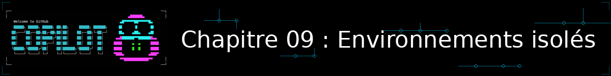
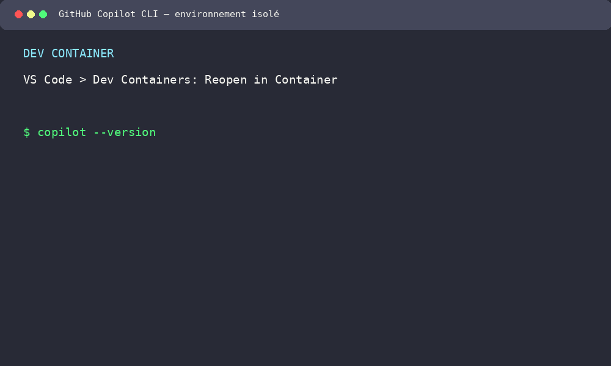
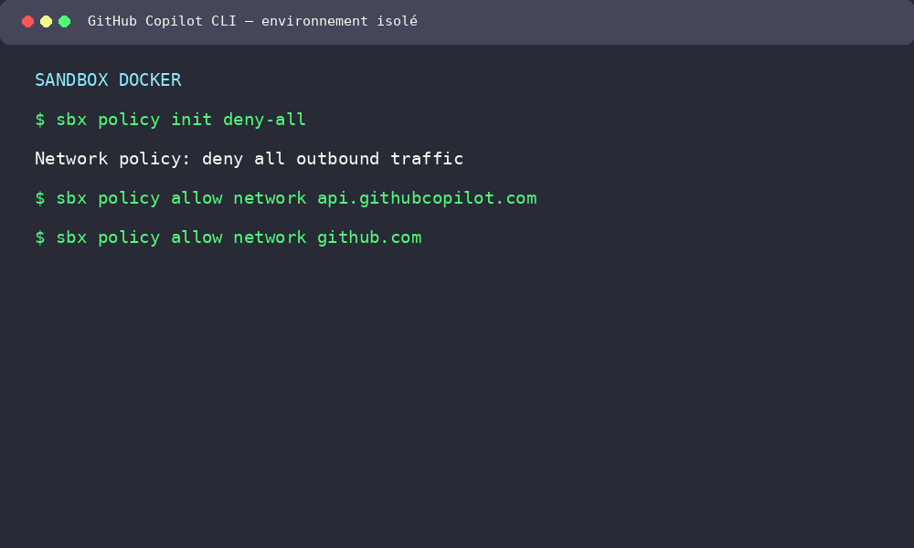

<!--
---
id: CopilotCLI-09
title: !translate Environnements isolés
description: !translate Exécutez GitHub Copilot CLI dans un dev container, activez son sandboxing natif, isolez-le complètement dans une sandbox Docker pour automatiser en toute confiance avec --allow-all, et construisez votre propre image Docker avec GitHub CLI et une stack terminal complète.
audience: Developers / Students / Terminal users
slug: isolated-environments
weight: 10
---
-->



> **Et si vous pouviez laisser Copilot CLI travailler en pleine autonomie — `--allow-all`, aucune confirmation à chaque étape — sans jamais craindre pour le reste de votre machine ?**

Au [Chapitre 02](../02-setup-and-first-steps/README.md) et dans l'annexe [Fonctionnalités de contexte supplémentaires](../appendices/additional-context.md), vous avez découvert `--allow-all` (et son alias `--yolo`) : le drapeau qui désactive toutes les invites de permission, indispensable pour automatiser Copilot CLI sans supervision humaine. Ces annexes le disaient déjà : *« N'utilisez `--allow-all` qu'avec des prompts que vous avez écrits vous-même et dans des répertoires en lesquels vous avez confiance. »* Ce chapitre bonus construit exactement ce contexte de confiance : un environnement où `--allow-all` devient sûr par construction, pas seulement par prudence.

Depuis juin 2026, GitHub propose d'ailleurs son propre **sandboxing natif** directement intégré à Copilot CLI (préversion publique), en plus des solutions externes que ce chapitre construit déjà avec Docker — vous allez voir les deux niveaux.

## 🎯 Objectifs d'apprentissage

À la fin de ce chapitre, vous serez capable de :

- Ouvrir ce dépôt dans un **dev container** cohérent et reproductible
- Distinguer un dev container (environnement d'équipe cohérent), une **sandbox native** (isolation au niveau processus, intégrée à Copilot CLI) et une **Docker Sandbox** (isolation microVM complète)
- Activer et configurer le sandboxing natif de Copilot CLI (`/sandbox enable`) avec des politiques fichiers/réseau *deny-by-default*, sans dépendance à Docker
- Lancer GitHub Copilot CLI dans une **Docker Sandbox** isolée avec `sbx run copilot`
- Configurer une politique réseau *deny-by-default* qui n'autorise que les domaines dont Copilot a réellement besoin
- Automatiser une revue de code avec `--allow-all` sans surveillance humaine, en toute sécurité
- Construire une image Docker autonome embarquant GitHub CLI, Copilot CLI et la stack terminal du Chapitre 00

> ⏱️ **Durée estimée** : ~60 minutes (20 min de lecture + 40 min de pratique)

---

## ✅ Prérequis

- [Chapitre 01 : Démarrage rapide](../01-quick-start/README.md) terminé (Copilot CLI installé et vérifié)
- Avoir lu l'encart sur `--allow-all` du [Chapitre 02](../02-setup-and-first-steps/README.md#découvrez-la-puissance-du-mode-programmatique) ou de l'annexe [Fonctionnalités de contexte supplémentaires](../appendices/additional-context.md)
- [Docker Desktop](https://www.docker.com/products/docker-desktop/) installé
- Une version récente de Copilot CLI pour la **Partie 2** : le sandboxing natif (`/sandbox`) est une fonctionnalité de juin 2026. Si la commande n'existe pas chez vous, mettez à jour avec `npm install -g @github/copilot@latest`.
- ⚠️ **Partie 3 uniquement** : Docker Desktop **4.50+** pour la fonctionnalité Docker Sandboxes. Si votre version est plus ancienne, mettez à jour Docker Desktop, ou repliez-vous sur l'isolation manuelle décrite dans l'encadré de repli — vous pouvez suivre les Parties 1 et 2 sans cette contrainte.
- La **Partie 4** ne nécessite que Docker standard (`docker build`/`docker run`) — pas besoin de Docker Desktop 4.50+ ni de la fonctionnalité Sandboxes.

---

## 🧩 Analogie du monde réel : l'atelier partagé, la cage grillagée et l'atelier verrouillé

Imaginez trois ateliers de menuiserie :

- Un **atelier partagé** : chaque membre de l'équipe y retrouve les mêmes établis, les mêmes outils, rangés au même endroit. Personne ne perd de temps à adapter son matériel — c'est le rôle du **dev container**.
- Une **cage grillagée à l'intérieur de l'atelier** : l'apprenti reste dans le même bâtiment, mais ne peut atteindre que l'établi et les outils qu'on lui a explicitement désignés — pas le reste de la pièce. C'est le rôle du **sandboxing natif de Copilot CLI** : une restriction au niveau du processus, sur votre propre machine.
- Un **atelier verrouillé, dans un bâtiment séparé** : ses murs sont pleins, sa seule porte est filtrée (on y entre et on en sort uniquement par des passages surveillés). C'est là qu'on laisse un apprenti travailler seul toute une journée, sans craindre qu'il n'abîme le reste du site. C'est le rôle de la **Docker Sandbox** (microVM).

| | Dev container | Sandbox native (CLI) | Docker Sandbox |
|---|---|---|---|
| **Objectif** | Un environnement de développement cohérent pour toute l'équipe | Restreindre Copilot CLI sur votre machine, sans outil externe | Une isolation stricte (microVM) pour exécuter un agent en autonomie |
| **Ce qui est isolé** | Les outils et versions (mais pas l'accès au reste de votre système) | Fichiers et réseau, par politique *deny-by-default*, au niveau du processus | Le système de fichiers **et** le réseau, dans une microVM avec son propre noyau |
| **Dépendance** | Docker (image du dev container) | Aucune — intégré à Copilot CLI | Docker Desktop 4.50+ (fonctionnalité Sandboxes) |
| **Quand l'utiliser** | Développement quotidien, onboarding, Codespaces | Automatiser sans installer d'outil supplémentaire | Automatisation `--allow-all`/`--yolo` sans surveillance, isolation maximale |

Les trois sont complémentaires : vous pouvez activer le sandboxing natif *à l'intérieur* d'un dev container, ou lancer une Docker Sandbox depuis l'un ou l'autre. Commençons par le premier niveau.

---

## Partie 1 : Copilot CLI dans un dev container

Un **dev container** est un environnement de développement décrit par un fichier `devcontainer.json` : une image Docker, des outils préinstallés, des extensions VS Code. Ouvrez-le avec l'extension VS Code **Dev Containers**, ou laissez GitHub Codespaces s'en charger pour vous (c'est exactement ce que fait le Chapitre 01 quand vous choisissez l'option Codespaces) — vous obtenez le même environnement, peu importe la machine.

Ce dépôt en a déjà un, à sa racine :

```json
// .devcontainer/devcontainer.json
{
  "name": "GitHub Copilot CLI for Beginners",
  "image": "mcr.microsoft.com/devcontainers/python:2-3.13-bullseye",
  "features": {
    "ghcr.io/devcontainers/features/github-cli:1": {},
    "ghcr.io/devcontainers/features/node:1": {}
  },
  "customizations": {
    "vscode": {
      "extensions": ["ms-python.python"]
    }
  },
  "onCreateCommand": "pip install pytest && npm install -g @github/copilot",
  "postStartCommand": "echo '✅ Python, pytest, GitHub CLI, and Copilot CLI are ready. Run: cd samples/book-app-project && python book_app.py help'"
}
```

`onCreateCommand` installe Copilot CLI via npm à la création du conteneur — c'est cette même configuration que Codespaces utilise au Chapitre 01.

### Une alternative : la Dev Container Feature officielle

Plutôt que d'installer Copilot CLI à la main dans `onCreateCommand`, vous pouvez utiliser la [Feature officielle `copilot-cli`](https://github.com/devcontainers/features/tree/main/src/copilot-cli), maintenue par l'équipe `devcontainers` :

```json
{
  "name": "GitHub Copilot CLI for Beginners",
  "image": "mcr.microsoft.com/devcontainers/python:2-3.13-bullseye",
  "features": {
    "ghcr.io/devcontainers/features/github-cli:1": {},
    "ghcr.io/devcontainers/features/node:1": {},
    "ghcr.io/devcontainers/features/copilot-cli:1": {
      "version": "latest"
    }
  },
  "onCreateCommand": "pip install pytest",
  "postStartCommand": "echo '✅ Python, pytest, GitHub CLI, and Copilot CLI are ready.'"
}
```

> 💡 **Version de la Feature** : `1` suit la dernière version mineure disponible. Pour figer une version précise (utile en CI, pour la reproductibilité), utilisez par exemple `ghcr.io/devcontainers/features/copilot-cli:1.1.3` au lieu de `:1`. Si votre organisation restreint l'accès aux registres de Features (registre d'entreprise fermé), gardez simplement l'approche `onCreateCommand: npm install -g @github/copilot` déjà en place dans ce dépôt — les deux méthodes installent le même paquet.

<details>
<summary>🎬 Voyez-le en action !</summary>



*La démo illustre le résultat attendu. Les écrans et les temps de construction peuvent varier selon votre version de VS Code, Docker et votre système d'exploitation.*

</details>

### ▶️ À vous de jouer : TP 1 — ouvrir le dev container

1. Installez l'extension VS Code **Dev Containers** (`ms-vscode-remote.remote-containers`) si ce n'est pas déjà fait.
2. Ouvrez ce dépôt dans VS Code, puis **Palette de commandes** (`Ctrl+Shift+P` / `Cmd+Shift+P`) > **Dev Containers: Reopen in Container**.
3. Patientez pendant la construction du conteneur (la première fois seulement — les suivantes réutilisent le cache).
4. Dans le terminal intégré (déjà à l'intérieur du conteneur) :
   ```bash
   copilot --version
   cd samples/book-app-project && python book_app.py help
   ```
5. **Défi** : faites une copie de `.devcontainer/devcontainer.json` (ne la committez pas), remplacez la ligne `onCreateCommand` par la Feature `ghcr.io/devcontainers/features/copilot-cli:1` montrée ci-dessus, puis **Dev Containers: Rebuild Container**. Vérifiez que `copilot --version` fonctionne toujours.

---

## Partie 2 : Le sandboxing natif de Copilot CLI

Un dev container donne un environnement **cohérent**, mais Copilot y a toujours accès à tout votre espace de travail monté et à votre réseau habituel. Avant de sortir l'artillerie lourde (Docker), Copilot CLI propose depuis juin 2026 sa propre isolation intégrée, sans aucun outil externe à installer.

### Activer le sandbox

```bash
/sandbox enable
```

Cette commande, lancée dans une session Copilot CLI interactive, restreint désormais l'accès de Copilot au système de fichiers, au réseau et à certaines capacités système — au niveau du processus, via la technologie native de votre OS (Seatbelt sur macOS, bubblewrap sur Linux, BaseContainer sur Windows). Ce n'est pas une machine virtuelle séparée : c'est une cage autour du processus `copilot` lui-même.

> ⚠️ **Selon votre version de Copilot CLI**, `/sandbox` peut nécessiter de démarrer la session avec `copilot --experimental`, ou être disponible directement. Si la commande `/sandbox` n'existe pas du tout, mettez à jour : `npm install -g @github/copilot@latest`. Sur Windows, certains chemins marqués « Denied » ne sont pas systématiquement appliqués — traitez le sandbox natif comme une protection en profondeur, pas comme une garantie absolue sur cet OS. Sur Linux, bubblewrap **0.5.0+** est requis.

### Le modèle *deny-by-default*

Comme pour la politique réseau Docker que vous verrez en Partie 3, le sandbox natif refuse tout par défaut : *"unless a path is explicitly granted, a command cannot use it"*. Chaque chemin a l'un de ces trois niveaux :

| Niveau | Effet |
|---|---|
| **Read/write** | Lecture et écriture autorisées |
| **Read-only** | Lecture autorisée, écriture refusée |
| **Denied** | Aucun accès, même si une règle plus large l'autoriserait ailleurs |

Par défaut, Copilot vous accorde automatiquement : le répertoire de travail courant en lecture/écriture, le reste du dépôt Git en lecture seule, et les répertoires de votre `PATH` (outils de dev) en lecture seule. Quand deux règles se chevauchent, **le chemin le plus spécifique gagne** — une règle que vous ajoutez vous-même prime toujours sur les accès automatiques.

Deux commandes de diagnostic :

```bash
/sandbox status   # le sandbox est-il actif ?
/sandbox policy   # politique fichiers effective pour le répertoire courant
```

`/sandbox` seul ouvre une configuration interactive à 4 onglets (**General**, **Auth**, **Filesystem**, **Network**) — c'est là que vous ajoutez des règles de chemin, activez/désactivez l'accès réseau sortant, ou configurez un proxy HTTP.

### Automatiser en toute confiance, sans Docker

```bash
copilot --allow-all -p "Review @book_app.py for issues"
```

Une fois le sandbox activé, cette commande devient sûre par construction : même avec `--allow-all`, Copilot ne peut pas sortir de la politique fichiers/réseau que vous avez définie — exactement le même principe que la Docker Sandbox de la Partie 3, mais sans image, sans microVM, directement sur votre machine.

> 💡 **Une alternative plus fine, sans sandbox du tout** : pour des cas simples, `--allow-tool` et `--deny-tool` autorisent ou refusent des outils précis sans tout ouvrir avec `--allow-all` — par exemple `copilot --allow-tool='shell(git:*)' --deny-tool='shell(git push)'` autorise toutes les commandes `git` sauf `git push`. Le refus est toujours prioritaire sur l'autorisation. Ces approbations se sauvegardent dans `~/.copilot/permissions-config.json`. C'est un entre-deux utile entre les invites de confirmation du [Chapitre 02](../02-setup-and-first-steps/README.md#découvrez-la-puissance-du-mode-programmatique) et le sandboxing complet de ce chapitre — mais contrairement au sandbox, cela ne protège pas le reste de votre système si l'outil autorisé se comporte mal.

### ▶️ À vous de jouer : TP 2 — isoler une session sans Docker

1. Démarrez Copilot CLI et activez le sandbox : `/sandbox enable`.
2. Vérifiez la politique effective du répertoire courant : `/sandbox policy`.
3. Toujours dans `/sandbox` (configuration interactive), ajoutez une règle **Denied** sur un répertoire situé au-dessus de la racine du dépôt (par exemple votre dossier personnel), puis revérifiez avec `/sandbox policy`.
4. **Vérifiez l'isolation sans exposer de donnée personnelle** : créez un fichier témoin hors du dépôt, puis demandez à Copilot de le lire — l'accès doit échouer grâce à la règle Denied ajoutée à l'étape 3 :
   ```bash
   printf 'host-only-check\n' > ../copilot-native-sandbox-check.txt
   copilot -p "Try to read ../copilot-native-sandbox-check.txt. Report whether it is accessible."
   rm ../copilot-native-sandbox-check.txt
   ```
5. Relancez la revue automatisée du TP 1 avec `--allow-all`, sandbox toujours actif : `copilot --allow-all -p "Review @../samples/book-app-project/book_app.py for issues. List only critical issues."` — comparez le résultat et le confort d'usage avec le TP 1 (dev container, pas de restriction équivalente).

---

## Partie 3 : Copilot CLI dans une sandbox Docker

Le sandboxing natif isole au niveau du processus sur votre propre OS. Pour une isolation encore plus stricte — un noyau et un démon Docker entièrement séparés — ou si vous préférez ne rien installer sur votre système hôte, Docker propose sa propre solution : la **Docker Sandbox**.

> 💬 Le même principe existe pour d'autres agents IA en ligne de commande — voir par exemple le [guide d'isolation par sandbox Docker de Claude Code](https://cc.bruniaux.com/guide/sandbox-isolation/), qui documente la fonctionnalité **Docker Sandboxes** pour Claude Code. Pour GitHub Copilot CLI, Docker publie la même fonctionnalité, avec des commandes équivalentes : [docs.docker.com/ai/sandboxes/agents/copilot](https://docs.docker.com/ai/sandboxes/agents/copilot/).

### Docker Sandboxes : une microVM par agent

Depuis Docker Desktop 4.50+, la fonctionnalité **Docker Sandboxes** (commande `sbx`) lance chaque agent dans sa propre microVM : son propre noyau, son propre démon Docker, un système de fichiers isolé, et un pare-feu réseau qui peut bloquer tout par défaut.

> ⚠️ **Repli si `sbx` n'est pas disponible** : si votre Docker Desktop est trop ancien ou que la fonctionnalité Sandboxes n'est pas activée, mettez à jour Docker Desktop (ou activez les Sandboxes dans ses paramètres), ou repliez-vous sur un conteneur classique avec des montages restreints :
> ```bash
> docker run -it --rm \
>   --mount type=bind,source="$(pwd)/samples/book-app-project",target=/workspace \
>   -w /workspace \
>   node:22 bash -lc "npm install -g @github/copilot && copilot"
> ```
> Seul `samples/book-app-project` est monté dans ce repli : ni votre dossier personnel ni la racine complète du dépôt ne le sont. Ce repli isole moins bien (pas de microVM ni de pare-feu par domaine), mais reste préférable à une exécution `--allow-all` directement sur votre machine hôte.

### Authentification

```bash
# Stocker votre token GitHub pour la sandbox
sbx secret set github --command 'gh auth token'
```

### Lancer Copilot CLI dans la sandbox

```bash
# Lance Copilot dans le répertoire courant
sbx run copilot

# Lance Copilot dans un projet précis
sbx run copilot samples/book-app-project

# Passe des arguments à Copilot (-- sépare les args de sbx de ceux de copilot)
sbx run copilot -- -p "Review @book_app.py for issues"
```

Par défaut, la sandbox exécute `copilot --yolo` — l'alias de `--allow-all` que vous connaissez déjà. Puisque l'isolation est assurée par la microVM elle-même, il n'y a plus besoin d'approuver chaque action une par une : c'est exactement le compromis que l'encart `--allow-all` vous invitait à rechercher.

> 💡 **Configuration non reprise** : la sandbox ne récupère pas votre configuration utilisateur habituelle (`~/.copilot`, instructions personnalisées globales) — seule la configuration au niveau du projet, dans le répertoire de travail, est prise en compte. C'est volontaire : cela évite qu'une configuration personnelle ne s'exporte dans un environnement automatisé.

<details>
<summary>🎬 Voyez la sandbox et son pare-feu en action !</summary>



*La démo est un exemple de sortie. Elle utilise une politique globale Docker Sandboxes : vérifiez les règles déjà en place si vous partagez cette installation Docker avec d'autres personnes.*

</details>

### Restreindre l'accès réseau

Le système de fichiers est déjà isolé par la microVM, mais le réseau reste ouvert par défaut. Pour un vrai « deny-by-default », initialisez la politique réseau Docker Sandboxes, puis n'autorisez que les domaines dont Copilot a réellement besoin :

```bash
sbx policy init deny-all
sbx policy allow network api.githubcopilot.com
sbx policy allow network github.com
sbx policy allow network api.github.com
```

`sbx policy init deny-all` modifie la politique réseau globale des sandboxes de votre installation Docker. Utilisez-le sur une installation dédiée à cet exercice, ou vérifiez d'abord les règles avec `sbx policy ls`. Ces trois domaines correspondent à la [liste d'autorisation officielle de GitHub Copilot](https://docs.github.com/en/copilot/reference/copilot-allowlist-reference) — ajoutez `*.githubusercontent.com` si vos prompts référencent des assets GitHub (releases, gists, avatars).

### ▶️ À vous de jouer : TP 3 — automatiser une revue en sandbox

1. Configurez l'authentification : `sbx secret set github --command 'gh auth token'`.
2. Depuis la racine du dépôt, lancez une revue automatisée du sample Python, entièrement non surveillée :
   ```bash
   sbx run copilot samples/book-app-project -- -p "Review @book_app.py for issues. List only critical issues."
   ```
3. Configurez la politique réseau en deny-by-default avec les trois domaines Copilot ci-dessus, puis relancez la même commande : elle doit toujours fonctionner, ce sont les seuls domaines nécessaires.
4. **Vérifiez l'isolation sans exposer de donnée personnelle** : créez un fichier témoin hors du projet, puis demandez à Copilot de le lire. Le fichier n'est pas monté dans la sandbox, donc l'accès doit échouer :
   ```bash
   printf 'host-only-check\n' > ../copilot-sandbox-isolation-check.txt
   sbx run copilot samples/book-app-project -- \
     -p "Try to read ../copilot-sandbox-isolation-check.txt. Report whether it is accessible."
   rm ../copilot-sandbox-isolation-check.txt
   ```
   C'est la frontière de la microVM qui protège le reste de votre machine, pas une simple invite de permission que vous auriez pu accepter par réflexe.
5. **Comparez avec les TP 1 et 2** : dans le dev container, la même tentative de lecture hors-projet aurait probablement réussi, car le conteneur partage votre système de fichiers monté plus largement ; dans le sandbox natif du TP 2, elle échouait déjà, mais au niveau du processus sur votre propre machine, sans microVM. C'est la différence clé entre un **environnement de développement cohérent** (dev container), une **restriction native** (sandbox CLI) et un **bac à sable d'automatisation** isolé au niveau OS (Docker Sandbox).

---

## Partie 4 : Construire votre propre image Docker avec GitHub CLI et la stack terminal

Les Parties 1 et 3 reposent toutes les deux sur une image de base déjà prête (`mcr.microsoft.com/devcontainers/python:...` pour le dev container, `node:22` pour le repli `docker run`), à laquelle on ajoute GitHub CLI et Copilot CLI à chaud. Le *Défi bonus* du Devoir ci-dessous vous demandera d'aller plus loin : construire **votre propre image**, avec GitHub CLI, Copilot CLI et — pourquoi pas — toute la stack terminal du [Chapitre 00 : Stack terminal moderne](../00-modern-terminal-stack/README.md) déjà installée dedans. Une seule image que vous pouvez ensuite réutiliser comme base de dev container, comme repli `docker run`, ou en CI — au lieu de réinstaller les mêmes outils à chaque couche.

> 💬 **Pour aller plus loin** : cette approche n'est pas une invention isolée. Gordon Beeming documente une démarche très proche dans [*"Taming the AI: My Paranoid Guide to Running Copilot CLI in a Secure Docker Sandbox"*](https://gordonbeeming.com/blog/2025-10-03/taming-the-ai-my-paranoid-guide-to-running-copilot-cli-in-a-secure-docker-sandbox), où il construit une image Docker dédiée pour isoler Copilot CLI par projet ; son outil [`copilot_here`](https://github.com/GordonBeeming/copilot_here) en est le wrapper shell prêt à l'emploi. Si vous préférez rester sur des *Dev Container Features* plutôt qu'un `Dockerfile` sur-mesure, la Feature officielle `github-cli` (déjà utilisée en Partie 1) accepte aussi une option `extensions` pour installer des extensions `gh` comme `github/gh-copilot` — voir sa [documentation](https://github.com/devcontainers/features/tree/main/src/github-cli).

Ce chapitre fournit un `Dockerfile` prêt à l'emploi : **[`09-isolated-environments/Dockerfile`](./Dockerfile)**. En voici le contenu intégral, testé et construit avec succès (voir l'encart 🧪 après le bloc) :

```dockerfile
FROM debian:bookworm-slim

ENV DEBIAN_FRONTEND=noninteractive \
    SHELL=/bin/zsh \
    PATH=/root/.atuin/bin:/root/.local/bin:/root/.fzf/bin:$PATH

# --- Paquets de base ---
RUN apt-get update && apt-get install -y --no-install-recommends \
        curl git gnupg ca-certificates wget \
        zsh tmux \
    && rm -rf /var/lib/apt/lists/*

# --- Node.js (dépôt NodeSource — requis par `npm install -g @github/copilot`) ---
RUN curl -fsSL https://deb.nodesource.com/setup_22.x | bash - \
    && apt-get install -y nodejs \
    && rm -rf /var/lib/apt/lists/*

# --- GitHub CLI (dépôt apt officiel cli.github.com) ---
RUN mkdir -p -m 755 /etc/apt/keyrings \
    && wget -nv -O /etc/apt/keyrings/githubcli-archive-keyring.gpg \
        https://cli.github.com/packages/githubcli-archive-keyring.gpg \
    && chmod go+r /etc/apt/keyrings/githubcli-archive-keyring.gpg \
    && echo "deb [arch=$(dpkg --print-architecture) signed-by=/etc/apt/keyrings/githubcli-archive-keyring.gpg] https://cli.github.com/packages stable main" \
        > /etc/apt/sources.list.d/github-cli.list \
    && apt-get update && apt-get install -y gh \
    && rm -rf /var/lib/apt/lists/*

# --- GitHub Copilot CLI ---
# Le paquet binaire spécifique à la plateforme (ex. @github/copilot-linux-x64) est une
# dépendance npm "optionnelle" : si sa récupération échoue sur un réseau instable, `npm
# install` ne remonte PAS d'erreur — il installe silencieusement un `copilot` cassé. On
# tente donc l'installation une première fois sans bloquer sur un échec (`|| true`), une
# seconde fois pour de bon (le cache npm du premier essai la rend quasi instantanée), puis
# on vérifie explicitement avec `copilot --version` pour faire échouer le build si besoin.
RUN npm install -g @github/copilot --fetch-retries=5 --fetch-retry-mintimeout=2000 || true \
    && npm install -g @github/copilot --fetch-retries=5 --fetch-retry-mintimeout=2000 \
    && copilot --version

# --- Starship, Atuin, zoxide (scripts d'installation officiels — identiques au Chapitre 00) ---
# Ces trois scripts téléchargent un binaire précompilé depuis les releases GitHub, ce qui
# peut occasionnellement rester bloqué plusieurs minutes sur un réseau instable avant
# d'échouer — pire, un `curl ... | sh` avale silencieusement un échec de curl (le code de
# sortie du pipe est celui de `sh`, pas de `curl` : un script vide "réussit" sans rien
# installer). On télécharge donc chaque script séparément, on l'exécute avec un timeout
# borné à 90s et jusqu'à 3 tentatives, puis on vérifie explicitement le binaire installé.
RUN curl -sS https://starship.rs/install.sh -o /tmp/install.sh \
    && ( for i in 1 2 3; do \
           timeout 90 sh /tmp/install.sh --yes && break; \
           echo "Tentative $i (Starship) échouée, nouvel essai..."; \
         done ) \
    && rm -f /tmp/install.sh && command -v starship

RUN curl --proto '=https' --tlsv1.2 -LsSf https://setup.atuin.sh -o /tmp/install.sh \
    && ( for i in 1 2 3; do \
           timeout 90 sh /tmp/install.sh --non-interactive && break; \
           echo "Tentative $i (Atuin) échouée, nouvel essai..."; \
         done ) \
    && rm -f /tmp/install.sh && command -v atuin

RUN curl -sSfL https://raw.githubusercontent.com/ajeetdsouza/zoxide/main/install.sh -o /tmp/install.sh \
    && ( for i in 1 2 3; do \
           timeout 90 sh /tmp/install.sh && break; \
           echo "Tentative $i (zoxide) échouée, nouvel essai..."; \
         done ) \
    && rm -f /tmp/install.sh && command -v zoxide

# --- fzf ---
RUN git clone --depth 1 https://github.com/junegunn/fzf.git ~/.fzf \
    && ~/.fzf/install --all --no-bash --no-fish

# --- eza (dépôt apt dédié — identique au Chapitre 00) ---
RUN mkdir -p /etc/apt/keyrings \
    && wget -qO- https://raw.githubusercontent.com/eza-community/eza/main/deb.asc \
        | gpg --dearmor -o /etc/apt/keyrings/gierens.gpg \
    && echo "deb [signed-by=/etc/apt/keyrings/gierens.gpg] http://deb.gierens.de stable main" \
        > /etc/apt/sources.list.d/gierens.list \
    && apt-get update && apt-get install -y eza \
    && rm -rf /var/lib/apt/lists/*

# --- bat (le paquet Debian s'appelle `batcat`) ---
RUN apt-get update && apt-get install -y bat && rm -rf /var/lib/apt/lists/* \
    && mkdir -p /usr/local/bin \
    && ln -sf "$(which batcat)" /usr/local/bin/bat

# --- zsh-autosuggestions + zsh-syntax-highlighting (l'ordre de source compte) ---
RUN mkdir -p ~/.zsh \
    && git clone https://github.com/zsh-users/zsh-autosuggestions ~/.zsh/zsh-autosuggestions \
    && git clone https://github.com/zsh-users/zsh-syntax-highlighting.git ~/.zsh/zsh-syntax-highlighting

# --- TPM + tmux-resurrect + tmux-continuum ---
RUN mkdir -p ~/.tmux/plugins \
    && git clone https://github.com/tmux-plugins/tpm ~/.tmux/plugins/tpm

# --- Configuration shell (~/.zshrc), identique au Chapitre 00 ---
RUN { \
      echo 'eval "$(starship init zsh)"'; \
      echo 'eval "$(atuin init zsh)"'; \
      echo 'eval "$(zoxide init zsh)"'; \
      echo '[ -f ~/.fzf.zsh ] && source ~/.fzf.zsh'; \
      echo "alias ls='eza --icons --group-directories-first'"; \
      echo "alias ll='eza -lh --icons --grid'"; \
      echo 'command -v bat >/dev/null && alias cat=bat'; \
      echo "alias cd='z'"; \
      echo 'source ~/.zsh/zsh-autosuggestions/zsh-autosuggestions.zsh'; \
      echo 'source ~/.zsh/zsh-syntax-highlighting/zsh-syntax-highlighting.zsh'; \
    } >> ~/.zshrc

# --- Configuration tmux (~/.tmux.conf), plugins déclarés — installation via `prefix + I` au premier lancement ---
RUN { \
      echo 'set -g default-terminal "screen-256color"'; \
      echo 'set -g mouse on'; \
      echo 'set -sg escape-time 0'; \
      echo 'set -g history-limit 10000'; \
      echo "set -g @plugin 'tmux-plugins/tpm'"; \
      echo "set -g @plugin 'tmux-plugins/tmux-resurrect'"; \
      echo "set -g @plugin 'tmux-plugins/tmux-continuum'"; \
      echo "set -g @continuum-restore 'on'"; \
      echo "run '~/.tmux/plugins/tpm/tpm'"; \
    } >> ~/.tmux.conf

WORKDIR /workspace
CMD ["zsh"]
```

`chsh` n'est volontairement pas utilisé ici : cette commande interactive échoue souvent lors d'un `RUN` de `docker build` non interactif. `CMD ["zsh"]` suffit à démarrer directement dans le bon shell à chaque `docker run`. La variable `PATH` est étendue explicitement dans l'`ENV` : Atuin, zoxide et fzf installent leur binaire dans `~/.atuin/bin`, `~/.local/bin` et `~/.fzf/bin`, des répertoires qui ne sont ajoutés au `PATH` par les scripts officiels que pour un **shell interactif** (via `.zshrc`) — sans cet `ENV`, ces commandes resteraient introuvables dans un script non interactif ou un `docker exec` direct.

> 🧪 **Testé en conditions réelles** : ce `Dockerfile` a été construit et vérifié avec `docker build` + `docker run` avant publication de ce chapitre. Deux enseignements en ont émergé, déjà intégrés ci-dessus : (1) sur un réseau instable, `npm install -g @github/copilot` peut *silencieusement* omettre le paquet binaire de la plateforme (dépendance npm "optionnelle") — d'où la double tentative suivie d'une vérification explicite ; (2) `curl ... | sh` masque un échec de `curl` (le code de sortie du pipe est celui de `sh`, pas de `curl`) — d'où le téléchargement du script en deux temps, avec timeout et retries, pour Starship/Atuin/zoxide.

> ⚠️ **Authentification** : ne figez jamais de token GitHub dans l'image (ni dans une instruction `ENV`, ni dans un `RUN gh auth login`) — un token intégré à une image est un token qui fuite avec elle. Authentifiez-vous plutôt de façon interactive au premier lancement du conteneur (`gh auth login`), ou injectez le token à l'exécution avec `-e GH_TOKEN=$(gh auth token)`. Voir le [Chapitre 11 : Sécurité avec Copilot](../11-security-with-copilot/README.md) pour approfondir ces bonnes pratiques.

### ▶️ À vous de jouer : TP 4 — construire et lancer votre image

1. Placez-vous dans le dossier de ce chapitre, où se trouve le `Dockerfile` fourni :
   ```bash
   cd 09-isolated-environments
   ```
2. Construisez l'image (comptez 3 à 5 minutes) :
   ```bash
   docker build -t gh-cli-terminal-stack .
   ```
3. Lancez un conteneur à partir de cette image, avec votre dossier courant monté :
   ```bash
   docker run -it --rm -v "$(pwd)":/workspace gh-cli-terminal-stack
   ```
4. Dans le conteneur, reprenez les **contrôles copiables** du Chapitre 00 pour vérifier que toute la stack est bien installée, puis ajoutez `gh` et `copilot` :
   ```bash
   zsh --version
   starship --version
   atuin --version
   zoxide --version
   fzf --version
   eza --version
   bat --version
   tmux -V
   gh --version
   copilot --version
   ```
5. Authentifiez-vous et vérifiez que Copilot CLI fonctionne :
   ```bash
   gh auth login
   copilot --version
   ```
6. **Défi** : publiez l'image dans un registre (`docker build -t ghcr.io/<votre-compte>/gh-cli-terminal-stack:latest . && docker push ghcr.io/<votre-compte>/gh-cli-terminal-stack:latest`), puis réutilisez-la comme `"image"` dans une copie de `.devcontainer/devcontainer.json` (Partie 1) à la place de `mcr.microsoft.com/devcontainers/python:2-3.13-bullseye` — vous n'avez alors plus besoin des Features `github-cli`/`node`, puisque tout est déjà dans votre image.

---

## 📝 Devoir

### Défi principal : revue automatisée verrouillée

En partant du TP 3, écrivez un court script bash qui : configure la politique réseau deny-by-default, lance `sbx run copilot` sur `samples/book-app-project` avec un prompt de revue de sécurité (inspirez-vous de l'exemple du [Chapitre 08](../08-putting-it-together/README.md#workflow-2--automatisation-de-la-revue-de-code-optionnel)), et écrit le résultat dans un fichier `review.md`.

<details>
<summary>💡 Indices</summary>

```bash
#!/usr/bin/env bash
set -euo pipefail

sbx policy init deny-all
sbx policy allow network api.githubcopilot.com
sbx policy allow network github.com
sbx policy allow network api.github.com

sbx run copilot samples/book-app-project -- \
  -p "Security review of @book_app.py. List only critical issues." \
  > review.md
```

</details>

> 💡 **Pas de Docker Desktop 4.50+ ?** Réalisez la même chose avec le sandbox natif du TP 2, sans `sbx` : `/sandbox enable`, puis `copilot --allow-tool='read' -p "Security review of @book_app.py. List only critical issues." > review.md` depuis `samples/book-app-project`. La politique fichiers du sandbox joue le même rôle que `sbx policy init deny-all`, sans dépendance Docker.

### Défi bonus : combiner dev container et sandbox

Modifiez le `Dockerfile` implicite du dev container (ou créez-en un dérivé) pour qu'il inclue déjà les outils nécessaires à `sbx`, afin de pouvoir lancer une sandbox *depuis l'intérieur* du dev container, sans dupliquer l'installation des dépendances entre les deux couches. Vous pouvez aussi rester à l'intérieur du dev container et simplement y activer le sandbox natif (`/sandbox enable`) : moins isolé qu'une Docker Sandbox, mais sans image ni couche supplémentaire à maintenir.

---

<details>
<summary>🔧 <strong>Erreurs courantes et dépannage</strong> (cliquez pour développer)</summary>

### Erreurs courantes

| Erreur | Ce qui se passe | Correction |
|---------|--------------|-----|
| `/sandbox` introuvable ou comportement inattendu | Votre Copilot CLI est trop ancien, ou la fonctionnalité exige encore `--experimental` selon la version | Mettez à jour : `npm install -g @github/copilot@latest`, ou relancez la session avec `copilot --experimental` |
| Un chemin marqué « Denied » reste lisible sous Windows | Le sandbox natif ne peut pas appliquer certains refus de chemin sur cet OS | Ne comptez pas sur `/sandbox` seul pour une isolation stricte sous Windows — préférez la Docker Sandbox (Partie 3) pour de l'automatisation sans surveillance |
| `/sandbox enable` échoue sur Linux avec une erreur liée à bubblewrap | `bubblewrap` est absent ou trop ancien (< 0.5.0) | Installez/mettez à jour le paquet `bubblewrap` avec le gestionnaire de votre distribution (ex. `apt install bubblewrap`), puis relancez `/sandbox enable` |
| `sbx: command not found` | Docker Desktop est trop ancien ou la fonctionnalité Sandboxes n'est pas activée | Mettez à jour vers Docker Desktop 4.50+, activez les Sandboxes dans les paramètres, ou utilisez le repli `docker run` manuel |
| `sbx run copilot` échoue avec une erreur d'authentification | `gh auth token` n'a rien retourné | Vérifiez que `gh auth status` fonctionne sur l'hôte avant `sbx secret set github --command 'gh auth token'` — la sandbox rejoue cette commande, elle ne peut pas authentifier `gh` elle-même |
| La politique réseau bloque des requêtes légitimes | Le pare-feu filtre par domaine, pas par contenu | Ajoutez le domaine manquant avec `--allow-host` plutôt que de repasser en `--policy allow` (ce qui annulerait l'isolation) |
| `copilot` introuvable après un rebuild du dev container | Les deux méthodes d'installation (npm dans `onCreateCommand` et Feature `copilot-cli`) sont actives en même temps et entrent en conflit sur le `PATH` | Gardez une seule méthode d'installation à la fois |
| `bat: command not found` dans le conteneur de la Partie 4 | Sur Debian, le paquet s'appelle `batcat` | Créez le lien symbolique `ln -sf $(which batcat) /usr/local/bin/bat`, comme au Chapitre 00 |
| Les plugins Tmux (`tmux-resurrect`, `tmux-continuum`) ne se chargent pas | TPM ne peut installer les plugins que depuis une session tmux active, jamais pendant `docker build` | Une fois le conteneur lancé, ouvrez tmux puis appuyez sur `prefix + I`, comme au Chapitre 00 |
| `gh auth login` redemande une authentification à chaque `docker run` | Le conteneur ne persiste rien entre deux exécutions (`--rm`) | Montez un volume pour `~/.config/gh` (`-v gh-config:/root/.config/gh`), ou passez `-e GH_TOKEN=$(gh auth token)` |
| `copilot --version` échoue avec `no platform package found` | Le paquet npm optionnel spécifique à la plateforme (`@github/copilot-linux-x64`) n'a pas pu être téléchargé — `npm install` ne remonte pas cette erreur | Relancez `npm install -g @github/copilot`, comme le fait déjà le `Dockerfile` fourni (deuxième tentative + `copilot --version` explicite) |
| `docker build` reste bloqué plusieurs minutes sur l'installation de Starship, Atuin ou zoxide | Leur script officiel télécharge un binaire depuis les releases GitHub ; sur un réseau instable, la requête peut rester ouverte sans erreur ni timeout | Interrompez et relancez `docker build` — le cache réutilise les couches déjà construites ; le `Dockerfile` fourni borne chaque tentative à 90s avec 3 essais pour éviter ce blocage |

</details>

---

## Résumé

Vous savez maintenant faire tourner Copilot CLI dans un environnement de développement partagé, dans une restriction native sans dépendance externe, et dans un bac à sable strictement isolé — le même outil, trois niveaux de confiance différents selon le contexte.

### 🔑 Points clés à retenir

1. **Dev container ≠ sandbox** : le premier donne un environnement cohérent, la seconde isole strictement le système de fichiers et le réseau
2. **Le sandboxing natif (`/sandbox enable`) isole au niveau du processus, sans Docker** : même modèle *deny-by-default* (read/write, read-only, denied) que Docker Sandboxes, mais intégré à Copilot CLI
3. **`--allow-tool`/`--deny-tool` offrent un contrôle plus fin que `--allow-all`**, sans isolation système — utile pour des cas simples, le refus étant toujours prioritaire
4. **`sbx run copilot` exécute `--yolo` par défaut** : sûr uniquement parce que l'isolation de la microVM remplace les invites de permission
5. **Le pare-feu filtre par domaine, pas par contenu** : `--allow-host` construit une liste blanche minimale, pas une inspection du trafic
6. **Toujours un repli documenté** : sans Docker Desktop 4.50+, le sandboxing natif (Partie 2) ou un `docker run` classique avec des montages restreints (Partie 3) restent des isolations utiles
7. **Construire sa propre image évite la duplication** : un seul `Dockerfile` peut servir de base au dev container (Partie 1), de repli `docker run` (Partie 3) et à la CI — au lieu de réinstaller GitHub CLI et la stack terminal à chaque couche

## 📋 Référence rapide

- [À propos des sandboxes cloud et locales pour GitHub Copilot](https://docs.github.com/en/copilot/concepts/about-cloud-and-local-sandboxes) — documentation officielle
- [Comprendre le sandboxing local (politiques de fichiers)](https://docs.github.com/en/copilot/concepts/agents/copilot-cli/understanding-local-sandboxing)
- [Configurer les paramètres du sandbox local](https://docs.github.com/en/copilot/how-tos/cloud-and-local-sandboxes/configuring-local-sandbox-settings)
- [Autoriser/refuser des outils (`--allow-tool`/`--deny-tool`)](https://docs.github.com/en/copilot/how-tos/copilot-cli/use-copilot-cli/allowing-tools)
- [Docker Sandboxes pour Copilot CLI](https://docs.docker.com/ai/sandboxes/agents/copilot/) — documentation officielle
- [Liste d'autorisation réseau de GitHub Copilot](https://docs.github.com/en/copilot/reference/copilot-allowlist-reference)
- [Dev Container Feature `copilot-cli`](https://github.com/devcontainers/features/tree/main/src/copilot-cli)
- [Référence des commandes GitHub Copilot CLI](https://docs.github.com/en/copilot/reference/cli-command-reference)
- [Installation de GitHub CLI sur Linux (dépôt apt officiel)](https://github.com/cli/cli/blob/trunk/docs/install_linux.md)
- ["Taming the AI" — sandbox Docker sécurisée pour Copilot CLI, Gordon Beeming](https://gordonbeeming.com/blog/2025-10-03/taming-the-ai-my-paranoid-guide-to-running-copilot-cli-in-a-secure-docker-sandbox)
- [copilot_here — wrapper Docker isolant Copilot CLI par projet](https://github.com/GordonBeeming/copilot_here)
- [Dev Container Feature officielle `github-cli`](https://github.com/devcontainers/features/tree/main/src/github-cli)

---

## ➡️ Et ensuite ?

Vous avez maintenant vu Copilot CLI dans plusieurs contextes d'exécution à travers ce cours : votre machine locale, un dev container cohérent, une restriction native sans dépendance externe, et une sandbox Docker strictement isolée. Le principe reste le même partout — plus vous automatisez, plus l'environnement qui vous entoure doit inspirer confiance.

> 💬 **Pour aller plus loin** : GitHub propose aussi des **sandboxes cloud** — des environnements Linux éphémères, hébergés par GitHub, qui permettent de reprendre une session Copilot CLI d'un appareil à l'autre (`copilot --cloud --experimental`). Ils nécessitent qu'un propriétaire d'organisation ou d'entreprise active la politique correspondante, et sont facturés à l'usage : hors périmètre de ce chapitre, mais utiles à connaître si vous travaillez dans une organisation GitHub. Voir [la documentation officielle](https://docs.github.com/en/copilot/concepts/about-cloud-and-local-sandboxes).

**[← Chapitre précédent : Tout assembler](../08-putting-it-together/README.md)** | **[Retour à l'accueil du cours →](../README.md)**
