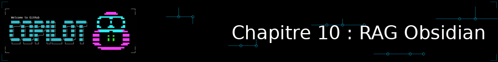
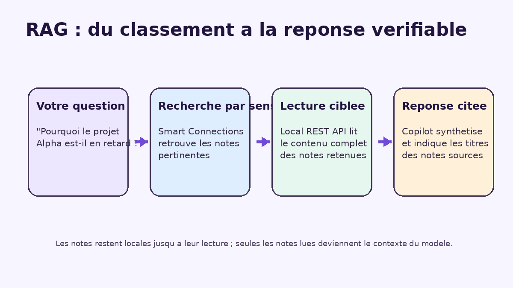
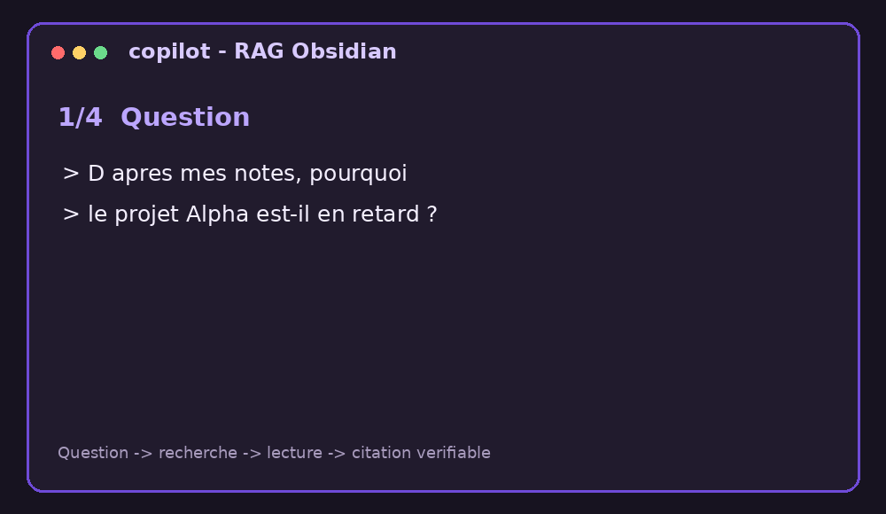

<!--
---
id: CopilotCLI-10
title: !translate Construire un pipeline RAG sur votre vault Obsidian
description: !translate Connectez Copilot CLI à vos notes Obsidian via deux serveurs MCP complémentaires pour poser des questions ancrées dans votre propre base de connaissances, avec une vraie recherche sémantique.
audience: Developers / Students / Terminal users
slug: rag-over-your-obsidian-vault
weight: 11
---
-->



> **Et si Copilot CLI pouvait répondre à vos questions en s'appuyant sur *vos propres notes*, plutôt que sur sa seule connaissance générale ?**

Jusqu'ici, Copilot CLI a répondu à partir de ce qu'il sait déjà, ou de ce qu'il trouve dans les fichiers de votre dépôt. Ce chapitre bonus lui donne accès à une troisième source : votre coffre (« vault ») **Obsidian**, votre base de notes personnelles. Vous allez mettre en place un vrai pipeline de **RAG** (*Retrieval-Augmented Generation*, génération augmentée par la recherche) : Copilot CLI recherche d'abord les notes pertinentes par similarité de sens, lit leur contenu complet, puis répond en citant ses sources — au lieu de deviner.

Ce chapitre s'appuie directement sur les **serveurs MCP** (Chapitre 07) : vous allez en connecter deux, chacun avec un rôle distinct, pour reproduire les trois étapes du RAG (retrieval, augmentation, génération). Si le Chapitre 07 vous semble flou, c'est le bon moment d'y jeter un œil rapide avant de continuer.

## 🎯 Objectifs d'apprentissage

À la fin de ce chapitre, vous serez capable de :

- Expliquer les trois étapes d'un pipeline RAG (retrieval, augmentation, génération) avec vos propres mots
- Connecter Copilot CLI à votre vault Obsidian via deux serveurs MCP complémentaires
- Distinguer une recherche littérale (mots-clés) d'une recherche sémantique (par similarité de sens)
- Poser à Copilot CLI une question de synthèse qui nécessite plusieurs notes, et vérifier ses citations
- Diagnostiquer les problèmes de connexion et d'indexation les plus courants

> ⏱️ **Durée estimée : ~55 minutes** (20 min de lecture + 35 min de pratique, installation des plugins Obsidian comprise)

---

## ✅ Prérequis

- Avoir terminé le [Chapitre 07 : Serveurs MCP](../07-mcp-servers/README.md) — ce chapitre réutilise le vocabulaire `mcp-config.json`, `/mcp show` et `/mcp config` sans les réexpliquer
- ⚠️ **Obsidian installé, avec un vault existant contenant déjà quelques notes** — c'est le seul prérequis de ce cours qui exige un outil en dehors de GitHub Copilot CLI lui-même ; ce chapitre est optionnel précisément pour cette raison
- ⚠️ Les plugins communautaires Obsidian **Local REST API** (v5.0 ou supérieure — voir encadré ci-dessous) et **Smart Connections** installés, activés, et votre vault déjà indexé par Smart Connections (voir la première section pour la marche à suivre)
- Node.js (déjà nécessaire depuis le Chapitre 01, pour `npx`)

---

## 🧩 Analogie du monde réel



| Concept | Copilot CLI seul | Copilot CLI + RAG Obsidian |
|---|---|---|
| D'où vient la réponse | La connaissance générale du modèle | Le contenu réel de vos notes |
| Comment il trouve l'information | Il ne la trouve pas : il la déduit ou la devine | Il recherche par sens, pas seulement par mot-clé exact |
| Comment vous vérifiez | Vous ne pouvez pas remonter à une source | Il cite les notes utilisées : vous pouvez les rouvrir |
| Ce qui se passe si vous ajoutez une note | Rien : le modèle ne la connaît toujours pas | Elle devient consultable dès qu'elle est indexée |

Pensez à un chercheur qui, plutôt que de répondre de mémoire ou de fouiller une pile de documents page par page, consulte un fichier déjà classé par thème : il retrouve directement les bons dossiers, les lit, puis rédige sa réponse en citant ses sources.

---

## Je veux... | Aller à...

| Je veux... | Aller à |
|---|---|
| Installer et indexer les plugins Obsidian | [Préparer votre vault](#préparer-votre-vault) |
| Connecter Copilot CLI à Obsidian | [Connecter Copilot CLI aux deux serveurs MCP](#connecter-copilot-cli-aux-deux-serveurs-mcp) |
| Poser une vraie question RAG | [Poser votre première question RAG](#poser-votre-première-question-rag) |
| Dépanner une connexion | [Erreurs courantes et dépannage](#-erreurs-courantes-et-dépannage) |

---

## Préparer votre vault

<a id="préparer-votre-vault"></a>

Deux plugins communautaires Obsidian jouent chacun un rôle différent dans ce pipeline RAG :

- **[Local REST API](https://github.com/coddingtonbear/obsidian-local-rest-api)** : expose votre vault (lecture, écriture, recherche littérale) à un client MCP. C'est la couche « accès au vault ».
- **[Smart Connections](https://github.com/brianpetro/obsidian-smart-connections)** : génère des embeddings locaux (aucune clé API, aucune donnée envoyée à l'extérieur) pour permettre une recherche **par sens** plutôt que par mot-clé exact. C'est la couche « recherche sémantique ».

Dans Obsidian, ouvrez **Settings → Community plugins → Browse**, cherchez puis installez les deux plugins, et activez-les.

> ⚠️ **Laissez Smart Connections terminer son indexation avant de continuer.** À la première activation, il génère les embeddings de toutes vos notes en arrière-plan — une barre de progression s'affiche dans les réglages du plugin. Sur un vault de quelques centaines de notes, comptez quelques minutes.

> 📚 **Version minimale de Local REST API : 5.0.** Depuis cette version, le plugin embarque directement son propre serveur MCP à l'URL `/mcp/` — plus besoin d'un pont externe. Si `Settings → Community plugins` indique une version antérieure, mettez à jour le plugin avant de continuer : sur une version plus ancienne, l'URL `/mcp/` utilisée plus bas n'existe pas et la connexion échoue sans message clair.

### Comprendre ce qui reste local et ce qui est envoyé au modèle

Avant de connecter un serveur MCP, décidez quelles notes vous acceptez de partager avec Copilot :

| Donnée | Où elle est traitée |
|---|---|
| Les embeddings et l'index de Smart Connections | Localement dans votre vault |
| Votre question et les résultats d'outils MCP | Par Copilot CLI et le modèle qui répond à votre question |
| Le texte complet d'une note | Envoyé au modèle **uniquement** si Copilot appelle l'outil de lecture du vault pour cette note |
| La clé Local REST API | Conservée dans votre variable d'environnement et transmise seulement à `127.0.0.1`, jamais dans votre prompt ni dans Git |

La recherche sémantique ne téléverse pas votre vault pour construire son index. En revanche, une fois que vous demandez à Copilot de lire une note, son contenu devient du contexte de votre conversation. N'activez donc ce flux que pour des notes que vous êtes autorisé à partager avec le service Copilot, et demandez une lecture ciblée plutôt qu'une lecture de tout le vault.

### Récupérer votre clé API et choisir le port

Ouvrez **Settings → Local REST API** : votre clé API s'affiche en haut de ce panneau, avec un bouton de copie à côté. Le plugin utilise HTTPS sur le port `27124` par défaut et son certificat est auto-signé ; activez explicitement le serveur HTTP local sur le port `27123` pour suivre l'exemple ci-dessous.

> ⚠️ HTTP est acceptable ici uniquement parce que l'URL vise `127.0.0.1`, c'est-à-dire votre propre machine. Ne rendez jamais ce serveur accessible depuis votre réseau ou Internet. Si vous préférez HTTPS, conservez `https://127.0.0.1:27124/mcp/` et installez d'abord le certificat auto-signé du plugin dans le magasin de certificats de votre système.

---

## Connecter Copilot CLI aux deux serveurs MCP

<a id="connecter-copilot-cli-aux-deux-serveurs-mcp"></a>

Comme vu au Chapitre 07, un serveur MCP distant se configure avec une URL, et un serveur MCP local se lance via une commande. Ici, vous avez besoin des deux à la fois.

> 📚 **Pourquoi ça fonctionne directement** : Copilot CLI prend en charge la révision de spec MCP `2026-07-28` depuis la v1.0.81 (voir Chapitre 07) — exactement celle que sert le serveur MCP natif de Local REST API. Vous n'avez donc aucun adaptateur de protocole à ajouter entre les deux.

Commencez par stocker la clé dans la variable d'environnement de votre terminal, sans la coller dans le fichier de configuration :

```bash
export OBSIDIAN_API_KEY='collez-ici-votre-cle-local-rest-api'
```

Ajoutez ensuite ceci à votre `.mcp.json` (à la racine du projet) ou à votre `~/.copilot/mcp-config.json` :

```json
{
  "mcpServers": {
    "obsidian": {
      "type": "http",
      "url": "http://127.0.0.1:27123/mcp/",
      "headers": {
        "Authorization": "Bearer ${OBSIDIAN_API_KEY}"
      },
      "tools": ["*"]
    },
    "smart-connections": {
      "type": "local",
      "command": "npx",
      "args": ["-y", "smart-connections-mcp"],
      "env": {
        "SMART_VAULT_PATH": "/chemin/absolu/vers/votre/vault"
      },
      "tools": ["*"]
    }
  }
}
```

Remplacez uniquement `/chemin/absolu/vers/votre/vault` par le chemin réel de votre vault sur disque. N'ajoutez pas votre clé dans ce JSON et ne versionnez pas un fichier qui la contient. Plusieurs vaults peuvent être séparés par des virgules dans `SMART_VAULT_PATH` (l'alias au pluriel `SMART_VAULT_PATHS` fonctionne aussi et devient prioritaire si les deux sont définies).

> 💡 **Restreindre l'accès à la lecture seule.** `"tools": ["*"]` autorise tous les outils du serveur — pratique pour suivre ce chapitre, mais `obsidian` expose aussi `vault_write`, `vault_delete` et `command_execute`. Pour un accès strictement en lecture, remplacez par une liste explicite, par exemple `"tools": ["vault_read", "vault_list", "search_simple"]`.

Vérifiez ensuite la connexion :

```bash
copilot

> /mcp config
```

Sélectionnez chaque serveur pour finaliser sa configuration, puis vérifiez avec `/mcp show` : `obsidian` et `smart-connections` doivent tous les deux apparaître comme activés.

> 💡 **`obsidian` répond mais `smart-connections` échoue au démarrage ?** Vérifiez que `SMART_VAULT_PATH` pointe bien vers le dossier racine de votre vault (celui qui contient le dossier `.obsidian`), avec un chemin absolu.

---

## Poser votre première question RAG

<a id="poser-votre-première-question-rag"></a>

Posez une question dont la réponse est dispersée entre plusieurs notes de votre vault — pas une seule note isolée, mais une vraie synthèse :

```bash
copilot

> D'après mes notes, fais-moi une synthèse de ce que je sais sur <un-sujet-present-dans-plusieurs-notes>. Utilise d'abord la recherche sémantique, puis lis uniquement les notes pertinentes. Pour chaque affirmation, indique une source au format [[titre-de-la-note]].
```

Le pipeline attendu est visible dans la chronologie de Copilot :

1. **Question** : vous formulez un besoin de synthèse.
2. **Recherche sémantique** : Smart Connections retrouve les titres les plus proches par sens, via son outil `search_notes` (ou `get_similar_notes` si vous partez d'une note précise plutôt que d'une question). Les noms exacts peuvent varier légèrement selon la version du serveur.
3. **Lecture ciblée du vault** : Local REST API fournit le contenu complet des seules notes retenues, via `vault_read` (ou `get_note_content` côté Smart Connections pour un extrait déjà découpé).
4. **Réponse citée** : Copilot synthétise et rattache chaque affirmation à un lien `[[titre-de-la-note]]`.

> 💡 **Recherche hybride.** Si votre question contient un identifiant exact (un nom de projet, un numéro de ticket), demandez explicitement à Copilot de combiner les deux approches : `search_simple` (littéral, sur Local REST API) pour ne rater aucune occurrence exacte, et `search_notes` (sémantique) pour les notes qui reformulent l'idée sans utiliser ce mot précis. C'est le principe de la **recherche hybride** : chaque méthode comble les angles morts de l'autre.

Par exemple, si votre vault contient les notes `Projet Alpha`, `Retro 2025-01` et `Standup API`, une réponse vérifiable peut ressembler à ceci :

> Le retard du projet vient surtout de la dépendance à l'API partenaire, confirmée lors de la rétrospective. La solution retenue est de livrer l'interface avec des données de démonstration, puis de brancher l'API dès qu'elle est disponible. **Sources :** [[Projet Alpha]], [[Retro 2025-01]], [[Standup API]].

Les titres et le contenu seront différents dans votre vault ; ce qui compte est que chaque `[[titre-de-la-note]]` corresponde au nom d'une note réellement lue.

<details>
<summary>🎬 Voyez-le en action !</summary>



*Le résultat peut varier selon votre modèle, vos outils et votre contexte : ne soyez pas surpris si votre sortie diffère de celle présentée ici — les notes retrouvées et leur ordre de citation dépendent entièrement du contenu de votre propre vault.*

</details>

Ouvrez ensuite une note citée dans Obsidian, par exemple en cliquant sur `[[Projet Alpha]]` dans votre propre réponse, et vérifiez qu'elle contient bien l'information utilisée. **Critère de réussite :** vous pouvez ouvrir au moins une citation, retrouver dans cette note le fait qu'elle soutient, et expliquer pourquoi Copilot ne l'a pas inventé. C'est le même réflexe de relecture qu'avec du code généré par IA — ne faites jamais confiance à une citation sans la vérifier au moins une fois.

---

## Pratique

### ▶️ À vous de jouer

1. Reformulez votre question pour forcer Copilot CLI à citer au moins trois notes différentes
2. Ajoutez une nouvelle note à votre vault, attendez que Smart Connections l'indexe (ou déclenchez une réindexation manuelle depuis ses réglages), puis reposez une question qui devrait maintenant l'inclure
3. Demandez à Copilot CLI d'écrire une note de synthèse *dans votre vault* (via `vault_write`), avec des liens `[[wikilink]]` vers chacune des notes sources qu'il a utilisées
4. Variante plus réaliste : au lieu d'écraser une note existante, demandez-lui d'ajouter la synthèse *sous une section précise* (par exemple `## Synthèse IA`) d'une note déjà existante, avec `vault_patch` plutôt que `vault_write` — cet outil cible un titre, un bloc ou le frontmatter sans toucher au reste de la note

---

## 📝 Devoir

**Défi principal** : posez une question dont la réponse nécessite de synthétiser au moins trois notes de votre vault, et vérifiez une par une que chaque citation renvoie bien à une note pertinente.

**Défi bonus** : ajoutez un second chemin de vault à `SMART_VAULT_PATH` (séparé par une virgule) et posez une question qui ne peut être répondue qu'en croisant une information présente dans chacun des deux vaults.

<details>
<summary>💡 Indices</summary>

- Pour le défi principal, choisissez un sujet que vous avez noté à plusieurs reprises, à des dates différentes ou sous des angles différents — c'est ce genre de sujet qui révèle le mieux l'intérêt de la synthèse
- Pour le défi bonus, demandez explicitement à Copilot CLI de préciser de quel vault provient chaque note citée

</details>

---

## 🔧 Erreurs courantes et dépannage

<details>
<summary>Cliquez pour voir les problèmes fréquents et leurs solutions</summary>

| Erreur | Ce qui se passe | Solution |
|---|---|---|
| `obsidian` absent de `/mcp show` | Le plugin Local REST API n'est pas activé, ou l'URL/le port est incorrect | Vérifiez Settings → Local REST API dans Obsidian, confirmez le port (27123 en HTTP), redémarrez Copilot CLI |
| Erreur `401 Unauthorized` sur le serveur `obsidian` | La clé API est absente, ou `OBSIDIAN_API_KEY` n'est pas définie dans le terminal qui lance Copilot | Exécutez à nouveau `export OBSIDIAN_API_KEY='...'`, puis relancez Copilot ; le header doit commencer par `Bearer ` |
| Erreur `401 Unauthorized` malgré une clé bien exportée | Certaines versions de Copilot CLI ne substituent pas encore `${VAR}` dans le champ `headers` d'un serveur `http` (seul `env` est garanti) ; le serveur reçoit alors littéralement `Bearer ${OBSIDIAN_API_KEY}` | Mettez à jour Copilot CLI vers la dernière version ; si le problème persiste, collez temporairement la valeur en clair dans un fichier de config **non versionné** (jamais dans `.mcp.json` s'il est suivi par Git) |
| Erreur de certificat sur le port 27124 | Vous utilisez l'URL HTTPS, qui repose sur un certificat auto-signé | Préférez HTTP sur `127.0.0.1:27123` pour ce TP, ou installez le certificat du plugin dans votre système avant de conserver HTTPS |
| `smart-connections` absent de `/mcp show` ou plante au démarrage | `SMART_VAULT_PATH` pointe vers un chemin incorrect | Vérifiez que le chemin est absolu et pointe vers le dossier qui contient `.obsidian` |
| La recherche renvoie `"mode": "keyword"` au lieu de `"mode": "semantic"` | Smart Connections n'a pas encore terminé (ou pas commencé) l'indexation de vos notes | Ouvrez Obsidian, attendez la fin de la barre de progression d'indexation dans les réglages du plugin, puis réessayez |
| Une note récente n'apparaît jamais dans les réponses | Elle n'a pas encore été indexée par Smart Connections | Attendez la réindexation automatique, ou déclenchez-en une manuellement depuis les réglages du plugin |

</details>

---

## Résumé

Vous avez connecté Copilot CLI à votre vault Obsidian via deux serveurs MCP complémentaires — l'un pour la recherche sémantique, l'autre pour l'accès au contenu — et obtenu des réponses ancrées dans vos propres notes, citations à l'appui.

### 🔑 Points clés à retenir

1. Un pipeline RAG combine trois étapes : **retrieval** (retrouver les bonnes notes), **augmentation** (leur contenu complet devient du contexte), **génération** (la réponse s'appuie dessus)
2. La recherche sémantique (par sens) et la recherche littérale (par mot-clé) sont complémentaires : la première trouve des notes que la seconde raterait
3. Deux serveurs MCP peuvent jouer des rôles différents et complémentaires dans un même pipeline, exactement comme vous connecteriez plusieurs outils à un même flux de travail
4. Vérifiez toujours les citations d'une réponse RAG en rouvrant les notes sources, exactement comme vous relisez du code généré

---

## 📋 Référence rapide

- [Exemple de config MCP pour ce chapitre](../samples/mcp-configs/obsidian-rag-mcp-config.json) — à copier-coller dans votre `.mcp.json`
- [obsidian-local-rest-api](https://github.com/coddingtonbear/obsidian-local-rest-api) — plugin d'accès au vault, avec serveur MCP natif depuis la v5.0 (documentation de ses 14 outils dans le README du dépôt)
- [obsidian-smart-connections](https://github.com/brianpetro/obsidian-smart-connections) — plugin d'embeddings locaux
- [smart-connections-mcp](https://github.com/msdanyg/smart-connections-mcp) — serveur MCP de recherche sémantique
- [Chapitre 07 : Serveurs MCP](../07-mcp-servers/README.md) — pour approfondir la configuration MCP

---

## ➡️ Et ensuite ?

Vous avez maintenant vu Copilot CLI puiser dans trois sources différentes au fil de ce cours : sa connaissance générale, les fichiers de votre dépôt, et vos notes personnelles. Le principe reste le même partout — plus la source est vérifiable, plus vous pouvez faire confiance à la réponse.

**[← Chapitre précédent : Environnements isolés](../09-isolated-environments/README.md)** | **[Retour à l'accueil du cours →](../README.md)**
