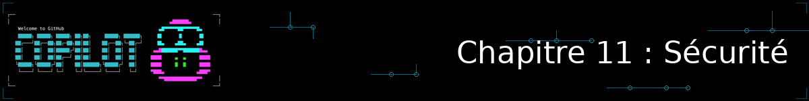
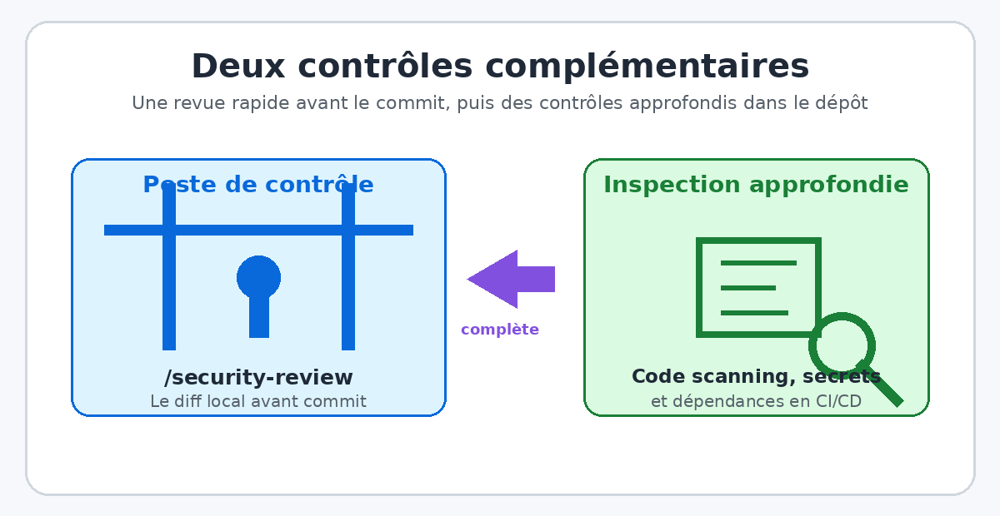
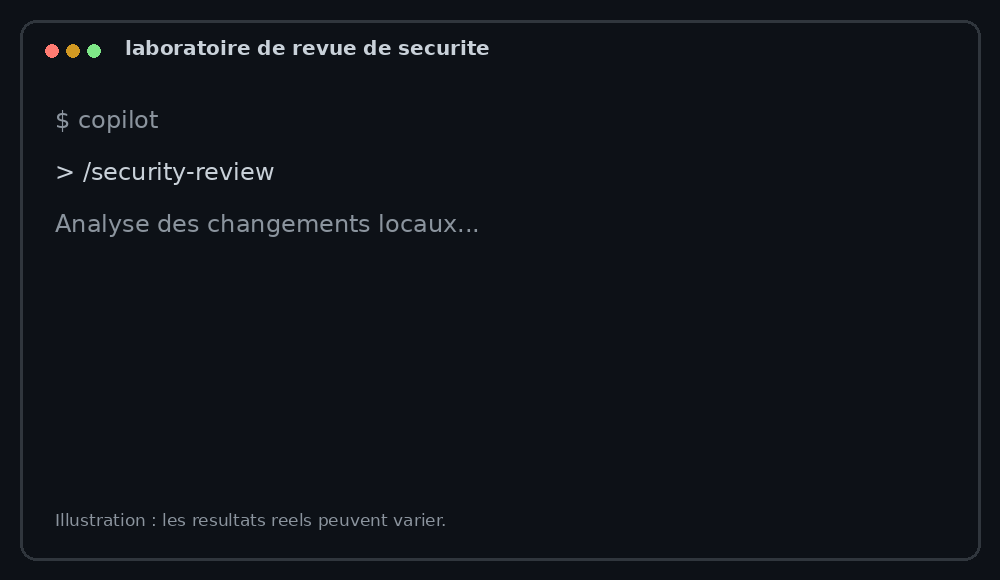

<!--
---
id: CopilotCLI-11
title: !translate Sécuriser votre code avec Copilot CLI
description: !translate Utilisez la revue de sécurité dédiée de Copilot CLI, protégez vos secrets avec les exclusions de contenu, et entraînez-vous à détecter de vraies vulnérabilités dans du code volontairement vulnérable.
audience: Developers / Students / Terminal users
slug: security-with-copilot
weight: 12
---
-->



> **Et si Copilot CLI pouvait repérer une faille de sécurité dans votre code avant même que vous ne la commitiez ?**

Depuis le Chapitre 04, vous avez déjà croisé la sécurité à plusieurs reprises : un aparté sur l'audit d'un fichier bugué (Chapitre 04), un skill `security-audit` maison basé sur le Top 10 OWASP (Chapitre 06), et un hook de pre-commit qui lance une revue automatique avant chaque commit (Chapitre 08). Ce chapitre rassemble ces briques et ajoute la pièce qui manquait : la commande **`/security-review`**, une revue de sécurité native de Copilot CLI, conçue spécifiquement pour scanner vos changements avant qu'ils ne partent en revue de code humaine.

## 🎯 Objectifs d'apprentissage

À la fin de ce chapitre, vous serez capable de :

- Activer et utiliser la commande `/security-review` pour scanner vos changements locaux
- Distinguer les catégories de vulnérabilités couvertes par cette revue, et celles qui ne le sont pas
- Écrire des instructions personnalisées qui orientent Copilot vers des pratiques de code sécurisées par défaut
- Protéger vos secrets avec les exclusions de contenu, et connaître leurs limites
- Adopter les réflexes de prudence nécessaires face aux risques d'exécution de commandes non supervisées
- Mener un audit de sécurité complet sur du code volontairement vulnérable

> ⏱️ **Durée estimée : ~40 minutes** (15 min de lecture + 25 min de pratique)

---

## ✅ Prérequis

- Avoir terminé le [Chapitre 04 : Flux de travail de développement](../04-development-workflows/README.md) — ce chapitre réutilise le réflexe de revue de code établi là-bas
- Avoir terminé le [Chapitre 06 : Automatiser les tâches répétitives](../06-skills/README.md) — pour comparer la commande native `/security-review` à un skill `security-audit` personnalisé
- ⚠️ **Copilot CLI dans une version qui propose `/security-review`, avec le mode expérimental activé** — cette fonctionnalité est en préversion publique. Vérifiez votre version avec `copilot --version`, puis lancez `copilot` et utilisez `/experimental` pour activer le mode expérimental. Si `/security-review` ne figure toujours pas dans `/help`, mettez à jour Copilot CLI avec `/update` ou suivez les instructions d'installation officielles.
- Un dépôt avec des changements locaux (fichiers modifiés ou stagés) à scanner — un diff vide n'a rien à analyser

---

## 🧩 Analogie du monde réel



| Concept | `/security-review` (Copilot CLI) | Code Scanning / Dependabot / Snyk |
|---|---|---|
| Ce qu'il regarde | Votre diff local, avant commit | L'historique complet du dépôt, les dépendances publiées |
| Vitesse | Quelques secondes, dans le terminal | Minutes, en CI/CD |
| Ce qu'il détecte | Des failles de code (injection, XSS, secrets en dur, etc.) | Des CVE connues, des chaînes de dépendances vulnérables, des flux de données inter-fichiers |
| Quand l'utiliser | Avant de committer, en continu pendant que vous codez | En CI/CD, sur chaque pull request, en continu sur les dépendances |

Pensez à `/security-review` comme au vigile qui contrôle rapidement votre sac à l'entrée d'un bâtiment : utile et immédiat, mais il ne remplace pas le service douanier qui inspecte en profondeur (Code Scanning avec CodeQL, Dependabot, Snyk) — les deux se complètent, ils n'interviennent pas au même moment ni sur le même périmètre.

---

## Je veux... | Aller à...

| Je veux... | Aller à |
|---|---|
| Scanner mes changements avant de commit | [Lancer une revue avec /security-review](#lancer-une-revue-avec-security-review) |
| Définir des règles de sécurité par défaut | [Écrire des instructions de sécurité par défaut](#écrire-des-instructions-de-sécurité-par-défaut) |
| Empêcher Copilot de voir mes secrets | [Protéger vos secrets](#protéger-vos-secrets) |
| Comprendre les limites et les risques | [Comprendre les limites et les risques](#comprendre-les-limites-et-les-risques) |

---

## Lancer une revue avec /security-review

<a id="lancer-une-revue-avec-security-review"></a>

Une fois le mode expérimental activé, lancez la commande depuis un projet de confiance contenant des changements locaux :

```bash
copilot

> /security-review
```

Copilot CLI analyse alors les changements stagés et non stagés que vous vous apprêtez à committer, et renvoie des failles à forte confiance classées par **sévérité** (Critique/Élevée/Moyenne/Faible). Chaque résultat peut inclure une explication et une correction suggérée à examiner avant application.

Les catégories couvertes sont larges :

| Catégorie | Exemple typique |
|---|---|
| Injection (SQL, commande shell, etc.) | Entrée utilisateur concaténée directement dans une requête ou une commande |
| Cross-Site Scripting (XSS) | Contenu utilisateur affiché sans échappement |
| Contrôle d'accès défaillant / traversée de chemin | Vérification d'autorisation manquante, `../` non filtré dans un chemin de fichier |
| SSRF (Server-Side Request Forgery) | Requête sortante construite à partir d'une entrée utilisateur non validée |
| Désérialisation non sécurisée / pollution de prototype | `pickle.loads()` sur des données non fiables, fusion d'objets non contrôlée |
| Cryptographie faible | MD5/SHA1 pour des mots de passe, générateur aléatoire non sécurisé |
| Secrets en dur | Clés API ou mots de passe écrits directement dans le code source |
| Fuite de données sensibles | Mots de passe ou numéros de carte écrits dans les logs |
| Authentification / CORS défaillants | Sessions mal invalidées, en-tête `Access-Control-Allow-Origin` trop permissif |
| Mauvaise configuration de sécurité | Dépendances non figées à une version précise (risque de chaîne d'approvisionnement) |
| Injection de prompt inter-agents (XPIA) | Contenu non fiable qui s'injecte dans un prompt destiné à une IA |

> 💡 **Cette commande ne remplace pas une analyse de vulnérabilités connues (CVE) ni un audit de dépendances.** Elle se concentre sur des schémas de code à risque, pas sur des correspondances avec des bases de CVE ou une analyse de flux de données inter-fichiers approfondie (« taint analysis »). Détail complet dans [Comprendre les limites et les risques](#comprendre-les-limites-et-les-risques).

---

## Écrire des instructions de sécurité par défaut

<a id="écrire-des-instructions-de-sécurité-par-défaut"></a>

`/security-review` réagit *après coup*, sur du code déjà écrit. Pour prévenir une partie des failles *avant* qu'elles n'apparaissent, complétez votre `.github/copilot-instructions.md` (vu au [Chapitre 05](../05-agents-custom-instructions/README.md)) avec des règles de sécurité explicites :

```markdown
## Sécurité

- Ne jamais coder en dur une clé API, un mot de passe ou un jeton : utiliser des variables d'environnement
- Toujours utiliser des requêtes paramétrées, jamais de concaténation de chaînes dans une requête SQL
- Hacher les mots de passe avec un algorithme dédié (bcrypt, argon2) — jamais MD5 ni SHA1
- Valider et échapper toute entrée utilisateur avant de l'afficher ou de l'exécuter
```

Ces instructions se chargent automatiquement à chaque session, sans que vous ayez à les répéter : c'est une défense en profondeur qui complète `/security-review`, plutôt qu'un doublon — l'une prévient, l'autre détecte ce qui est passé au travers.

---

## Protéger vos secrets

<a id="protéger-vos-secrets"></a>

Les **exclusions de contenu** (configurables au niveau organisation ou dépôt sur GitHub) permettent d'empêcher certains fichiers d'alimenter les suggestions, le chat ou la revue de code Copilot. C'est une bonne pratique à mettre en place, mais elle a une limite documentée qu'il faut connaître : **les exclusions de contenu ne couvrent pas Copilot CLI ni le mode agent**. Un fichier exclu côté suggestions IDE peut donc rester parfaitement lisible par Copilot CLI dans votre terminal.

La règle qui en découle est simple et ne dépend d'aucun réglage : **ne laissez jamais un secret réel dans un fichier que Copilot peut lire**, exclusion de contenu ou non. En pratique :

- Gardez vos secrets dans un fichier `.env` non versionné (déjà listé dans votre `.gitignore`), ou dans un gestionnaire de secrets qui les injecte à l'exécution
- Ne collez jamais une vraie clé d'API dans un prompt, même pour « juste tester »
- Si vous devez partager un fichier de configuration en exemple, remplacez chaque valeur sensible par un placeholder explicite (`YOUR_API_KEY_HERE`)

### Checklist secrets : à faire avant toute exécution automatisée

Avant de lancer Copilot CLI, et en particulier avant d'autoriser des outils ou un mode automatisé, vérifiez ces points :

- [ ] Le dossier ouvert est un dépôt que vous connaissez et auquel vous faites confiance.
- [ ] Aucun fichier accessible ne contient de clé API, mot de passe, jeton, certificat ou fichier `.env` réel.
- [ ] Les valeurs de démonstration sont des placeholders ou des clés explicitement factices, jamais des secrets de test encore valides.
- [ ] Vous n'activez pas `--allow-all` pour un dépôt inconnu ; si l'automatisation est indispensable, utilisez d'abord l'environnement isolé du [Chapitre 09](../09-isolated-environments/README.md).
- [ ] Vous relirez chaque commande et chaque modification proposée avant de l'approuver.

Cette checklist précède volontairement l'exercice : une revue de sécurité peut lire le diff et les fichiers nécessaires à son analyse. Les fichiers de `samples/buggy-code/` contiennent uniquement des secrets factices destinés à être détectés.

---

## Comprendre les limites et les risques

<a id="comprendre-les-limites-et-les-risques"></a>

`/security-review` est une fonctionnalité **expérimentale, en préversion publique** : le nombre de failles détectées, leur formulation ou leur sévérité peuvent évoluer d'une version à l'autre de Copilot CLI. Elle ne fait ni correspondance avec des CVE connues, ni analyse de dépendances, ni analyse de flux de données inter-fichiers approfondie — c'est le rôle de GitHub Code Scanning (CodeQL), Dependabot et d'outils tiers comme Snyk, en complément et non en remplacement.

> ⚠️ **Une revue sans résultat n'est pas une preuve d'absence de vulnérabilité.** Elle peut manquer une faille, mal interpréter le contexte ou ne pas couvrir une dépendance. Conservez les revues humaines, les tests, la gestion des dépendances et le scanner de secrets dans votre processus.

> ⚠️ **Gardez aussi un œil sur ce que Copilot CLI *exécute*, pas seulement sur ce qu'il *écrit*.** Des chercheurs en sécurité ont documenté des cas où une entrée conçue pour l'occasion contournait la liste de commandes en lecture seule normalement approuvées sans confirmation, jusqu'à faire exécuter une commande réseau (téléchargement puis exécution d'un script) sans validation explicite. GitHub a qualifié ce cas de risque faible et n'a pas annoncé de correctif immédiat au moment de la rédaction. La bonne pratique reste la même que celle déjà rencontrée dans les chapitres précédents : **relisez toujours une commande proposée avant de l'approuver**, et évitez de faire tourner un dépôt non fiable en mode entièrement autonome (autopilot) sans supervision. Si vous avez besoin de ce mode entièrement autonome (`--allow-all`), construisez d'abord l'environnement sûr qui le rend acceptable : voir le [Chapitre 09 : Environnements isolés](../09-isolated-environments/README.md).

<details>
<summary>🎬 Voyez-le en action !</summary>



*Le résultat peut varier selon votre modèle, vos outils et votre contexte : ne soyez pas surpris si votre sortie diffère de celle présentée ici — le nombre de failles détectées, leur sévérité, ou le texte exact des corrections proposées peuvent changer d'une session à l'autre.*

</details>

---

## Pratique : un scénario de revue complet

Le dossier [`samples/buggy-code/`](../samples/buggy-code/README.md) contient du code volontairement vulnérable (injection SQL, secrets en dur, désérialisation dangereuse, etc.). **Ne corrigez jamais ces fichiers dans le dépôt du cours.** Le laboratoire ci-dessous copie `user_service.py` dans un dossier temporaire et le stage comme un nouveau fichier : la revue reçoit ainsi le fichier entier dans son diff, sans modifier l'exemple pédagogique.

### 1. Détecter les problèmes

Après avoir effectué la [checklist secrets](#checklist-secrets--à-faire-avant-toute-exécution-automatisée), exécutez ces commandes depuis la racine du dépôt :

```bash
LAB_DIR="$(mktemp -d)"
git init "$LAB_DIR"
cp samples/buggy-code/python/user_service.py "$LAB_DIR/user_service.py"
cd "$LAB_DIR"
git add user_service.py

copilot

> /security-review
```

**Résultats attendus :** la formulation et la sévérité peuvent varier, mais la revue doit notamment attirer l'attention sur la requête SQL construite avec `user_id` (environ ligne 15), la journalisation du mot de passe, le secret JWT en dur, le hachage MD5 et `pickle.loads()` sur des données non fiables. Notez les résultats, leur sévérité et leur niveau de confiance : un résultat est une hypothèse à examiner, pas une correction automatique.

Si votre version ne propose pas `/security-review`, utilisez ce repli manuel dans la même session Copilot :

```text
Examine @user_service.py pour les vulnérabilités de sécurité. Liste chaque problème avec sa ligne, son impact, son niveau de sévérité et une correction sûre. Ne modifie aucun fichier.
```

### 2. Valider manuellement un résultat

Choisissez l'injection SQL de `get_user`. Lisez la ligne signalée : `user_id` est inséré directement dans la requête SQL. Expliquez ensuite à Copilot pourquoi une valeur telle que `1 OR 1=1` peut modifier le sens de la requête. Ne lancez pas cet exemple contre une base contenant des données réelles.

Pour chaque résultat, vérifiez vous-même :

1. La donnée est-elle réellement contrôlée par un utilisateur ou une source non fiable ?
2. La ligne signalée atteint-elle une opération sensible (requête SQL, journal, désérialisation, etc.) ?
3. La correction suggérée préserve-t-elle le comportement attendu et n'introduit-elle pas de secret dans le code ?

### 3. Corriger uniquement dans le laboratoire

Le fichier du laboratoire est une copie : vous pouvez y tester une correction sans changer `samples/buggy-code/`. Demandez une correction ciblée et relisez le diff :

```text
Dans @user_service.py, corrige uniquement l'injection SQL de get_user avec une requête paramétrée. N'applique aucune autre correction et n'ajoute aucun secret.
```

La correction attendue transmet `user_id` comme paramètre séparé à `cursor.execute`, au lieu de le concaténer dans la chaîne SQL. Vérifiez le diff proposé, puis stagez seulement cette correction :

```bash
git diff -- user_service.py
git add user_service.py
```

### 4. Relire après la correction

Dans la même session, relancez :

```text
/security-review
```

**Résultat attendu :** le signalement concernant la concaténation SQL dans `get_user` disparaît ou est résolu. Les autres problèmes intentionnels du fichier, comme le secret JWT, MD5 ou `pickle.loads()`, restent signalables tant que vous ne les avez pas corrigés dans le laboratoire. Cette dernière revue confirme seulement le changement examiné ; elle ne certifie pas que le fichier est sûr.

Lorsque vous avez terminé, fermez la session et supprimez le dossier temporaire créé par `mktemp` à l'aide du chemin exact affiché par votre terminal. Ne copiez pas la correction vers `samples/buggy-code/`.

---

## 📝 Devoir

**Défi principal** : reprenez le scénario avec `samples/buggy-code/python/payment_processor.py` dans un nouveau laboratoire temporaire. Détectez une faille, validez-la manuellement, corrigez-la uniquement dans la copie, puis relancez `/security-review`. Ne committez pas cette correction dans le vrai dépôt du cours : ce dossier est un terrain d'exercice intentionnellement bugué.

**Défi bonus** : sur un projet personnel, ajoutez une section « Sécurité » à votre propre `.github/copilot-instructions.md`, puis vérifiez avec un prompt neutre (« écris-moi une fonction qui stocke un mot de passe ») que Copilot applique désormais ces règles par défaut.

<details>
<summary>💡 Indices</summary>

- Pour le défi principal, demandez explicitement « Applique la correction proposée pour la faille [nom] dans ce fichier »
- Pour le défi bonus, formulez des règles courtes et impératives (« Ne jamais... », « Toujours... ») plutôt que des explications longues — Copilot les respecte mieux ainsi

</details>

---

## 🔧 Erreurs courantes et dépannage

<details>
<summary>Cliquez pour voir les problèmes fréquents et leurs solutions</summary>

| Erreur | Ce qui se passe | Solution |
|---|---|---|
| `/security-review` introuvable ou ignorée | Mode expérimental non activé, ou version de Copilot CLI trop ancienne | Mettez à jour Copilot CLI et activez le mode expérimental (`copilot --help` ou la documentation officielle pour la syntaxe de votre version) |
| « Aucun changement à analyser » | Aucun fichier modifié ou stagé dans le dépôt courant | Modifiez ou stagez (`git add`) au moins un fichier avant de relancer la commande |
| Résultat différent d'une exécution à l'autre | La commande est encore en préversion publique, le modèle sous-jacent peut évoluer | Normal pour une fonctionnalité expérimentale — recoupez avec une revue manuelle ou votre skill `security-audit` |
| Aucune CVE ni dépendance vulnérable signalée | Ce n'est pas le rôle de `/security-review` : elle analyse des schémas de code, pas des bases de CVE | Utilisez GitHub Code Scanning (CodeQL) et Dependabot en complément |
| Copilot exécute une commande shell sans confirmation attendue | Une liste de commandes en lecture seule peut être détournée par une entrée malveillante | Ne désactivez jamais les approbations sur un dépôt non fiable ; relisez chaque commande proposée avant de l'approuver |

</details>

---

## Résumé

Vous avez ajouté une dernière brique à votre flux de travail sécurité : une commande native pour scanner vos changements en quelques secondes, des instructions par défaut qui préviennent certaines failles avant même qu'elles n'apparaissent, et les réflexes de prudence nécessaires face aux limites réelles de l'outil.

### 🔑 Points clés à retenir

1. `/security-review` scanne votre diff local sur plusieurs catégories de vulnérabilités, directement dans le terminal (fonctionnalité expérimentale, en évolution)
2. Elle complète, sans les remplacer, les outils qui analysent l'historique du dépôt et les dépendances (Code Scanning/CodeQL, Dependabot, Snyk)
3. Des instructions de sécurité par défaut dans `.github/copilot-instructions.md` préviennent des failles avant même qu'elles ne soient écrites
4. Les exclusions de contenu ne couvrent pas Copilot CLI : la seule protection fiable pour un secret reste de ne jamais le placer dans un fichier lisible par l'IA
5. Relisez toujours une commande proposée par Copilot CLI avant de l'approuver, exactement comme vous relisez du code généré

---

## 📋 Référence rapide

- [Dedicated security review command now available in Copilot CLI](https://github.blog/changelog/2026-06-10-dedicated-security-review-command-now-available-in-copilot-cli/) — annonce officielle de `/security-review`
- [Best practices for GitHub Copilot CLI](https://docs.github.com/en/copilot/how-tos/copilot-cli/cli-best-practices) — bonnes pratiques générales, dont la sécurité
- [Responsible use of GitHub Copilot CLI](https://docs.github.com/en/enterprise-cloud@latest/copilot/responsible-use/copilot-cli) — limites et usage responsable
- [Chapitre 06 : Automatiser les tâches répétitives](../06-skills/README.md) — le skill `security-audit` maison
- [samples/buggy-code](../samples/buggy-code/README.md) — le code volontairement vulnérable utilisé dans ce chapitre

---

## ➡️ Et ensuite ?

Vous avez terminé le parcours de ce cours : de l'installation de Copilot CLI à la sécurisation de votre code, en passant par les agents, les skills, les serveurs MCP et les environnements isolés. La suite vous appartient : appliquez ces réflexes sur vos propres projets, et gardez toujours la relecture humaine comme dernière ligne de défense.

**[← Chapitre précédent : Environnements isolés](../09-isolated-environments/README.md)** | **[Retour à l'accueil du cours →](../README.md)**
