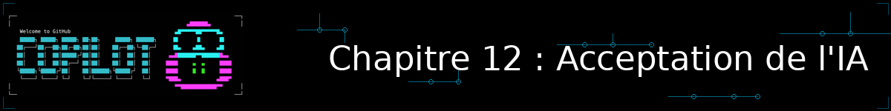
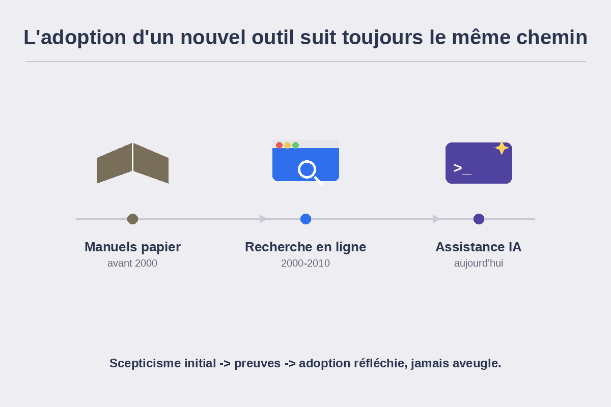

<!--
---
id: CopilotCLI-12
title: !translate Comprendre l'acceptation de l'IA par les développeurs
description: !translate Découvrez ce que les études de GitHub, McKinsey, DORA, Stack Overflow et LinearB révèlent sur les impacts positifs de l'IA sur les développeurs, et confrontez ces résultats à votre propre expérience de Copilot CLI.
audience: Developers / Students / Terminal users
slug: developer-acceptance-of-ai
weight: 13
---
-->

> **Et si vos impressions sur l'IA pouvaient être vérifiées par des chiffres ?**

Depuis le Chapitre 01, vous avez installé, testé et pratiqué Copilot CLI sur des tâches concrètes : revue de code, débogage, génération de tests, agents personnalisés, skills, serveurs MCP, workflows n8n. Ce chapitre bonus change de nature : il ne vous apprend pas une nouvelle commande, mais vous invite à prendre du recul. Que dit la recherche indépendante — et pas seulement le discours commercial des éditeurs d'outils — de l'impact réel de l'IA sur le travail des développeurs et développeuses ? Et où se situe votre propre expérience par rapport à ces données ?

## 🎯 Objectifs d'apprentissage

À la fin de ce chapitre, vous serez capable de :

- Citer cinq études de référence sur l'IA et la productivité des développeurs (GitHub, McKinsey, DORA, Stack Overflow, LinearB)
- Distinguer un chiffre de productivité mesurée d'un chiffre de productivité perçue ou autodéclarée
- Identifier les facteurs qui font varier les bénéfices de l'IA d'une équipe à l'autre
- Mener votre propre auto-évaluation et la confronter aux données présentées

> ⏱️ **Durée estimée : ~30 minutes** (20 min de lecture + 10 min d'auto-évaluation)

---

## ✅ Prérequis

- Avoir pratiqué au moins les [Chapitres 01 à 04](../04-development-workflows/README.md) — une expérience réelle de Copilot CLI est nécessaire pour l'auto-évaluation de ce chapitre
- Les Chapitres 09 et 10 (bonus) ne sont pas nécessaires pour suivre celui-ci
- Aucun outil supplémentaire requis : ce chapitre se lit et se pratique sans installation

---

## 🧩 Analogie du monde réel

| Concept | Adoption de « chercher sa réponse en ligne » (années 2000-2010) | Adoption de l'IA de codage (aujourd'hui) |
|---|---|---|
| Scepticisme initial | « Un vrai développeur lit la documentation officielle, pas des réponses de forum » | « Un vrai développeur écrit son code lui-même, il ne le délègue pas à une IA » |
| Ce que les études ont fini par montrer | Les développeurs qui cherchaient en ligne résolvaient certains problèmes plus vite qu'en épluchant des manuels | Les développeurs qui utilisent l'IA complètent certaines tâches nettement plus vite, avec une charge mentale réduite |
| Ce qui reste vrai malgré l'adoption | Il faut toujours vérifier la réponse trouvée et son contexte avant de l'utiliser | Il faut toujours relire et valider ce que l'IA produit avant de l'utiliser |

Chaque vague d'outillage a connu le même cycle : scepticisme légitime, puis données à l'appui, puis adoption prudente plutôt qu'aveugle. Ce chapitre vous donne les données ; à vous d'en tirer une adoption réfléchie plutôt qu'un simple effet de mode.

---

## Pourquoi cette question compte

L'IA de codage fait l'objet d'un discours à deux vitesses : d'un côté des annonces d'éditeurs qui promettent des gains spectaculaires, de l'autre un scepticisme tout aussi répandu chez les développeurs qui ont vu passer une IA générer du code erroné avec assurance. Entre les deux, la recherche indépendante — enquêtes à grande échelle, expériences contrôlées, études de cas en entreprise — offre un terrain plus solide pour se faire une opinion. Voici ce qu'elle dit.

## Ce que montrent les études

Avant d'entrer dans le détail, un repère utile : chaque étude ci-dessous repose sur un type de preuve différent, et ces trois types ne se valent pas de la même façon.

- **Mesure expérimentale** : un groupe test et un groupe témoin sont comparés sur une tâche identique, avec un résultat chronométré ou objectivement vérifiable (ex. le temps mis pour écrire un serveur HTTP). C'est la preuve la plus solide, mais aussi la plus coûteuse à produire — d'où des échantillons souvent restreints.
- **Corrélation observée** : deux phénomènes varient ensemble dans des données réelles (ex. « les équipes à architecture découplée gagnent plus avec l'IA ») sans qu'un groupe témoin randomisé isole la cause. Utile pour repérer des tendances, insuffisant pour prouver un lien de cause à effet.
- **Perception / autodéclaration** : les personnes interrogées rapportent elles-mêmes leur ressenti (« je me sens plus productif·ve »), sans mesure indépendante. Précieux pour capter le vécu et la confiance, mais soumis aux biais de mémoire et de désirabilité sociale.

Chaque étude ci-dessous précise son URL, sa date de publication, la population étudiée, le ou les types de preuve mobilisés, et ses limites méthodologiques.

### GitHub Research : une expérience contrôlée sur la vitesse de complétion

En 2022 (mise à jour en 2024), la chercheuse Eirini Kalliamvakou et son équipe ont publié l'une des études les plus citées sur le sujet. Une expérience contrôlée a réparti 95 développeurs professionnels en deux groupes, avec pour tâche d'écrire un serveur HTTP en JavaScript : le groupe utilisant GitHub Copilot a terminé **55 % plus vite** (1 h 11 en moyenne, contre 2 h 41 pour le groupe témoin), avec un taux de réussite de 78 % contre 70 %. Le résultat est statistiquement significatif (P = .0017).

Une enquête complémentaire menée auprès de plus de 2 000 développeurs a mesuré des effets moins chronométrables mais tout aussi concrets : 73 % déclarent rester plus facilement « en flow », 87 % économisent de l'effort mental sur les tâches répétitives, et entre 60 et 75 % se sentent plus épanouis et moins frustrés dans leur travail. Un ingénieur senior interrogé résume ainsi son expérience : *« I have to think less, and when I have to think it's the fun stuff. »*

> 📎 **Source :** [GitHub Blog — Research: quantifying GitHub Copilot's impact](https://github.blog/news-insights/research/research-quantifying-github-copilots-impact-on-developer-productivity-and-happiness/) · **Date :** 2022, mise à jour 2024 · **Population :** 95 développeurs professionnels (expérience contrôlée) + 2 000+ développeurs (enquête complémentaire) · **Type de preuve :** mesure expérimentale (temps chronométré, groupe témoin) pour le chiffre de 55 %, perception autodéclarée (enquête) pour le flow et l'effort mental · **Limites méthodologiques :** une seule tâche testée (serveur HTTP en JavaScript) sur un échantillon restreint de volontaires ; l'enquête complémentaire est déclarative et peut surreprésenter les utilisateurs déjà convaincus par l'outil ; étude financée et publiée par l'éditeur de l'outil évalué.

### McKinsey : des gains qui dépendent du type de tâche

L'étude McKinsey *« Unleashing developer productivity with generative AI »* (2023) montre que les gains de productivité varient fortement selon la nature de la tâche : jusqu'à deux fois plus rapide sur des tâches bien cadrées, avec des gains de 35 à 50 % sur la rédaction de documentation, environ 50 % sur la génération de nouveau code, et près des deux tiers sur le refactoring.

Le même rapport apporte une nuance importante : sur des tâches complexes ou faisant appel à un framework peu familier au développeur, le gain de temps tombe sous les 10 %. Les auteurs recommandent un accompagnement structuré (formation, sélection des cas d'usage) plutôt qu'un déploiement sans préparation.

> 📎 **Source :** [McKinsey — Unleashing developer productivity with generative AI](https://www.mckinsey.com/capabilities/tech-and-ai/our-insights/unleashing-developer-productivity-with-generative-ai) · **Date :** 2023 · **Population :** panel de développeurs en entreprise observés sur des tâches réelles (documentation, génération de code, refactoring) · **Type de preuve :** corrélation observée entre usage de l'IA et temps de complétion sur des tâches en contexte réel, sans groupe témoin randomisé comme dans l'étude GitHub Research · **Limites méthodologiques :** l'absence de randomisation empêche d'exclure d'autres facteurs (expérience du développeur, complexité réelle de la tâche) ; les gains rapportés varient énormément selon la familiarité avec le framework utilisé, ce qui limite la généralisation d'un chiffre unique.

### DORA : l'IA comme « amplificateur », pas comme solution magique

Le rapport 2025 de DORA (DevOps Research and Assessment, adossé à Google Cloud), *« State of AI-Assisted Software Development »*, indique que 90 % des répondants utilisent déjà l'IA dans leur travail, et plus de 80 % déclarent une productivité accrue. Sa thèse centrale est plus nuancée que ce seul chiffre : l'IA agirait comme un **amplificateur** des pratiques déjà en place, plutôt que comme un facteur de progrès universel.

Deux études de cas l'illustrent. Chez Adidas, les équipes travaillant sur une architecture faiblement couplée ont vu leur productivité progresser de 20 à 30 %, avec une hausse de 50 % du « Happy Time » (le temps réellement passé à coder plutôt qu'en tâches administratives) — tandis que les équipes dépendantes d'un ERP historique fortement couplé n'en ont tiré presque aucun bénéfice. Chez Booking.com, une formation ciblée des équipes a permis jusqu'à 30 % de merge requests supplémentaires, accompagnée d'une amélioration notable de la satisfaction au travail.

> 📎 **Source :** [DORA — State of AI-Assisted Software Development 2025](https://dora.dev/dora-report-2025/) · **Date :** 2025 · **Population :** enquête à grande échelle auprès de praticiens DevOps, complétée par deux études de cas en entreprise (Adidas, Booking.com) · **Type de preuve :** perception autodéclarée (productivité accrue déclarée par plus de 80 % des répondants) combinée à une analyse corrélationnelle entre pratiques d'ingénierie existantes et gains observés — pas d'expérience contrôlée · **Limites méthodologiques :** les études de cas sont choisies pour illustrer un potentiel et ne constituent pas un échantillon représentatif ; la thèse « amplificateur » repose sur une corrélation (architecture découplée ↔ gains plus élevés), pas sur un lien de causalité démontré expérimentalement.

### Stack Overflow : une adoption qui grimpe, une confiance qui recule

L'enquête *Stack Overflow Developer Survey 2025* documente un paradoxe intéressant. L'adoption continue de progresser : 84 % des développeurs utilisent ou prévoient d'utiliser des outils IA, contre 76 % en 2024, et 52 % constatent un effet positif sur leur productivité.

Mais la confiance, elle, recule : le sentiment positif global vis-à-vis de l'IA est passé de plus de 70 % en 2023-2024 à 60 % en 2025, et 46 % des développeurs se méfient désormais de l'exactitude des réponses de l'IA, contre 33 % qui lui font confiance. La frustration la plus citée (66 % des répondants) : des réponses IA « presque justes, mais pas tout à fait ».

> 📎 **Source :** [Stack Overflow Developer Survey 2025 — section IA](https://survey.stackoverflow.co/2025/ai) · **Date :** 2025 · **Population :** communauté mondiale de développeurs répondant volontairement à l'enquête annuelle Stack Overflow · **Type de preuve :** perception et autodéclaration pures (aucune mesure chronométrée ni expérience contrôlée) · **Limites méthodologiques :** échantillon auto-sélectionné (les répondants sont des utilisateurs actifs de Stack Overflow, pas un panel représentatif de tous les développeurs) ; les variations d'une année sur l'autre peuvent refléter des changements de composition du panel autant qu'une évolution réelle des opinions.

### LinearB : le vrai sens du mot « acceptation »

Les quatre études précédentes mesurent la vitesse, le ressenti ou l'adoption déclarée — mais aucune ne mesure l'acceptation au sens le plus littéral du terme pour un flux de travail Copilot CLI : est-ce que le code produit par l'IA finit réellement fusionné ? Le rapport *2026 Engineering Benchmarks* de LinearB (mai 2026), construit à partir de 8,1 millions de pull requests sur 4 800 équipes dans 42 pays, répond à cette question précise. Si 88,3 % des développeurs utilisent désormais l'IA régulièrement (contre un peu moins de 72 % début 2024), le taux de PR effectivement **fusionnées sous 30 jours** raconte une autre histoire : **32,7 %** pour le code généré par IA, contre **84,5 %** pour le code écrit par des humains — moins de la moitié.

L'écart se creuse encore en amont : une PR générée par IA attend en moyenne **plus de 16 heures** avant qu'un relecteur ne s'en saisisse, contre environ 200 minutes pour une PR classique. Une fois prise en charge, en revanche, l'écart se referme presque : la relecture elle-même prend 194 minutes contre 252 minutes. Autrement dit, le goulot d'étranglement n'est pas la relecture en tant que telle, mais la décision de s'y atteler — et, une fois entamée, la conclusion (fusionner ou non).

> 📎 **Source :** [LinearB — 8 million pull requests reveal where engineering productivity breaks down](https://linearb.io/blog/8-million-prs-engineering-productivity) · **Date :** 4 mai 2026 · **Population :** 8,1 millions de pull requests, 4 800 équipes, 42 pays · **Type de preuve :** mesure opérationnelle à grande échelle sur des données réelles de dépôts (télémétrie de plateforme), pas une expérience contrôlée en laboratoire · **Limites méthodologiques :** LinearB est un éditeur d'outils d'analytics d'ingénierie qui a un intérêt commercial à mettre en avant ce goulot d'étranglement ; « acceptation » signifie ici précisément « fusionnée sous 30 jours », ce qui peut confondre une PR lente à relire avec une PR réellement rejetée ; l'étude ne contrôle pas la complexité relative des PR IA comparées aux PR humaines.

### Synthèse

| Étude | Échantillon | Résultat clé |
|---|---|---|
| GitHub Research (2022-2024) | 95 développeurs (expérience contrôlée) + 2 000+ (enquête) | Tâche test terminée 55 % plus vite ; 73 % restent « en flow » |
| McKinsey (2023) | Panel de développeurs sur des tâches types (documentation, code, refactoring) | Jusqu'à 2x plus rapide sur tâches bien cadrées ; moins de 10 % de gain sur tâches complexes |
| DORA (2025) | Enquête à grande échelle + études de cas (Adidas, Booking.com) | Plus de 80 % déclarent une productivité accrue ; l'IA amplifie les forces et les faiblesses organisationnelles existantes |
| Stack Overflow Developer Survey (2025) | Communauté mondiale de développeurs | 84 % utilisent ou prévoient d'utiliser l'IA (+8 points vs 2024) ; sentiment positif en recul (70 %+ → 60 %) |
| LinearB (2026) | 8,1 millions de PR, 4 800 équipes, 42 pays | Taux d'acceptation de PR : 32,7 % pour l'IA vs 84,5 % pour l'humain ; attente avant revue 4,6x plus longue pour l'IA |

## Ce qu'il faut nuancer

Ces cinq études racontent la même histoire à des degrés différents : des bénéfices réels et mesurés, mais ni uniformes ni automatiques. La thèse « amplificateur » de DORA explique pourquoi deux équipes utilisant le même outil peuvent obtenir des résultats opposés. Le paradoxe confiance/adoption de Stack Overflow rappelle qu'utiliser un outil plus souvent ne veut pas dire lui faire une confiance aveugle. Et la limite identifiée par McKinsey sur les tâches complexes confirme ce que vous avez sans doute déjà observé en pratiquant Copilot CLI : plus une tâche est bien cadrée, plus l'IA y excelle.

Les chiffres LinearB éclairent une tension que DORA nomme la **taxe de vérification** (*« le temps gagné à l'écriture est souvent réinvesti dans l'audit »*) : les gains de vitesse mesurés par GitHub Research et McKinsey portent sur l'écriture d'une tâche isolée, mais ce temps gagné en amont peut être en partie reperdu plus loin dans le cycle, au moment de relire et de valider le résultat. C'est exactement ce que montre l'écart entre 32,7 % et 84,5 % : produire du code plus vite ne suffit pas à le faire accepter plus vite, et c'est précisément le rôle de la relecture humaine que vous pratiquez depuis le Chapitre 04.

🎬 Voyez-le en action !

Ce chapitre ne comporte pas de commande à exécuter ni de démo à filmer. Voici à la place un exemple (fictif, à titre d'illustration) de ce à quoi peut ressembler une auto-évaluation une fois remplie, pour vous donner un modèle avant de faire la vôtre à la section Pratique :

| Question | Exemple de réponse |
|---|---|
| Tâche répétitive déléguée à Copilot CLI cette semaine | Génération de tests unitaires (Chapitre 04) |
| Temps gagné perçu | Environ 20 minutes sur une tâche qui en prenait 45 |
| Moment où il a fallu corriger l'IA | Un test généré ignorait un cas limite (liste vide) |
| Chiffre d'étude qui correspond le mieux à mon ressenti | « 87 % économisent de l'effort mental sur les tâches répétitives » (GitHub Research) |

*Le résultat de votre propre auto-évaluation variera selon vos tâches, votre projet et votre contexte : ne soyez pas surpris si vos réponses diffèrent largement de cet exemple.*

Approfondir : comment lire une étude d'adoption technologique sans se faire biaiser

- **Autodéclaration vs mesure directe** : un chiffre du type « 88 % se sentent plus productifs » décrit un ressenti, pas une mesure chronométrée. Les deux se complètent mais ne se remplacent pas — croisez enquête et expérience contrôlée quand c'est possible, comme le fait l'étude GitHub Research.
- **Taille et composition de l'échantillon** : une expérience sur 95 développeurs volontaires n'est pas représentative de toute la profession ; une enquête à 2 000+ réponses est plus solide, mais reste soumise au profil de qui répond (les utilisateurs déjà convaincus répondent souvent plus volontiers).
- **Qui finance et publie l'étude** : une étude publiée par l'éditeur d'un outil IA a un intérêt à en montrer les bénéfices — cela ne rend pas ses chiffres faux, mais justifie de les croiser avec une source indépendante, comme DORA ou Stack Overflow, qui ne vendent pas d'outil IA.
- **Le biais de sélection des cas publiés** : les études de cas à succès (comme Adidas dans le rapport DORA) sont choisies pour illustrer un potentiel, pas une moyenne garantie — le même rapport documente aussi des équipes qui n'en tirent presque aucun bénéfice.
- **« Acceptation » n'a pas un seul sens** : ce mot recouvre au moins trois métriques différentes, souvent confondues dans les articles qui en parlent — l'acceptation d'une suggestion inline pendant que vous tapez (environ 30 % selon plusieurs études tierces ; GitHub Copilot ne publie pas de chiffre officiel unique pour ce cas précis), l'acceptation d'une pull request générée par un agent IA au sens où elle est fusionnée (32,7 % selon LinearB), et l'acceptation au sens de la confiance déclarée dans un sondage (33 % selon Stack Overflow). Avant de citer un pourcentage d'« acceptation de l'IA », vérifiez toujours laquelle de ces trois choses est réellement mesurée.

---

## Pratique

Reprenez vos notes (ou votre mémoire) des chapitres précédents : les tâches où vous avez délégué du travail à Copilot CLI, le temps que cela vous a semblé faire gagner, et les moments où il a fallu corriger ou ignorer sa proposition.

### ▶️ À vous de jouer

1. Listez trois tâches où Copilot CLI vous a fait gagner du temps depuis le début de ce cours
2. Pour chacune, estimez le temps gagné en pourcentage, comme le font les études de ce chapitre
3. Identifiez laquelle des cinq études présentées correspond le mieux à votre propre expérience, et expliquez pourquoi

### 🧪 Activité avant/après : mesurez votre propre expérience

Choisissez une tâche de code courte et bien cadrée (par exemple : écrire une fonction utilitaire avec son test, ou corriger un bug simple dans `samples/book-app-project/`). Réalisez-la deux fois sur deux variantes comparables de cette tâche — une fois sans l'aide de Copilot CLI, une fois avec — puis consignez ces quatre métriques comparables, à la manière des études de ce chapitre :

| Métrique | Sans IA | Avec Copilot CLI |
|---|---|---|
| Temps passé (en minutes, du début à un code qui fonctionne) | | |
| Nombre de reprises (relances ou corrections après une première tentative jugée insuffisante) | | |
| Nombre d'erreurs repérées à la relecture finale | | |
| Niveau de confiance dans le résultat (échelle de 1 = faible à 5 = élevé) | | |

Comparez ensuite vos deux colonnes : sur quelle métrique l'écart est-il le plus marqué ? Rapprochez ce constat d'une étude précise du chapitre — par exemple le temps gagné (GitHub Research), ou la confiance et la charge mentale (DORA, Stack Overflow) — plutôt que d'une impression générale.

---

## 📝 Devoir

**Défi principal** : rédigez un bilan personnel de 3 à 5 phrases comparant votre expérience de Copilot CLI aux résultats présentés dans ce chapitre — sur quels points vos observations rejoignent-elles les études, sur quels points s'en écartent-elles ?

**Défi bonus** : recherchez une étude récente (2025 ou 2026) sur l'IA et les développeurs que ce chapitre ne cite pas, et résumez en quelques phrases sa méthode et son résultat principal.

💡 Indices

- Pour le défi principal, appuyez-vous sur un exemple concret plutôt qu'une impression générale (« le Chapitre 04, sur la génération de tests, m'a fait gagner... »)
- Pour le défi bonus, privilégiez une source qui indique clairement sa méthode (taille d'échantillon, enquête ou expérience contrôlée) plutôt qu'un article qui se contente de citer des chiffres sans les sourcer

---

## 🔧 Erreurs courantes et dépannage

Cliquez pour voir les pièges d'interprétation les plus fréquents

| Piège | Ce qui se passe | Comment l'éviter |
|---|---|---|
| Confondre ressenti et mesure | Un chiffre d'enquête (« 88 % se sentent plus productifs ») est traité comme une mesure chronométrée | Vérifiez si l'étude décrit une enquête déclarative ou une expérience contrôlée — les deux ont une valeur différente |
| Généraliser un chiffre moyen à son propre cas | « L'IA fait gagner 55 % de temps » est appliqué tel quel à une tâche très différente de celle testée | Repérez la tâche exacte utilisée dans l'étude (ici, un serveur HTTP en JavaScript) avant de comparer à votre contexte |
| Ignorer qui publie l'étude | Un chiffre très favorable venant d'un éditeur d'outil IA est pris pour une vérité absolue | Croisez toujours avec au moins une source indépendante (DORA, Stack Overflow) avant de tirer une conclusion |
| Oublier l'effet « amplificateur » | On attend les mêmes gains d'IA quelle que soit la maturité de son équipe ou de son organisation | Rappelez-vous que le rapport DORA montre des gains très inégaux selon les pratiques d'ingénierie déjà en place (architecture, formation, etc.) |
| Confondre taux de fusion et jugement de qualité | Un taux d'acceptation de PR (« 32,7 % fusionnées ») est interprété comme une note de qualité du code produit | Le taux LinearB mesure une PR fusionnée ou non sous 30 jours — une PR peut attendre longtemps pour des raisons de priorité ou de charge de l'équipe, pas seulement à cause d'un défaut du code |

---

## Résumé

Les études indépendantes convergent sur un point : l'IA de codage produit des bénéfices mesurables sur la vitesse, la charge mentale et la satisfaction des développeurs, mais ces bénéfices ne sont ni uniformes ni automatiques — ils dépendent du type de tâche, de l'organisation et de l'esprit critique avec lequel on interprète les chiffres. Votre propre expérience de Copilot CLI depuis le début de ce cours est une donnée tout aussi valable que celles présentées ici.

### 🔑 Points clés à retenir

1. Les expériences contrôlées (GitHub Research) et les enquêtes déclaratives (Stack Overflow) mesurent des choses différentes — ne les confondez pas
2. Les gains de productivité varient fortement selon le type de tâche : très élevés sur les tâches répétitives et bien cadrées (McKinsey), beaucoup plus faibles sur les tâches complexes
3. L'IA agit comme un amplificateur des pratiques existantes, pas comme une solution universelle — c'est la thèse centrale du rapport DORA
4. L'adoption de l'IA progresse plus vite que la confiance qu'on lui accorde (Stack Overflow) — un scepticisme mesuré reste une posture saine, pas un obstacle à l'usage
5. « Acceptation » a plusieurs sens : suggestion inline acceptée (~30 %), PR fusionnée (32,7 %, LinearB), confiance déclarée (33 %, Stack Overflow) — écrire du code plus vite ne veut pas dire le faire accepter plus vite, c'est la taxe de vérification mise en évidence par DORA

---

## 📋 Référence rapide

- [GitHub Research : quantifier l'impact de Copilot sur la productivité et le bien-être](https://github.blog/news-insights/research/research-quantifying-github-copilots-impact-on-developer-productivity-and-happiness/)
- [McKinsey : Unleashing developer productivity with generative AI](https://www.mckinsey.com/capabilities/tech-and-ai/our-insights/unleashing-developer-productivity-with-generative-ai)
- [DORA : State of AI-Assisted Software Development 2025](https://dora.dev/dora-report-2025/)
- [Stack Overflow Developer Survey 2025 — section IA](https://survey.stackoverflow.co/2025/ai)
- [LinearB : 8 million pull requests reveal where engineering productivity breaks down](https://linearb.io/blog/8-million-prs-engineering-productivity)
- [Chapitre 04 : Flux de travail de développement](../04-development-workflows/README.md) — pour revoir les tâches déléguées à Copilot CLI que vous allez confronter à ces études

---

## ➡️ Et ensuite ?

Vous avez pris du recul sur ce que la recherche indépendante dit de l'IA en développement, et mesuré votre propre expérience avec l'activité avant/après. Dans le **[Chapitre 13 : Explorer l'historique de vos sessions avec /chronicle](../13-chronicle-session-insights/README.md)**, vous allez passer de cette auto-évaluation manuelle à une mesure objectivée, construite directement à partir de votre historique réel de sessions Copilot CLI.

**[← Chapitre précédent : Sécuriser son code avec Copilot CLI](../11-security-with-copilot/README.md)** | **[Chapitre suivant : Explorer l'historique de vos sessions avec /chronicle →](../13-chronicle-session-insights/README.md)**
