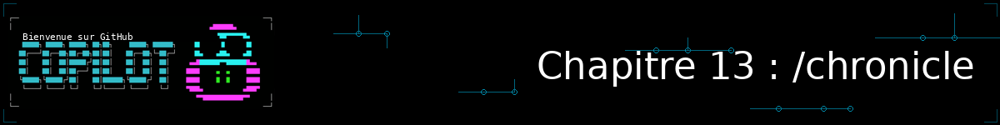
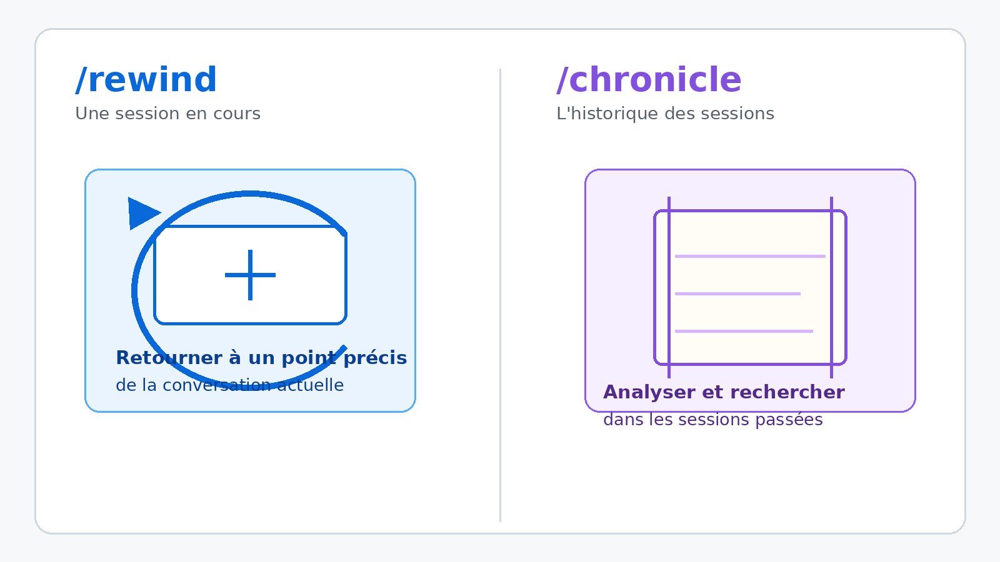
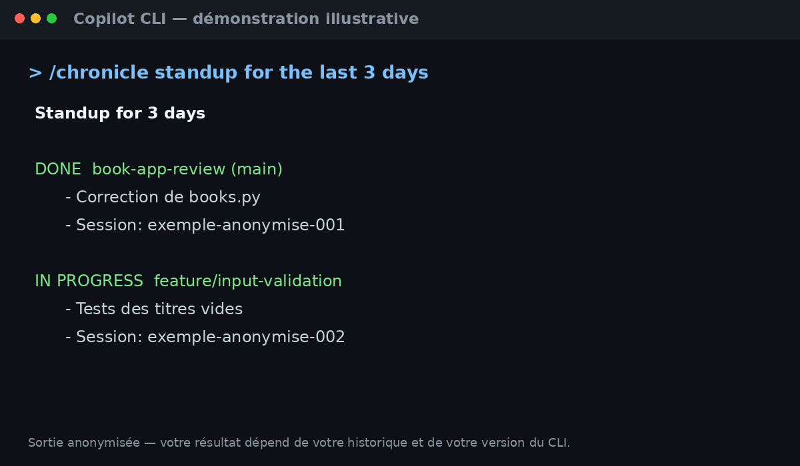

<!--
---
id: CopilotCLI-13
title: !translate Explorer l'historique de vos sessions avec /chronicle
description: !translate Utilisez la commande /chronicle pour transformer l'historique de vos sessions Copilot CLI en rapports d'activité, conseils personnalisés et recherches ciblées.
audience: Developers / Students / Terminal users
slug: analyze-session-history-with-chronicle
weight: 14
---
-->



> **Et si votre historique de sessions Copilot CLI pouvait vous dire, en une seule commande, ce que vous avez accompli cette semaine ?**

Au [Chapitre 03](../03-context-conversations/README.md), vous avez appris à piloter une session en cours : lui donner du contexte, surveiller sa fenêtre de contexte, revenir en arrière avec `/rewind` en cas de mauvaise piste. Ce chapitre change d'échelle. Au lieu de vous concentrer sur une seule conversation, vous allez interroger l'ensemble de votre historique Copilot CLI grâce à la commande `/chronicle`, pour en extraire des rapports d'activité, des conseils personnalisés, et retrouver en quelques secondes un sujet traité trois jours plus tôt.

## 🎯 Objectifs d'apprentissage

À la fin de ce chapitre, vous serez capable de :

- Faire la différence entre `/rewind` (revenir à un point précis d'une session) et `/chronicle` (analyser l'ensemble de votre historique)
- Générer un rapport d'activité avec `/chronicle standup`
- Obtenir des conseils personnalisés sur votre usage de Copilot CLI avec `/chronicle tips` et `/chronicle cost-tips`
- Rechercher un sujet précis dans l'historique de toutes vos sessions avec `/chronicle search`
- Enrichir automatiquement vos instructions personnalisées avec `/chronicle improve`
- Transformer un schéma de travail répétitif en skill réutilisable avec `/chronicle skills review`

> ⏱️ **Durée estimée : ~30 minutes** (10 min de lecture + 20 min de pratique)

---

## ✅ Prérequis

- Avoir terminé le [Chapitre 03 : Contexte et conversations](../03-context-conversations/README.md) — ce chapitre réutilise `/context`, `/rewind` et `/compact` sans les réexpliquer
- Avoir déjà travaillé avec Copilot CLI sur quelques sessions (idéalement en ayant fait les exercices des chapitres précédents) : `/chronicle` a besoin d'un minimum d'historique local pour produire des résultats utiles
- ⚠️ **Version recommandée : Copilot CLI v1.0.66 ou plus récent** (`/chronicle` existe depuis la v0.0.419, mais `skills review` — voir plus bas — n'existe que depuis cette version). Vérifiez votre version avec `copilot --version` et mettez à jour si besoin (`npm update -g @github/copilot`, `brew upgrade copilot-cli`, ou le gestionnaire équivalent). Consultez la [documentation officielle](https://docs.github.com/en/copilot/how-tos/copilot-cli/use-copilot-cli/chronicle) pour le détail exact des sous-commandes disponibles dans votre version. Si `/chronicle` n'est pas disponible, utilisez `/resume` pour retrouver une session et posez directement une question sur son contenu.

---

## 🧩 Analogie du monde réel



| Concept | `/rewind` | `/chronicle` |
|---|---|---|
| Échelle | Un point précis de la session **en cours** | L'ensemble de vos sessions **passées** |
| Ce que ça fait | Revient en arrière (conversation, et éventuellement fichiers) | Analyse et résume (rapports, conseils, recherche) |
| Ce que vous obtenez | Un état antérieur restauré | Un texte de synthèse, ou la réponse à une recherche |
| Quand l'utiliser | Vous vous êtes engagé dans une mauvaise voie | Vous voulez un résumé, des conseils, ou retrouver un sujet passé |

Pensez à `/rewind` comme à la touche « annuler » d'un éditeur de texte : elle agit sur le document en cours, un pas à la fois. `/chronicle` ressemble davantage au journal de bord d'un capitaine de navire, ou au rapport qu'une équipe rédige en rétrospective de sprint : il ne change rien à ce qui a été fait, il prend du recul dessus.

> 💡 **Rappel express — `/context`, `/rewind`, `/compact`** : vous connaissez déjà ces commandes depuis le [Chapitre 03](../03-context-conversations/README.md#vérifier-et-gérer-le-contexte). `/context` affiche l'usage de la fenêtre de contexte, `/rewind` (ou son alias `/undo`) ouvre le sélecteur de chronologie pour revenir à un point antérieur de la conversation en cours, `/compact` résume l'historique pour libérer de l'espace. Ce chapitre ne les réexplique pas : direction le Chapitre 03 si vous avez besoin d'un rappel plus complet.

---

## Je veux... | Aller à...

| Je veux... | Aller à |
|---|---|
| Comprendre ce que fait `/chronicle` | [Comprendre /chronicle](#comprendre-chronicle) |
| Générer un rapport d'activité | [Générer un rapport d'activité avec standup](#générer-un-rapport-dactivité-avec-standup) |
| Obtenir des conseils personnalisés | [Obtenir des conseils avec tips et cost-tips](#obtenir-des-conseils-avec-tips-et-cost-tips) |
| Rechercher un sujet dans mon historique | [Rechercher dans l'historique avec search](#rechercher-dans-lhistorique-avec-search) |
| Enrichir mes instructions personnalisées | [Enrichir vos instructions avec improve](#enrichir-vos-instructions-avec-improve) |
| Transformer une habitude de travail en skill | [Transformer un schéma de travail en skill avec skills](#transformer-un-schéma-de-travail-en-skill-avec-skills) |
| Reconstruire mon index local | [Comprendre /chronicle](#comprendre-chronicle) |

---

## Comprendre `/chronicle`

<a id="comprendre-chronicle"></a>

`/chronicle` analyse les données de session stockées **localement sur votre machine** — concrètement, dans `~/.copilot/session-state/`, indexées dans une base SQLite locale (`session-store.db`) que `/chronicle` interroge pour rester rapide même sur un gros historique — et en tire des informations exploitables. Ces données sont synchronisées par défaut avec votre compte GitHub afin de pouvoir les interroger depuis plusieurs surfaces Copilot (CLI, VS Code, JetBrains, l'app GitHub Copilot). Contrairement à une question libre posée à Copilot (« résume ce que j'ai fait cette semaine »), ses sous-commandes sont des raccourcis pensés pour des besoins précis et récurrents.

| Sous-commande | Ce qu'elle fait |
|---|---|
| `standup` | Génère un rapport sur vos activités récentes (branches, réalisations, pull requests ou issues référencées) |
| `tips` | Propose 3 à 5 recommandations personnalisées selon vos habitudes d'usage et les fonctionnalités disponibles |
| `cost-tips` | Analyse vos habitudes de consommation de tokens pour repérer des pistes d'efficacité |
| `search` | Recherche un mot-clé ou un sujet directement dans le contenu de vos sessions |
| `improve` | Examine les points de friction rencontrés et propose des améliorations pour votre fichier `.github/copilot-instructions.md` |
| `skills review` | Relit les brouillons de skills que Copilot a détectés dans vos sessions et vous laisse les accepter, rejeter ou reporter (voir [plus bas](#transformer-un-schéma-de-travail-en-skill-avec-skills)) |
| `reindex` | Reconstruit l'index local de vos sessions et le resynchronise avec votre compte |

Par défaut, ces sous-commandes s'appuient sur **toutes vos sessions enregistrées**, sans distinction de dépôt ou de branche. Deux exceptions : `improve`, qui se limite aux données du dépôt ou répertoire de travail courant, puisque ses recommandations concernent les instructions de ce projet ; et `skills review`, dont les brouillons de skills proposés sont eux aussi ancrés dans le dépôt où le schéma de travail a été détecté. Le périmètre dépend toutefois de vos réglages de synchronisation : avec `"remoteExport": false`, les données restent sur votre machine.

> 🕰️ **`/chronicle` a évolué vite** — utile à savoir si votre CLI affiche moins de sous-commandes que ce chapitre n'en montre :
>
> | Version | Date | Ce qui a changé |
> |---|---|---|
> | v0.0.419 | 27/02/2026 | `/chronicle` introduit (expérimental), avec `standup`, `tips`, `improve` |
> | v1.0.40 | 01/05/2026 | Historique de session et `/chronicle` passent en disponibilité générale pour tous les utilisateurs |
> | v1.0.49 | 18/05/2026 | Ajout de `search` |
> | v1.0.51 | 20/05/2026 | Ajout de `cost-tips` |
> | v1.0.66 | 30/06/2026 | Ajout de `skills review` |
>
> Sources : [changelog officiel de Copilot CLI](https://github.com/github/copilot-cli/blob/main/changelog.md).

> 🔒 **Confidentialité** : l'historique peut contenir vos prompts, les réponses de Copilot, les outils utilisés et des informations sur les fichiers modifiés. N'y placez pas de secrets, mots de passe, jetons ou données personnelles. Les données de session peuvent être envoyées au modèle lorsque vous utilisez `/chronicle`, comme pour toute interaction Copilot. Les exemples et la démonstration de ce chapitre sont fictifs et anonymisés.

```bash
copilot

> /chronicle
# Sans argument, ouvre un sélecteur listant les sous-commandes disponibles

> /chronicle standup
> /chronicle standup for the last 3 days
> /chronicle tips for better prompting
```

> 🔁 **`reindex`, pour quand l'index local dérive de votre historique réel** : si des sessions récentes n'apparaissent pas dans `standup` ou `search`, lancez `/chronicle reindex` — il reconstruit l'index local et affiche sa progression directement dans la timeline de la session pendant l'opération.
>
> ```bash
> > /chronicle reindex
> Reindexing local sessions… ████████████░░░░ 74%
> ```

---

## Générer un rapport d'activité avec `standup`

<a id="générer-un-rapport-dactivité-avec-standup"></a>

`/chronicle standup` parcourt par défaut les sessions des **24 dernières heures** et en tire un résumé structuré — utile pour un point d'équipe, ou simplement pour se souvenir de ce qui a été fait avant une pause.

```bash
copilot

> /chronicle standup for the last 3 days

Standup for 3 days:

✅ Done

book-app-review (main branch)
 - Correction de la duplication dans books.py
 - Session : exemple-anonymise-001

🚧 In Progress

feature/input-validation (feature/input-validation branch)
 - Validation des titres vides et tests associés
 - Session : exemple-anonymise-002
```

> 💡 **Précisez la période** si le résultat par défaut ne correspond pas à ce que vous cherchez : `/chronicle standup for the last 3 days`. Le contenu, les branches et les statuts varient selon votre historique.

---

## Obtenir des conseils avec `tips` et `cost-tips`

<a id="obtenir-des-conseils-avec-tips-et-cost-tips"></a>

Là où `standup` regarde en arrière, `tips` et `cost-tips` regardent vos habitudes pour vous aider à mieux utiliser Copilot CLI.

```bash
copilot

> /chronicle tips for better prompting

1. Use @ to mention files instead of pasting content
2. Iterate within a session instead of starting over
3. Try /research for exploration work
4. Turn recurring prompts into a custom agent
5. Use plan mode for multi-step work
```

La sortie réelle est personnalisée à partir de vos prompts, des outils utilisés et des fonctionnalités disponibles. Vous pouvez cibler un sujet, par exemple `/chronicle tips for better prompting`.

`cost-tips` va plus loin en se concentrant sur votre **consommation de tokens** :

```bash
copilot

> /chronicle cost-tips

Cost efficiency tips:
1. Plusieurs sessions rechargent le même gros fichier (@large-codebase/) à
   chaque prompt : une session dédiée avec /compact réduirait le volume renvoyé
2. Vos commandes git status/git log génèrent une sortie verbeuse répétée :
   un proxy de compression (voir Chapitre 14) réduirait ce volume
```

> 📝 **Gardez cette sortie sous le coude** : le Chapitre 14 reprend exactement ce sujet — l'analyse et la réduction de votre consommation de tokens — avec des outils dédiés (RTK et Tokscale).

---

## Rechercher dans l'historique avec `search`

<a id="rechercher-dans-lhistorique-avec-search"></a>

`/chronicle search` interroge directement le contenu de vos sessions passées, sans que vous ayez besoin de vous souvenir de leur nom ou de leur date.

```bash
copilot

> /chronicle search authentication

Found matching sessions:
1. "book-app-review" — occurrence de `authentication` dans un prompt
2. "mcp-setup" — occurrence de `authentication` dans la réponse de Copilot
```

C'est une recherche directe dans le contenu des sessions, et non une recherche sémantique : utilisez un terme précis quand vous vous souvenez *avoir déjà résolu ce problème*, sans vous souvenir *où* ni *quand*.

---

## Enrichir vos instructions avec `improve`

<a id="enrichir-vos-instructions-avec-improve"></a>

`/chronicle improve` examine les frictions rencontrées dans vos sessions récentes (corrections répétées, malentendus, allers-retours) et propose des ajouts concrets à votre fichier [`.github/copilot-instructions.md`](../05-agents-custom-instructions/README.md) — le fichier d'instructions personnalisées que vous avez découvert au Chapitre 05.

```bash
copilot

> /chronicle improve

Suggested improvements:
1. Préférer pytest à unittest pour les nouveaux tests
   Signal : plusieurs corrections dans les sessions de test
2. Utiliser des type hints complets dans les modules Python
   Signal : consigne répétée dans plusieurs prompts

Apply selected suggestions to .github/copilot-instructions.md? [y/N]
```

`improve` analyse les frictions (erreurs répétées, corrections et réorientations), puis vous laisse sélectionner les recommandations à appliquer. Sa portée reste limitée au dépôt ou répertoire courant.

> ⚠️ **Limite à connaître** : certaines opérations de partage par gist ne sont pas disponibles pour les comptes Enterprise Managed Users ou les organisations GitHub Enterprise Cloud avec résidence des données activée. Si une étape de partage échoue dans ce contexte, utilisez une exportation locale avec `/share file`.

<details>
<summary>🎬 Voyez-le en action !</summary>



*Démonstration illustrative et anonymisée : le résultat peut varier selon votre version du CLI, votre modèle et votre historique. Les quatre écrans montrent respectivement `standup`, `tips`, `search` et `improve`.*

</details>

---

## Transformer un schéma de travail en skill avec `skills`

<a id="transformer-un-schéma-de-travail-en-skill-avec-skills"></a>

`improve` enrichit vos *instructions* ; `skills` va plus loin et propose carrément une nouvelle **compétence réutilisable**. Quand Copilot détecte, dans votre historique de sessions, un schéma de travail répété plusieurs fois de la même façon (par exemple : toujours les mêmes étapes pour préparer une release, ou pour auditer un module avant de le fusionner), il peut en tirer un brouillon de skill — au même format `SKILL.md` que celui que vous avez découvert au [Chapitre 06](../06-skills/README.md).

Ces brouillons se relisent avec `/chronicle skills review` : vous les acceptez, les rejetez, ou les reportez à plus tard, un par un.

```bash
copilot

> /chronicle skills review

Draft skill proposals:

1. "release-checklist" — détecté sur 4 sessions (branches release/*)
   Étapes observées : bump de version, mise à jour du changelog, tag Git, build

   [a] Accepter  [r] Rejeter  [d] Reporter
```

> ⚠️ **À vérifier selon votre version** : `skills review` est confirmée par le [changelog officiel](https://github.com/github/copilot-cli/blob/main/changelog.md) à partir de la v1.0.66. La documentation de référence de Copilot CLI mentionne aussi deux sous-commandes complémentaires, `skills create` (déclencher manuellement un brouillon) et `skills status` (suivre l'état des brouillons en cours) — vérifiez leur disponibilité avec `copilot --version` et la [référence officielle des commandes](https://docs.github.com/en/copilot/reference/copilot-cli-reference/cli-command-reference), qui évolue plus vite que ce chapitre.

Un brouillon accepté devient un fichier `SKILL.md` dans votre dépôt, structuré exactement comme ceux que vous avez écrits à la main au Chapitre 06 — sauf qu'ici, c'est votre propre historique de travail qui en a rédigé la première version.

---

## Pratique

Ouvrez une session Copilot CLI dans le projet du cours et essayez les sous-commandes sur votre propre historique.

### ▶️ À vous de jouer

1. Lancez `/chronicle standup` et vérifiez qu'il retrouve bien une activité récente sur `samples/book-app-project/` (la période par défaut est de 24 heures)
2. Lancez `/chronicle tips` : au moins un conseil vous concerne-t-il vraiment ?
3. Choisissez un sujet traité il y a plusieurs sessions (par exemple un bug corrigé au Chapitre 04) et retrouvez-le avec `/chronicle search <mot-clé>`
4. Lancez `/chronicle improve`, examinez les recommandations et ne validez que celles qui correspondent réellement à vos conventions
5. Si votre version le permet, lancez `/chronicle skills review` : un brouillon de skill a-t-il été détecté dans vos sessions récentes ?

---

## 📝 Devoir

**Défi principal** : utilisez `/chronicle search` pour retrouver une session où vous avez travaillé sur `books.py` ou `utils.py`, puis demandez à Copilot CLI de résumer en une phrase ce qui avait été décidé à ce moment-là.

**Défi bonus** : lancez `/chronicle cost-tips` et notez la première piste d'optimisation proposée — vous la retrouverez au Chapitre 14, où vous allez passer à l'action dessus avec des outils dédiés.

<details>
<summary>💡 Indices</summary>

- Pour le défi principal, un mot-clé trop générique (« bug », « erreur ») renverra trop de résultats : préférez un terme spécifique (nom de fonction, nom de fichier)
- Pour le défi bonus, gardez une trace écrite (même un simple fichier texte) de la piste retenue : vous en aurez besoin au chapitre suivant

</details>

---

## 🔧 Erreurs courantes et dépannage

<details>
<summary>Cliquez pour voir les problèmes fréquents et leurs solutions</summary>

| Erreur | Ce qui se passe | Solution |
|---|---|---|
| `/chronicle standup` renvoie un rapport vide | Aucune session enregistrée dans la période demandée, ou index local incomplet | Élargissez la période avec `/chronicle standup for the last 3 days`, puis essayez `/chronicle reindex` si des sessions locales manquent |
| `/chronicle improve` ne produit aucune suggestion ou échoue silencieusement | Compte Enterprise Managed Users, ou organisation GitHub Enterprise Cloud avec résidence des données | Fonctionnement attendu dans ce contexte — utilisez `tips` ou `standup` à la place |
| `/chronicle search <mot>` renvoie trop de résultats non pertinents | Mot-clé trop générique | Utilisez un terme plus spécifique : nom de fichier, nom de fonction, nom de branche |
| `/chronicle` sans argument ne fait rien de visible | Le sélecteur interactif s'est ouvert mais aucune sous-commande n'a été sélectionnée | Utilisez les flèches puis Entrée pour choisir une sous-commande, ou tapez directement `/chronicle <sous-commande>` |

</details>

---

## Résumé

Vous savez maintenant transformer votre historique Copilot CLI en informations exploitables : un rapport d'activité avec `standup`, des conseils personnalisés avec `tips` et `cost-tips`, une recherche ciblée avec `search`, des instructions personnalisées enrichies automatiquement avec `improve`, et des brouillons de skills réutilisables avec `skills review`.

### 🔑 Points clés à retenir

1. `/chronicle` analyse **l'ensemble de votre historique enregistré**, contrairement à `/rewind` qui n'agit que sur la session en cours
2. Ses sous-commandes (`standup`, `tips`, `cost-tips`, `search`, `improve`, `skills review`, `reindex`) répondent chacune à un besoin précis — pas besoin de les mémoriser toutes, `/chronicle` seul ouvre un sélecteur
3. `improve` et `skills review` sont les deux sous-commandes ancrées au dépôt courant : la première modifie `.github/copilot-instructions.md`, la seconde en tire des fichiers `SKILL.md`
4. `cost-tips` fait le pont avec l'analyse de consommation de tokens, approfondie au [Chapitre 14](../14-token-consumption-analysis/README.md)
5. `skills review` fait le pont avec les skills réutilisables présentées au [Chapitre 06](../06-skills/README.md) — sauf que celles-ci naissent de votre propre historique plutôt que d'être écrites à la main

> 📚 **Documentation officielle** : [Utiliser les données de session avec /chronicle](https://docs.github.com/en/copilot/how-tos/copilot-cli/use-copilot-cli/chronicle)

---

## 📋 Référence rapide

- [Documentation officielle de `/chronicle`](https://docs.github.com/en/copilot/how-tos/copilot-cli/use-copilot-cli/chronicle)
- [Référence des commandes Copilot CLI](https://docs.github.com/en/copilot/reference/copilot-cli-reference/cli-command-reference) — pour la liste à jour des sous-commandes de `/chronicle`
- [Changelog officiel de Copilot CLI](https://github.com/github/copilot-cli/blob/main/changelog.md) — pour dater précisément l'arrivée d'une sous-commande
- [Chapitre 03 : Contexte et conversations](../03-context-conversations/README.md) — pour `/context`, `/rewind`, `/compact` et la gestion des sessions
- [Chapitre 05 : Créer des assistants IA spécialisés](../05-agents-custom-instructions/README.md) — pour comprendre `.github/copilot-instructions.md`, que `/chronicle improve` modifie
- [Chapitre 06 : Automatiser les tâches répétitives](../06-skills/README.md) — pour la structure d'un `SKILL.md`, que `/chronicle skills review` génère à partir de vos sessions

---

## ➡️ Et ensuite ?

`/chronicle cost-tips` vous a donné un premier aperçu de votre consommation de tokens. Dans le **[Chapitre 14 : Analyser sa consommation de tokens avec RTK et Tokscale](../14-token-consumption-analysis/README.md)**, vous allez passer des conseils ponctuels à des outils dédiés, capables de mesurer et de réduire concrètement cette consommation, session après session.

**[← Chapitre précédent : Comprendre l'acceptation de l'IA par les développeurs](../12-ai-developer-acceptance/README.md)** | **[Chapitre suivant : Analyser sa consommation de tokens →](../14-token-consumption-analysis/README.md)**
