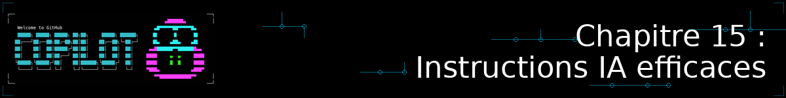
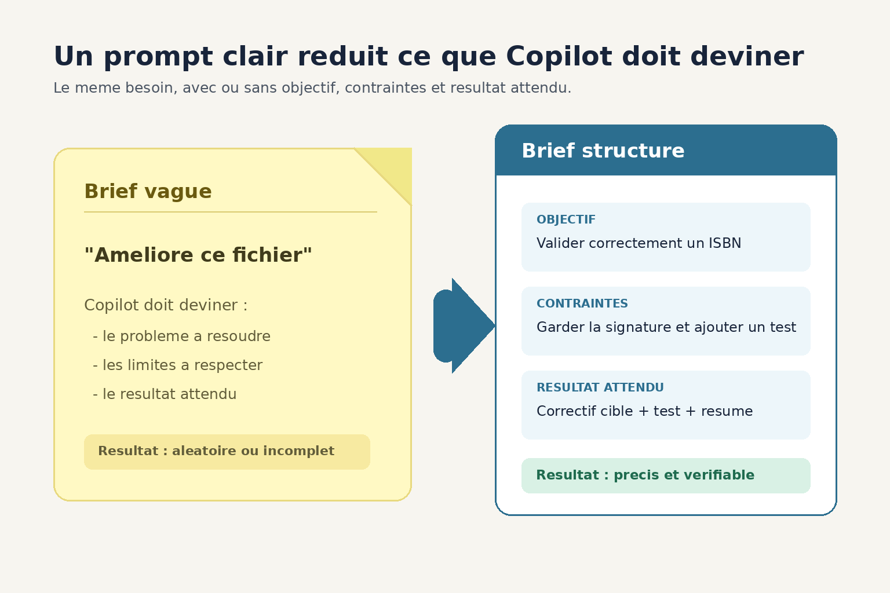
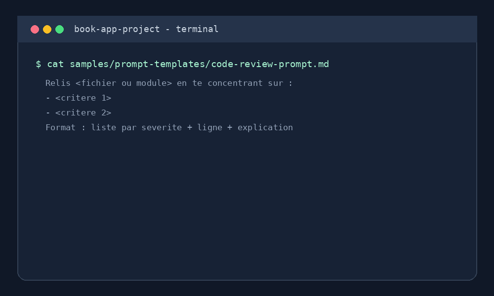

<!--
---
id: CopilotCLI-15
title: !translate Rédiger des instructions IA efficaces et réutilisables
description: !translate Structurez des instructions claires et contextualisées, ancrez vos prompts dans le vocabulaire métier, construisez des templates réutilisables, et découvrez le principe des CLI générées à partir d'un serveur MCP.
audience: Developers / Students / Terminal users
slug: write-effective-reusable-prompts
weight: 16
---
-->



> **Et si la qualité de ce que Copilot CLI produit dépendait moins du modèle que de la façon dont vous lui parlez ?**

Depuis le début de ce cours, vous avez appris à configurer Copilot CLI : des instructions personnalisées (Chapitre 05), des skills qui se chargent automatiquement (Chapitre 06), des serveurs MCP (Chapitre 07). Ce chapitre bonus change de focale : au lieu d'ajouter de la configuration, il s'agit d'améliorer la matière première que vous donnez à l'IA à chaque prompt — sa clarté, son ancrage dans votre contexte métier, et sa réutilisabilité d'une session à l'autre.

## 🎯 Objectifs d'apprentissage

À la fin de ce chapitre, vous serez capable de :

- Rédiger des instructions claires et détaillées qui réduisent les allers-retours avec Copilot CLI
- Ancrer vos prompts dans les données et le vocabulaire métier de votre projet plutôt que dans des termes génériques
- Construire et réutiliser des templates de prompts pour standardiser les tâches répétitives de votre équipe
- Expliquer le principe d'une CLI générée à partir d'un serveur MCP (illustré par la famille d'outils `mcp2cli`) et dans quels cas elle est pertinente

> ⏱️ **Durée estimée : ~35 minutes** (15 min de lecture + 20 min de pratique)

---

## ✅ Prérequis

- Avoir terminé le [Chapitre 05 : Créer des assistants IA spécialisés](../05-agents-custom-instructions/README.md) — ce chapitre part du principe que vous savez déjà écrire des instructions personnalisées de base
- ⚠️ Pour la section optionnelle sur `mcp2cli`, avoir terminé le [Chapitre 07 : Serveurs MCP](../07-mcp-servers/README.md) et, idéalement, le [Chapitre 18 : n8n](../18-n8n-workflows/README.md) — le serveur MCP n8n déjà configuré y sert d'exemple
- Un terminal avec Copilot CLI installé et fonctionnel (Chapitre 01)

---

## 🧩 Analogie du monde réel



| Concept | Instruction vague | Instruction claire, contextualisée et réutilisable |
|---|---|---|
| Ce que vous donnez à Copilot CLI | "Améliore ce fichier" | Objectif précis + contraintes + format de sortie attendu + vocabulaire du domaine |
| Ce que Copilot CLI doit deviner | Presque tout | Le moins possible |
| Résultat typique | Correct par accident, ou hors sujet | Aligné dès la première tentative, ou proche |
| Coût la fois suivante | Vous réexpliquez tout depuis zéro | Vous réutilisez un template déjà éprouvé |

Donner une instruction floue à Copilot CLI, c'est un peu comme confier une tâche à un nouveau collègue avec un post-it griffonné : il va probablement produire *quelque chose*, mais rarement ce que vous aviez en tête. Un cahier des charges court mais structuré change complètement la donne — sans pour autant devenir un roman.

---

| Je veux... | Aller à |
|---|---|
| Écrire des instructions plus précises | [Donner des instructions claires et détaillées](#donner-des-instructions-claires-et-détaillées) |
| Utiliser le vocabulaire de mon projet dans mes prompts | [Ancrer le prompt dans les données et le langage métier](#ancrer-le-prompt-dans-les-données-et-le-langage-métier) |
| Arrêter de réécrire le même prompt à chaque fois | [Construire des templates de prompts réutilisables](#construire-des-templates-de-prompts-réutilisables) |
| Comprendre le principe d'une CLI générée depuis un serveur MCP | [Pour aller plus loin : une CLI générée depuis un serveur MCP](#pour-aller-plus-loin-une-cli-générée-depuis-un-serveur-mcp) |

---

## Donner des instructions claires et détaillées

<a id="donner-des-instructions-claires-et-détaillées"></a>

Un prompt efficace répond à trois questions avant même que Copilot CLI ne commence à travailler : **quel est l'objectif**, **quelles sont les contraintes**, et **à quoi ressemble une sortie acceptable**. Comparez ces deux prompts, tous les deux exécutés depuis `samples/book-app-project/` :

```bash
copilot

> Améliore la validation dans books.py
```

Contre une version qui répond aux trois questions :

```bash
copilot

> Dans books.py, renforce la validation du champ ISBN de la fonction
> add_book() : elle doit refuser un ISBN qui ne contient pas exactement
> 10 ou 13 chiffres (tirets autorisés et ignorés), et lever une ValueError
> avec un message explicite plutôt que d'accepter silencieusement une
> valeur invalide. Garde la signature de la fonction inchangée et ajoute
> un test dans tests/test_books.py qui couvre le cas d'un ISBN invalide.
```

Le premier prompt laisse Copilot CLI deviner ce que "améliore" veut dire — il peut tout aussi bien reformater le code que changer la logique métier. Le second fixe l'objectif (renforcer une règle précise), la contrainte (ne pas casser la signature existante) et le format de sortie attendu (un test qui couvre le nouveau cas). Vous obtiendrez un résultat aligné dès la première tentative bien plus souvent.

> 💡 **Une astuce simple** : si vous hésitez sur le niveau de détail, listez mentalement objectif / contraintes / format de sortie avant d'écrire votre prompt. Les trois n'ont pas besoin d'être longs — juste explicites.

---

## Ancrer le prompt dans les données et le langage métier

<a id="ancrer-le-prompt-dans-les-données-et-le-langage-métier"></a>

Copilot CLI produit de meilleurs résultats quand vous lui parlez avec le vocabulaire réel de votre projet plutôt qu'avec des termes génériques. Dans `samples/book-app-project/`, le domaine a ses propres mots : un **livre** a un `title`, un `author`, un `isbn`, il appartient au **catalogue** stocké dans `data.json`. Un prompt qui utilise ce vocabulaire donne à Copilot CLI le contexte nécessaire pour rester cohérent avec le reste du code :

```bash
copilot

> Ajoute une fonction find_books_by_author(author) dans books.py qui
> retourne tous les livres du catalogue dont le champ author correspond
> (recherche insensible à la casse), en réutilisant la même structure de
> retour que list_books(). Suis les conventions de nommage déjà utilisées
> dans le fichier (snake_case, docstrings courtes).
```

Ce prompt fonctionne mieux qu'un équivalent générique ("ajoute une fonction de recherche") pour deux raisons : il nomme les champs de données réels (`title`, `author`, `isbn`) au lieu de "les informations du livre", et il demande explicitement à Copilot CLI de réutiliser une structure et des conventions déjà présentes dans le code plutôt que d'en inventer de nouvelles.

Dans un contexte professionnel, ce même réflexe s'applique à votre propre domaine métier : nommez vos entités, vos statuts, vos règles métier avec les termes que votre équipe utilise réellement — pas des équivalents génériques que Copilot CLI devra ensuite réinterpréter.

---

## Construire des templates de prompts réutilisables

<a id="construire-des-templates-de-prompts-réutilisables"></a>

Si une équipe redemande régulièrement le même type de tâche à Copilot CLI — une revue de code, une correction de bug avec critères d'acceptation, une nouvelle fonctionnalité — écrire un bon prompt à chaque fois est une perte de temps évitable. Un **template de prompt** est un fichier Markdown avec des sections fixes et des emplacements `<...>` à remplir, que vous complétez puis collez dans `copilot`.

Ce cours en fournit trois exemples dans [`samples/prompt-templates/`](../samples/prompt-templates/README.md), appliqués à `book-app-project` :

| Template | Usage |
|---|---|
| [`code-review-prompt.md`](../samples/prompt-templates/code-review-prompt.md) | Cadrer une revue de code sur un fichier ou un module précis |
| [`bug-fix-prompt.md`](../samples/prompt-templates/bug-fix-prompt.md) | Décrire un bug avec des critères d'acceptation clairs avant de demander un correctif |
| [`feature-request-prompt.md`](../samples/prompt-templates/feature-request-prompt.md) | Cadrer une nouvelle fonctionnalité avec son contexte métier et le format de sortie attendu |

Pour les utiliser, ouvrez le fichier, remplissez les emplacements entre `<...>`, puis collez le résultat dans une session `copilot` :

```bash
cat samples/prompt-templates/bug-fix-prompt.md
# Remplissez les emplacements <...> dans un éditeur, puis :
copilot
> <collez ici le contenu rempli du template>
```

<details>
<summary>🎬 Voyez-le en action !</summary>



*Le résultat peut varier selon votre modèle, vos outils et votre contexte : ne soyez pas surpris si votre sortie diffère de celle présentée ici.*

</details>

> 💡 **Pourquoi un fichier Markdown plutôt qu'un script** ? Un template de prompt n'a pas besoin d'être exécutable : c'est un texte structuré, versionné avec le reste de votre projet, que n'importe qui de l'équipe peut relire, faire évoluer et réutiliser sans connaître d'outillage particulier.

---

## Choisir le bon support pour son prompt

Un prompt peut être utilisé de trois façons complémentaires. Le **prompt interactif** est le texte que vous écrivez directement dans une conversation `copilot` : choisissez-le pour explorer une idée, demander une précision ou ajuster votre demande après une première réponse.

```bash
copilot

> Explique la différence entre find_book_by_title() et find_by_author()
> dans samples/book-app-project/books.py, sans modifier de fichier.
```

Un **fichier Markdown** est un support de préparation et de partage, pas une commande exécutée automatiquement. Il est idéal pour un template réutilisable : complétez-le, relisez-le, puis copiez son contenu dans une session interactive.

```bash
cat samples/prompt-templates/code-review-prompt.md
# Complétez les emplacements <...> dans votre éditeur, puis copiez le texte
# rempli dans une session copilot.
```

Un **appel programmatique** lance Copilot CLI depuis un script ou une automatisation avec l'option `--prompt`. Utilisez-le seulement pour une tâche cadrée et répétable. `--allow-all-tools` autorise Copilot CLI à utiliser automatiquement ses outils : n'employez cette option que dans un dépôt et un environnement auxquels vous faites confiance.

```bash
copilot --prompt "Liste les fonctions publiques de samples/book-app-project/books.py, sans modifier de fichier." --allow-all-tools
```

| Besoin | Support adapté | Exemple |
|---|---|---|
| Explorer et affiner une demande | Prompt interactif | Poser une question, puis préciser la réponse |
| Réutiliser une formulation validée avec l'équipe | Fichier Markdown | Remplir `code-review-prompt.md` |
| Automatiser une tâche précise | Appel programmatique | Lancer `copilot --prompt "..." --allow-all-tools` depuis un script |

---

<details>
<summary>🔬 Pour aller plus loin : une CLI générée depuis un serveur MCP</summary>

<a id="pour-aller-plus-loin-une-cli-générée-depuis-un-serveur-mcp"></a>

Au [Chapitre 07](../07-mcp-servers/README.md) et au [Chapitre 18](../18-n8n-workflows/README.md), vous avez connecté Copilot CLI à des serveurs MCP (GitHub, n8n) via le protocole MCP lui-même : découverte des outils, puis appel via le protocole à chaque interaction. C'est flexible, mais chaque appel consomme du contexte pour décrire les outils disponibles.

Une famille d'outils portant le nom `mcp2cli` explore une autre approche : générer, à partir des outils exposés par un serveur MCP, une **CLI typée classique** (une sous-commande par outil, un flag par paramètre). Le principe : au lieu que Copilot CLI dialogue avec le serveur MCP via le protocole complet à chaque appel, il exécute une commande shell simple et déjà documentée par son `--help` — ce qui réduit nettement le nombre de tokens consommés par interaction.

> ⚠️ `mcp2cli` n'est pas un outil officiel unique : plusieurs implémentations open source indépendantes portent ce nom, avec des périmètres différents (générique multi-protocoles, plugin spécifique à un agent, pont léger en bash). Considérez-le comme un **principe** à évaluer avec l'implémentation de votre choix, pas comme une dépendance à installer les yeux fermés. **Statut vérifié le 16 septembre 2026.**

Le serveur MCP n8n que vous avez configuré au Chapitre 18 est un bon candidat pour expérimenter ce principe : au lieu que Copilot CLI négocie le protocole MCP à chaque instruction, une CLI générée exposerait directement des sous-commandes comme `n8n-cli create-workflow` ou `n8n-cli list-workflows`. C'est ce que propose le défi bonus de ce chapitre.

</details>

---

## Pratique

Ouvrez `samples/prompt-templates/code-review-prompt.md`, remplissez ses emplacements pour cibler `samples/book-app-project/utils.py`, puis collez le résultat dans une session `copilot`.

### ▶️ À vous de jouer

1. Comparez le résultat obtenu avec le template rempli à ce que vous auriez obtenu avec le prompt "relis utils.py" — notez les différences de précision
2. Remplissez `bug-fix-prompt.md` pour un bug réel ou inventé dans `book-app-project`, en y intégrant le vocabulaire métier du projet (livre, catalogue, ISBN)
3. Modifiez un des trois templates pour l'adapter à un type de tâche récurrent dans votre propre travail

---

## 📝 Devoir

**Défi principal** : créez un quatrième template de prompt (par exemple `refactor-prompt.md`) dans `samples/prompt-templates/`, adapté à une tâche que vous répétez régulièrement avec Copilot CLI, en suivant la même structure (objectif / contraintes / format de sortie attendu).

**Défi bonus** : si vous avez terminé le Chapitre 18, recherchez une implémentation de `mcp2cli` (par exemple sur GitHub) et testez-la sur le serveur MCP n8n déjà configuré. Comparez le nombre d'échanges nécessaires pour créer un workflow simple via la CLI générée par rapport à un appel MCP classique.

<details>
<summary>💡 Indices</summary>

- Pour le défi principal, réutilisez la structure des trois templates existants plutôt que d'en inventer une nouvelle — la cohérence entre templates est plus utile que l'originalité
- Pour le défi bonus, commencez par une seule commande générée (par exemple lister les workflows existants) avant de tenter une création complète, pour valider que la connexion au serveur MCP n8n fonctionne bien via la CLI générée

</details>

---

## 🔧 Erreurs courantes et dépannage

<details>
<summary>Cliquez pour voir les problèmes fréquents et leurs solutions</summary>

| Erreur | Ce qui se passe | Solution |
|---|---|---|
| Copilot CLI produit un résultat hors sujet malgré un prompt qui semblait clair | L'objectif est clair mais le format de sortie attendu ne l'est pas | Ajoutez explicitement la forme attendue de la réponse (un patch, un fichier de test, une liste, etc.) |
| Un template rempli donne un résultat générique | Les emplacements `<...>` ont été remplis avec des termes génériques plutôt qu'avec le vocabulaire réel du projet | Reprenez le remplissage en réutilisant les noms de champs, fonctions et fichiers existants |
| Deux membres de l'équipe obtiennent des résultats très différents avec "le même" prompt | Le prompt n'était en réalité pas versionné — chacun improvisait sa propre formulation | Versionnez vos templates dans le dépôt (comme `samples/prompt-templates/`) plutôt que de les garder dans un historique de terminal personnel |
| Une implémentation `mcp2cli` échoue à se connecter à un serveur MCP | Le serveur MCP n'est pas authentifié ou n'est pas démarré | Vérifiez d'abord la connexion avec `/mcp show` dans Copilot CLI avant de diagnostiquer côté CLI générée |

</details>

---

## Résumé

Vous avez vu que la qualité d'un résultat Copilot CLI dépend autant de la formulation du prompt que du modèle sous-jacent : des instructions claires et contextualisées réduisent les allers-retours, des templates réutilisables évitent de tout réécrire à chaque fois, et le principe d'une CLI générée depuis un serveur MCP illustre une autre façon de réduire le coût de chaque interaction.

### 🔑 Points clés à retenir

1. Un bon prompt répond à trois questions avant d'être envoyé : objectif, contraintes, format de sortie attendu
2. Utiliser le vocabulaire métier réel de votre projet (noms de champs, de fonctions, de statuts) donne à Copilot CLI un contexte plus précis que des termes génériques
3. Un template de prompt versionné dans le dépôt évite à une équipe de réinventer le même prompt à chaque tâche répétitive
4. `mcp2cli` n'est pas un outil unique mais un principe (CLI typée générée depuis un serveur MCP) porté par plusieurs implémentations indépendantes

---

## 📋 Référence rapide

- [Prompt engineering for GitHub Copilot Chat](https://docs.github.com/en/copilot/concepts/prompting/prompt-engineering) — documentation officielle, les principes s'appliquent directement à Copilot CLI
- [Best practices for using GitHub Copilot](https://docs.github.com/en/copilot/get-started/best-practices) — recommandations générales officielles
- [knowsuchagency/mcp2cli](https://github.com/knowsuchagency/mcp2cli) — une implémentation open source du principe CLI générée depuis un serveur MCP
- [Chapitre 07 : Serveurs MCP](../07-mcp-servers/README.md) — pour revoir la configuration MCP classique
- [Templates de prompts de ce cours](../samples/prompt-templates/README.md)

---

## ➡️ Et ensuite ?

Vous avez maintenant parcouru l'ensemble du cours, de l'installation de Copilot CLI jusqu'à l'automatisation de workflows visuels et à l'écriture d'instructions réutilisables. La suite logique : appliquer ces pratiques à votre propre projet, et faire évoluer vos templates de prompts au fil de ce que vous apprenez sur ce qui fonctionne avec votre équipe.

**[← Chapitre précédent : Analyser sa consommation de tokens avec RTK et Tokscale](../14-token-consumption-analysis/README.md)** | **[Retour à l'accueil du cours →](../README.md)**
