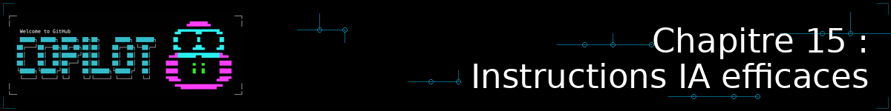
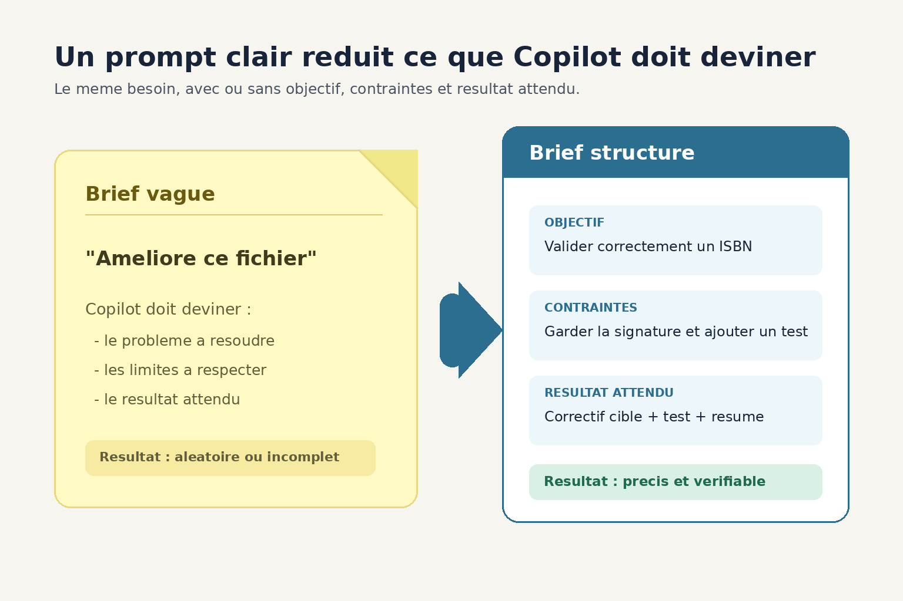
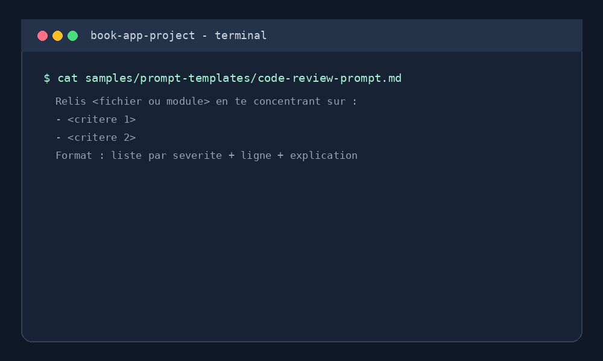

<!--
---
id: CopilotCLI-15
title: !translate Rédiger des instructions IA efficaces et réutilisables
description: !translate Structure des instructions claires et contextualisées, ancre tes prompts dans le vocabulaire métier, construis des templates réutilisables, et découvre le principe des CLI générées à partir d'un serveur MCP.
audience: Developers / Students / Terminal users
slug: write-effective-reusable-prompts
weight: 16
---
-->



> **Et si la qualité de ce que Copilot CLI produit dépendait moins du modèle que de la façon dont tu lui parles ?**

Depuis le début de ce cours, tu as appris à configurer Copilot CLI : des instructions personnalisées (Chapitre 05), des skills qui se chargent automatiquement (Chapitre 06), des serveurs MCP (Chapitre 07). Ce chapitre bonus change de focale : au lieu d'ajouter de la configuration, il s'agit d'améliorer la matière première que tu donnes à l'IA à chaque prompt — sa clarté, son ancrage dans ton contexte métier, et sa réutilisabilité d'une session à l'autre.

## 🎯 Objectifs d'apprentissage

À la fin de ce chapitre, tu seras capable de :

- Rédiger des instructions claires et détaillées qui réduisent les allers-retours avec Copilot CLI
- Ancrer tes prompts dans les données et le vocabulaire métier de ton projet plutôt que dans des termes génériques
- Construire et réutiliser des templates de prompts pour standardiser les tâches répétitives de ton équipe
- Expliquer le principe d'une CLI générée à partir d'un serveur MCP (illustré par la famille d'outils `mcp2cli`) et dans quels cas elle est pertinente

> ⏱️ **Durée estimée : ~40 minutes** (18 min de lecture + 20 min de pratique)

---

## ✅ Prérequis

- Avoir terminé le [Chapitre 05 : Créer des assistants IA spécialisés](../05-agents-custom-instructions/README.md) — ce chapitre part du principe que tu sais déjà écrire des instructions personnalisées de base
- ⚠️ Pour la section optionnelle sur `mcp2cli`, avoir terminé le [Chapitre 07 : Serveurs MCP](../07-mcp-servers/README.md) et, idéalement, le [Chapitre 18 : n8n](../18-n8n-workflows/README.md) — le serveur MCP n8n déjà configuré y sert d'exemple
- Un terminal avec Copilot CLI installé et fonctionnel (Chapitre 01)

---

## 🧩 Analogie du monde réel



| Concept | Instruction vague | Instruction claire, contextualisée et réutilisable |
|---|---|---|
| Ce que tu donnes à Copilot CLI | "Améliore ce fichier" | Objectif précis + contraintes + format de sortie attendu + vocabulaire du domaine |
| Ce que Copilot CLI doit deviner | Presque tout | Le moins possible |
| Résultat typique | Correct par accident, ou hors sujet | Aligné dès la première tentative, ou proche |
| Coût la fois suivante | Tu réexpliques tout depuis zéro | Tu réutilises un template déjà éprouvé |

Donner une instruction floue à Copilot CLI, c'est un peu comme confier une tâche à un nouveau collègue avec un post-it griffonné : il va probablement produire *quelque chose*, mais rarement ce que tu avais en tête. Un cahier des charges court mais structuré change complètement la donne — sans pour autant devenir un roman.

---

| Je veux... | Aller à |
|---|---|
| Écrire des instructions plus précises | [Donner des instructions claires et détaillées](#donner-des-instructions-claires-et-détaillées) |
| Utiliser le vocabulaire de mon projet dans mes prompts | [Ancrer le prompt dans les données et le langage métier](#ancrer-le-prompt-dans-les-données-et-le-langage-métier) |
| Arrêter de réécrire le même prompt à chaque fois | [Construire des templates de prompts réutilisables](#construire-des-templates-de-prompts-réutilisables) |
| Comprendre le principe d'une CLI générée depuis un serveur MCP | [Pour aller plus loin : une CLI générée depuis un serveur MCP](#pour-aller-plus-loin-une-cli-générée-depuis-un-serveur-mcp) |

---

## Donner des instructions claires et détaillées

<a id="donner-des-instructions-claires-et-détaillées"></a>

Un prompt efficace répond à trois questions avant même que Copilot CLI ne commence à travailler : **quel est l'objectif**, **quelles sont les contraintes**, et **à quoi ressemble une sortie acceptable**. Compare ces deux prompts, tous les deux exécutés depuis `samples/book-app-project/` :

```bash
copilot

> Améliore la validation dans books.py
```

Contre une version qui répond aux trois questions :

```bash
copilot

> Dans books.py, renforce la validation du champ ISBN de la fonction
> add_book() : elle doit refuser un ISBN qui ne contient pas exactement
> 10 ou 13 chiffres (tirets autorisés et ignorés), et lever une ValueError
> avec un message explicite plutôt que d'accepter silencieusement une
> valeur invalide. Garde la signature de la fonction inchangée et ajoute
> un test dans tests/test_books.py qui couvre le cas d'un ISBN invalide.
```

Le premier prompt laisse Copilot CLI deviner ce que "améliore" veut dire — il peut tout aussi bien reformater le code que changer la logique métier. Le second fixe l'objectif (renforcer une règle précise), la contrainte (ne pas casser la signature existante) et le format de sortie attendu (un test qui couvre le nouveau cas). Tu obtiendras un résultat aligné dès la première tentative bien plus souvent.

> 💡 **Une astuce simple** : si tu hésites sur le niveau de détail, liste mentalement objectif / contraintes / format de sortie avant d'écrire ton prompt. Les trois n'ont pas besoin d'être longs — juste explicites.

> 💡 **Pour une tâche à plusieurs étapes dépendantes** (ex. une fonctionnalité qui touche plusieurs fichiers), n'essaie pas de tout décrire dans un seul prompt géant : utilise `/plan` (vu au [Chapitre 04](../04-development-workflows/README.md)), qui applique ce même triptyque objectif/contraintes/format à un plan que tu valides avant l'exécution. La documentation officielle Copilot CLI le confirme : les modèles réussissent mieux quand on leur donne un plan concret à suivre plutôt qu'une seule instruction dense. À l'inverse, réserve cette décomposition explicite aux tâches réellement complexes — pour une demande simple, elle ajoute de la friction sans gain de précision.

---

## Ancrer le prompt dans les données et le langage métier

<a id="ancrer-le-prompt-dans-les-données-et-le-langage-métier"></a>

Copilot CLI produit de meilleurs résultats quand tu lui parles avec le vocabulaire réel de ton projet plutôt qu'avec des termes génériques. Dans `samples/book-app-project/`, le domaine a ses propres mots : un **livre** a un `title`, un `author`, un `isbn`, il appartient au **catalogue** stocké dans `data.json`. Un prompt qui utilise ce vocabulaire donne à Copilot CLI le contexte nécessaire pour rester cohérent avec le reste du code :

```bash
copilot

> Ajoute une fonction find_books_by_author(author) dans books.py qui
> retourne tous les livres du catalogue dont le champ author correspond
> (recherche insensible à la casse), en réutilisant la même structure de
> retour que list_books(). Suis les conventions de nommage déjà utilisées
> dans le fichier (snake_case, docstrings courtes).
```

Ce prompt fonctionne mieux qu'un équivalent générique ("ajoute une fonction de recherche") pour deux raisons : il nomme les champs de données réels (`title`, `author`, `isbn`) au lieu de "les informations du livre", et il demande explicitement à Copilot CLI de réutiliser une structure et des conventions déjà présentes dans le code plutôt que d'en inventer de nouvelles.

Dans un contexte professionnel, ce même réflexe s'applique à ton propre domaine métier : nomme tes entités, tes statuts, tes règles métier avec les termes que ton équipe utilise réellement — pas des équivalents génériques que Copilot CLI devra ensuite réinterpréter.

---

## Construire des templates de prompts réutilisables

<a id="construire-des-templates-de-prompts-réutilisables"></a>

Si une équipe redemande régulièrement le même type de tâche à Copilot CLI — une revue de code, une correction de bug avec critères d'acceptation, une nouvelle fonctionnalité — écrire un bon prompt à chaque fois est une perte de temps évitable. Un **template de prompt** est un fichier Markdown avec des sections fixes et des emplacements `<...>` à remplir, que tu complètes puis colles dans `copilot`.

Ce cours en fournit trois exemples dans [`samples/prompt-templates/`](../samples/prompt-templates/README.md), appliqués à `book-app-project` :

| Template | Usage |
|---|---|
| [`code-review-prompt.md`](../samples/prompt-templates/code-review-prompt.md) | Cadrer une revue de code sur un fichier ou un module précis |
| [`bug-fix-prompt.md`](../samples/prompt-templates/bug-fix-prompt.md) | Décrire un bug avec des critères d'acceptation clairs avant de demander un correctif |
| [`feature-request-prompt.md`](../samples/prompt-templates/feature-request-prompt.md) | Cadrer une nouvelle fonctionnalité avec son contexte métier et le format de sortie attendu |

Pour les utiliser, ouvre le fichier, remplis les emplacements entre `<...>`, puis colle le résultat dans une session `copilot` :

```bash
cat samples/prompt-templates/bug-fix-prompt.md
# Remplis les emplacements <...> dans un éditeur, puis :
copilot
> <colle ici le contenu rempli du template>
```

<details>
<summary>🎬 Vois-le en action !</summary>



*Le résultat peut varier selon ton modèle, tes outils et ton contexte : ne sois pas surpris si ta sortie diffère de celle présentée ici.*

</details>

> 💡 **Pourquoi un fichier Markdown plutôt qu'un script** ? Un template de prompt n'a pas besoin d'être exécutable : c'est un texte structuré, versionné avec le reste de ton projet, que n'importe qui de l'équipe peut relire, faire évoluer et réutiliser sans connaître d'outillage particulier.

> ⚠️ **Pourquoi coller le template plutôt que taper `/mon-template`** ? Contrairement à VS Code, Visual Studio et JetBrains, qui savent charger des *prompt files* (`.github/prompts/*.prompt.md`) comme des slash commands personnalisées, Copilot CLI ne propose pas encore ce mécanisme nativement : plusieurs demandes en ce sens restent ouvertes sur le dépôt `github/copilot-cli` (par exemple [l'issue #618](https://github.com/github/copilot-cli/issues/618)), sans implémentation à ce jour. Copier-coller le contenu rempli dans une session `copilot` n'est donc pas un pis-aller temporaire : c'est actuellement la bonne méthode pour la CLI. **Statut vérifié le 20 septembre 2026.**

---

## Choisir le bon support pour son prompt

Un prompt peut être utilisé de trois façons complémentaires. Le **prompt interactif** est le texte que tu écris directement dans une conversation `copilot` : choisis-le pour explorer une idée, demander une précision ou ajuster ta demande après une première réponse.

```bash
copilot

> Explique la différence entre find_book_by_title() et find_by_author()
> dans samples/book-app-project/books.py, sans modifier de fichier.
```

Un **fichier Markdown** est un support de préparation et de partage, pas une commande exécutée automatiquement. Il est idéal pour un template réutilisable : complète-le, relis-le, puis copie son contenu dans une session interactive.

```bash
cat samples/prompt-templates/code-review-prompt.md
# Complète les emplacements <...> dans ton éditeur, puis copie le texte
# rempli dans une session copilot.
```

Un **appel programmatique** lance Copilot CLI depuis un script ou une automatisation avec l'option `--prompt`. Utilise-le seulement pour une tâche cadrée et répétable. `--allow-all-tools` autorise Copilot CLI à utiliser automatiquement ses outils : n'emploie cette option que dans un dépôt et un environnement auxquels tu fais confiance.

```bash
copilot --prompt "Liste les fonctions publiques de samples/book-app-project/books.py, sans modifier de fichier." --allow-all-tools
```

| Besoin | Support adapté | Exemple |
|---|---|---|
| Explorer et affiner une demande | Prompt interactif | Poser une question, puis préciser la réponse |
| Réutiliser une formulation validée avec l'équipe | Fichier Markdown | Remplir `code-review-prompt.md` |
| Automatiser une tâche précise | Appel programmatique | Lancer `copilot --prompt "..." --allow-all-tools` depuis un script |

> 💡 **Avant de coller un template dans une session déjà bien remplie** : un gabarit reste précis seulement si Copilot CLI n'a pas déjà beaucoup compacté son contexte (compaction automatique dès 80 % de la fenêtre de contexte, cf. [Chapitre 03 : Vérifier et gérer le contexte](../03-context-conversations/README.md#vérifier-et-gérer-le-contexte)). Si `/context` montre une session déjà chargée, démarre plutôt une session fraîche avec `/clear` ou `/new` avant de coller ton template rempli, pour éviter que sa précision se dilue dans un historique compacté.

---

<details>
<summary>🔬 Pour aller plus loin : une CLI générée depuis un serveur MCP</summary>

<a id="pour-aller-plus-loin-une-cli-générée-depuis-un-serveur-mcp"></a>

Au [Chapitre 07](../07-mcp-servers/README.md) et au [Chapitre 18](../18-n8n-workflows/README.md), tu as connecté Copilot CLI à des serveurs MCP (GitHub, n8n) via le protocole MCP lui-même : découverte des outils, puis appel via le protocole à chaque interaction. C'est flexible, mais chaque appel consomme du contexte pour décrire les outils disponibles.

Une famille d'outils portant le nom `mcp2cli` explore une autre approche : générer, à partir des outils exposés par un serveur MCP, une **CLI typée classique** (une sous-commande par outil, un flag par paramètre). Le principe : au lieu que Copilot CLI dialogue avec le serveur MCP via le protocole complet à chaque appel, il exécute une commande shell simple et déjà documentée par son `--help` — ce qui réduit nettement le nombre de tokens consommés par interaction.

> ⚠️ `mcp2cli` n'est pas un outil officiel unique : plusieurs implémentations open source indépendantes portent ce nom, avec des périmètres différents (générique multi-protocoles, plugin spécifique à un agent, pont léger en bash). Considère-le comme un **principe** à évaluer avec l'implémentation de ton choix, pas comme une dépendance à installer les yeux fermés. **Statut vérifié le 16 septembre 2026.**

Le serveur MCP n8n que tu as configuré au Chapitre 18 est un bon candidat pour expérimenter ce principe : au lieu que Copilot CLI négocie le protocole MCP à chaque instruction, une CLI générée exposerait directement des sous-commandes comme `n8n-cli create-workflow` ou `n8n-cli list-workflows`. C'est ce que propose le défi bonus de ce chapitre.

</details>

---

## Pratique

Ouvre `samples/prompt-templates/code-review-prompt.md`, remplis ses emplacements pour cibler `samples/book-app-project/utils.py`, puis colle le résultat dans une session `copilot`.

### ▶️ À toi de jouer

1. Compare le résultat obtenu avec le template rempli à ce que tu aurais obtenu avec le prompt "relis utils.py" — note les différences de précision
2. Remplis `bug-fix-prompt.md` pour un bug réel ou inventé dans `book-app-project`, en y intégrant le vocabulaire métier du projet (livre, catalogue, ISBN)
3. Modifie un des trois templates pour l'adapter à un type de tâche récurrent dans ton propre travail

---

## 📝 Devoir

**Défi principal** : crée un quatrième template de prompt (par exemple `refactor-prompt.md`) dans `samples/prompt-templates/`, adapté à une tâche que tu répètes régulièrement avec Copilot CLI, en suivant la même structure (objectif / contraintes / format de sortie attendu).

**Défi bonus** : si tu as terminé le Chapitre 18, recherche une implémentation de `mcp2cli` (par exemple sur GitHub) et teste-la sur le serveur MCP n8n déjà configuré. Compare le nombre d'échanges nécessaires pour créer un workflow simple via la CLI générée par rapport à un appel MCP classique.

<details>
<summary>💡 Indices</summary>

- Pour le défi principal, réutilise la structure des trois templates existants plutôt que d'en inventer une nouvelle — la cohérence entre templates est plus utile que l'originalité
- Pour le défi bonus, commence par une seule commande générée (par exemple lister les workflows existants) avant de tenter une création complète, pour valider que la connexion au serveur MCP n8n fonctionne bien via la CLI générée

</details>

---

## 🔧 Erreurs courantes et dépannage

<details>
<summary>Clique pour voir les problèmes fréquents et leurs solutions</summary>

| Erreur | Ce qui se passe | Solution |
|---|---|---|
| Copilot CLI produit un résultat hors sujet malgré un prompt qui semblait clair | L'objectif est clair mais le format de sortie attendu ne l'est pas | Ajoute explicitement la forme attendue de la réponse (un patch, un fichier de test, une liste, etc.) |
| Un template rempli donne un résultat générique | Les emplacements `<...>` ont été remplis avec des termes génériques plutôt qu'avec le vocabulaire réel du projet | Reprends le remplissage en réutilisant les noms de champs, fonctions et fichiers existants |
| Deux membres de l'équipe obtiennent des résultats très différents avec "le même" prompt | Le prompt n'était en réalité pas versionné — chacun improvisait sa propre formulation | Versionne tes templates dans le dépôt (comme `samples/prompt-templates/`) plutôt que de les garder dans un historique de terminal personnel |
| Une implémentation `mcp2cli` échoue à se connecter à un serveur MCP | Le serveur MCP n'est pas authentifié ou n'est pas démarré | Vérifie d'abord la connexion avec `/mcp show` dans Copilot CLI avant de diagnostiquer côté CLI générée |

</details>

---

## Résumé

Tu as vu que la qualité d'un résultat Copilot CLI dépend autant de la formulation du prompt que du modèle sous-jacent : des instructions claires et contextualisées réduisent les allers-retours, des templates réutilisables évitent de tout réécrire à chaque fois, et le principe d'une CLI générée depuis un serveur MCP illustre une autre façon de réduire le coût de chaque interaction.

### 🔑 Points clés à retenir

1. Un bon prompt répond à trois questions avant d'être envoyé : objectif, contraintes, format de sortie attendu
2. Utiliser le vocabulaire métier réel de ton projet (noms de champs, de fonctions, de statuts) donne à Copilot CLI un contexte plus précis que des termes génériques
3. Un template de prompt versionné dans le dépôt évite à une équipe de réinventer le même prompt à chaque tâche répétitive
4. `mcp2cli` n'est pas un outil unique mais un principe (CLI typée générée depuis un serveur MCP) porté par plusieurs implémentations indépendantes
5. Pour une tâche complexe à étapes dépendantes, préfère `/plan` (Chapitre 04) à un unique prompt géant : le triptyque objectif/contraintes/format reste utile pour cadrer chaque étape du plan

---

## 📋 Référence rapide

- [Prompt engineering for GitHub Copilot Chat](https://docs.github.com/en/copilot/concepts/prompting/prompt-engineering) — documentation officielle, les principes s'appliquent directement à Copilot CLI
- [Best practices for using GitHub Copilot](https://docs.github.com/en/copilot/get-started/best-practices) — recommandations générales officielles
- [Best practices for GitHub Copilot CLI](https://docs.github.com/en/copilot/how-tos/copilot-cli/cli-best-practices) — recommandations spécifiques à la CLI : `/plan`, choix du modèle, flux de travail
- [Managing context in GitHub Copilot CLI](https://docs.github.com/en/copilot/concepts/agents/copilot-cli/context-management) — compaction automatique et commandes `/context` / `/compact`
- [Chapitre 17 : mcp2cli et le coût en tokens](../17-mcp2cli/README.md) — traite ce même principe en détail avec une implémentation concrète (attention, plusieurs projets indépendants portent le nom « mcp2cli » : voir l'avertissement d'homonymie de ce chapitre)
- [Chapitre 07 : Serveurs MCP](../07-mcp-servers/README.md) — pour revoir la configuration MCP classique
- [Templates de prompts de ce cours](../samples/prompt-templates/README.md)

---

## ➡️ Et ensuite ?

Tu sais maintenant rédiger des prompts clairs et construire des templates réutilisables. Il reste trois chapitres bonus optionnels pour aller plus loin : paralléliser des sessions avec les worktrees Git (Chapitre 16), transformer un serveur MCP en CLI native avec mcp2cli (Chapitre 17), et piloter des workflows visuels n8n depuis Copilot CLI (Chapitre 18).

**[← Chapitre précédent : Analyser sa consommation de tokens avec RTK et Tokscale](../14-token-consumption-analysis/README.md)** | **[Chapitre suivant : Worktrees parallèles →](../16-parallel-worktrees/README.md)**
