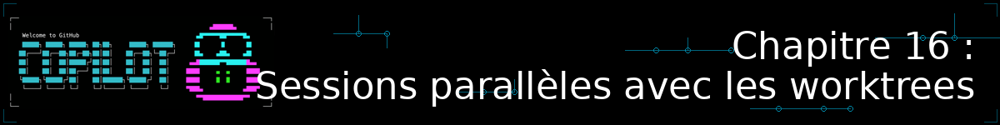
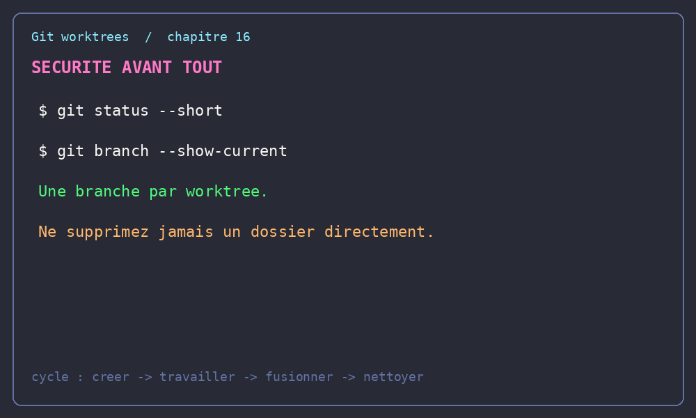

<!--
---
id: CopilotCLI-16
title: !translate Sessions parallèles avec les worktrees Git
description: !translate Isolez plusieurs sessions Copilot CLI dans des worktrees Git indépendants pour mener de front deux tâches sur le même dépôt, sans qu'elles ne se marchent dessus.
audience: Developers / Students / Terminal users
slug: parallel-sessions-with-worktrees
weight: 17
---
-->



> **Et si vous pouviez laisser une session Copilot CLI corriger un bug urgent pendant qu'une deuxième travaille sur une nouvelle fonctionnalité — dans le même dépôt, en même temps, sans qu'elles ne se marchent dessus ?**

Au [Chapitre 08](../08-putting-it-together/README.md), un encadré évoquait en une ligne `/worktree new`, disponible depuis Copilot CLI v1.0.79. Au [Chapitre 09](../09-isolated-environments/README.md), vous avez appris à isoler Copilot CLI pour qu'il travaille sans surveillance humaine. Ce chapitre bonus développe un troisième axe, complémentaire : l'isolation au service de la **parallélisation**. Vous allez apprendre à faire tourner plusieurs sessions Copilot CLI en même temps, sur le même clone de dépôt, chacune sur sa propre tâche, grâce aux **worktrees Git**.

## 🎯 Objectifs d'apprentissage

À la fin de ce chapitre, vous serez capable de :

- Expliquer ce qu'est un worktree Git et le problème concret qu'il résout
- Créer, lister et supprimer des worktrees avec les commandes Git natives
- Isoler une session Copilot CLI dans un nouveau worktree avec `/worktree new`
- Faire tourner plusieurs sessions Copilot CLI en parallèle sur des tâches indépendantes du même dépôt
- Fusionner le travail de chaque worktree, puis nettoyer proprement derrière vous

> ⏱️ **Durée estimée** : ~35 minutes (15 min de lecture + 20 min de pratique)

---

## ✅ Prérequis

- [Chapitre 01 : Démarrage rapide](../01-quick-start/README.md) terminé (Copilot CLI installé et vérifié)
- À l'aise avec les branches Git de base (créer une branche, committer, pousser)
- ⚠️ **Version recommandée** : Copilot CLI v1.0.79 ou plus récent pour la commande `/worktree new`. Si votre version est plus ancienne, mettez à jour (`npm update -g @github/copilot`, `brew upgrade copilot-cli`, etc.) — ou repliez-vous simplement sur les commandes Git natives présentées dans ce chapitre, qui fonctionnent quelle que soit votre version de Copilot CLI.

---

## 🧩 Analogie du monde réel : les chambres d'un même hôtel

Imaginez un hôtel avec une seule réception, une seule adresse, une seule infrastructure (électricité, eau, réseau) — mais plusieurs chambres. Chaque client dispose de sa propre chambre, avec sa propre porte : il peut y travailler, la ranger ou la mettre sens dessus dessous sans déranger la chambre voisine. Tout le monde partage pourtant le même bâtiment.

Un worktree Git fonctionne pareil : plusieurs dossiers sur votre disque (les « chambres »), chacun sur sa propre branche, qui partagent tous le même historique Git — les mêmes commits, les mêmes objets (la « réception » et les « fondations »). Aucune duplication de l'historique, aucune synchronisation à gérer entre les dossiers.

Comparez les trois façons de mener deux tâches de front sur un même dépôt :

| | Cloner le dépôt une deuxième fois | Changer de branche (`git stash` + `checkout`) | Worktree |
|---|---|---|---|
| **Espace disque** | Tout l'historique dupliqué | Aucun espace supplémentaire | Seuls les fichiers de travail sont dupliqués ; historique partagé |
| **Interrompt la tâche en cours** | Non | Oui — il faut `stash`/`pop` à chaque bascule | Non |
| **Sessions Copilot CLI simultanées** | Possible, mais le second clone se désynchronise facilement du premier | Impossible (un seul répertoire de travail) | Oui, en toute sécurité, sur le même historique |

---

## Le problème : un répertoire, une tâche à la fois

Par défaut, un dépôt Git n'a qu'un seul répertoire de travail. Si vous lancez une session Copilot CLI dessus pour développer une fonctionnalité, puis qu'un bug urgent tombe, vous n'avez que de mauvaises options : interrompre la session en cours, mettre vos changements de côté avec `git stash`, changer de branche, corriger le bug, puis tout remettre en place pour reprendre où vous en étiez. À chaque bascule, vous perdez du contexte — exactement le genre de friction que ce cours essaie de vous faire éviter.

Les worktrees suppriment cette contrainte : chaque tâche obtient son propre dossier, sa propre branche, et donc sa propre session Copilot CLI, sans jamais toucher aux autres.

---

## Les worktrees Git, la mécanique de base

Un worktree se manipule avec quatre commandes Git natives — disponibles depuis Git 2.5 (2015), aucune installation supplémentaire requise.

### 🛡️ Règles de sécurité avant de commencer

Avant toute commande, vérifiez que vous êtes bien dans le dépôt attendu et que votre travail est protégé :

```bash
git rev-parse --show-toplevel
git status --short
git branch --show-current
```

Ne lancez pas la démonstration avec des modifications non committées que vous voulez conserver : un nouveau worktree part du commit de référence, pas de votre état de fichiers local. Chaque worktree doit utiliser **une branche différente** ; une même branche ne peut pas être extraite simultanément dans deux dossiers. Enfin, ne supprimez jamais un dossier de worktree avec une commande récursive : utilisez `git worktree remove` afin que Git mette aussi à jour ses métadonnées.

### Créer un worktree

```bash
# Crée un nouveau dossier ../book-app-hotfix, avec une nouvelle branche "fix/isbn-validation"
git worktree add -b fix/isbn-validation ../book-app-hotfix
```

`-b <nom-de-branche>` crée la branche en même temps que le worktree. Si vous omettez `<point-de-départ>` (ici, rien après le chemin), la nouvelle branche part du commit actuellement extrait dans votre répertoire principal.

### Lister les worktrees actifs

```bash
git worktree list
```

```
/path/to/onepoint_formation_gihub_copilot     a1b2c3d [main]
/path/to/book-app-hotfix                      a1b2c3d [fix/isbn-validation]
```

### Supprimer un worktree

```bash
git worktree remove ../book-app-hotfix
```

Git refuse de supprimer un worktree contenant des modifications non committées ou des fichiers non suivis — committez-les, ou forcez avec `git worktree remove -f` en connaissance de cause.

### Nettoyer les références orphelines

```bash
git worktree prune
```

Utile si vous avez supprimé un dossier de worktree directement (`rm -rf`) sans passer par `git worktree remove` — Git garde sinon une référence à un dossier qui n'existe plus.

> ⚠️ **Limitation importante** : vous ne pouvez pas extraire la même branche dans deux worktrees en même temps. Chaque worktree a besoin de sa propre branche — c'est justement ce qui garantit qu'aucune session Copilot CLI ne peut écraser le travail d'une autre par accident.

## Le cycle de vie complet : créer, travailler, fusionner, nettoyer

Le schéma suivant est volontairement explicite. Exécutez les commandes depuis la racine du dépôt principal, sauf lorsqu'un bloc indique un changement de dossier.

### 1. Créer et vérifier

```bash
git status --short
git worktree add -b feature/book-search ../book-app-search
git worktree list
```

La dernière commande doit afficher le dépôt principal et `../book-app-search`, chacun avec une branche différente. Ne lancez pas une deuxième session sur le même worktree : une session Copilot CLI par dossier évite les écritures concurrentes.

### 2. Travailler dans le worktree

```bash
cd ../book-app-search
copilot -p "Ajoute une recherche par auteur dans samples/book-app-project/ et ses tests pytest. Ne modifie pas les autres fonctionnalités."
git diff --check
python -m pytest samples/book-app-project/tests/
git add samples/book-app-project/
git commit -m "feat: add author search"
```

Le commit est créé dans la branche du worktree. Revenez ensuite au dépôt principal avant de fusionner :

```bash
cd -
git status --short
git branch --show-current
```

### 3. Fusionner et traiter un conflit

```bash
git merge --no-ff feature/book-search
```

Si Git signale un conflit, ne supprimez pas arbitrairement les marqueurs `<<<<<<<`, `=======` et `>>>>>>>`. Ouvrez chaque fichier concerné, choisissez ou combinez les deux versions, puis vérifiez le résultat :

```bash
git status
git diff --check
python -m pytest samples/book-app-project/tests/
git add <fichier-résolu>
git commit
```

Un worktree reste indépendant jusqu'au commit ; la fusion se fait depuis le dépôt principal, jamais depuis le dossier que vous êtes en train de supprimer.

### 4. Nettoyer et prouver que le nettoyage est terminé

Après une fusion réussie (ou après avoir décidé d'abandonner le travail), supprimez le dossier géré par Git, puis sa branche devenue inutile :

```bash
git worktree remove ../book-app-search
git worktree prune
git branch -d feature/book-search
git worktree list
```

Le dernier `git worktree list` ne doit plus afficher `../book-app-search` : dans un dépôt qui ne comportait pas d'autres worktrees, il ne reste alors que le dépôt principal. Cette vérification fait partie du résultat attendu, pas d'une étape facultative.

### Si une session est interrompue

Une coupure réseau, un terminal fermé ou une session Copilot CLI arrêtée ne supprime pas automatiquement le worktree. Reprenez depuis le dépôt principal et inspectez d'abord :

```bash
git worktree list
git -C ../book-app-search status --short
```

- **Travail à conserver** : revenez dans le worktree, faites les vérifications, puis `git add` et `git commit` avant de fusionner.
- **Travail à abandonner** : vérifiez deux fois le chemin affiché par `git worktree list`, puis utilisez `git worktree remove -f ../book-app-search`. L'option `-f` détruit les modifications non committées de ce worktree.
- **Dossier supprimé manuellement** : exécutez `git worktree prune`, puis relancez `git worktree list` pour confirmer que la référence orpheline a disparu.

Ne forcez jamais la suppression sans avoir identifié précisément le worktree et accepté la perte de ses changements.

---

## Isoler une session Copilot CLI dans un worktree

Vous pourriez toujours créer un worktree à la main puis y lancer `copilot` normalement — cela fonctionne très bien, et c'est le repli à connaître si votre version de Copilot CLI est trop ancienne. Mais depuis la version **v1.0.79**, Copilot CLI propose un raccourci intégré qui fait les deux étapes en une seule commande, directement depuis une session interactive :

```
/worktree new
```

Copilot crée un worktree isolé à partir du HEAD actuel, puis démarre une nouvelle conversation dans ce worktree — sans changer de branche dans votre répertoire de travail principal, exactement comme le résumait déjà l'encadré du [Chapitre 08](../08-putting-it-together/README.md) :

> 🛡️ *« `/worktree new` isole votre session de travail dans un nouveau worktree git — pratique pour paralléliser plusieurs tâches Copilot CLI (par exemple ce workflow et une correction de bug urgente) sans qu'elles ne se marchent dessus. »*

Comme pour toute nouvelle branche, le nouveau worktree part d'un point de départ propre : committez ou mettez de côté (`git stash`) vos changements en cours dans la session d'origine avant de lancer `/worktree new`, pour éviter toute confusion sur ce qui a été repris et ce qui est resté derrière.

<details>
<summary>🎬 Voyez-le en action !</summary>



*Le résultat peut varier selon votre version de Copilot CLI et votre contexte : ne soyez pas surpris si votre sortie diffère de celle présentée ici.*

</details>

---

## Paralléliser pour de vrai : plusieurs sessions, plusieurs fenêtres

Un worktree isolé ne sert à rien si vous ne l'exploitez que l'un après l'autre. Pour paralléliser pour de bon, ouvrez une fenêtre ou un onglet de terminal par worktree — un multiplexeur comme `tmux` (présenté au [Chapitre 00](../00-modern-terminal-stack/README.md)) rend la bascule entre sessions plus confortable, mais n'est pas indispensable : plusieurs fenêtres de terminal classiques, ou plusieurs onglets de terminal intégré dans votre éditeur, fonctionnent tout aussi bien.

Reprenons l'exemple du [Chapitre 08](../08-putting-it-together/README.md) : une correction de bug urgente pendant qu'une fonctionnalité est en cours de développement, sur `samples/book-app-project/`.

**Terminal 1 — worktree pour la correction de bug** (dans `books.py`) :

```bash
git worktree add -b fix/isbn-validation ../book-app-hotfix
cd ../book-app-hotfix
copilot -p "Dans samples/book-app-project/books.py, corrige la validation de l'ISBN pour accepter les ISBN-13 avec tirets. Ajoute un test dans tests/test_books.py."
```

**Terminal 2 — worktree pour la nouvelle fonctionnalité** (dans `book_app.py`), en parallèle du premier :

```bash
git worktree add -b feature/find-by-year ../book-app-feature
cd ../book-app-feature
copilot -p "Dans samples/book-app-project/book_app.py, ajoute une commande find-by-year qui liste les livres publiés une année donnée. Ajoute un test."
```

Les deux sessions Copilot CLI travaillent sur le même historique Git, dans deux dossiers distincts, sans jamais se gêner. Vous pouvez suivre l'avancement de l'une pendant que l'autre tourne encore.

> 💡 **Une autre manière de paralléliser : `/fleet`** — Le [Chapitre 08](../08-putting-it-together/README.md) mentionne aussi `/fleet`, qui laisse Copilot décomposer *une seule* tâche complexe en sous-tâches indépendantes, exécutées par des sous-agents en parallèle ([documentation officielle](https://docs.github.com/copilot/concepts/agents/copilot-cli/fleet)). Les deux approches sont complémentaires plutôt que concurrentes : les worktrees vous laissent orchestrer vous-même plusieurs tâches *distinctes* (comme dans l'exemple ci-dessus) ; `/fleet` laisse Copilot orchestrer lui-même la décomposition d'*une* tâche en sous-parties.

---

## Fusionner et nettoyer

Une fois le travail d'un worktree terminé et validé, revenez au dépôt principal pour l'intégrer :

```bash
# Depuis le dépôt principal, après avoir committé dans chaque worktree
git push -u origin fix/isbn-validation
git push -u origin feature/find-by-year

# Fusionnez comme vous le feriez pour n'importe quelle branche
# (localement avec `git merge`, ou via une pull request GitHub)
```

Puis nettoyez les worktrees devenus inutiles :

```bash
git worktree remove ../book-app-hotfix
git worktree remove ../book-app-feature
git worktree prune
git worktree list
# Vérifiez ici qu'il ne reste aucun worktree de démonstration.

git branch -d fix/isbn-validation feature/find-by-year
```

---

## Pratique

Vous allez créer deux worktrees, y lancer deux sessions Copilot CLI en parallèle sur `samples/book-app-project/`, puis nettoyer.

### ▶️ À vous de jouer

1. Depuis la racine du dépôt, créez un premier worktree : `git worktree add -b tp/worktree-un ../tp-worktree-un`
2. Créez un second worktree : `git worktree add -b tp/worktree-deux ../tp-worktree-deux`
3. Vérifiez que les deux apparaissent avec `git worktree list`
4. Dans deux fenêtres de terminal séparées, `cd` dans chaque worktree et lancez une session Copilot CLI (interactive ou avec `-p`) sur une tâche différente et courte dans `samples/book-app-project/`
5. Dans chaque worktree, vérifiez, testez, `git add`ez puis commitez le travail
6. Revenez au dépôt principal, fusionnez chaque branche, puis supprimez les deux worktrees avec `git worktree remove`
7. Exécutez `git worktree list` et confirmez qu'aucun des deux worktrees de TP ne figure encore dans la liste

---

## 📝 Devoir

### Défi principal : l'interruption pour un correctif urgent

Pendant que vos deux worktrees du TP sont encore actifs (ne les supprimez pas), simulez une urgence : créez un **troisième** worktree pour un correctif, sans toucher aux deux premiers. Vérifiez avec `git worktree list` que les trois coexistent, chacun sur sa propre branche.

<details>
<summary>💡 Indices</summary>

```bash
git worktree add -b hotfix/urgence ../tp-worktree-hotfix
cd ../tp-worktree-hotfix
copilot -p "Corrige un petit bug dans samples/book-app-project/utils.py"
```

Aucune des deux autres sessions n'a besoin d'être interrompue ou de perdre son contexte pendant que vous traitez l'urgence.

</details>

### Défi bonus : un script de nettoyage automatique

Écrivez un script bash qui prend un nom de branche en argument, crée le worktree correspondant, lance Copilot CLI en mode programmatique (`-p`) avec un prompt donné en second argument, puis supprime automatiquement le worktree une fois la commande terminée.

<details>
<summary>💡 Indices</summary>

```bash
#!/usr/bin/env bash
set -euo pipefail

branch="$1"
prompt="$2"
path="../wt-${branch//\//-}"

git worktree add -b "$branch" "$path"
(cd "$path" && copilot -p "$prompt")
git worktree remove "$path"
```

</details>

---

<details>
<summary>🔧 <strong>Erreurs courantes et dépannage</strong> (cliquez pour développer)</summary>

### Erreurs courantes

| Erreur | Ce qui se passe | Solution |
|---------|--------------|-----|
| `fatal: '<branche>' is already checked out at '<chemin>'` | Git refuse d'extraire la même branche dans deux worktrees en même temps | Utilisez une branche différente pour chaque worktree (`-b <nouvelle-branche>`) |
| `/worktree new` inconnue ou ignorée par Copilot CLI | Version de Copilot CLI antérieure à v1.0.79 | Mettez à jour avec `npm update -g @github/copilot` (ou l'équivalent de votre gestionnaire), ou utilisez `git worktree add` manuellement en attendant |
| `fatal: '<chemin>' already exists` | Un dossier (ou un ancien worktree) du même nom existe déjà à cet endroit | Choisissez un autre chemin, ou supprimez l'ancien worktree avec `git worktree remove` avant de recréer le vôtre |
| `git worktree remove` refuse de supprimer | Le worktree contient des modifications non committées ou des fichiers non suivis | Committez ou mettez de côté vos changements, ou forcez avec `git worktree remove -f` si vous êtes sûr de vouloir les perdre |
| Vous ne savez plus quelle fenêtre correspond à quel worktree | Plusieurs sessions ouvertes sans repère visuel | Affichez la branche courante dans votre invite de shell (`git branch --show-current`), ou nommez vos onglets/panes de terminal explicitement |

</details>

---

## Résumé

Vous savez maintenant isoler plusieurs sessions Copilot CLI dans des worktrees Git indépendants, pour mener de front des tâches distinctes sur le même dépôt sans qu'elles n'interfèrent entre elles — que vous les créiez à la main avec `git worktree add`, ou en un raccourci avec `/worktree new`.

### 🔑 Points clés à retenir

1. **Un worktree, une branche, un dossier** : vous ne pouvez pas extraire la même branche dans deux worktrees en même temps
2. **L'historique Git est partagé, pas dupliqué** : contrairement à un second clone, aucune synchronisation à gérer entre worktrees
3. **`/worktree new` automatise `git worktree add` + le démarrage d'une session Copilot CLI** — mais repose sur les mêmes commandes Git natives que vous pouvez toujours utiliser directement
4. **Worktrees et `/fleet` sont complémentaires** : les premiers parallélisent des tâches distinctes que vous orchestrez ; `/fleet` décompose une seule tâche en sous-parties orchestrées par Copilot

## 📋 Référence rapide

- [Documentation officielle `git worktree`](https://git-scm.com/docs/git-worktree)
- [Documentation officielle `/fleet`](https://docs.github.com/copilot/concepts/agents/copilot-cli/fleet)
- [Utiliser Copilot CLI — vue d'ensemble des options](https://docs.github.com/en/copilot/how-tos/copilot-cli/use-copilot-cli/overview)
- [Chapitre 08 : Tout assembler](../08-putting-it-together/README.md) — première mention de `/worktree new` et `/fleet`

---

## ➡️ Et ensuite ?

Vous avez maintenant exploré trois façons de faire travailler Copilot CLI de manière isolée : dans un dev container cohérent, dans une sandbox strictement verrouillée (Chapitre 09), et dans des worktrees parallèles pour mener plusieurs tâches de front. À vous de combiner ces briques selon vos besoins — rien ne vous empêche, par exemple, de lancer une sandbox Docker *depuis* un worktree.

**[← Chapitre précédent : Rédiger des instructions IA efficaces et réutilisables](../15-prompt-engineering/README.md)** | **[Retour à l'accueil du cours →](../README.md)**
