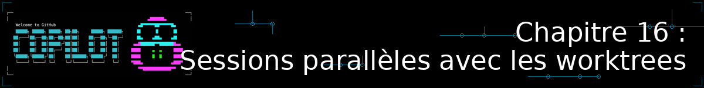
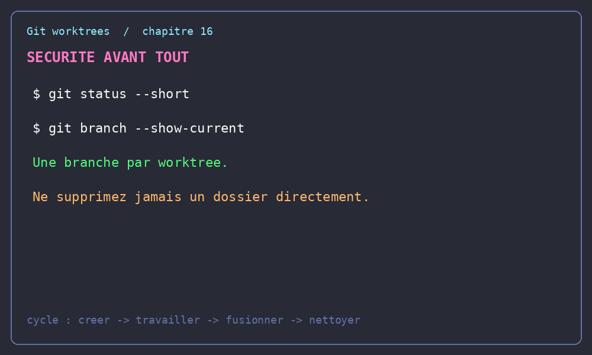

<!--
---
id: CopilotCLI-16
title: !translate Sessions parallèles avec les worktrees Git
description: !translate Isole plusieurs sessions Copilot CLI dans des worktrees Git indépendants pour mener de front deux tâches sur le même dépôt, sans qu'elles ne se marchent dessus.
audience: Developers / Students / Terminal users
slug: parallel-sessions-with-worktrees
weight: 17
---
-->



> **Et si tu pouvais laisser une session Copilot CLI corriger un bug urgent pendant qu'une deuxième travaille sur une nouvelle fonctionnalité — dans le même dépôt, en même temps, sans qu'elles ne se marchent dessus ?**

Au [Chapitre 08](../08-putting-it-together/README.md), un encadré évoquait en une ligne `/worktree new`, disponible depuis Copilot CLI v1.0.79. Au [Chapitre 09](../09-isolated-environments/README.md), tu as appris à isoler Copilot CLI pour qu'il travaille sans surveillance humaine. Ce chapitre bonus développe un troisième axe, complémentaire : l'isolation au service de la **parallélisation**. Tu vas apprendre à faire tourner plusieurs sessions Copilot CLI en même temps, sur le même clone de dépôt, chacune sur sa propre tâche, grâce aux **worktrees Git**.

## 🎯 Objectifs d'apprentissage

À la fin de ce chapitre, tu seras capable de :

- Expliquer ce qu'est un worktree Git et le problème concret qu'il résout
- Créer, lister et supprimer des worktrees avec les commandes Git natives
- Isoler une session Copilot CLI dans un nouveau worktree avec `/worktree new`
- Faire tourner plusieurs sessions Copilot CLI en parallèle sur des tâches indépendantes du même dépôt
- Fusionner le travail de chaque worktree, puis nettoyer proprement derrière toi

> ⏱️ **Durée estimée** : ~35 minutes (15 min de lecture + 20 min de pratique)

---

## ✅ Prérequis

- [Chapitre 01 : Démarrage rapide](../01-quick-start/README.md) terminé (Copilot CLI installé et vérifié)
- À l'aise avec les branches Git de base (créer une branche, committer, pousser)
- ⚠️ **Version recommandée** : Copilot CLI v1.0.79 ou plus récent pour la commande `/worktree new`. Si ta version est plus ancienne, mets à jour (`npm update -g @github/copilot`, `brew upgrade copilot-cli`, etc.) — ou replie-toi simplement sur les commandes Git natives présentées dans ce chapitre, qui fonctionnent quelle que soit ta version de Copilot CLI.

---

## 🧩 Analogie du monde réel : les chambres d'un même hôtel

Imagine un hôtel avec une seule réception, une seule adresse, une seule infrastructure (électricité, eau, réseau) — mais plusieurs chambres. Chaque client dispose de sa propre chambre, avec sa propre porte : il peut y travailler, la ranger ou la mettre sens dessus dessous sans déranger la chambre voisine. Tout le monde partage pourtant le même bâtiment.

Un worktree Git fonctionne pareil : plusieurs dossiers sur ton disque (les « chambres »), chacun sur sa propre branche, qui partagent tous le même historique Git — les mêmes commits, les mêmes objets (la « réception » et les « fondations »). Aucune duplication de l'historique, aucune synchronisation à gérer entre les dossiers.

Compare les trois façons de mener deux tâches de front sur un même dépôt :

| | Cloner le dépôt une deuxième fois | Changer de branche (`git stash` + `checkout`) | Worktree |
|---|---|---|---|
| **Espace disque** | Tout l'historique dupliqué | Aucun espace supplémentaire | Seuls les fichiers de travail sont dupliqués ; historique partagé |
| **Interrompt la tâche en cours** | Non | Oui — il faut `stash`/`pop` à chaque bascule | Non |
| **Sessions Copilot CLI simultanées** | Possible, mais le second clone se désynchronise facilement du premier | Impossible (un seul répertoire de travail) | Oui, en toute sécurité, sur le même historique |

---

## Le problème : un répertoire, une tâche à la fois

Par défaut, un dépôt Git n'a qu'un seul répertoire de travail. Si tu lances une session Copilot CLI dessus pour développer une fonctionnalité, puis qu'un bug urgent tombe, tu n'as que de mauvaises options : interrompre la session en cours, mettre tes changements de côté avec `git stash`, changer de branche, corriger le bug, puis tout remettre en place pour reprendre où tu en étais. À chaque bascule, tu perds du contexte — exactement le genre de friction que ce cours essaie de te faire éviter.

Les worktrees suppriment cette contrainte : chaque tâche obtient son propre dossier, sa propre branche, et donc sa propre session Copilot CLI, sans jamais toucher aux autres.

---

## Les worktrees Git, la mécanique de base

Un worktree se manipule avec quatre commandes Git natives — disponibles depuis Git 2.5 (2015), aucune installation supplémentaire requise.

### 🛡️ Règles de sécurité avant de commencer

Avant toute commande, vérifie que tu es bien dans le dépôt attendu et que ton travail est protégé :

```bash
git rev-parse --show-toplevel
git status --short
git branch --show-current
```

Ne lance pas la démonstration avec des modifications non committées que tu veux conserver : un nouveau worktree part du commit de référence, pas de ton état de fichiers local. Chaque worktree doit utiliser **une branche différente** ; une même branche ne peut pas être extraite simultanément dans deux dossiers. Enfin, ne supprime jamais un dossier de worktree avec une commande récursive : utilise `git worktree remove` afin que Git mette aussi à jour ses métadonnées.

### Créer un worktree

```bash
# Crée un nouveau dossier ../book-app-hotfix, avec une nouvelle branche "fix/isbn-validation"
git worktree add -b fix/isbn-validation ../book-app-hotfix
```

`-b <nom-de-branche>` crée la branche en même temps que le worktree. Si tu omets `<point-de-départ>` (ici, rien après le chemin), la nouvelle branche part du commit actuellement extrait dans ton répertoire principal.

### Lister les worktrees actifs

```bash
git worktree list
```

```
/path/to/onepoint_formation_gihub_copilot     a1b2c3d [main]
/path/to/book-app-hotfix                      a1b2c3d [fix/isbn-validation]
```

### Supprimer un worktree

```bash
git worktree remove ../book-app-hotfix
```

Git refuse de supprimer un worktree contenant des modifications non committées ou des fichiers non suivis — commite-les, ou force avec `git worktree remove -f` en connaissance de cause.

### Nettoyer les références orphelines

```bash
git worktree prune
```

Utile si tu as supprimé un dossier de worktree directement (`rm -rf`) sans passer par `git worktree remove` — Git garde sinon une référence à un dossier qui n'existe plus.

> ⚠️ **Limitation importante** : tu ne peux pas extraire la même branche dans deux worktrees en même temps. Chaque worktree a besoin de sa propre branche — c'est justement ce qui garantit qu'aucune session Copilot CLI ne peut écraser le travail d'une autre par accident.

## Le cycle de vie complet : créer, travailler, fusionner, nettoyer

Le schéma suivant est volontairement explicite. Exécute les commandes depuis la racine du dépôt principal, sauf lorsqu'un bloc indique un changement de dossier.

### 1. Créer et vérifier

```bash
git status --short
git worktree add -b feature/book-search ../book-app-search
git worktree list
```

La dernière commande doit afficher le dépôt principal et `../book-app-search`, chacun avec une branche différente. Ne lance pas une deuxième session sur le même worktree : une session Copilot CLI par dossier évite les écritures concurrentes.

### 2. Travailler dans le worktree

```bash
cd ../book-app-search
copilot -p "Ajoute une recherche par auteur dans samples/book-app-project/ et ses tests pytest. Ne modifie pas les autres fonctionnalités."
git diff --check
python -m pytest samples/book-app-project/tests/
git add samples/book-app-project/
git commit -m "feat: add author search"
```

Le commit est créé dans la branche du worktree. Reviens ensuite au dépôt principal avant de fusionner :

```bash
cd -
git status --short
git branch --show-current
```

### 3. Fusionner et traiter un conflit

```bash
git merge --no-ff feature/book-search
```

Si Git signale un conflit, ne supprime pas arbitrairement les marqueurs `<<<<<<<`, `=======` et `>>>>>>>`. Ouvre chaque fichier concerné, choisis ou combine les deux versions, puis vérifie le résultat :

```bash
git status
git diff --check
python -m pytest samples/book-app-project/tests/
git add <fichier-résolu>
git commit
```

Un worktree reste indépendant jusqu'au commit ; la fusion se fait depuis le dépôt principal, jamais depuis le dossier que tu es en train de supprimer.

### 4. Nettoyer et prouver que le nettoyage est terminé

Après une fusion réussie (ou après avoir décidé d'abandonner le travail), supprime le dossier géré par Git, puis sa branche devenue inutile :

```bash
git worktree remove ../book-app-search
git worktree prune
git branch -d feature/book-search
git worktree list
```

Le dernier `git worktree list` ne doit plus afficher `../book-app-search` : dans un dépôt qui ne comportait pas d'autres worktrees, il ne reste alors que le dépôt principal. Cette vérification fait partie du résultat attendu, pas d'une étape facultative.

### Si une session est interrompue

Une coupure réseau, un terminal fermé ou une session Copilot CLI arrêtée ne supprime pas automatiquement le worktree. Reprends depuis le dépôt principal et inspecte d'abord :

```bash
git worktree list
git -C ../book-app-search status --short
```

- **Travail à conserver** : reviens dans le worktree, fais les vérifications, puis `git add` et `git commit` avant de fusionner.
- **Travail à abandonner** : vérifie deux fois le chemin affiché par `git worktree list`, puis utilise `git worktree remove -f ../book-app-search`. L'option `-f` détruit les modifications non committées de ce worktree.
- **Dossier supprimé manuellement** : exécute `git worktree prune`, puis relance `git worktree list` pour confirmer que la référence orpheline a disparu.

Ne force jamais la suppression sans avoir identifié précisément le worktree et accepté la perte de ses changements.

---

## Isoler une session Copilot CLI dans un worktree

Tu pourrais toujours créer un worktree à la main puis y lancer `copilot` normalement — cela fonctionne très bien, et c'est le repli à connaître si l'une des commandes suivantes n'est pas reconnue par ta version de Copilot CLI (mets à jour, ou vérifie la liste avec `/help`). Mais depuis la version **v1.0.79**, Copilot CLI propose plusieurs raccourcis intégrés qui combinent la création du worktree et le démarrage d'une session dedans, directement depuis une session interactive.

### `/worktree new` — une nouvelle conversation, en parallèle

```
/worktree new
```

Copilot crée un worktree isolé à partir du HEAD actuel, puis démarre une **nouvelle conversation** dans ce worktree — ta conversation actuelle et son dossier de travail restent inchangés, exactement comme le résumait déjà l'encadré du [Chapitre 08](../08-putting-it-together/README.md) :

> 🛡️ *« `/worktree new` isole ta session de travail dans un nouveau worktree git — pratique pour paralléliser plusieurs tâches Copilot CLI (par exemple ce workflow et une correction de bug urgente) sans qu'elles ne se marchent dessus. »*

Comme pour toute nouvelle branche, le nouveau worktree part d'un point de départ propre : commite ou mets de côté (`git stash`) tes changements en cours dans la session d'origine avant de lancer `/worktree new`, pour éviter toute confusion sur ce qui a été repris et ce qui est resté derrière.

<details>
<summary>🎬 Vois-le en action !</summary>



*Le résultat peut varier selon ta version de Copilot CLI et ton contexte : ne sois pas surpris si ta sortie diffère de celle présentée ici.*

</details>

### `/worktree` et `/move` — basculer la session en cours

Deux autres commandes créent un worktree et **basculent la session actuelle** dedans, au lieu d'en ouvrir une nouvelle. Elles se distinguent par ce qu'elles font de tes modifications non committées :

```
/worktree fix/isbn-validation
```

`/worktree [branche|description]` laisse tes modifications non committées **derrière**, dans le worktree d'origine, et poursuit ta conversation dans le nouveau worktree, sur une base propre.

```
/move fix/isbn-validation
```

`/move [branche|description]` fait l'inverse : il **emporte** tes modifications non committées avec toi dans le nouveau worktree. C'est la réponse directe au problème posé plus haut dans ce chapitre — plus besoin de `git stash` puis `git checkout` pour mettre une tâche de côté et en démarrer une autre, `/move` fait les deux en une commande.

Les deux acceptent soit un nom de branche, soit une description de tâche en langage naturel (sur laquelle Copilot génère un nom de branche), soit aucun argument (génération automatique à partir de la conversation).

### `/fork` et `/branch` — fourcher la conversation, sans nouveau worktree

```
/fork
```

`/fork [NOM]` (alias `/branch [NOM]`) fourche uniquement la **conversation** dans une nouvelle session — sans créer de worktree ni de nouveau dossier sur disque. Utile pour explorer deux pistes de discussion ou deux approches sur le même code, sans avoir besoin de l'isolation complète (et du coût disque) d'un worktree. Si tu n'as pas besoin de faire tourner deux processus Copilot CLI en parallèle sur des fichiers différents, `/fork` suffit souvent et reste plus léger.

### Depuis la ligne de commande, sans passer par une session interactive

```bash
copilot --worktree=fix-isbn-validation -p "Corrige la validation de l'ISBN dans samples/book-app-project/books.py"
```

Le flag `-w`/`--worktree[=NOM]` fait l'équivalent non-interactif de `/worktree new` : il crée (ou réutilise) un worktree isolé et y démarre la session, sans que tu aies à taper de commande `/worktree` une fois Copilot lancé. Par défaut, Copilot range ces worktrees sous `<dépôt>.worktrees/<nom>` — un emplacement différent des dossiers `../book-app-hotfix` créés à la main plus haut dans ce chapitre ; `git worktree list` affiche les deux de la même façon, quel que soit l'endroit où ils se trouvent sur le disque.

> ⚙️ **Faire partir un worktree d'une autre base que `HEAD`** — par défaut, `/worktree`, `/worktree new`, `/move` et `--worktree` créent leur branche à partir du commit actuellement extrait (`HEAD`) dans ton répertoire courant. Si tu es en plein milieu d'une feature branch et que tu veux qu'un worktree de hotfix parte toujours de `main` plutôt que de ta branche en cours, règle `worktreeBaseRef` sur `"defaultBranch"` dans la [configuration de Copilot CLI](https://docs.github.com/en/copilot/reference/copilot-cli-reference/cli-config-dir-reference).

| Commande | Bascule la session en cours ? | Emporte les modifs non committées ? | Nouveau dossier sur disque ? |
|---|---|---|---|
| `/worktree new` | Non (nouvelle conversation en parallèle) | — (reste dans l'ancien worktree) | Oui |
| `/worktree` | Oui | Non, les laisse derrière | Oui |
| `/move` | Oui | Oui | Oui |
| `/fork` / `/branch` | Oui (nouvelle conversation) | — (aucun fichier déplacé) | Non |

---

## Paralléliser pour de vrai : plusieurs sessions, plusieurs fenêtres

Un worktree isolé ne sert à rien si tu ne l'exploites que l'un après l'autre. Pour paralléliser pour de bon, ouvre une fenêtre ou un onglet de terminal par worktree — un multiplexeur comme `tmux` (présenté au [Chapitre 00](../00-modern-terminal-stack/README.md)) rend la bascule entre sessions plus confortable, mais n'est pas indispensable : plusieurs fenêtres de terminal classiques, ou plusieurs onglets de terminal intégré dans ton éditeur, fonctionnent tout aussi bien.

Reprenons l'exemple du [Chapitre 08](../08-putting-it-together/README.md) : une correction de bug urgente pendant qu'une fonctionnalité est en cours de développement, sur `samples/book-app-project/`.

**Terminal 1 — worktree pour la correction de bug** (dans `books.py`) :

```bash
git worktree add -b fix/isbn-validation ../book-app-hotfix
cd ../book-app-hotfix
copilot -p "Dans samples/book-app-project/books.py, corrige la validation de l'ISBN pour accepter les ISBN-13 avec tirets. Ajoute un test dans tests/test_books.py."
```

**Terminal 2 — worktree pour la nouvelle fonctionnalité** (dans `book_app.py`), en parallèle du premier :

```bash
git worktree add -b feature/find-by-year ../book-app-feature
cd ../book-app-feature
copilot -p "Dans samples/book-app-project/book_app.py, ajoute une commande find-by-year qui liste les livres publiés une année donnée. Ajoute un test."
```

Les deux sessions Copilot CLI travaillent sur le même historique Git, dans deux dossiers distincts, sans jamais se gêner. Tu peux suivre l'avancement de l'une pendant que l'autre tourne encore.

> 💡 **Une autre manière de paralléliser : `/fleet`** — Le [Chapitre 08](../08-putting-it-together/README.md) mentionne aussi `/fleet`, qui laisse Copilot décomposer *une seule* tâche complexe en sous-tâches indépendantes, exécutées par des sous-agents en parallèle ([documentation officielle](https://docs.github.com/en/copilot/concepts/agents/copilot-cli/fleet)). Les deux approches sont complémentaires plutôt que concurrentes : les worktrees te laissent orchestrer toi-même plusieurs tâches *distinctes* (comme dans l'exemple ci-dessus) ; `/fleet` laisse Copilot orchestrer lui-même la décomposition d'*une* tâche en sous-parties.

### Ce qu'un worktree ne duplique pas

Un worktree partage l'historique Git, mais **pas** ton environnement d'exécution : chaque nouveau dossier repart sans dépendances installées. Pour `samples/book-app-project/` (Python), recrée ou réutilise un environnement virtuel dans chaque worktree avant de lancer les tests :

```bash
cd ../book-app-hotfix
python -m venv .venv && source .venv/bin/activate
pip install -r samples/book-app-project/requirements.txt 2>/dev/null || true
python -m pytest samples/book-app-project/tests/
```

Si `pytest` échoue immédiatement après la création d'un worktree, pense d'abord à cette étape avant de soupçonner le code généré. Pour la même raison, deux serveurs de développement lancés depuis deux worktrees différents peuvent entrer en conflit s'ils écoutent tous les deux sur le même port par défaut — attribue-leur des ports distincts si tu en lances plusieurs en même temps.

Un raccourci non-interactif équivalent au workflow manuel ci-dessus, cette fois avec le flag `--worktree` :

```bash
copilot --worktree=feature-find-by-year -p "Dans samples/book-app-project/book_app.py, ajoute une commande find-by-year qui liste les livres publiés une année donnée. Ajoute un test."
```

Enfin, si une session Copilot CLI tourne encore dans un worktree, verrouille-le pour éviter qu'un nettoyage manuel — le tien ou celui d'un script automatisé comme celui du devoir bonus plus bas — ne le supprime par erreur pendant qu'il travaille :

```bash
git worktree lock ../book-app-hotfix --reason "Session Copilot CLI en cours"
# ... une fois la session terminée et le travail committé ...
git worktree unlock ../book-app-hotfix
```

---

## Fusionner et nettoyer

Avant de fusionner, vérifie ce que la session Copilot CLI a réellement modifié — un agent qui corrige une fonction touche parfois aussi, sans qu'on le lui ait demandé, un fichier voisin :

```bash
git diff main...fix/isbn-validation
```

(ou `/diff` directement dans une session Copilot CLI, qui bascule automatiquement sur ce même diff de branche dès que ton répertoire de travail est propre). Ne fusionne pas tant que le diff contient des changements que tu n'attendais pas.

Une fois le travail d'un worktree terminé et validé, reviens au dépôt principal pour l'intégrer :

```bash
# Depuis le dépôt principal, après avoir committé dans chaque worktree
git push -u origin fix/isbn-validation
git push -u origin feature/find-by-year

# Fusionne comme tu le ferais pour n'importe quelle branche
# (localement avec `git merge`, ou via une pull request GitHub)
```

> 💡 **Ou laisse Copilot CLI gérer la pull request** — `/pr create` ouvre une pull request pour la branche courante directement depuis la session ; `/pr auto` la pousse jusqu'au vert (CI passante) puis s'arrête, et `/pr automerge` (alias `/agentmerge`) la pousse jusqu'au vert puis la fusionne. Voir la [documentation officielle sur la gestion des pull requests](https://docs.github.com/en/copilot/how-tos/copilot-cli/use-copilot-cli/manage-pull-requests).

Puis nettoie les worktrees devenus inutiles :

```bash
git worktree remove ../book-app-hotfix
git worktree remove ../book-app-feature
git worktree prune
git worktree list
# Vérifie ici qu'il ne reste aucun worktree de démonstration.

git branch -d fix/isbn-validation feature/find-by-year
```

---

## Pratique

Tu vas créer deux worktrees, y lancer deux sessions Copilot CLI en parallèle sur `samples/book-app-project/`, puis nettoyer.

### ▶️ À toi de jouer

1. Depuis la racine du dépôt, crée un premier worktree : `git worktree add -b tp/worktree-un ../tp-worktree-un`
2. Crée un second worktree : `git worktree add -b tp/worktree-deux ../tp-worktree-deux`
3. Vérifie que les deux apparaissent avec `git worktree list`
4. Dans deux fenêtres de terminal séparées, `cd` dans chaque worktree et lance une session Copilot CLI (interactive ou avec `-p`) sur une tâche différente et courte dans `samples/book-app-project/`
5. Dans chaque worktree, vérifie, teste, `git add` puis commite le travail
6. Reviens au dépôt principal, fusionne chaque branche, puis supprime les deux worktrees avec `git worktree remove`
7. Exécute `git worktree list` et confirme qu'aucun des deux worktrees de TP ne figure encore dans la liste

---

## 📝 Devoir

### Défi principal : l'interruption pour un correctif urgent

Pendant que tes deux worktrees du TP sont encore actifs (ne les supprime pas), simule une urgence : crée un **troisième** worktree pour un correctif, sans toucher aux deux premiers. Vérifie avec `git worktree list` que les trois coexistent, chacun sur sa propre branche.

<details>
<summary>💡 Indices</summary>

```bash
git worktree add -b hotfix/urgence ../tp-worktree-hotfix
cd ../tp-worktree-hotfix
copilot -p "Corrige un petit bug dans samples/book-app-project/utils.py"
```

Aucune des deux autres sessions n'a besoin d'être interrompue ou de perdre son contexte pendant que tu traites l'urgence.

</details>

### Défi bonus : un script de nettoyage automatique

Écris un script bash qui prend un nom de branche en argument, crée le worktree correspondant, lance Copilot CLI en mode programmatique (`-p`) avec un prompt donné en second argument, puis supprime automatiquement le worktree une fois la commande terminée.

> 🤖 **Solution prête à l'emploi :** [`scripts/wt-parallel.sh`](scripts/wt-parallel.sh) (bash) et [`scripts/wt-parallel.ps1`](scripts/wt-parallel.ps1) (PowerShell) vont plus loin que l'indice ci-dessous : nettoyage garanti même en cas d'erreur, refus d'écraser un worktree existant et option `--keep` / `-Keep` pour conserver le résultat. Essaie d'abord de l'écrire toi-même !
> `bash 16-parallel-worktrees/scripts/wt-parallel.sh feature/demo "Ajoute une docstring à utils.py"`

<details>
<summary>💡 Indices</summary>

```bash
#!/usr/bin/env bash
set -euo pipefail

branch="$1"
prompt="$2"
path="../wt-${branch//\//-}"

git worktree add -b "$branch" "$path"
(cd "$path" && copilot -p "$prompt")
git worktree remove "$path"
```

</details>

---

<details>
<summary>🔧 <strong>Erreurs courantes et dépannage</strong> (clique pour développer)</summary>

### Erreurs courantes

| Erreur | Ce qui se passe | Solution |
|---------|--------------|-----|
| `fatal: '<branche>' is already checked out at '<chemin>'` | Git refuse d'extraire la même branche dans deux worktrees en même temps | Utilise une branche différente pour chaque worktree (`-b <nouvelle-branche>`) |
| `/worktree new` inconnue ou ignorée par Copilot CLI | Version de Copilot CLI antérieure à v1.0.79 | Mets à jour avec `npm update -g @github/copilot` (ou l'équivalent de ton gestionnaire), ou utilise `git worktree add` manuellement en attendant |
| `fatal: '<chemin>' already exists` | Un dossier (ou un ancien worktree) du même nom existe déjà à cet endroit | Choisis un autre chemin, ou supprime l'ancien worktree avec `git worktree remove` avant de recréer le tien |
| `git worktree remove` refuse de supprimer | Le worktree contient des modifications non committées ou des fichiers non suivis | Commite ou mets de côté tes changements, ou force avec `git worktree remove -f` si tu es sûr de vouloir les perdre |
| `git worktree remove` échoue avec une erreur de verrou | Le worktree a été verrouillé avec `git worktree lock` | Déverrouille-le d'abord avec `git worktree unlock <chemin>`, puis relance la suppression |
| `pytest` (ou tout autre test) échoue juste après la création d'un worktree | Le nouveau dossier n'a pas ses dépendances installées (venv/`node_modules` non partagés entre worktrees) | Recrée l'environnement virtuel et réinstalle les dépendances dans le nouveau worktree avant de relancer les tests |
| Tu ne sais plus quelle fenêtre correspond à quel worktree | Plusieurs sessions ouvertes sans repère visuel | Affiche la branche courante dans ton invite de shell (`git branch --show-current`), ou nomme tes onglets/panes de terminal explicitement |

</details>

---

## Résumé

Tu sais maintenant isoler plusieurs sessions Copilot CLI dans des worktrees Git indépendants, pour mener de front des tâches distinctes sur le même dépôt sans qu'elles n'interfèrent entre elles — que tu les crées à la main avec `git worktree add`, ou avec l'un des raccourcis intégrés (`/worktree new`, `/worktree`, `/move`, `--worktree`).

### 🔑 Points clés à retenir

1. **Un worktree, une branche, un dossier** : tu ne peux pas extraire la même branche dans deux worktrees en même temps
2. **L'historique Git est partagé, pas dupliqué** : contrairement à un second clone, aucune synchronisation à gérer entre worktrees
3. **Quatre commandes Copilot CLI, quatre nuances** : `/worktree new` ouvre une nouvelle conversation en parallèle ; `/worktree` bascule la session en cours en laissant les modifications non committées derrière ; `/move` bascule en les emportant ; `/fork`/`/branch` fourche la conversation seule, sans nouveau worktree — toutes reposent sur les mêmes commandes Git natives que tu peux toujours utiliser directement
4. **Un worktree ne duplique pas ton environnement** : réinstalle les dépendances (venv, `node_modules`…) dans chaque nouveau worktree, et verrouille-le (`git worktree lock`) pendant qu'une session y tourne
5. **Worktrees et `/fleet` sont complémentaires** : les premiers parallélisent des tâches distinctes que tu orchestres ; `/fleet` décompose une seule tâche en sous-parties orchestrées par Copilot

## 📋 Référence rapide

- [Documentation officielle `git worktree`](https://git-scm.com/docs/git-worktree)
- [Référence complète des commandes Copilot CLI](https://docs.github.com/en/copilot/reference/copilot-cli-reference/cli-command-reference) — `/worktree`, `/worktree new`, `/move`, `/fork`, `/branch`, `--worktree`
- [Configuration de Copilot CLI](https://docs.github.com/en/copilot/reference/copilot-cli-reference/cli-config-dir-reference) — dont le paramètre `worktreeBaseRef`
- [Gérer les pull requests avec `/pr`](https://docs.github.com/en/copilot/how-tos/copilot-cli/use-copilot-cli/manage-pull-requests)
- [Documentation officielle `/fleet`](https://docs.github.com/en/copilot/concepts/agents/copilot-cli/fleet)
- [Utiliser Copilot CLI — vue d'ensemble des options](https://docs.github.com/en/copilot/how-tos/copilot-cli/use-copilot-cli/overview)
- [Chapitre 08 : Tout assembler](../08-putting-it-together/README.md) — première mention de `/worktree new` et `/fleet`

---

## ➡️ Et ensuite ?

Tu as maintenant exploré trois façons de faire travailler Copilot CLI de manière isolée : dans un dev container cohérent, dans une sandbox strictement verrouillée (Chapitre 09), et dans des worktrees parallèles pour mener plusieurs tâches de front. À toi de combiner ces briques selon tes besoins — rien ne t'empêche, par exemple, de lancer une sandbox Docker *depuis* un worktree.

**[← Chapitre précédent : Rédiger des instructions IA efficaces et réutilisables](../15-prompt-engineering/README.md)** | **[Chapitre suivant : mcp2cli et le coût en tokens →](../17-mcp2cli/README.md)**
