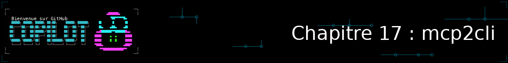
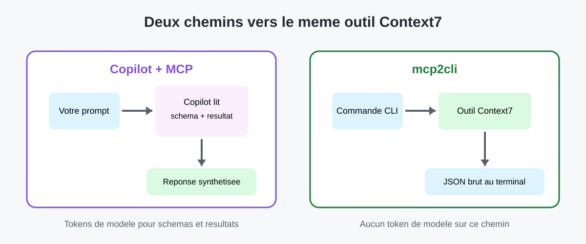
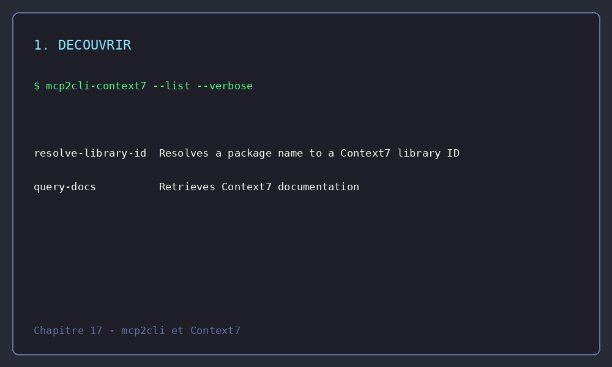

<!--
---
id: CopilotCLI-17
title: !translate Aller plus loin avec MCP : mcp2cli et le coût en tokens
description: !translate Comprenez pourquoi MCP a un coût en tokens, puis découvrez mcp2cli, un pont CLI qui transforme un serveur MCP en outil de terminal natif, pour interroger Context7 sans passer par une session Copilot.
audience: Developers / Students / Terminal users
slug: mcp2cli-and-token-cost
weight: 18
---
-->



> **Et si vous pouviez interroger un serveur MCP directement depuis votre terminal, sans faire transiter chaque échange par un modèle d'IA ?**

Au [Chapitre 07](../07-mcp-servers/README.md), vous avez connecté Copilot CLI à des serveurs MCP : GitHub, le système de fichiers, Context7. Chaque fois que Copilot utilise l'un de ces serveurs, deux choses se produisent en coulisses : le modèle doit d'abord « connaître » les outils disponibles (leurs noms, leurs paramètres, leurs descriptions), puis il doit lire chaque résultat renvoyé par le serveur. Les deux consomment des tokens, à chaque tour de conversation, pour chaque serveur connecté.

Ce chapitre bonus revient sur ce coût, et vous fait découvrir **mcp2cli**, un outil tiers qui transforme n'importe quel serveur MCP en ligne de commande native. Vous l'utiliserez pour interroger le serveur Context7 (déjà configuré au Chapitre 07) directement depuis votre terminal, sans passer par Copilot du tout.

> ⚠️ **Ce chapitre suppose que vous avez terminé le [Chapitre 07 : Serveurs MCP](../07-mcp-servers/README.md)**, en particulier la configuration du serveur Context7. Sans cela, vous n'aurez rien à interroger.

## 🎯 Objectifs d'apprentissage

À la fin de ce chapitre, vous serez capable de :

- Expliquer pourquoi chaque serveur MCP connecté a un coût en tokens, même quand vous ne l'utilisez pas activement
- Installer mcp2cli et l'utiliser pour découvrir les outils d'un serveur MCP existant
- Inspecter puis invoquer un outil MCP directement depuis le terminal, en JSON
- Choisir entre Copilot + MCP et mcp2cli selon ce que vous cherchez à faire

> ⏱️ **Durée estimée** : ~35 minutes (10 min de lecture + 25 min de pratique)

---

## ✅ Prérequis

> ⚠️ **[Chapitre 07 : Serveurs MCP](../07-mcp-servers/README.md) obligatoire.** Ce chapitre réutilise le serveur Context7 que vous y avez configuré.

- Le serveur Context7 configuré dans `~/.copilot/mcp-config.json` ou `.mcp.json` (voir [Serveur Context7](../07-mcp-servers/README.md#context7-server-documentation))
- Être à l'aise avec les commandes de terminal de base
- `curl` disponible sur votre système (pour l'installation)

---

## 🧩 Analogie du monde réel : standardiste vs ligne directe

Pensez à Copilot + MCP comme à un standard téléphonique : vous décrivez ce que vous voulez à un ou une standardiste (le modèle), qui comprend votre demande, sait quel poste (quel outil MCP) appeler, transmet votre question, écoute la réponse complète, puis vous la reformule. C'est précieux : le ou la standardiste peut interpréter une demande ambiguë, enchaîner plusieurs appels, et faire la synthèse. Mais chaque échange occupe son attention, et donc du temps.

mcp2cli, c'est la ligne directe : quand vous savez déjà exactement quel poste appeler et quoi lui dire, vous composez le numéro vous-même. C'est plus rapide, ça ne mobilise personne d'autre, mais vous n'avez plus personne pour interpréter une réponse ambiguë ou décider quoi faire ensuite.

| Standard téléphonique | Ligne directe |
|---|---|
| **Copilot + MCP** : le modèle lit les outils disponibles, comprend votre demande, appelle le bon outil, interprète le résultat | **mcp2cli** : vous appelez directement l'outil, vous lisez vous-même le résultat brut |
| Coûte des tokens à chaque échange (schémas d'outils + résultats) | Coûte zéro token de modèle : rien ne transite par une IA |
| Utile pour une tâche complexe, ambiguë, ou multi-étapes | Utile pour une recherche ciblée et répétée, ou un script |

> 💡 **Point clé** : Les deux approches parlent le même protocole MCP au même serveur. Ce n'est pas Context7 qui change, c'est qui — ou quoi — se trouve entre vous et lui.

---

## Pourquoi MCP coûte des tokens

Un [Token](../GLOSSARY.md#token) est l'unité de texte que Copilot traite, et la [fenêtre de contexte](../GLOSSARY.md#context-window-fenêtre-de-contexte) est la place disponible pour tous les tokens d'une conversation : vos prompts, l'historique, les fichiers partagés — et les serveurs MCP.

Concrètement, quand un serveur MCP est activé, deux coûts s'ajoutent :

1. **Le coût de découverte** : au démarrage d'une session (et à chaque reconnexion), Copilot reçoit la liste des outils de chaque serveur activé — leurs noms, leurs descriptions, le schéma JSON de leurs paramètres. Plus vous avez de serveurs actifs, avec `"tools": ["*"]`, plus cette liste est longue, et plus elle occupe de place dans la fenêtre de contexte *avant même votre premier prompt*.
2. **Le coût d'appel** : chaque fois que Copilot appelle un outil, les arguments de l'appel et le résultat complet renvoyé par le serveur passent par le modèle. Un résultat volumineux (une longue page de documentation, par exemple) coûte des tokens à lire, même si vous n'en avez besoin que d'un court extrait.

Vous avez déjà croisé deux leviers pour réduire ce coût au Chapitre 07, sans que le lien avec les tokens soit fait explicitement :

- **Limiter `"tools"` dans la configuration** plutôt que `["*"]`, pour n'exposer que les outils réellement utiles d'un serveur.
- **`/mcp disable <server-name>`** pour désactiver un serveur que vous n'utilisez pas dans la session en cours (voir [Commandes MCP supplémentaires](../07-mcp-servers/README.md#-additional-mcp-commands)).

mcp2cli propose une troisième option, plus radicale : sortir complètement le modèle de l'équation pour les requêtes où vous n'avez pas besoin de raisonnement, seulement d'une donnée.

---

## Découvrir mcp2cli

[mcp2cli](https://mcp2cli.dev/) est un outil tiers (licence Apache 2.0, dépôt [`mcp2cli/source-code`](https://github.com/mcp2cli/source-code)) qui « transforme n'importe quel serveur MCP en application de ligne de commande native ». Il se connecte à un serveur MCP, découvre automatiquement ses outils, ressources et prompts, puis les expose comme des commandes de terminal typées : les champs obligatoires du schéma deviennent des flags obligatoires, et le schéma JSON pilote l'analyse des arguments.

> 💡 **mcp2cli n'est pas un produit GitHub ni Microsoft.** C'est un outil tiers indépendant. Il communique avec un serveur MCP via le même protocole standard que Copilot CLI — les deux révisions MCP 2026-07-28 (sans état, sondée en priorité) et 2025-11-25 (avec repli automatique) — mais c'est un projet distinct, à évaluer comme n'importe quel outil tiers avant de l'installer.
>
> ⚠️ **Attention à l'homonymie** : d'autres projets open source sans rapport portent aussi le nom « mcp2cli » (par exemple un plugin Claude Code ou une bibliothèque de pont générique). Ce chapitre suit exclusivement [mcp2cli.dev](https://mcp2cli.dev/) — vérifiez toujours l'URL du dépôt avant d'installer un outil qui porte ce nom.

### Installation

```bash
curl -fsSL https://mcp2cli.dev/install.sh | sh
```

> ⚠️ **Avant d'exécuter un script d'installation via `curl | sh`**, il est prudent d'en inspecter le contenu (`curl -fsSL https://mcp2cli.dev/install.sh | less`) plutôt que de l'exécuter les yeux fermés — une bonne pratique pour n'importe quel script tiers, pas seulement celui-ci.

Une fois installé, mcp2cli propose deux façons de se connecter à un serveur MCP :

- **Ad hoc, sans configuration** : `--url <URL>` pour un serveur distant, ou `--stdio "<commande>"` pour lancer un serveur local — pratique pour un test ponctuel (vous vous en servirez pour le défi bonus avec le serveur Filesystem).
- **Config nommée + alias**, pour un usage répété : `mcp2cli config init` enregistre la connexion sous un nom, puis `mcp2cli link create` génère une commande autonome (par exemple `context7`) que vous utilisez ensuite comme n'importe quel programme du terminal. C'est cette seconde option que vous utiliserez pour Context7, puisqu'il s'exécute localement via `npx`.

---

## TP : interroger Context7 sans passer par Copilot




### Un parcours exactement reproductible

Le GIF ci-dessous suit les quatre commandes de ce TP. Son fichier source [`mcp2cli-context7-demo.tape`](assets/mcp2cli-context7-demo.tape) permet de le régénérer avec [VHS](https://github.com/charmbracelet/vhs).



Les commandes ont été vérifiées avec **mcp2cli v0.1.8** (la dernière version publiée au moment de la rédaction — l'outil est encore en version 0.x, vérifiez la vôtre avec `mcp2cli --version` et consultez la [référence CLI officielle](https://github.com/mcp2cli/source-code/blob/main/docs/reference/cli-reference.md) si une commande ci-dessous ne correspond plus). Le serveur Context7 utilisé est celui déjà configuré au Chapitre 07 : un processus local lancé via `npx -y @upstash/context7-mcp`, sans clé API. Créez d'abord une config nommée qui pointe vers cette même commande, puis un alias :

```bash
curl -fsSL https://mcp2cli.dev/install.sh | sh
mcp2cli config init --name context7 --app bridge \
  --transport stdio --stdio-command npx \
  --stdio-arg -y --stdio-arg @upstash/context7-mcp
mcp2cli link create --name context7
```

Fermez et rouvrez le terminal si la commande `context7` n'est pas encore trouvée (l'alias est un lien symbolique créé à côté du binaire `mcp2cli` — ajoutez ce dossier à votre `PATH` si besoin). Vous pouvez contrôler la version et la configuration effectivement utilisées :

```bash
mcp2cli --version
mcp2cli config show --name context7
```

> ⚠️ **Limite importante** : `mcp2cli` génère ses commandes à partir du schéma publié par le serveur. Une mise à jour de Context7 peut donc faire évoluer un nom ou un flag. Exécutez toujours les étapes 1 et 2 avant d'automatiser le flux.

### Étape 1 : découvrir le même outil Context7

```bash
context7 ls --tools
```

Vous devez voir notamment `resolve-library-id` et `query-docs`. Le premier transforme le nom d'une bibliothèque en identifiant Context7 ; le second recherche dans sa documentation.

### Étape 2 : inspecter sa signature générée

```bash
context7 resolve-library-id --help
```

La signature affiche les deux flags obligatoires : `--library-name` et `--query`. C'est la version directement lisible de la signature MCP que Copilot reçoit lorsqu'il découvre l'outil.

### Étape 3 : invoquer l'outil avec une requête fixe

```bash
context7 --json resolve-library-id --library-name=pytest --query="pytest fixture scopes"
```

**Résultat attendu** : la réponse JSON contient l'identifiant Context7 **`/pytest-dev/pytest`**. Conservez-le pour l'appel suivant :

```bash
context7 --json query-docs --library-id=/pytest-dev/pytest --query="pytest fixture scopes"
```

Cette seconde réponse contient de la documentation sur les portées de fixtures pytest. Aucun token de **modèle** n'est consommé : vous appelez le serveur et lisez sa réponse directement. Le réseau, le terminal et Context7 continuent bien sûr de traiter la requête.

### Étape 4 : comparer le même outil, la même requête et le même résultat

Ouvrez Copilot avec le serveur Context7 configuré au Chapitre 07, puis envoyez ce prompt :

```bash
copilot

> Use the Context7 resolve-library-id tool with library name "pytest" and query "pytest fixture scopes". Return the selected Context7 library ID only.
```

**Même entrée** : `pytest` et `pytest fixture scopes`. **Même outil** : `resolve-library-id` de Context7. **Même résultat à vérifier** : `/pytest-dev/pytest`. La différence est le chemin : mcp2cli affiche la réponse brute dans le terminal ; Copilot reçoit le schéma de l'outil et sa réponse, puis vous la présente. La formulation de Copilot peut varier, mais l'identifiant retourné doit être le même.

### Alternative manuelle sans mcp2cli

Si l'installation de mcp2cli est bloquée, le [MCP Inspector](https://github.com/modelcontextprotocol/inspector) permet de faire le même contrôle manuellement :

```bash
npx -y @modelcontextprotocol/inspector npx -y @upstash/context7-mcp
```

Ouvrez l'adresse locale affichée, sélectionnez `resolve-library-id`, puis saisissez `pytest` pour `libraryName` et `pytest fixture scopes` pour `query`. Vérifiez `/pytest-dev/pytest`, puis appelez `query-docs` avec cet identifiant et la même requête. Cette alternative montre les mêmes outils et données, mais nécessite un navigateur et ne fournit pas une commande facilement scriptable.

---

# Pratique

**🎉 Vous savez maintenant pourquoi MCP a un coût, et comment le contourner quand vous n'avez pas besoin d'un modèle pour interpréter la réponse.** Passons à la pratique.

## ▶️ À vous de jouer

### Exercice 1 : Vérifier l'installation

```bash
mcp2cli --version
mcp2cli config show --name context7
context7 ls --tools
```

**Résultat attendu** : la version de mcp2cli, la configuration nommée et les outils `resolve-library-id` et `query-docs` s'affichent sans erreur.

> 💡 **Ça échoue ?** Vérifiez que la config existe (`mcp2cli config list`) et recréez l'alias avec `mcp2cli link create --name context7 --force` si besoin. Vérifiez aussi que Context7 fonctionne avec Copilot (`/mcp show` au Chapitre 07) : si les deux clients ne le joignent pas, le problème est ailleurs.

---

### Exercice 2 : Inspecter les signatures générées

Inspectez les paramètres du premier outil, puis ceux du second :

```bash
context7 resolve-library-id --help
context7 query-docs --help
```

**Résultat attendu** : vous identifiez `--library-name` et `--query` pour la résolution, puis `--library-id` et `--query` pour la recherche documentaire.

---

### Exercice 3 : Récupérer de la documentation pour l'application de gestion de livres

Utilisez la même requête que dans le TP, en sauvegardant les deux réponses JSON :

```bash
context7 --json resolve-library-id --library-name=pytest --query="pytest fixture scopes" > resolve-pytest.json
context7 --json query-docs --library-id=/pytest-dev/pytest --query="pytest fixture scopes" > pytest-fixture-scopes.json
```

**Résultat attendu** : `resolve-pytest.json` contient `/pytest-dev/pytest` et `pytest-fixture-scopes.json` contient une documentation exploitable sur les portées de fixtures, sans démarrer une session Copilot.

---

### Exercice 4 : Comparer la même requête par vous-même

Dans Copilot configuré avec Context7, réutilisez précisément `library name = pytest` et `query = pytest fixture scopes`. Comparez :

- L'identifiant renvoyé : `/pytest-dev/pytest` dans les deux cas
- La longueur et la lisibilité de chaque réponse
- Ce qu'il vous reste à faire dans chaque cas (lire le JSON brut ou lire une réponse déjà synthétisée)

**Résultat attendu** : vous pouvez formuler, dans vos propres mots, un critère pour choisir entre les deux approches selon la tâche.

---

## 📝 Devoir

### Défi principal : Construire un mini-flux de documentation avec mcp2cli

Utilisez mcp2cli pour construire, en une suite de commandes, un flux complet de recherche de documentation :

1. **Découvrez** les outils de l'alias Context7 avec `context7 ls --tools`
2. **Inspectez** les deux signatures avec `--help`
3. **Enchaînez** `resolve-library-id`, puis `query-docs` avec l'identifiant retourné
4. **Sauvegardez** les résultats JSON dans deux fichiers
5. **Comparez** avec le même besoin résolu via Copilot, et notez par écrit (2-3 phrases) quand vous choisiriez l'une ou l'autre approche dans votre travail quotidien

**Critères de réussite** : vous obtenez une réponse JSON exploitable en local sans jamais démarrer `copilot`, et vous pouvez justifier votre choix d'approche pour une tâche donnée en termes de coût (tokens, temps) et de bénéfice (interprétation, synthèse).

<details>
<summary>💡 Indices (cliquez pour développer)</summary>

**Étape 1-2 : Découverte et inspection**
```bash
context7 ls --tools
context7 resolve-library-id --help
context7 query-docs --help
```

**Étape 3 : Enchaîner les outils**

Le premier outil renvoie un identifiant de bibliothèque. Réutilisez-le avec `--library-id` dans le second appel — le même principe que la synthèse manuelle que Copilot ferait pour vous automatiquement.

**Étape 4 : Sauvegarder la sortie**
```bash
context7 --json resolve-library-id --library-name=pytest --query="pytest fixture scopes" > resolve-pytest.json
context7 --json query-docs --library-id=/pytest-dev/pytest --query="pytest fixture scopes" > pytest-fixture-scopes.json
```

**Si mcp2cli ne se connecte pas :** utilisez l'alternative MCP Inspector documentée dans le TP, puis vérifiez que Context7 fonctionne dans Copilot avec `/mcp show`.

</details>

### Défi bonus : Essayer un autre serveur déjà configuré

Si vous avez configuré le serveur Filesystem au Chapitre 07, répétez l'exercice 1 avec :

```bash
mcp2cli --stdio "npx -y @modelcontextprotocol/server-filesystem ." ls
```

Comparez la liste d'outils obtenue avec celle de Context7 — chaque serveur MCP expose un jeu d'outils différent, et mcp2cli s'adapte automatiquement à chacun sans configuration supplémentaire.

---

<details>
<summary>🔧 <strong>Erreurs courantes et dépannage</strong> (cliquez pour développer)</summary>

### Erreurs courantes

| Erreur | Ce qui se passe | Correction |
|---------|--------------|-----|
| Script d'installation bloqué par une politique de sécurité | `curl \| sh` échoue ou est refusé silencieusement | Téléchargez le script (`curl -fsSL https://mcp2cli.dev/install.sh -o install.sh`), inspectez-le, puis exécutez-le manuellement (`sh install.sh`) |
| Premier démarrage lent ou en timeout | `npx` télécharge le paquet `@upstash/context7-mcp` à la première exécution | Relancez la commande ; les exécutions suivantes seront plus rapides grâce au cache npm |
| Nom d'outil incorrect dans la commande | mcp2cli renvoie une erreur du type « commande inconnue » | Relancez `context7 ls --tools` pour obtenir le nom exact |
| Argument obligatoire manquant | mcp2cli refuse la commande avant même de contacter le serveur | Relancez `context7 resolve-library-id --help` ou `context7 query-docs --help` |

### Dépannage

**« La commande mcp2cli est introuvable »** - Vérifiez que le script d'installation a bien ajouté mcp2cli à votre `PATH`, puis ouvrez un nouveau terminal.

**« La commande `context7` est introuvable »** - Le lien symbolique créé par `mcp2cli link create` vit à côté du binaire `mcp2cli`. Ajoutez ce dossier à votre `PATH`, ou recréez le lien ailleurs avec `mcp2cli link create --name context7 --dir ~/.local/bin --force`.

**« Le serveur ne répond pas »** - Vérifiez la configuration nommée, puis lancez le diagnostic intégré :
```bash
mcp2cli config show --name context7
context7 doctor
```
Puis testez Context7 dans Copilot avec `/mcp show`. Si les deux clients échouent, revoyez le [Chapitre 07](../07-mcp-servers/README.md).

**« Un serveur MCP distant demande une authentification »** - chaque alias expose sa propre sous-commande `auth` : `context7 auth login` ouvrirait un flux OAuth avec PKCE dans le navigateur pour un serveur qui l'annonce, ou accepte un jeton existant sans navigateur (`echo "$TOKEN" | context7 auth login`, ou `--non-interactive` en script). Le jeton est ensuite stocké localement (`~/.local/share/mcp2cli/instances/context7/tokens.json`, permissions `0600`) et réinjecté automatiquement à chaque appel — Context7 n'en a pas besoin ici puisqu'il tourne en local via `npx`.

</details>

---

# Résumé

## 🔑 Points clés à retenir

1. **Chaque serveur MCP connecté a un coût en tokens** : les schémas de ses outils occupent la fenêtre de contexte, et chaque résultat renvoyé transite par le modèle
2. **Vous connaissiez déjà deux leviers** pour réduire ce coût : limiter `"tools"` dans la configuration plutôt que `["*"]`, et `/mcp disable` un serveur inutilisé
3. **mcp2cli transforme un serveur MCP en CLI native** : il parle le même protocole MCP que Copilot, mais sans modèle d'IA au milieu
4. **Une config nommée (`mcp2cli config init`) + un alias (`mcp2cli link create`)** transforment un serveur MCP en commande autonome (`context7`) ; `--url`/`--stdio` permettent aussi une connexion ad hoc sans config, pratique pour un test ponctuel
5. **`ls`, `inspect`, `doctor` et l'invocation directe** couvrent tout le flux découverte → schéma → appel → diagnostic, sans jamais démarrer `copilot`
6. **Ce n'est pas un remplacement de Copilot** : mcp2cli convient aux requêtes ciblées et répétées ; Copilot reste préférable dès qu'il faut interpréter, enchaîner ou synthétiser

> 📋 **Référence rapide** : [Documentation mcp2cli](https://mcp2cli.dev/docs) pour la liste complète des sous-commandes et options ; [Chapitre 07 : Serveurs MCP](../07-mcp-servers/README.md) pour revoir la configuration des serveurs.

---

## ➡️ Et ensuite

Ce chapitre bonus complète le Chapitre 07. Vous savez maintenant configurer des serveurs MCP, les utiliser depuis Copilot, et sortir le modèle de l'équation avec mcp2cli quand c'est plus efficace de le faire. D'autres chapitres bonus explorent d'autres façons d'étendre Copilot CLI, comme le [Chapitre 18 : Workflows n8n](../18-n8n-workflows/README.md), qui connecte Copilot CLI au serveur MCP de n8n.

### Ressources

- [mcp2cli.dev](https://mcp2cli.dev/) — site officiel et documentation
- [Référence CLI mcp2cli](https://github.com/mcp2cli/source-code/blob/main/docs/reference/cli-reference.md) — liste complète des sous-commandes et options (l'outil évolue vite en version 0.x)
- [Spécification MCP 2025-11-25](https://modelcontextprotocol.io/specification/2025-11-25) — révision « avec session », encore largement déployée
- [Spécification MCP 2026-07-28](https://modelcontextprotocol.io/specification/2026-07-28/changelog) — révision « sans état », que mcp2cli et Copilot CLI savent toutes deux négocier
- [Chapitre 07 : Serveurs MCP](../07-mcp-servers/README.md) — pour revoir la configuration des serveurs

---

**[← Chapitre précédent : Sessions parallèles avec les worktrees Git](../16-parallel-worktrees/README.md)** | **[Chapitre suivant : Workflows n8n →](../18-n8n-workflows/README.md)**
