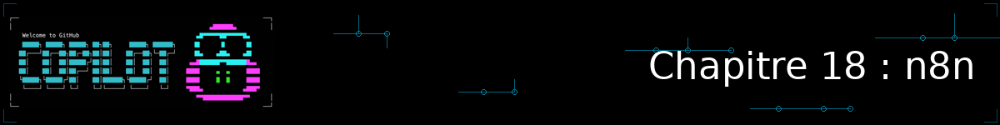
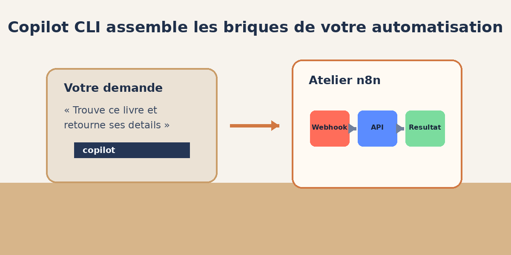
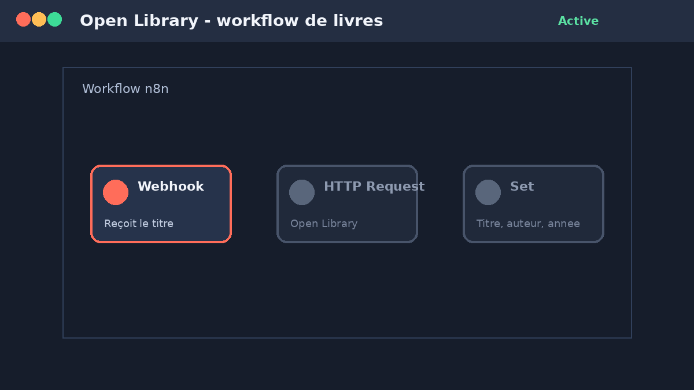

<!--
---
id: CopilotCLI-18
title: !translate Automatiser un workflow visuel avec n8n
description: !translate Installez n8n en local avec Docker, connectez Copilot CLI à son serveur MCP, et utilisez les skills n8n officielles pour construire votre premier workflow visuel.
audience: Developers / Students / Terminal users
slug: automate-visual-workflows-with-n8n
weight: 19
---
-->



> **Et si Copilot CLI pouvait non seulement écrire votre code, mais aussi assembler pour vous les briques visuelles d'un outil d'automatisation externe ?**

Jusqu'ici, tout ce que Copilot CLI a produit pour vous — code, tests, agents, skills — vivait sous forme de fichiers dans votre dépôt. Ce chapitre bonus change de terrain : vous allez utiliser Copilot CLI pour piloter **n8n**, un outil open source de construction de workflows par blocs visuels (des « nœuds » que l'on relie entre eux), au lieu d'écrire du code ligne par ligne.

Ce chapitre s'appuie directement sur deux briques que vous connaissez déjà : les **serveurs MCP** (Chapitre 07) pour connecter Copilot CLI à l'API de n8n, et les **skills** (Chapitre 06) pour lui enseigner les bonnes pratiques de construction de workflows n8n. Si l'un de ces deux chapitres vous semble flou, c'est le bon moment d'y jeter un œil rapide avant de continuer.

## 🎯 Objectifs d'apprentissage

À la fin de ce chapitre, vous serez capable de :

- Lancer une instance n8n locale avec Docker
- Connecter Copilot CLI au serveur MCP intégré de n8n
- Récupérer et adapter les skills n8n officielles pour qu'elles fonctionnent avec Copilot CLI
- Demander à Copilot CLI de construire un workflow n8n complet à partir d'une simple description en langage naturel
- Tester ce workflow et diagnostiquer les problèmes de connexion les plus courants

> ⏱️ **Durée estimée : ~50 minutes** (15 min de lecture + 35 min de pratique, installation de Docker/n8n comprise)

---

## ✅ Prérequis

- Avoir terminé le [Chapitre 07 : Serveurs MCP](../07-mcp-servers/README.md) — ce chapitre réutilise le vocabulaire `mcp-config.json`, `/mcp show` et `/mcp config` sans les réexpliquer
- ⚠️ **Docker installé et démarré sur votre machine** — c'est le seul prérequis de ce cours qui exige un outil en dehors de GitHub Copilot CLI lui-même ; ce chapitre est optionnel précisément pour cette raison
- Un terminal avec accès à un navigateur web (pour l'étape d'authentification OAuth) — évitez un environnement entièrement headless pour ce chapitre
- Node.js (déjà nécessaire depuis le Chapitre 01, pour `npx`)

---

## 🧩 Analogie du monde réel



| Concept | Copilot CLI seul | Copilot CLI + n8n |
|---|---|---|
| Ce que vous obtenez | Du code source, ligne par ligne | Un graphe de blocs (« nœuds ») déjà connectés |
| Où ça vit | Des fichiers `.py`, `.js`, `.cs` dans votre dépôt | Un workflow JSON importable dans n8n |
| Qui l'exécute | Votre application, votre CI | Le moteur d'exécution n8n, sur déclencheur (webhook, planification, etc.) |
| Le rôle de Copilot CLI | Rédiger et modifier le code | Assembler les bons nœuds, dans le bon ordre, avec les bons paramètres |

Pensez à n8n comme à un établi rempli de blocs préfabriqués (appeler une API, filtrer une donnée, envoyer un message) : Copilot CLI, une fois connecté, sait quels blocs choisir et comment les relier — vous n'avez qu'à décrire le résultat voulu.

---

## Je veux... | Aller à...

| Je veux... | Aller à |
|---|---|
| Installer n8n en local | [Lancer n8n avec Docker](#lancer-n8n-avec-docker) |
| Connecter Copilot CLI à n8n | [Connecter Copilot CLI au serveur MCP de n8n](#connecter-copilot-cli-au-serveur-mcp-de-n8n) |
| Donner à Copilot CLI les bonnes pratiques n8n | [Récupérer les skills n8n officielles](#récupérer-les-skills-n8n-officielles) |
| Construire un workflow concret | [Construire votre premier workflow](#construire-votre-premier-workflow) |

---

## Lancer n8n avec Docker

<a id="lancer-n8n-avec-docker"></a>

n8n propose une image Docker officielle. Créez d'abord un volume nommé pour que vos workflows survivent à un redémarrage du conteneur, puis lancez l'instance :

```bash
docker volume create n8n_data

docker run -it --rm \
  --name n8n \
  -p 5678:5678 \
  -v n8n_data:/home/node/.n8n \
  docker.n8n.io/n8nio/n8n
```

Ouvrez [http://localhost:5678](http://localhost:5678) dans votre navigateur : n8n vous demande de créer un compte propriétaire local (email + mot de passe, stockés uniquement dans votre volume Docker). C'est tout, vous avez une instance n8n qui tourne.

> 💡 **Le conteneur s'arrête quand vous fermez le terminal.** C'est voulu ici (`--rm` et `-it`) pour un usage de TP. Pour une instance qui tourne en arrière-plan pendant que vous continuez à travailler, relancez la même commande en remplaçant `-it --rm` par `-d` (mode détaché).

### Activer le serveur MCP de n8n

Dans l'interface n8n, ouvrez **Settings → Instance-level MCP** et activez l'option. C'est ce réglage qui expose un point d'accès MCP à l'adresse `http://localhost:5678/mcp-server/http` — c'est cette URL que Copilot CLI va utiliser à l'étape suivante.

> ⚠️ Cette fonctionnalité nécessite **n8n 2.2.0 ou supérieur**. L'image `docker.n8n.io/n8nio/n8n` pointe vers la dernière version stable ; si le réglage « Instance-level MCP » n'apparaît pas dans vos Settings, votre image est trop ancienne — supprimez le conteneur (`docker rm n8n`, votre volume `n8n_data` est conservé) et retirez tout tag de version explicite de la commande `docker run` pour retélécharger la dernière image.

---

## Connecter Copilot CLI au serveur MCP de n8n

<a id="connecter-copilot-cli-au-serveur-mcp-de-n8n"></a>

Comme vu au Chapitre 07, un serveur MCP distant se configure en pointant simplement Copilot CLI vers une URL — pas de `npx`, pas de processus local à gérer. Ajoutez ceci à votre `.mcp.json` (à la racine du projet) ou à votre `~/.copilot/mcp-config.json` :

```json
{
  "mcpServers": {
    "n8n": {
      "type": "http",
      "url": "http://localhost:5678/mcp-server/http"
    }
  }
}
```

Authentifiez ensuite ce serveur :

```bash
copilot

> /mcp config
```

Sélectionnez `n8n` puis suivez le flux d'authentification proposé (connexion via votre navigateur avec le compte que vous venez de créer). Vérifiez la connexion avec `/mcp show` : le serveur `n8n` doit apparaître comme activé.

> 💡 **Pas de navigateur disponible (Codespace headless, conteneur distant) ?** Effectuez cette étape d'authentification une fois depuis une machine locale avec accès navigateur, puis copiez le `mcp-config.json` authentifié vers votre environnement de travail distant.

---

## Récupérer les skills n8n officielles

<a id="récupérer-les-skills-n8n-officielles"></a>

Le projet [n8n-io/skills](https://github.com/n8n-io/skills) contient 14 skills officielles (plus une méta-skill) qui apprennent à un agent IA les bonnes pratiques de construction de workflows n8n (syntaxe d'expression, gestion d'erreurs, patterns de workflow, etc.). Ce dépôt est conçu en premier lieu pour Claude Code (installation via `/plugin install`, une commande propre à Claude Code) — il faut donc l'adapter légèrement pour Copilot CLI, qui charge ses skills depuis `.github/skills/` (voir [Chapitre 06](../06-skills/README.md)).

Clonez le dépôt puis copiez son contenu à l'emplacement attendu par Copilot CLI :

```bash
git clone https://github.com/n8n-io/skills.git /tmp/n8n-skills
mkdir -p .github/skills
cp -r /tmp/n8n-skills/skills/* .github/skills/
```

Vérifiez que Copilot CLI les a bien détectées :

```bash
copilot

> /skills list
```

> 💡 **Repli si `.github/skills/` ne se remplit pas comme attendu** : le projet référence aussi [skills.sh](https://skills.sh), un installeur générique multi-agents (`npx skills add n8n-io/skills`). Sa compatibilité « varie selon l'agent » d'après sa propre documentation — essayez-le, mais la copie manuelle ci-dessus reste la méthode qui fonctionne à coup sûr avec Copilot CLI.

Ces skills partent du principe qu'un serveur MCP n8n est déjà connecté (l'étape précédente) : elles ne remplacent pas la connexion MCP, elles apprennent seulement à Copilot CLI *comment bien s'en servir*.

---

## Construire votre premier workflow

<a id="construire-votre-premier-workflow"></a>

Vous allez construire un workflow simple, dans l'esprit de l'application de gestion de livres utilisée tout au long de ce cours : un webhook qui reçoit un titre de livre, interroge l'API publique [Open Library](https://openlibrary.org/developers/api) pour en récupérer les informations, et renvoie une réponse mise en forme.

```bash
copilot

> Construis-moi un workflow n8n avec trois nœuds : un déclencheur Webhook qui
> reçoit un titre de livre en paramètre, un nœud HTTP Request qui interroge
> https://openlibrary.org/search.json?q=<titre> pour trouver ce livre, et un
> nœud Set qui ne garde que le titre, l'auteur et l'année de première
> publication du premier résultat. Crée ce workflow directement dans mon
> instance n8n connectée.
```

<details>
<summary>🎬 Voyez-le en action !</summary>



*Le résultat peut varier selon votre modèle, vos outils et votre contexte : ne soyez pas surpris si votre sortie diffère de celle présentée ici — le nombre de nœuds, leurs noms exacts ou l'ordre des paramètres peuvent changer d'une session à l'autre.*

</details>

Une fois que Copilot CLI a terminé, ouvrez l'éditeur n8n ([http://localhost:5678](http://localhost:5678)) : le workflow doit apparaître dans votre liste, avec ses trois nœuds déjà reliés. Ouvrez-le et lisez les paramètres générés avant de l'activer — c'est le même réflexe de relecture qu'avec du code généré par IA.

---

## Pratique

Activez le workflow, puis récupérez l'URL du webhook affichée sur le nœud Webhook (bouton « Test URL » ou « Production URL »). Testez-le :

```bash
curl "<url-du-webhook>?titre=The+Hobbit"
```

### ▶️ À vous de jouer

1. Vérifiez que la réponse contient bien titre, auteur et année
2. Modifiez le prompt donné à Copilot CLI pour qu'il ajoute une gestion du cas « aucun résultat trouvé »
3. Demandez à Copilot CLI d'expliquer, nœud par nœud, ce qu'il vient de construire — comme vous le feriez pour relire du code

---

## 📝 Devoir

**Défi principal** : ajoutez un nœud de gestion d'erreur à votre workflow (par exemple un nœud `If` qui vérifie si l'appel à Open Library a échoué ou n'a renvoyé aucun résultat, et renvoie un message clair plutôt qu'une erreur brute).

**Défi bonus** : trouvez un autre exemple de workflow simple en ligne (recherchez « n8n beginner workflow example ») et demandez à Copilot CLI de le reproduire dans votre instance à partir de sa seule description en langage naturel, sans lui donner le JSON source.

<details>
<summary>💡 Indices</summary>

- Pour le défi principal, demandez explicitement à Copilot CLI d'utiliser un nœud `If` ou `Filter` après le nœud HTTP Request, avant le nœud Set
- Pour le défi bonus, décrivez le workflow trouvé en ligne avec vos propres mots (déclencheur, étapes, résultat attendu) plutôt que de copier-coller du vocabulaire technique n8n que vous ne maîtrisez pas encore

</details>

---

## 🔧 Erreurs courantes et dépannage

<details>
<summary>Cliquez pour voir les problèmes fréquents et leurs solutions</summary>

| Erreur | Ce qui se passe | Solution |
|---|---|---|
| `n8n` absent de `/mcp show` | Le fichier `mcp-config.json` n'a pas été rechargé, ou l'URL est incorrecte | Vérifiez l'URL (`http://localhost:5678/mcp-server/http`), redémarrez Copilot CLI |
| Réglage « Instance-level MCP » introuvable | Version de n8n trop ancienne (< 2.2.0) | Retirez tout tag de version de l'image Docker et retéléchargez la dernière image |
| Port `5678` déjà utilisé | Une autre instance n8n (ou un autre service) tourne déjà sur ce port | Ajoutez `-p 5679:5678` à `docker run` et adaptez l'URL MCP en conséquence |
| L'authentification OAuth ne s'ouvre pas | Environnement sans navigateur (conteneur headless, Codespace distant) | Authentifiez-vous une fois depuis une machine avec navigateur, puis copiez le `mcp-config.json` authentifié |
| `/skills list` n'affiche aucune skill n8n | Les fichiers ont été copiés au mauvais endroit | Vérifiez `ls .github/skills/` — les dossiers de skills doivent être directement dedans, pas dans un sous-dossier `skills/` imbriqué |
| Le workflow créé ignore les instructions de style/bonnes pratiques n8n | Les skills ne se sont pas chargées pour ce prompt | Mentionnez explicitement « nœud », « workflow n8n » ou « expression n8n » dans votre prompt pour déclencher leur chargement automatique |

</details>

---

## Résumé

Vous avez connecté Copilot CLI à une instance n8n locale via MCP, adapté un pack de skills conçu pour un autre outil, et laissé Copilot CLI assembler un workflow complet à partir d'une description en langage naturel — la même logique de délégation que vous appliquez déjà au code depuis le Chapitre 04.

### 🔑 Points clés à retenir

1. Un serveur MCP distant se configure avec `"type": "http"` et une `"url"` — aucun processus local à gérer, contrairement aux serveurs `npx`
2. Une skill écrite pour un autre agent (ici Claude Code) reste réutilisable avec Copilot CLI tant que son format `SKILL.md` est respecté et qu'elle est copiée au bon endroit (`.github/skills/`)
3. Les skills n8n ne remplacent pas la connexion MCP : l'une transporte les données, l'autre transporte les bonnes pratiques
4. Relisez toujours un workflow généré avant de l'activer, exactement comme vous relisez du code généré

---

## 📋 Référence rapide

- [Exemple de config MCP pour n8n](../samples/mcp-configs/n8n-mcp-config.json) — à copier-coller dans votre `.mcp.json`
- [n8n-io/skills](https://github.com/n8n-io/skills) — skills officielles n8n
- [Documentation Docker de n8n](https://hub.docker.com/r/n8nio/n8n) — image officielle
- [API Open Library](https://openlibrary.org/developers/api) — utilisée dans l'exemple de ce chapitre
- [Chapitre 07 : Serveurs MCP](../07-mcp-servers/README.md) — pour approfondir la configuration MCP

---

## ➡️ Et ensuite ?

Vous avez maintenant vu Copilot CLI travailler dans deux mondes différents : celui du code, et celui des workflows visuels d'un outil tiers. Le principe reste le même dans les deux cas — décrire un résultat, laisser l'IA assembler les briques, puis relire avant de valider.

**[← Chapitre précédent : mcp2cli et le coût en tokens](../17-mcp2cli/README.md)** | **[Retour à l'accueil du cours →](../README.md)**
