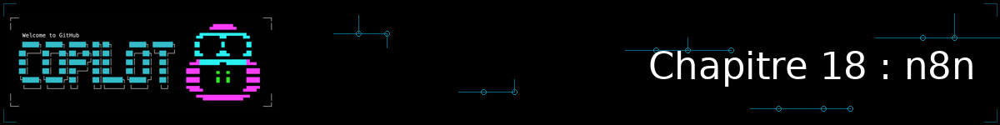
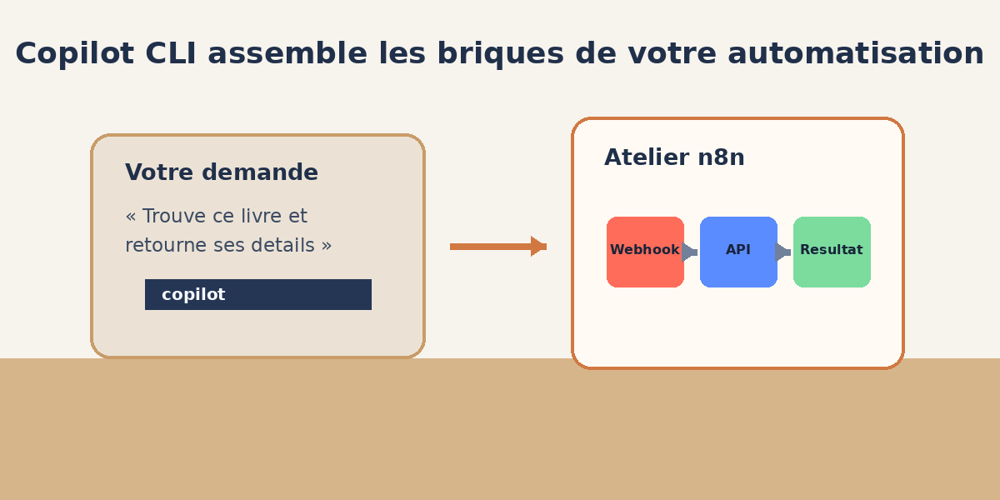
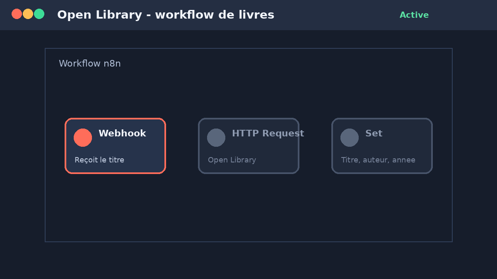
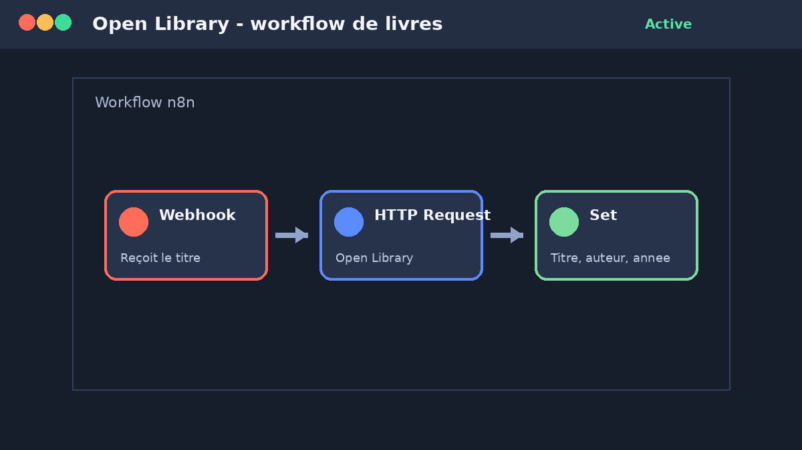

<!--
---
id: CopilotCLI-18
title: !translate Automatiser un workflow visuel avec n8n
description: !translate Installe n8n en local avec Docker, connecte Copilot CLI à son serveur MCP, et utilise les skills n8n officielles pour construire ton premier workflow visuel.
audience: Developers / Students / Terminal users
slug: automate-visual-workflows-with-n8n
weight: 19
---
-->



> **Et si Copilot CLI pouvait non seulement écrire ton code, mais aussi assembler pour toi les briques visuelles d'un outil d'automatisation externe ?**

Jusqu'ici, tout ce que Copilot CLI a produit pour toi — code, tests, agents, skills — vivait sous forme de fichiers dans ton dépôt. Ce chapitre bonus change de terrain : tu vas utiliser Copilot CLI pour piloter **n8n**, un outil open source de construction de workflows par blocs visuels (des « nœuds » que l'on relie entre eux), au lieu d'écrire du code ligne par ligne.

Ce chapitre s'appuie directement sur deux briques que tu connais déjà : les **serveurs MCP** (Chapitre 07) pour connecter Copilot CLI à l'API de n8n, et les **skills** (Chapitre 06) pour lui enseigner les bonnes pratiques de construction de workflows n8n. Si l'un de ces deux chapitres te semble flou, c'est le bon moment d'y jeter un œil rapide avant de continuer.

## 🎯 Objectifs d'apprentissage

À la fin de ce chapitre, tu seras capable de :

- Lancer une instance n8n locale avec Docker
- Connecter Copilot CLI au serveur MCP intégré de n8n
- Récupérer et adapter les skills n8n officielles pour qu'elles fonctionnent avec Copilot CLI
- Demander à Copilot CLI de construire un workflow n8n complet à partir d'une simple description en langage naturel
- Tester ce workflow et diagnostiquer les problèmes de connexion les plus courants

> ⏱️ **Durée estimée : ~50 minutes** (15 min de lecture + 35 min de pratique, installation de Docker/n8n comprise)

---

## ✅ Prérequis

- Avoir terminé le [Chapitre 07 : Serveurs MCP](../07-mcp-servers/README.md) — ce chapitre réutilise le vocabulaire `mcp-config.json`, `/mcp show` et `/mcp config` sans les réexpliquer
- ⚠️ **Docker installé et démarré sur ta machine** — c'est le seul prérequis de ce cours qui exige un outil en dehors de GitHub Copilot CLI lui-même ; ce chapitre est optionnel précisément pour cette raison
- Un terminal avec accès à un navigateur web (pour l'étape d'authentification OAuth) — évite un environnement entièrement headless pour ce chapitre
- Node.js (déjà nécessaire depuis le Chapitre 01, pour `npx`)

---

## 🧩 Analogie du monde réel



| Concept | Copilot CLI seul | Copilot CLI + n8n |
|---|---|---|
| Ce que tu obtiens | Du code source, ligne par ligne | Un graphe de blocs (« nœuds ») déjà connectés |
| Où ça vit | Des fichiers `.py`, `.js`, `.cs` dans ton dépôt | Un workflow JSON importable dans n8n |
| Qui l'exécute | Ton application, ta CI | Le moteur d'exécution n8n, sur déclencheur (webhook, planification, etc.) |
| Le rôle de Copilot CLI | Rédiger et modifier le code | Assembler les bons nœuds, dans le bon ordre, avec les bons paramètres |

Pense à n8n comme à un établi rempli de blocs préfabriqués (appeler une API, filtrer une donnée, envoyer un message) : Copilot CLI, une fois connecté, sait quels blocs choisir et comment les relier — tu n'as qu'à décrire le résultat voulu.

---

## Je veux... | Aller à...

| Je veux... | Aller à |
|---|---|
| Installer n8n en local | [Lancer n8n avec Docker](#lancer-n8n-avec-docker) |
| Connecter Copilot CLI à n8n | [Connecter Copilot CLI au serveur MCP de n8n](#connecter-copilot-cli-au-serveur-mcp-de-n8n) |
| Donner à Copilot CLI les bonnes pratiques n8n | [Récupérer les skills n8n officielles](#récupérer-les-skills-n8n-officielles) |
| Construire un workflow concret | [Construire ton premier workflow](#construire-ton-premier-workflow) |

---

## Lancer n8n avec Docker

<a id="lancer-n8n-avec-docker"></a>

n8n propose une image Docker officielle. Crée d'abord un volume nommé pour que tes workflows survivent à un redémarrage du conteneur, puis lance l'instance :

```bash
docker volume create n8n_data

docker run -it --rm \
  --name n8n \
  -p 5678:5678 \
  -v n8n_data:/home/node/.n8n \
  docker.n8n.io/n8nio/n8n
```

> 🤖 **Raccourci :** `bash 18-n8n-workflows/scripts/start-n8n.sh` (ou `.\18-n8n-workflows\scripts\start-n8n.ps1`) crée le volume, lance n8n et ajoute le bloc `n8n` à ton `~/.copilot/mcp-config.json` sans écraser le reste. Options : `-d` / `-Detach` pour l'arrière-plan, `--no-mcp` / `-NoMcp` pour ne pas toucher à la config.

Ouvre [http://localhost:5678](http://localhost:5678) dans ton navigateur : n8n te demande de créer un compte propriétaire local (email + mot de passe, stockés uniquement dans ton volume Docker). C'est tout, tu as une instance n8n qui tourne.

> 💡 **Le conteneur s'arrête quand tu fermes le terminal.** C'est voulu ici (`--rm` et `-it`) pour un usage de TP. Pour une instance qui tourne en arrière-plan pendant que tu continues à travailler, relance la même commande en remplaçant `-it --rm` par `-d` (mode détaché).

### Activer le serveur MCP de n8n

Vérifie d'abord la version réellement lancée :

```bash
docker exec n8n n8n --version
```

Dans l'interface n8n, ouvre **Settings → Instance-level MCP** et active l'option. Ce réglage expose le point d'accès `http://localhost:5678/mcp-server/http`, que Copilot CLI utilisera à l'étape suivante.

> ⚠️ **Fonctionnalité dépendante de la version.** L'emplacement du réglage et les options d'accès peuvent évoluer avec n8n. La documentation n8n actuelle indique que la construction ou l'édition de workflows via MCP est disponible à partir de **n8n 2.13.0**. Si « Instance-level MCP » n'apparaît pas, consulte la [documentation de connexion au serveur MCP n8n](https://docs.n8n.io/connect/connect-to-n8n-mcp-server) correspondant à ta version, puis mets à jour l'image si nécessaire. N'expose pas le serveur tant que ce réglage n'est pas compris.

L'activation au niveau de l'instance ne rend pas tous tes workflows accessibles automatiquement : chaque workflow doit être exposé individuellement, soit depuis son propre menu `...` → **Settings** → bascule **Available in MCP**, soit depuis `Settings → Instance-level MCP → Workflows exposed`. Seuls les workflows **publiés** avec un déclencheur Webhook, Form, Schedule ou Chat sont éligibles — c'est pourquoi le workflow construit plus loin dans ce chapitre devra être activé avant de pouvoir être exposé, pas seulement pour répondre sur son URL de production.

---

## Connecter Copilot CLI au serveur MCP de n8n

<a id="connecter-copilot-cli-au-serveur-mcp-de-n8n"></a>

Comme vu au Chapitre 07, un serveur MCP distant se configure en pointant simplement Copilot CLI vers une URL — pas de `npx`, pas de processus local à gérer. Ajoute ceci à ton `.mcp.json` (à la racine du projet) ou à ton `~/.copilot/mcp-config.json` :

```json
{
  "mcpServers": {
    "n8n": {
      "type": "http",
      "url": "http://localhost:5678/mcp-server/http"
    }
  }
}
```

Authentifie ensuite ce serveur, si ton instance le demande :

```bash
copilot

> /mcp config
```

Sélectionne `n8n` puis suis le flux d'authentification proposé par ton instance. Vérifie la connexion avec `/mcp show` : le serveur `n8n` doit apparaître comme activé.

> 💡 **Pas de navigateur disponible ?** La boîte de dialogue `Settings → Instance-level MCP → Connect a client` propose aussi un onglet **API key** : un jeton d'accès personnel à copier directement dans `mcp-config.json` (en en-tête d'authentification), sans passer par le flux OAuth. C'est l'option la plus fiable pour un terminal distant ou un conteneur sans navigateur.

### 🔒 Protéger les identifiants et l'accès MCP

Le compte propriétaire créé au premier démarrage et les identifiants de tes connexions n8n donnent accès à tes automatisations. Utilise des comptes de test pendant ce tutoriel, garde le volume Docker `n8n_data` privé et ne copie jamais un fichier de configuration contenant un jeton d'accès MCP dans Git, une issue ou une capture d'écran. Si tu dois déplacer une configuration vers une machine distante, recrée l'authentification sur cette machine au lieu de copier ses secrets.

Le serveur MCP peut créer, modifier ou lancer les workflows que tu lui autorises. Donne-lui le minimum de droits nécessaire et désactive l'accès MCP ou les workflows exposés lorsque tu n'en as plus besoin.

---

## Récupérer les skills n8n officielles

<a id="récupérer-les-skills-n8n-officielles"></a>

Le projet [n8n-io/skills](https://github.com/n8n-io/skills) contient 13 skills de capacité officielles (syntaxe d'expression, gestion d'erreurs, patterns de workflow, etc.), plus une méta-skill (`using-n8n-skills-official`) qui route automatiquement vers la bonne skill — soit 14 fichiers `SKILL.md` au total. Ce dépôt est conçu en premier lieu pour Claude Code et Codex (installation via `/plugin install`, propre à ces agents) ; son propre README indique d'ailleurs chercher des contributeurs pour les autres agents (Cursor, OpenCode…) sans encore garantir de parité de fonctionnalités. Copilot CLI fait partie de ce vide : ce chapitre l'adapte manuellement, en copiant les skills à l'emplacement que Copilot CLI charge, `.github/skills/` (voir [Chapitre 06](../06-skills/README.md)).

> 💡 **La méta-skill ne se charge pas toute seule ici.** Avec le plugin officiel (Claude Code, Codex), un hook au démarrage de session charge automatiquement `using-n8n-skills-official`, qui route ensuite vers la bonne skill selon le contexte. La copie manuelle ci-dessous ne reproduit pas ce hook : Copilot CLI continue de charger les skills sur détection de mots-clés dans le prompt (voir [Chapitre 06](../06-skills/README.md)), d'où l'astuce du tableau de dépannage plus bas pour mentionner explicitement « nœud » ou « workflow n8n ».

Clone le dépôt puis copie son contenu à l'emplacement attendu par Copilot CLI :

```bash
git clone https://github.com/n8n-io/skills.git /tmp/n8n-skills
mkdir -p .github/skills
cp -r /tmp/n8n-skills/skills/* .github/skills/
```

Vérifie que Copilot CLI les a bien détectées :

```bash
copilot

> /skills list
```

> 💡 **Repli si `.github/skills/` ne se remplit pas comme attendu** : le projet référence aussi [skills.sh](https://skills.sh), un installeur générique multi-agents (`npx skills add n8n-io/skills`). Sa compatibilité « varie selon l'agent » d'après sa propre documentation — essaie-le, mais la copie manuelle ci-dessus reste la méthode qui fonctionne à coup sûr avec Copilot CLI.

Ces skills partent du principe qu'un serveur MCP n8n est déjà connecté (l'étape précédente) : elles ne remplacent pas la connexion MCP, elles apprennent seulement à Copilot CLI *comment bien s'en servir*.

---

## Construire ton premier workflow

<a id="construire-ton-premier-workflow"></a>

Tu vas construire un workflow simple, dans l'esprit de l'application de gestion de livres utilisée tout au long de ce cours : un webhook qui reçoit un titre de livre, interroge l'API publique [Open Library](https://openlibrary.org/developers/api) pour en récupérer les informations, et renvoie une réponse mise en forme.

```bash
copilot

> Construis-moi un workflow n8n avec trois nœuds : un déclencheur Webhook qui
> reçoit un titre de livre en paramètre, un nœud HTTP Request qui interroge
> https://openlibrary.org/search.json?q=<titre> pour trouver ce livre, et un
> nœud Set qui ne garde que le titre, l'auteur et l'année de première
> publication du premier résultat. Crée ce workflow directement dans mon
> instance n8n connectée.
```

<details>
<summary>🎬 Vois-le en action !</summary>



*Le résultat peut varier selon ton modèle, tes outils et ton contexte : ne sois pas surpris si ta sortie diffère de celle présentée ici — le nombre de nœuds, leurs noms exacts ou l'ordre des paramètres peuvent changer d'une session à l'autre.*

</details>



Une fois que Copilot CLI a terminé, ouvre l'éditeur n8n ([http://localhost:5678](http://localhost:5678)) : le workflow doit apparaître dans ta liste, avec ses trois nœuds déjà reliés. Ouvre-le et lis les paramètres générés avant de l'activer — c'est le même réflexe de relecture qu'avec du code généré par IA.

---

## Pratique

Active le workflow avant d'utiliser son URL de production. Dans le nœud Webhook, copie l'URL affichée : l'URL de test ne fonctionne que pendant l'écoute de test dans l'éditeur, tandis que l'URL de production ne répond que lorsque le workflow est actif. Remplace l'URL ci-dessous par celle copiée, puis teste-le :

```bash
WEBHOOK_URL="http://localhost:5678/webhook/mon-livre"
curl --get --data-urlencode "titre=The Hobbit" "$WEBHOOK_URL"
```

> ⚠️ **Webhook public : prudence.** `localhost` n'est accessible que depuis ta machine. Pour recevoir des requêtes depuis Internet, configure d'abord une URL HTTPS publique dans n8n (notamment `WEBHOOK_URL` derrière un proxy inverse), protège le point d'entrée par une authentification ou un secret vérifié dans le workflow, et limite ce qui peut le déclencher. N'envoie jamais un secret dans l'URL : elle peut être conservée dans l'historique du navigateur, les journaux et les outils de supervision.

### ▶️ À toi de jouer

1. Vérifie que la réponse contient bien titre, auteur et année
2. Modifie le prompt donné à Copilot CLI pour qu'il ajoute une gestion du cas « aucun résultat trouvé »
3. Demande à Copilot CLI d'expliquer, nœud par nœud, ce qu'il vient de construire — comme tu le ferais pour relire du code

---

## 📝 Devoir

**Défi principal** : ajoute un nœud de gestion d'erreur à ton workflow (par exemple un nœud `If` qui vérifie si l'appel à Open Library a échoué ou n'a renvoyé aucun résultat, et renvoie un message clair plutôt qu'une erreur brute).

**Défi bonus** : trouve un autre exemple de workflow simple en ligne (recherche « n8n beginner workflow example ») et demande à Copilot CLI de le reproduire dans ton instance à partir de sa seule description en langage naturel, sans lui donner le JSON source.

<details>
<summary>💡 Indices</summary>

- Pour le défi principal, demande explicitement à Copilot CLI d'utiliser un nœud `If` ou `Filter` après le nœud HTTP Request, avant le nœud Set
- Pour le défi bonus, décris le workflow trouvé en ligne avec tes propres mots (déclencheur, étapes, résultat attendu) plutôt que de copier-coller du vocabulaire technique n8n que tu ne maîtrises pas encore

</details>

---

## 🔧 Erreurs courantes et dépannage

<details>
<summary>Clique pour voir les problèmes fréquents et leurs solutions</summary>

| Erreur | Ce qui se passe | Solution |
|---|---|---|
| `n8n` absent de `/mcp show` | Le fichier `mcp-config.json` n'a pas été rechargé, ou l'URL est incorrecte | Vérifie l'URL (`http://localhost:5678/mcp-server/http`), redémarre Copilot CLI |
| Port `5678` déjà utilisé | Une autre instance n8n (ou un autre service) tourne déjà sur ce port | Ajoute `-p 5679:5678` à `docker run` et adapte l'URL MCP en conséquence |
| Réglage « Instance-level MCP » introuvable | Ta version ou ton édition n8n ne propose pas cette fonctionnalité à cet emplacement | Vérifie `docker exec n8n n8n --version`, consulte la documentation MCP correspondant à cette version, puis mets à jour l'image si nécessaire |
| L'authentification ne s'ouvre pas | Environnement sans navigateur (conteneur headless, Codespace distant) | Utilise l'onglet **API key** de `Settings → Instance-level MCP → Connect a client` plutôt que le flux OAuth ; génère le jeton depuis une machine avec navigateur et colle-le dans `mcp-config.json` de l'environnement distant |
| L'URL de production répond `404` | Le workflow n'est pas actif, ou tu utilises une URL de test hors de l'éditeur | Active le workflow et copie son URL « Production URL » ; garde l'URL « Test URL » pour l'écoute de test |
| Le workflow n'apparaît pas dans la liste d'outils du client MCP | Le workflow n'est pas publié, ou son déclencheur n'est pas éligible à MCP | Publie le workflow (un déclencheur Webhook, Form, Schedule ou Chat est requis), puis active **Available in MCP** depuis son menu `...` → Settings |
| `/skills list` n'affiche aucune skill n8n | Les fichiers ont été copiés au mauvais endroit | Vérifie `ls .github/skills/` — les dossiers de skills doivent être directement dedans, pas dans un sous-dossier `skills/` imbriqué |
| Le workflow créé ignore les instructions de style/bonnes pratiques n8n | Les skills ne se sont pas chargées pour ce prompt | Mentionne explicitement « nœud », « workflow n8n » ou « expression n8n » dans ton prompt pour déclencher leur chargement automatique |

</details>

---

## Résumé

Tu as connecté Copilot CLI à une instance n8n locale via MCP, adapté un pack de skills conçu pour un autre outil, et laissé Copilot CLI assembler un workflow complet à partir d'une description en langage naturel — la même logique de délégation que tu appliques déjà au code depuis le Chapitre 04.

### 🔑 Points clés à retenir

1. Un serveur MCP distant se configure avec `"type": "http"` et une `"url"` — aucun processus local à gérer, contrairement aux serveurs `npx`
2. Une skill écrite pour un autre agent (ici Claude Code) reste réutilisable avec Copilot CLI tant que son format `SKILL.md` est respecté et qu'elle est copiée au bon endroit (`.github/skills/`)
3. Les skills n8n ne remplacent pas la connexion MCP : l'une transporte les données, l'autre transporte les bonnes pratiques
4. Relis toujours un workflow généré avant de l'activer, exactement comme tu relis du code généré

---

## 📋 Référence rapide

- [Exemple de config MCP pour n8n](../samples/mcp-configs/n8n-mcp-config.json) — à copier-coller dans ton `.mcp.json`
- [Connexion au serveur MCP n8n](https://docs.n8n.io/connect/connect-to-n8n-mcp-server) — configuration, authentification OAuth et clé API
- [n8n-io/skills](https://github.com/n8n-io/skills) — skills officielles n8n
- [Documentation Docker de n8n](https://hub.docker.com/r/n8nio/n8n) — image officielle
- [API Open Library](https://openlibrary.org/developers/api) — utilisée dans l'exemple de ce chapitre
- [Chapitre 07 : Serveurs MCP](../07-mcp-servers/README.md) — pour approfondir la configuration MCP

---

## ➡️ Et ensuite ?

Tu as maintenant vu Copilot CLI travailler dans deux mondes différents : celui du code, et celui des workflows visuels d'un outil tiers. Le principe reste le même dans les deux cas — décrire un résultat, laisser l'IA assembler les briques, puis relire avant de valider.

Ce chapitre couvre le sens « Copilot CLI pilote n8n ». La direction inverse existe aussi : le nœud `MCP Server Trigger` transforme un workflow n8n déjà construit en son propre serveur MCP, consommable par d'autres agents — une piste à explorer une fois celui-ci maîtrisé.

**[← Chapitre précédent : mcp2cli et le coût en tokens](../17-mcp2cli/README.md)** | **[Retour à l'accueil du cours →](../README.md)**
