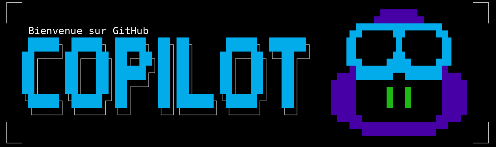
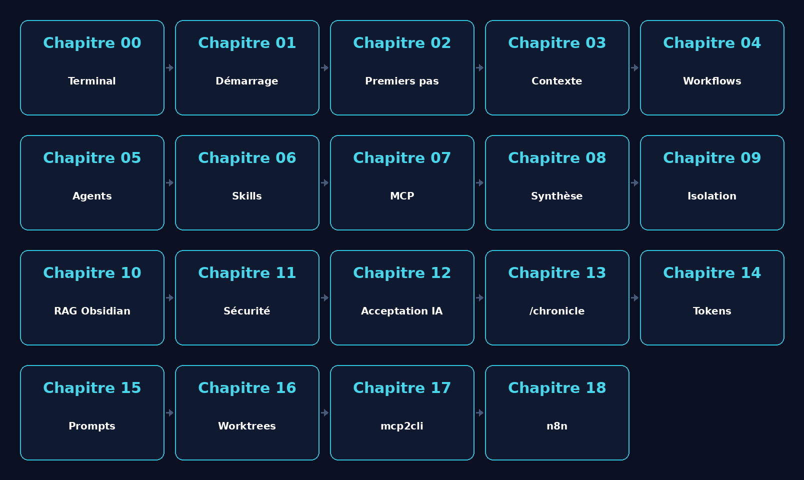

<!--
---
id: CopilotCLI-ROOT
title: !translate GitHub Copilot CLI pour débutants
description: !translate Apprends à démultiplier ton flux de travail de développement grâce à l'assistance en ligne de commande propulsée par l'IA, directement depuis ton terminal.
audience: Developers / Students / Terminal users
slug: copilot-cli-for-beginners
weight: 0
---
-->



[](./LICENSE)&ensp;
[](https://codespaces.new/github/copilot-cli-for-beginners?hide_repo_select=true&ref=main&quickstart=true)&ensp;
[](https://docs.github.com/en/copilot/how-tos/copilot-cli)&ensp;
[](https://aka.ms/foundry/discord)

🎯 [Ce que tu vas apprendre](#-ce-que-tu-vas-apprendre) &ensp; ✅ [Prérequis](#-prérequis) &ensp; 🤖 [Famille Copilot](#-comprendre-la-famille-github-copilot) &ensp; 📚 [Structure du cours](#-structure-du-cours) &ensp; 📋 [Référence des commandes](#-référence-des-commandes-github-copilot-cli)

# GitHub Copilot CLI pour débutants

> **✨ Apprends à démultiplier ton flux de travail de développement grâce à l'assistance en ligne de commande propulsée par l'IA.**

GitHub Copilot CLI apporte l'assistance de l'IA directement dans ton terminal. Plutôt que de basculer vers un navigateur ou un éditeur de code, tu peux poser des questions, générer des applications complètes, relire du code, générer des tests, et déboguer des problèmes sans quitter ta ligne de commande.

Imagine-le comme un collègue compétent disponible 24 h/24 et 7 j/7, capable de lire ton code, d'expliquer des motifs déroutants, et de t'aider à travailler plus vite !

> 📘 **Tu préfères une expérience web ?** Tu peux suivre ce cours ici même sur GitHub, ou le consulter sur [Awesome Copilot](https://awesome-copilot.github.com/learning-hub/cli-for-beginners/) pour une expérience de navigation plus traditionnelle.

Ce cours est conçu pour :

- **Les développeurs et développeuses** qui veulent utiliser l'IA depuis la ligne de commande
- **Les utilisateurs de terminal** qui préfèrent des flux de travail pilotés au clavier plutôt que des intégrations IDE
- **Les équipes souhaitant standardiser** les pratiques de revue de code et de développement assistées par l'IA

## 🎯 Ce que tu vas apprendre

Ce cours pratique t'emmène de zéro à la productivité avec GitHub Copilot CLI. Tu travailleras avec une seule application Python de gestion de collection de livres tout au long des chapitres, en l'améliorant progressivement grâce à des flux de travail assistés par l'IA. À la fin, tu utiliseras l'IA en toute confiance pour relire du code, générer des tests, déboguer des problèmes, et automatiser des flux de travail : le tout depuis ton terminal.

**Aucune expérience de l'IA n'est requise.** Si tu sais utiliser un terminal, tu peux apprendre cela.

**Parfait pour :** les développeurs, les étudiants, et toute personne ayant une expérience du développement logiciel.

## ✅ Prérequis

Avant de commencer, assure-toi d'avoir :

- **Un compte GitHub** : [Crée-en un gratuitement](https://github.com/signup)<br>
- **Un accès à GitHub Copilot** : [Offre gratuite](https://github.com/features/copilot/plans), [Abonnement mensuel](https://github.com/features/copilot/plans), ou [Gratuit pour les étudiants/enseignants](https://education.github.com/pack)<br>
- **Des bases du terminal** : être à l'aise avec `cd`, `ls`, l'exécution de commandes

## 🤖 Comprendre la famille GitHub Copilot

GitHub Copilot a évolué en une famille d'outils propulsés par l'IA. Voici où chacun d'eux vit :

| Produit | Où il s'exécute | Description |
|---------|---------------|----------|
| [**GitHub Copilot CLI**](https://docs.github.com/copilot/how-tos/copilot-cli/cli-getting-started)<br>(ce cours) | Ton terminal | Assistant de codage IA natif du terminal |
| [**GitHub Copilot**](https://docs.github.com/copilot) | VS Code, Visual Studio, JetBrains, etc. | Mode agent, chat, suggestions en ligne |
| [**Copilot sur GitHub.com**](https://github.com/copilot) | GitHub | Chat immersif sur tes dépôts, création d'agents, et plus |
| [**Agent cloud GitHub Copilot**](https://docs.github.com/copilot/using-github-copilot/using-copilot-coding-agent-to-work-on-tasks) | GitHub | Assigne des issues à des agents, récupère des PR en retour |

Ce cours se concentre sur **GitHub Copilot CLI**, qui apporte l'assistance de l'IA directement dans ton terminal.

## 📚 Structure du cours



| Chapitre | Titre | Ce que tu vas construire |
|:-------:|-------|-------------------|
| 00 | 🧰 [Équipez votre terminal](./00-modern-terminal-stack/README.md) | Une stack terminal moderne (zsh, Starship, tmux, Atuin, Zoxide, fzf, eza, bat) |
| 01 | 🚀 [Démarrage rapide](./01-quick-start/README.md) | Installation et vérification |
| 02 | 👋 [Premiers pas](./02-setup-and-first-steps/README.md) | Démonstrations en direct + trois modes d'interaction |
| 03 | 🔍 [Contexte et conversations](./03-context-conversations/README.md) | Analyse de projet multi-fichiers |
| 04 | ⚡ [Flux de travail de développement](./04-development-workflows/README.md) | Revue de code, débogage, génération de tests |
| 05 | 🤖 [Créer des assistants IA spécialisés](./05-agents-custom-instructions/README.md) | Agents personnalisés pour ton flux de travail |
| 06 | 🛠️ [Automatiser les tâches répétitives](./06-skills/README.md) | Compétences (skills) qui se chargent automatiquement |
| 07 | 🔌 [Se connecter à GitHub, aux bases de données et aux API](./07-mcp-servers/README.md) | Intégration de serveurs MCP |
| 08 | 🎯 [Assembler le tout](./08-putting-it-together/README.md) | Flux de travail complets |
| 09 | 🐳 [Environnements isolés](./09-isolated-environments/README.md) *(bonus, nécessite Docker)* | Dev container + sandbox Docker isolée pour automatiser avec `--allow-all` en toute confiance |
| 10 | 🧠 [RAG sur votre vault Obsidian](./10-obsidian-rag/README.md) *(bonus, nécessite Obsidian)* | Un pipeline RAG local (recherche sémantique + citations) sur vos propres notes, via deux serveurs MCP |
| 11 | 🔒 [Sécuriser votre code avec Copilot CLI](./11-security-with-copilot/README.md) | Une revue de sécurité de bout en bout : commande `/security-review`, instructions sécurisées par défaut, protection des secrets |
| 12 | 🔍 [Comprendre l'acceptation de l'IA par les développeurs](./12-ai-developer-acceptance/README.md) *(bonus)* | Une auto-évaluation personnelle confrontée aux études GitHub, McKinsey, DORA et Stack Overflow |
| 13 | 🕰️ [Explorer l'historique de vos sessions avec /chronicle](./13-chronicle-session-insights/README.md) | Des rapports d'activité, conseils et recherches générés à partir de votre historique Copilot CLI |
| 14 | 📊 [Analyser sa consommation de tokens avec RTK et Tokscale](./14-token-consumption-analysis/README.md) *(bonus)* | Une sortie de commandes compressée avec RTK, et un tableau de bord de consommation avec Tokscale |
| 15 | 🧠 [Rédiger des instructions IA efficaces et réutilisables](./15-prompt-engineering/README.md) *(bonus)* | Des templates de prompts réutilisables et le principe d'une CLI générée depuis un serveur MCP |
| 16 | 🌳 [Sessions parallèles avec les worktrees Git](./16-parallel-worktrees/README.md) *(bonus)* | Deux sessions Copilot CLI isolées dans des worktrees Git, travaillant en parallèle sur le même dépôt |
| 17 | 🪙 [mcp2cli et le coût en tokens](./17-mcp2cli/README.md) *(bonus, complète le Chapitre 07)* | Interroger le serveur Context7 MCP directement depuis le terminal, sans passer par Copilot |
| 18 | 🔗 [Automatiser un workflow visuel avec n8n](./18-n8n-workflows/README.md) *(bonus, nécessite Docker)* | Un workflow n8n construit par Copilot CLI via MCP et les skills n8n officielles |

## 📖 Comment fonctionne ce cours

Chaque chapitre suit le même schéma :

1. **Analogie avec le monde réel** : comprendre le concept à travers des comparaisons familières
2. **Concepts fondamentaux** : apprendre les connaissances essentielles
3. **Exemples pratiques** : exécuter des commandes réelles et voir les résultats
4. **Exercice** : mettre en pratique ce que tu as appris
5. **Et ensuite ?** : aperçu du chapitre suivant

**Les exemples de code sont exécutables.** Chaque bloc de texte copilot de ce cours peut être copié et exécuté dans ton terminal.

## 📋 Référence des commandes GitHub Copilot CLI

La **[référence des commandes GitHub Copilot CLI](https://docs.github.com/en/copilot/reference/cli-command-reference)** t'aide à trouver les commandes et raccourcis clavier pour utiliser Copilot CLI efficacement.

## 🙋 Obtenir de l'aide

- 🐛 **Tu as trouvé un bug ?** [Ouvre une issue](https://github.com/github/copilot-cli-for-beginners/issues)
- 📚 **Documentation officielle :** [Documentation GitHub Copilot CLI](https://docs.github.com/copilot/concepts/agents/about-copilot-cli)

## Contribuer

> **Remarque** : le code utilisé dans le cours est conçu pour générer des types spécifiques de sorties lors des revues, explications, et séances de débogage. Nous ne pouvons donc pas accepter de PR qui modifient le code existant.

**Comment contribuer :**

1. Fork ce dépôt et clone-le sur ta machine
2. Crée une branche de fonctionnalité (`git checkout -b my-improvement`)
3. Effectue tes modifications
4. Soumets une pull request

### Vérifier les références et les démos

Avant de soumettre une modification de chapitre, lance :

```bash
npm run audit
```

Cette commande vérifie les liens et images locaux dans les fichiers Markdown,
la présence des GIF et tapes déclarés dans `.github/scripts/demos.json`, puis
signale les GIF orphelins et les chapitres dont les commandes Copilot ne sont
pas encore couverts. Les références cassées font échouer la commande ; les
écarts de génération ou de couverture sont détaillés dans le rapport. Pour
enregistrer celui-ci dans un fichier :

```bash
npm run audit -- --report=./audit-report.md
```

Les nouveaux assets suivent la convention `<concept>-demo.gif` pour une
démonstration animée et `<concept>-analogy.png` pour une illustration statique.

## Licence

Ce projet est distribué sous les termes de la licence open source MIT. Consulte le fichier [LICENSE](./LICENSE) pour les termes complets.
